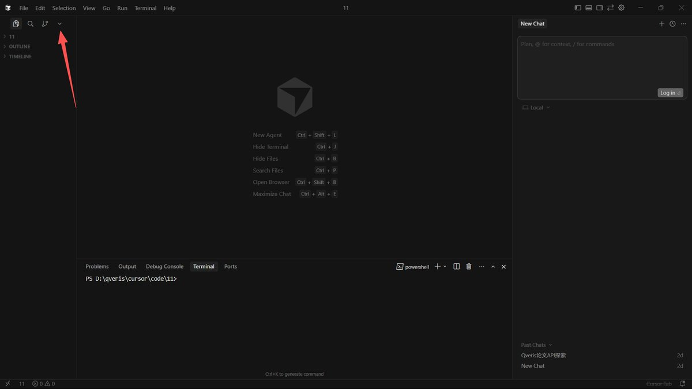

## Cursor+QVeris能干嘛？

很多人用 AI的体验是：

> 💬「AI 很聪明，但只能说，不能做」

比如：

- 能分析市场，但拿不到**实时金融数据**
- 能规划流程，但**调API经常失败**
- 能写代码，但**不知道该用哪个工具**

QVeris的目的是：让AI在混乱的互联网里，稳定、低成本、可确定地“调用工具和数据”。

当你在Cursor里接入QVeris后：

- AI不再“瞎编数据”
- 不需要你手动集成几十个API
- Agent 可以完成完整的**Search →Decide→Act**

## 如何在Cursor中使用QVeris

Step 1：安装QVeris插件

打开 Cursor

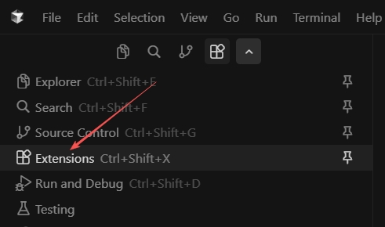

左上角点击最右侧小箭头展开，打开 Extensions

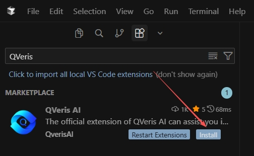

搜索QVeris AI，点击Install安装

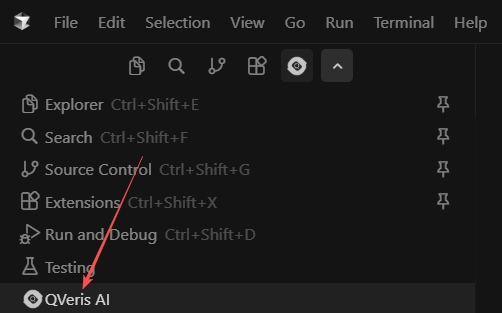

Step 2：注册QVeris，获取API KEY

安装完成后在刚刚的拓展界面重新找到QVeris AI

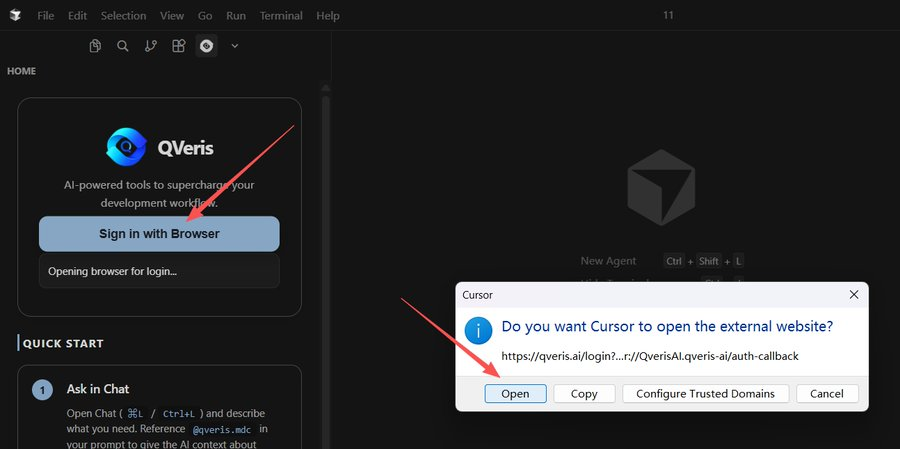

点击Sign in with Browser，右边弹窗点open，跳转到QVeris官网，注册登录

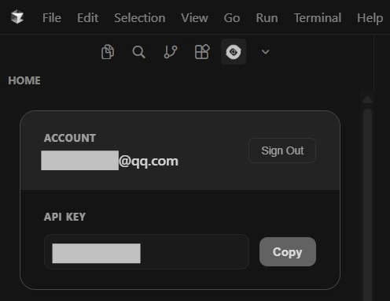

完成后得到一个API KEY（注意：这一步很重要，之后要用到）

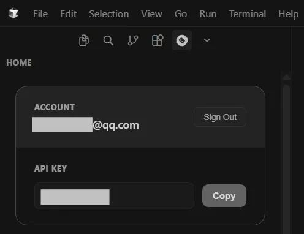

以上准备工作完成。

Step 3：创建一个项目

点击左上角File，打开Open Folder

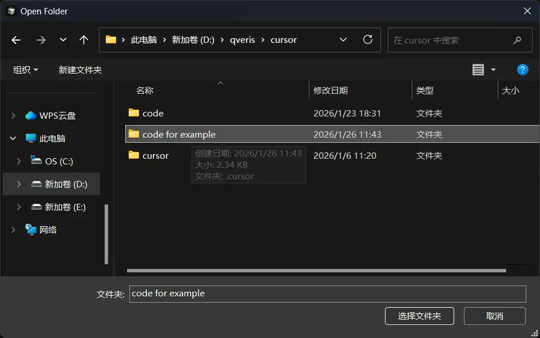

新建一个文件夹，这里示例为“code for example”，选择文件夹

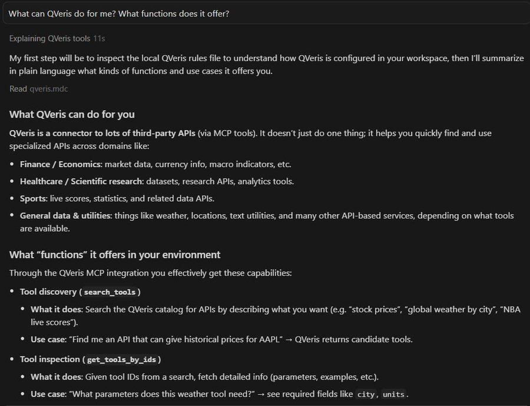

现在就可以在右侧栏与AI交流你想实现的项目了。

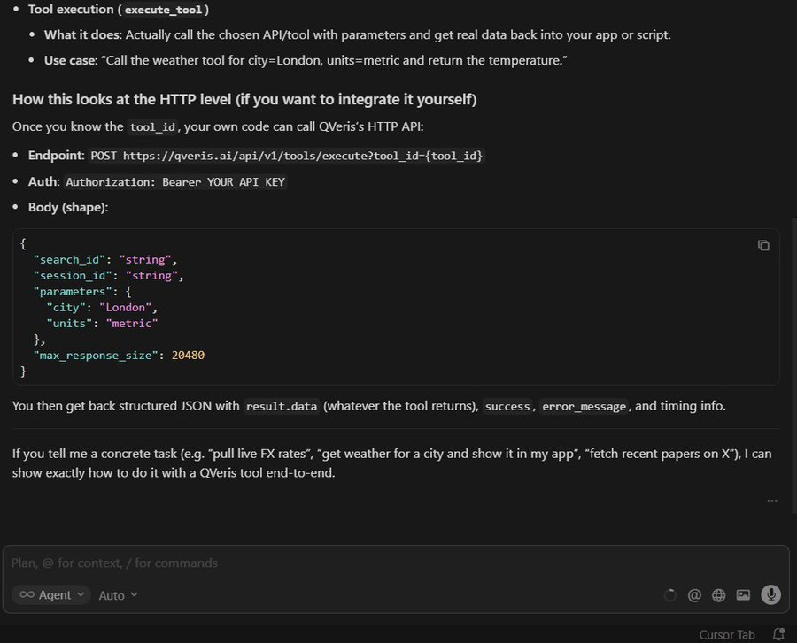

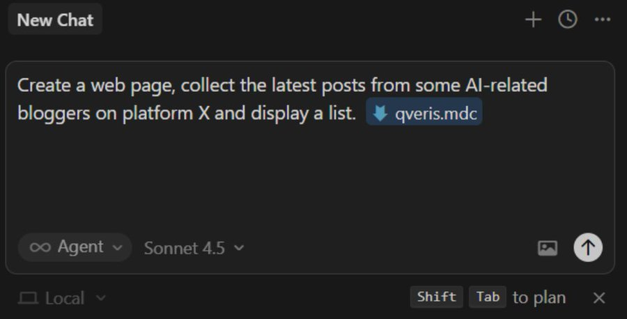

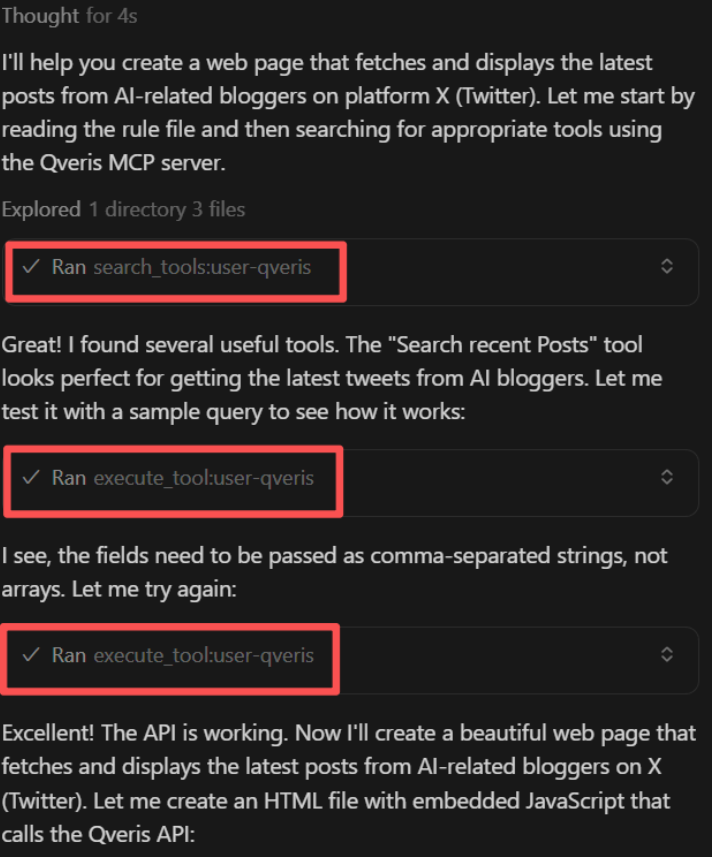

接下来演示如何利用QVeris做一个案例。

直接对 AI 说你要什么

在 Cursor Chat 中输入类似：

> 请帮我借助FMP做一个金融实时分析网站。

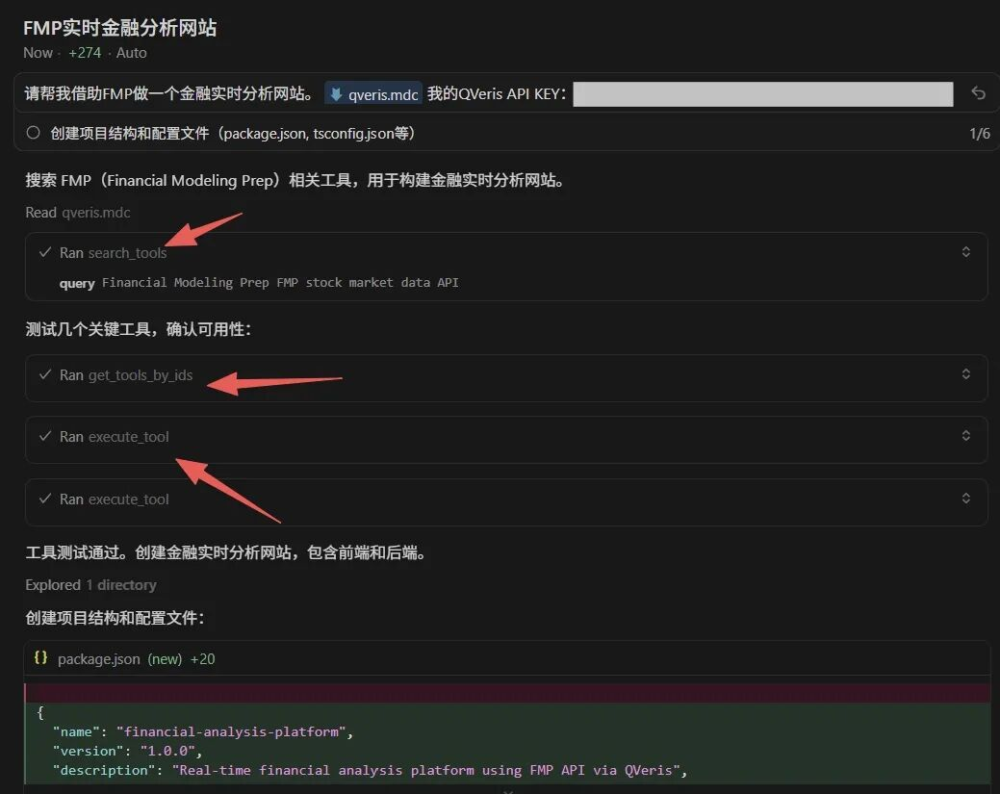

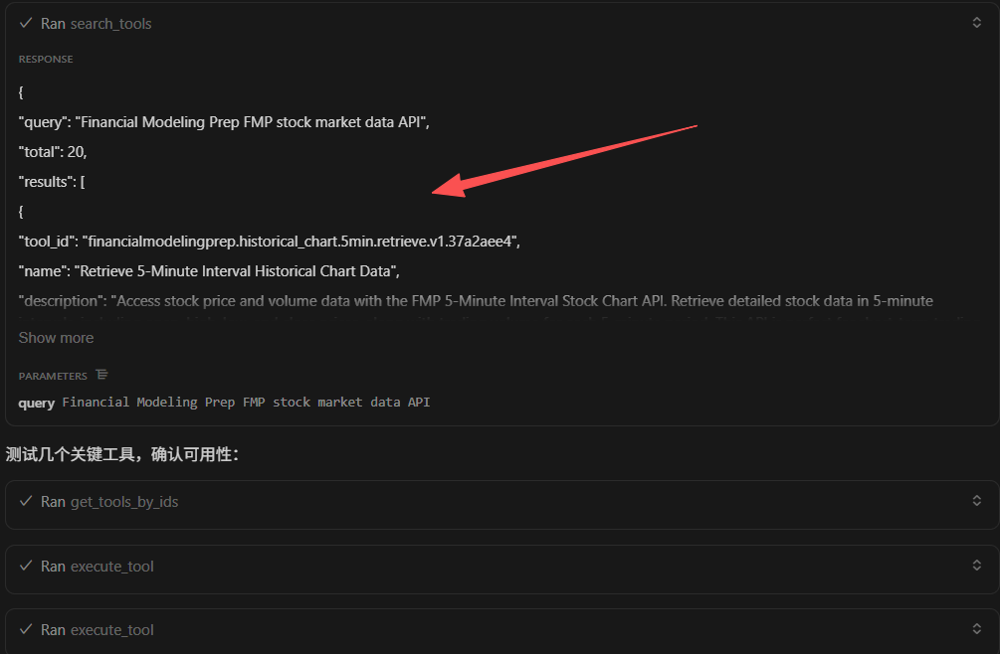

展开也可以看具体调用了哪些工具。

这里需要特别注意，在通过QVeris调用工具的时候，需要特地**@qveris.mdc**，@号前与文字内容相隔一格，再附上注册QVeris时的API KEY。

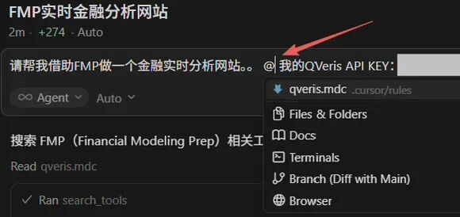

Cursor 解决的是：**AI 怎么更好地“写”**QVeris 解决的是：**AI 怎么真正“做”**

当两者连在一起，你写的不再只是代码，而是**能行动的 Agent**。
