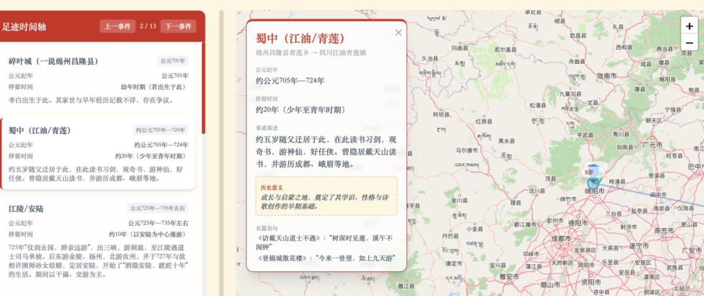
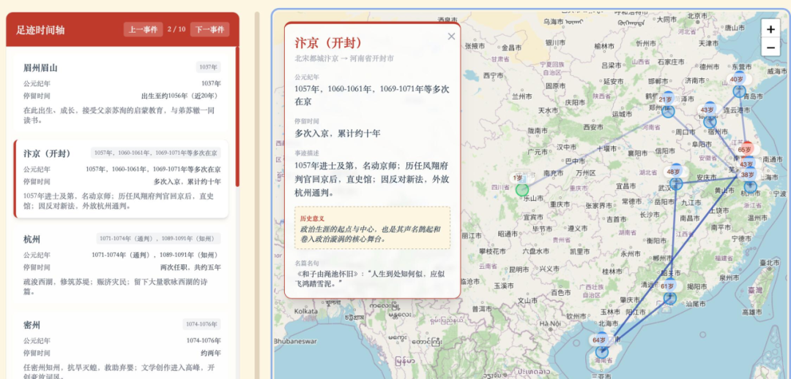
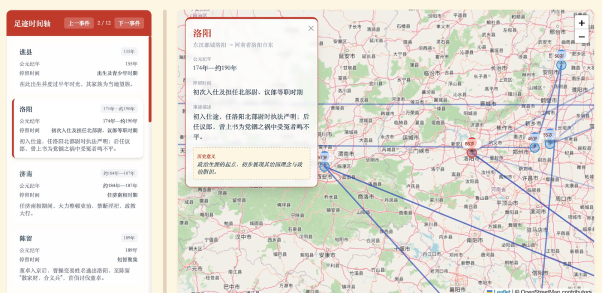

## 用地图重读历史：这个AI工具让李白苏轼的"人生轨迹"一目了然

"如果李白有朋友圈定位功能，他的足迹图会是什么样？"

当我们读"峨眉山月半轮秋，影入平羌江水流"时，是否好奇过：24岁的李白离开蜀地时，究竟走过了哪些城市？

当我们背"问余平生事业，黄州惠州儋州"时，可曾想过：苏轼一生被贬的路线图，藏着怎样的心酸历程？

一个叫做 MapStory 的项目生成现在可以生成诗句对应的足迹图，请看例子：

“峨眉山月半轮秋，影入平羌江水流。”

“问余平生事业，黄州惠州儋州。”

“关东有义士，兴兵讨群凶。”

MapStory（故事地图），它用"人物—时空—事件"的空间叙事逻辑，从空间视角重新发现历史人物的人生轨迹。

那么，它是如何做到的？

## MapStory：让历史人物在地图上“活”起来

MapStory 是一个基于大语言模型的历史人物足迹可视化系统。只需输入"李白"，3-10分钟后，你就能获得一张可交互的地图：标注着他到访过的数个关键城市、当时的年龄，以及在那里发生的诗词创作或历史事件。

它的核心逻辑非常清晰：以“人物—时空—事件”为主线。它不仅仅是抓取一段文字，而是通过空间叙事，让用户直观地看到历史人物在不同年龄阶段的地理分布。

## MapStroy的系统逻辑

## 深度生平研究（LLM 生成）

调用LLM生成人物传记，智能提取关键地点与事件，无需人工整理海量史料。

当用户输入“苏轼”时，MapStory 首先调用大语言模型（LLM）进行全量生平扫描，精准提取出 6-20 个关键生命节点。每一个地点不再是孤立的坐标，而是挂载了具体事件、人物年龄及历史意义的结构化节点。

## 精准地理编码（QVeris 核心赋能）

这是项目关键的一环。历史地名（如“儋州”、“幽州”）与现代坐标之间存在巨大的鸿沟。MapStory 通过接入 QVeris 的统一接口，调用其强大的地理编码服务。

- 一键接入： 无需对接复杂的第三方地图 API，通过 QVeris 即可直接调取高德工具及公共地理服务。
- 坐标转换： 将模糊的历史地名解析为精准的经纬度数据，为可视化打下坚实基础。

## 数据整合

将地点、年龄、事件整理为结构化数据，建立"时间-空间-事件"的三维关联。

## 地图可视化

基于Leaflet渲染交互式地图，支持路线展示、弹窗详情、时间轴浏览三种模式。

## 传记输出

自动生成包含人物简介、完整足迹与历史影响的Markdown+HTML文档。

## QVeris：Agent 的原生统一数据接口

MapStory 的成功落地，证明了 QVeris 的核心价值：让 AI 从“会回答”变成“能执行”。

目前的 AI 虽然聪明，但往往“看不见、摸不着真实世界”。QVeris 做的就是把真实世界的数据（如金融、搜索、社交、地理信息等）和专业工具，封装成 AI 可以直接调用的“能力插件”。

- 统一接口： 开发者不再需要调研、购买和对接成百上千个昂贵又复杂的 API。
- 秒级调用： 像 MapStory 这样的应用，只需接入 QVeris，就能瞬间拥有处理地理信息、检索专业数据的能力。
- 底层支撑： QVeris 是 Agent 自动化的底层逻辑，它让 AI 拥有了触碰真实世界的“手和脚”。

## 谁在期待 MapStory 与 QVeris？

这种“AI + 真实数据”的结合，正在改变多个行业：

- 历史教育： 老师不再干讲，通过足迹地图展示诗人的一生，让学生直观感受“地理的重量”。
- 文史研究： 将海量文本一键转为可视化分布图，辅助学者分析地理迁徙规律。
- 文旅策划： 快速规划“跟着苏轼游大宋”等主题旅游路线。

## 结语

StoryMap 的价值在于用空间视角，重新发现历史人物的生命轨迹。当我们看到苏轼从汴京到黄州、惠州、儋州的连线时，那些课本上的文字突然有了地理的重量；当我们放大李白出蜀的路线，才能理解"两岸猿声啼不住"是在怎样的急流中写就。

MapStory的GitHub地址👇

https://github.com/cuizicheng1024/map_story

如果你关心 AI 如何真正落地、如何实现流程自动化，那么 QVeris 正是连接“数字大脑”与“真实物理世界”的那一层必不可少的基础设施。让 AI 拥有执行力，从 QVeris 开始。
