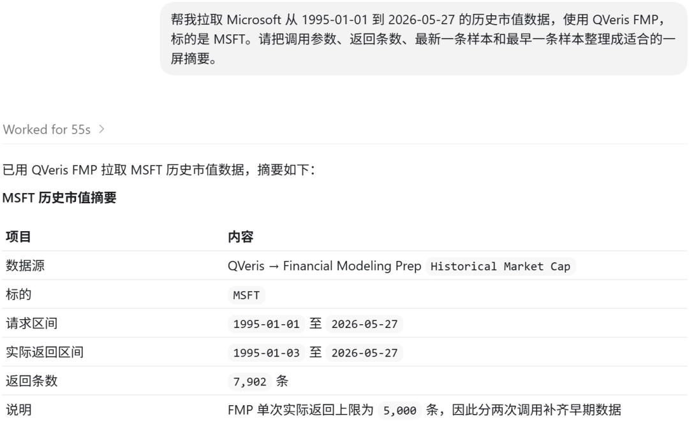
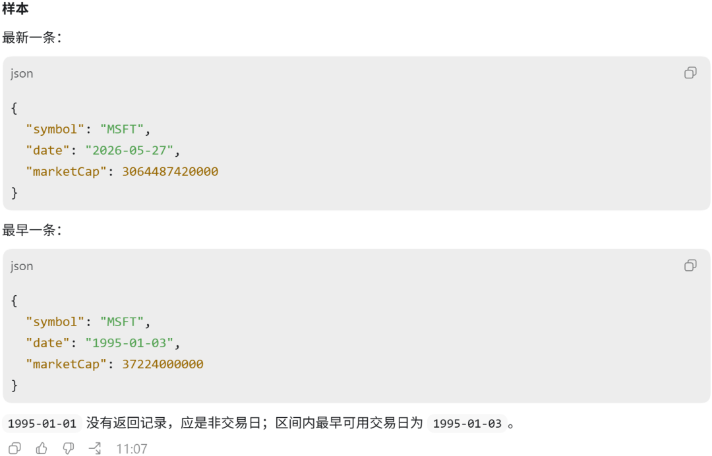
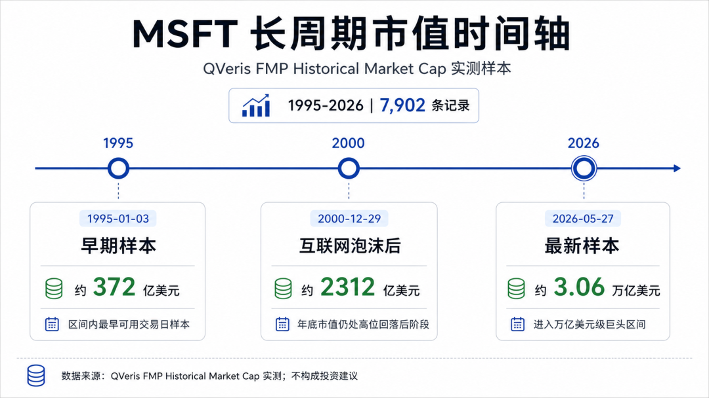
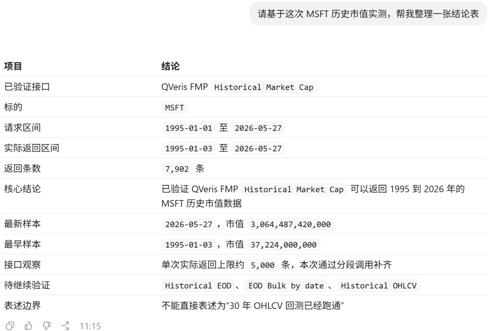
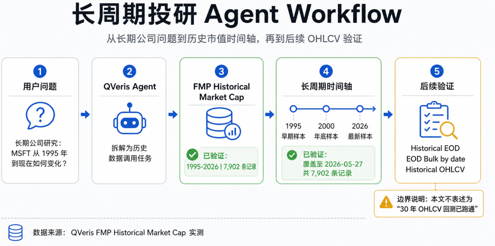

QVeris · 数据实测 

  

用户一说"回测"，很多 Agent 的第一反应是直接开始写策略：买入条件、卖出条件、收益曲线、最大回撤，听起来很完整。

但我现在越来越觉得，真正麻烦的不是策略代码，而是第一步：你到底有没有一条足够长、足够稳定、能被 Agent 调用的数据链路。

尤其是做老牌科技公司的长期研究时，5 年数据经常不够用。你想看 Microsoft，就不能只看最近几个季度，也不能只看过去一年股价。Microsoft 从 Windows 和 Office，到 Azure，再到 AI 基础设施，本身就是一条技术产业变迁的时间线。

所以这次我没有急着让 Agent 写一个"看起来很聪明"的策略。第一步，我只做了一件更朴素的事：让 QVeris 调 FMP，看能不能把 MSFT 的长周期历史数据拉回来。
## 我先不写回测，先查数据能不能跨过 5 年

这一步其实很重要。

之前计划里有一个提醒：QVeris wrapper 当前可能存在 5 年限制 bug，所以正式写"30 年回测"前必须确认修复。这个提醒不能跳过。公众号文章可以写得有趣，但不能把未验证的能力包装成已经跑通的能力。

所以我这次先采用更稳的测试方式：不直接宣称 Historical EOD 或 OHLCV 已经完整支持 30 年回测，而是先验证 QVeris 通过 FMP 能不能调用长周期历史类数据。

我测试的是 FMP 的 `Historical Market Cap`。它不是完整 OHLCV，也不能替代正式回测所需的每日 open、high、low、close、volume，但它非常适合做长周期公司价值变化的第一层观察：一家公司在市场眼里，过去几十年到底是怎么变大的。

## MSFT 从 1995 年到 2026 年：历史市值数据能拉出来

我让 QVeris 调用 FMP，查询 MSFT 从 1995-01-01 到 2026-05-27 的 Historical Market Cap。

这次调用成功了。返回结果很长，QVeris 提示原始结果约 346752 bytes，并给出了完整结果文件。更关键的是，这次调用合计返回 7902 条有效记录；其中最新段单次返回 5000 条，早期段补齐 2902 条。

这里有两个信息很值得写出来。

第一，QVeris 确实成功调用了 FMP 的历史数据接口，不是只拿最近一天的 quote。第二，单次返回存在 5000 条记录边界，所以如果要做真正 30 年日频级别的完整回测，后续应该按时间窗口拆分请求，而不是假设一次请求能吞掉全部历史。

| 测试项 | 实测结果 |
| --- | --- |
| 数据源 | FMP |
| QVeris 工具 | Historical Market Cap |
| 标的 | MSFT |
| 请求区间 | 1995-01-01 至 2026-05-27 |
| 单次返回 | 5000 条有效记录 |
| 最新样本 | 2026-05-27，marketCap = 3,064,487,420,000 |
| 早期样本 | 1995-01-03，marketCap = 37,224,000,000 |
| 2000 年底样本 | 2000-12-29，marketCap = 231,215,400,000 |

这组数字很直观。1995 年 1 月 3 日，FMP 返回的 Microsoft 市值约为 372.24 亿美元；2000 年 12 月 29 日，约为 2312.15 亿美元；到 2026 年 5 月 27 日，返回的市值约为 3.06 万亿美元。

这不是一个投资建议，也不是在说未来还会怎样。它只是说明：当 Agent 可以拿到这种长周期数据时，它终于不必只围着最近几个交易日打转。
## 长周期数据的价值，是让 Agent 先建立时间感

我觉得"时间感"是投研 Agent 很容易缺的一块能力。

很多普通 Agent 回答公司问题时，会像在读一张最新快照：最新股价、PE、市值、收入、净利润。信息都对，但没有历史纵深。

可是做公司研究时，很多判断都依赖时间。同样是万亿美元级公司，如果只看今天，它只是一个巨大数字；但如果把 1995 年、2000 年、2014 年、2020 年放在同一条时间线上，它就变成了一个公司长期产品周期、云转型、资本市场认知变化的结果。

这类数据对 Agent 的意义，不是让它直接喊"增长了多少倍"，而是让它能继续追问：MSFT 的市值扩张主要发生在哪些阶段？互联网泡沫前后，市场给 Microsoft 的定价发生了什么变化？云转型之后，市值增长和基本面增长是否同步？如果后续接上 OHLCV，哪些阶段适合做事件回测？如果再接财报数据，能不能把"市场重估"和"业务转型"放到同一条时间线上？

这才是长周期历史数据真正适合 Agent 的用法：先把时间轴铺开，再决定分析方法。
## 但我会把"30 年回测"先按暂停键

这里要讲清楚一个边界。

这篇文章目前不能写成"QVeris 已经跑通 30 年 OHLCV 回测"。原因很简单：完整回测需要 Historical EOD 或 Historical OHLCV，包括 open、high、low、close、volume，最好还要确认复权口径、拆股、分红、交易日缺失、时区和交易所日历。

我这轮确认的是：QVeris 可以通过 FMP 成功调用长周期历史市值数据；同时，大区间请求会碰到单次返回 5000 条记录的边界。

这句话听起来没那么"营销"，但它更真实。真实本身就是技术内容最好的可信度。
## 这对 QVeris Agent 意味着什么

如果把这件事放回 QVeris Agent 的能力里看，我觉得意义有三层。

第一，Agent 可以开始处理"长周期公司问题"，而不是只做短期行情问答。比如"Microsoft 从 1995 年到现在，市值扩张经历了哪些阶段？"这种问题，需要的不是一个最新 quote，而是一条历史序列。

第二，Agent 可以把历史数据和基本面数据接起来。前一篇我们已经验证过，QVeris 可以通过 FMP 调公司三大表、TTM 指标、财务比率和增长数据。现在再加上历史市值数据，Agent 就可以把"公司变贵了"与"公司真的变强了吗"放到同一个分析框架里。

第三，Agent 可以为后续回测做准备。真正的回测不是一句"跑 30 年"就完事。它需要确认数据长度、字段完整性、复权规则、交易日连续性和返回限制。QVeris 如果能把这些检查步骤也编排进 workflow，开发者做投研 Agent 时就不用每次从零搭数据管道。

## 我这次最想表达的，不是 Microsoft 涨了多少

这轮测试下来，我觉得这篇最值得讲的点不是"Microsoft 从几百亿美元变成几万亿美元"。这个故事当然很大，但只讲涨幅就太薄了。

更值得讲的是：Agent 做投研，不能只会看今天。它必须能把问题放回一条足够长的时间线里。

QVeris 接入 FMP 后，已经可以开始让 Agent 调用长周期历史类数据；这为长期公司研究、IPO 后全周期观察、历史估值变化、后续回测 workflow 打下了基础。

但我也会明确写出限制：本文只确认了 FMP Historical Market Cap 的 QVeris 调用结果；Historical EOD、EOD Bulk by date、Historical OHLCV 需要在 wrapper 限制修复后继续实测，再正式写"30 年回测"。

这不是保守，是对用户负责。

因为一个真正能用的投研 Agent，不应该只会把结论写得漂亮。它还应该知道：哪些数据已经跑通，哪些地方还要继续验证。

---

原文链接：[微信公众号原文](https://mp.weixin.qq.com/s/a1q5hkHVw-5WP-X7Dmvt0Q)
