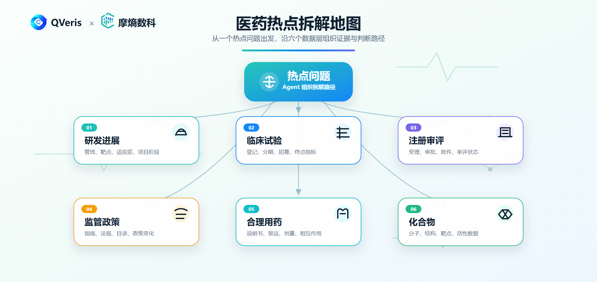
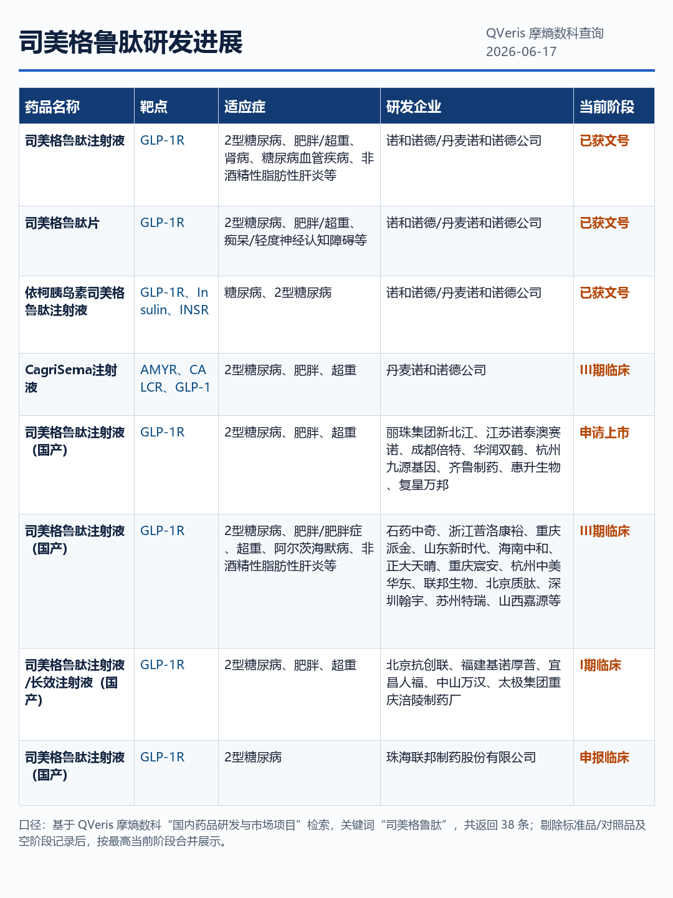
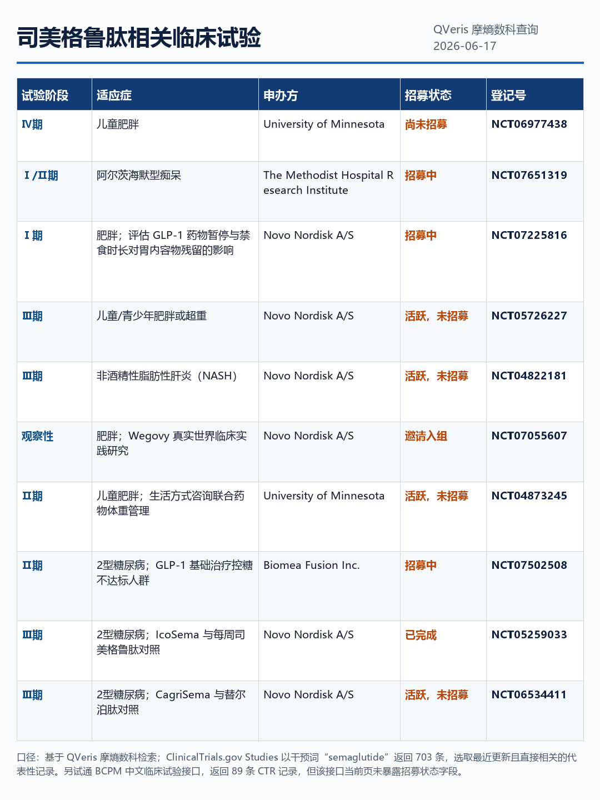
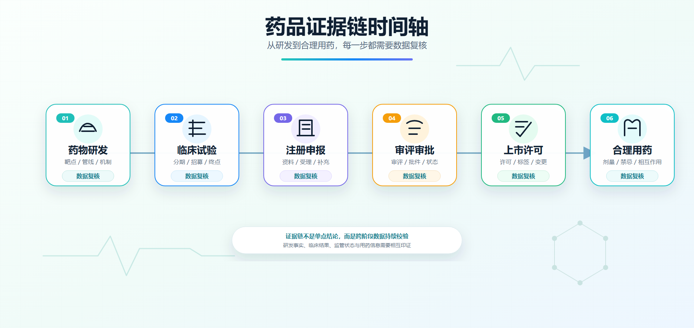
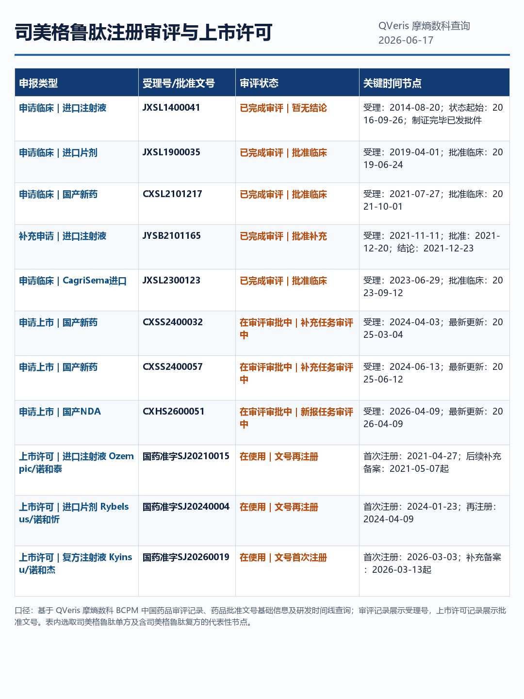
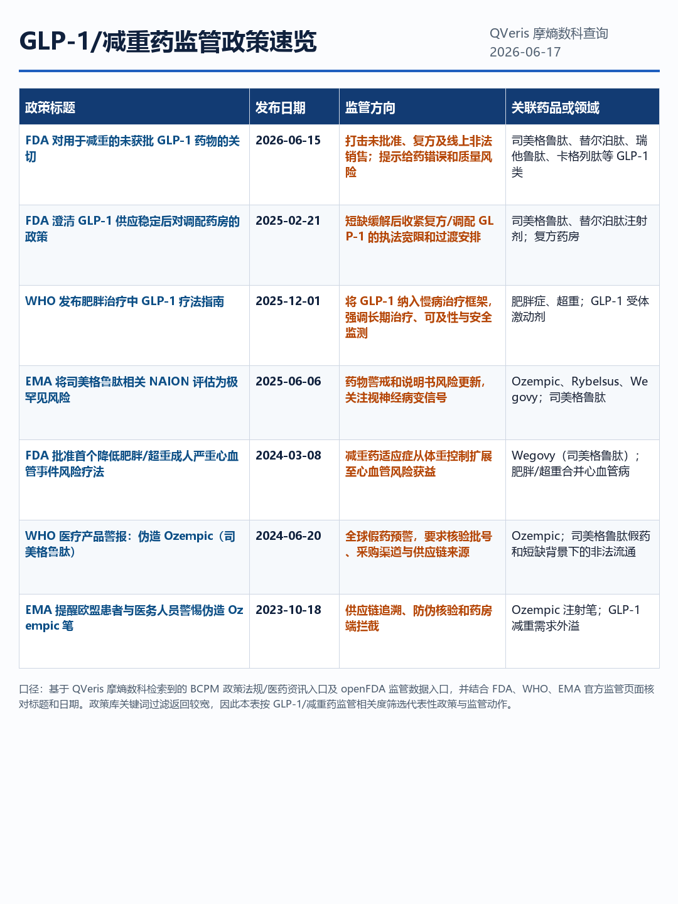
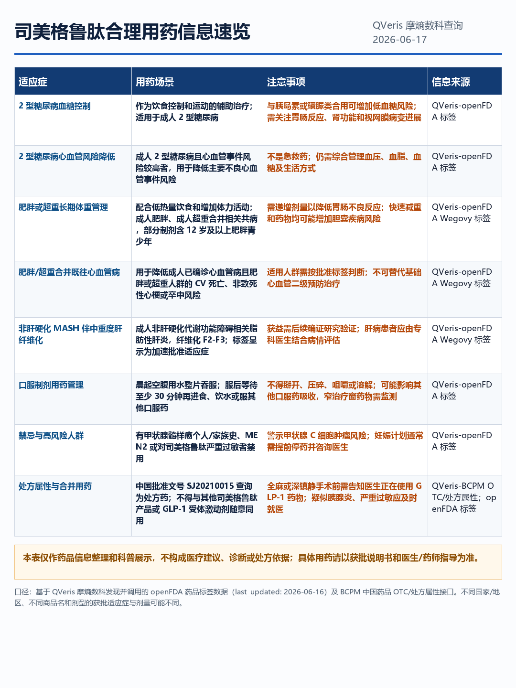
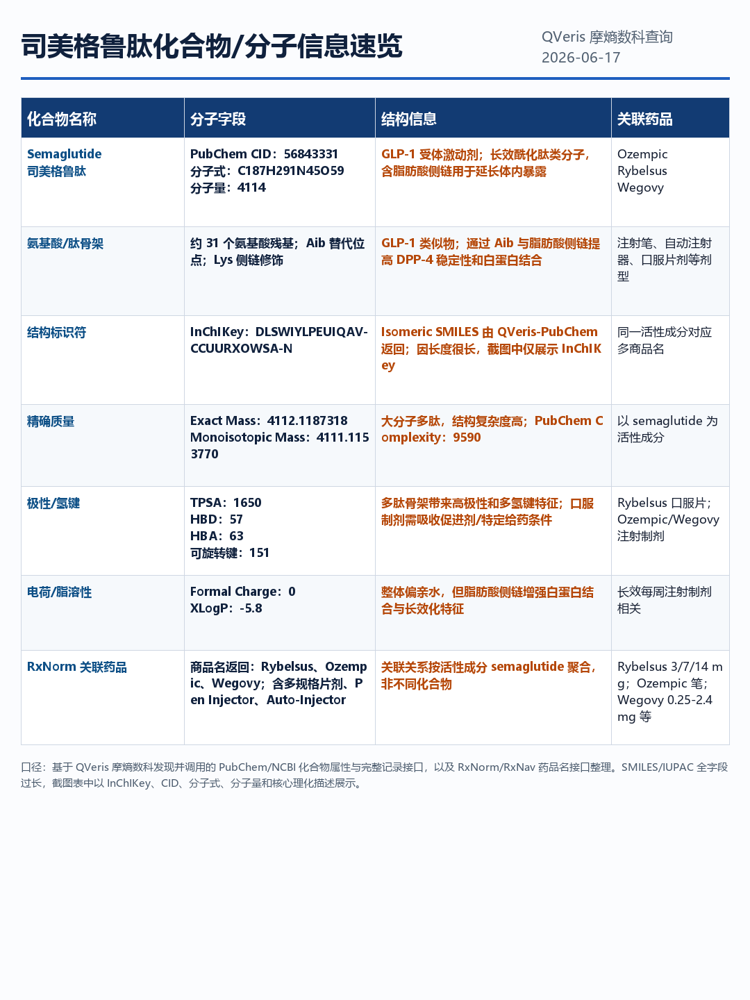
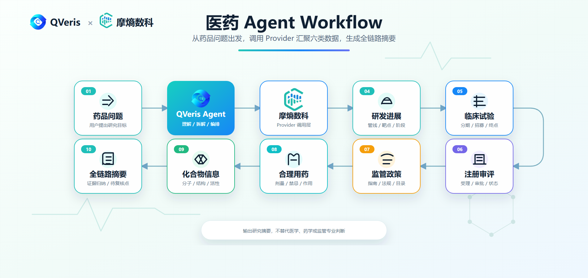

## 医药热点很多，但真正难的是查清楚

这两年，医药行业几乎每天都有新故事。

GLP-1 减重药从注射剂卷到口服药；ADC 一会儿是创新药出海主角，一会儿又被追问安全性和临床终点；AI 制药、License-out、临床失败、注册审评、政策监管，也不断把医药新闻推到更大众的视野里。

但越热的方向，越容易出现一个问题：大家都在讨论“它是不是下一个爆款”，却很少有人能在第一时间查清楚，它到底走到哪一步了。

> 一个药到底是只有概念，还是已经进临床？是临床早期，还是接近注册？是海外有进展，还是国内也有申报？是新闻很热，还是证据链真的站得住？

这正是 QVeris 接入摩熵数科 Provider 想解决的问题。

> **接入后新增什么能力**：QVeris 可以把药品 / 靶点 / 适应症查询拆解为研发进展、临床试验、注册审评、监管政策、合理用药、分子实体等可追溯数据节点，并由 Agent 串联成一条可继续复核的医药查询链路。

摩熵数科不是泛泛的医药资讯源，而是面向医药研发、注册监管、临床诊疗、合理用药、分子实体 / 化合物等高频查询场景的数据能力。接入 QVeris 后，Agent 不再只是把新闻改写成摘要，而是可以沿着一款药从研发到使用的关键路径继续追问。

| 读者看到的热点 | Agent 真正该追问的问题 | 摩熵数科可补上的数据 |
|-|-|-|
| GLP-1相关减重药爆火 | 药物、适应症、临床阶段、用药信息是否清楚 | 研发进展、临床、合理用药、分子实体 / 化合物 |
| ADC / 创新药出海 | 靶点、管线、临床试验、注册节点是否能查到 | 研发进展、临床、注册审评 |
| 临床数据发布 | 试验处于几期，招募状态如何，证据能否复核 | 临床试验数据 |
| 药品申报 / 获批 | 国内注册进展到哪一步，审评节点是什么 | 注册、审评、上市许可 |
| 政策监管变化 | 监管口径是否影响品类、产品或后续路径 | 药政监管、政策法规 |

## 两个典型用户会怎么用

| 用户场景 | 会怎么问 Agent | 摩熵数科能补什么 |
|-|-|-|
| BD / 投研团队看一条热门管线 | “这款 GLP-1 或 ADC 项目到底走到哪一步了？国内有没有申报，临床是否还在推进？” | 研发阶段、临床试验、注册审评、监管背景，帮助形成早期项目判断清单。 |
| 医学信息 / 产品团队整理药品资料 | “这款药的适应症、合理用药信息和底层分子实体怎么串起来？” | 合理用药、临床诊疗、药品基础信息、分子实体或化学 / 生物学线索，帮助整理面向内部复核的资料包。 |

---

## 第一问：这个药，到底研发到哪一步了

医药新闻里最常见的一句话是：“某某药物正在研发中。”

这句话听起来有信息量，但其实远远不够。因为“正在研发”可能意味着刚刚立项，也可能意味着已经进临床三期；可能只是一个早期候选分子，也可能是一个已经在海外产生真实临床数据的项目。

如果用户拿着一个热门药物、一个靶点、一个适应症来问 QVeris Agent，第一步不应该是写观点，而应该是先把研发事实查清楚。

- 这个药物对应什么靶点？
- 它覆盖哪些适应症？
- 相关研发企业是谁？
- 当前研发阶段是什么？
- 同靶点或同适应症下，还有哪些类似项目？

这一步听起来基础，但它决定了后面的所有判断。一个真正能用的医药 Agent，不能把“概念热度”等同于“研发进展”。

---

## 第二问：有没有临床试验，还是只停在故事里

热门药物最容易被问的一层，就是临床。

尤其是 GLP-1、ADC、肿瘤免疫、罕见病、AI 制药这些方向，市场叙事可以很快，但临床推进不会因为叙事变快。有没有真实试验登记，试验处于几期，招募状态如何，申办方是谁，适应症是否和宣传一致，这些才是更硬的证据。

接入摩熵数科后，QVeris Agent 可以把临床试验作为研发进展的下一层复核。

| 临床查询点 | 为什么需要关心 |
|-|-|
| 试验阶段 | 判断项目是早期探索，还是已经进入关键验证阶段 |
| 招募状态 | 招募状态、最近更新时间、预计完成时间、实际入组人数、终止/暂停记录等信息，可共同作为项目活跃度判断依据 |
| 适应症 | 看清真正研究的疾病领域，而不是只看营销标签 |
| 申办方 / 机构 | 理解项目背后的企业、医院和研究资源 |

这一步会让 Agent 的回答明显变得不一样。它不会只说“某药处于临床阶段”，而是会进一步整理：能查到哪些试验、每个试验处于什么状态、下一步应该看数据读出还是注册申报。

---

## 第三问：它离上市还有多远

医药行业里，临床热度和上市距离不是一回事。

一个项目可以非常热门，但离上市还很远；也可以媒体讨论不多，却已经在注册审评里悄悄往前走。对很多用户来说，真正想知道的不是“这款药有没有新闻”，而是“它有没有进入注册流程”。

摩熵数科覆盖药品注册、审评审批、上市许可等方向。接入 QVeris 后，Agent 可以继续追问：

- 是否存在注册申报记录？
- 审评审批处于哪个节点？
- 是否已有上市许可或相关结果？
- 注册信息能否和临床进展互相印证？

这对创新药、仿制药、一致性评价、进口药、本土药企管线跟踪都很关键。因为一款药从“大家都在聊”到“真正进入市场”，中间隔着一整套注册和审评流程。

---

## 第四问：监管会不会改变这个故事

医药行业的剧情，经常不是公司自己改写的，而是监管改写的。

一个品类的政策变化，可能影响市场准入；一个审评规则的调整，可能改变研发策略；一个监管口径的变化，也可能让某些药物、器械或治疗路径重新被评估。

所以，医药 Agent 不能只看产品亮点，也要看监管语境。

摩熵数科覆盖药政监管和政策法规相关数据。对 QVeris 来说，这部分能力可以让 Agent 在回答药品问题时补充监管背景：相关政策是什么、发布日期是什么、影响的是哪个领域、是否会改变注册或使用路径。

> 一个更稳的医药查询，不应该只问“这个药有什么亮点”，还应该问“监管环境是否允许这个亮点顺利兑现”。

---

## 第五问：真正用起来时，合理用药怎么查

当一款药进入真实使用场景后，问题会从“有没有进展”变成“怎么被正确理解”。

例如，GLP-1 药物讨论很热，但用户真正需要看的不只是减重效果，还有适应症、用药场景、注意事项和说明书语境。肿瘤药、慢病药、罕见病药也一样，任何涉及真实使用的问题，都不能被一句“效果不错”带过去。

摩熵数科覆盖合理用药、临床诊疗等方向。接入 QVeris 后，Agent 可以把合理用药信息作为药品全链路的一部分。

> **边界说明**：这里的价值是公开药品信息查询和辅助理解，不是医疗诊断，也不是治疗建议。涉及用药决策时，必须以医生、药师和权威说明书为准。

这条边界必须写清楚。QVeris Agent 可以帮助用户更快整理药品使用相关资料，但不能替代专业医疗判断。它应该是医学信息整理助手，而不是医生。

---

## 第六问：回到药物本身，分子实体是什么

医药热点讲到最后，经常还要回到最底层的问题：这个药物本身是什么。

对研发、专利、竞品和机制分析来说，药物本体信息非常关键。对小分子药物，它可能是化合物结构和理化性质；对多肽、蛋白、抗体等生物药，则更适合称为分子实体、序列、结构或作用机制线索。这些信息能帮助用户从药品名称继续追到更基础的研发证据。

摩熵数科覆盖化学工具、生物化学与分子生物学等能力。接入 QVeris 后，Agent 可以在药品查询里补上“分子实体 / 化学与生物学信息”这一层：

- 从药品名称追到分子实体或化合物信息；
- 从分子实体继续理解结构、序列、理化性质或机制线索；
- 把分子实体信息和研发阶段、临床试验、注册审评放在一起看；
- 帮助用户判断后续是否需要继续查专利、文献或同类药物实体。

这让 Agent 不只会查“这个药有没有进展”，也能把问题往药物本体和研发证据上继续推进。

---

## 摩熵数科接入后，QVeris Agent 不只是会查药名

如果把这篇文章压缩成一句话，那就是：

> QVeris 接入摩熵数科后，Agent 可以围绕一款药、一条管线、一个靶点或一个适应症，连续追问研发、临床、注册、监管、合理用药和分子实体信息。

这比“搜索一下这个药”要有用得多。

因为医药行业的问题，本来就不是一个网页能回答的。它需要多层证据，需要时间线，需要监管节点，也需要明确告诉用户：哪些是事实，哪些是推断，哪些还需要继续复核。

| 过去的医药查询 | QVeris × 摩熵数科后的查询 |
|-|-|
| 先搜新闻，再手动找临床、注册和说明书 | 通过 Agent workflow 连续查询研发、临床、注册、监管、用药和分子实体 |
| 容易停留在热点叙事 | 把热点拆成可复核的数据节点 |
| 用户自己判断下一步查哪里 | Agent 根据当前结果继续追问下一层证据 |

对研发团队，它可以帮助快速补齐项目背景；对 BD 团队，它可以做早期项目筛选；对投研团队，它可以形成药企和管线跟踪框架；对产品和医学信息团队，它可以整理合理用药和监管信息；对开发者，它则提供了一组可以接入 Agent 的医药数据能力。

热点会不断变化。今天是 GLP-1 和 ADC，明天可能是新的靶点、新的递送方式、新的注册政策。但底层问题不会变：一款药到底是什么，进展到哪一步，有没有临床证据，是否进入注册审评，监管语境如何，真正使用时该看什么，底层分子实体又是什么。

QVeris × 摩熵数科，就是为了让 Agent 在这些问题上不只会说，而是会查、会串联、会追问。

