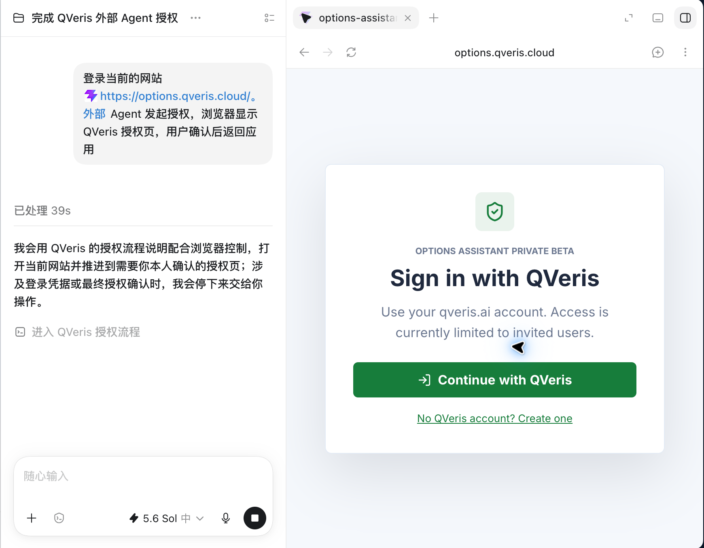
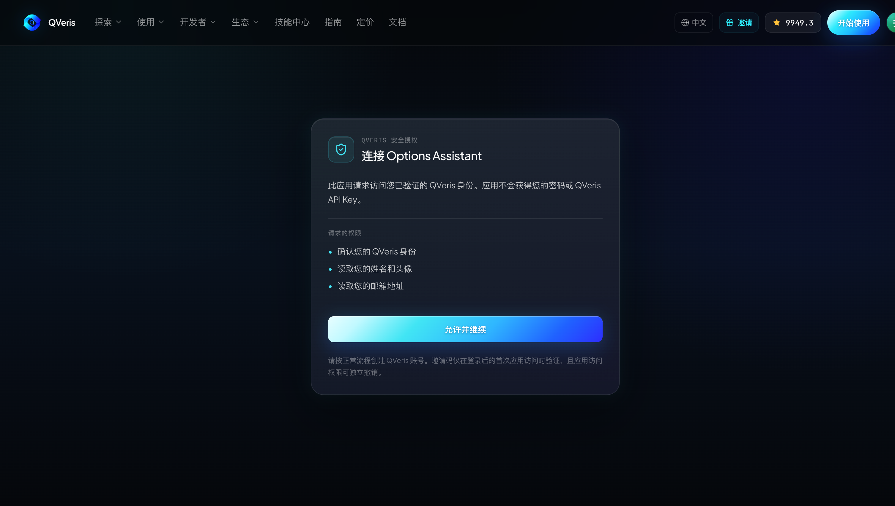

很多 Agent 产品的第一版接入方式都很直接：让用户创建一个 API Key，再把它粘贴到配置文件、环境变量或聊天窗口中。这个办法开发快，却把长期凭证交给了越来越复杂的运行环境。

当 Agent 运行在云端、CI、远程开发机或第三方平台上时，API Key 一旦泄露，通常很难回答它被谁使用、获得了哪些权限、何时失效，以及如何只撤销某一个应用的访问。

更成熟的方式，是让用户在 QVeris 的授权页面确认应用、权限和访问范围，由应用获得面向特定 Resource Server 的 Access Token。用户无需把自己的 QVeris API Key 交给 Agent，应用也不必代替用户保管账户密码。



# API Key 与 OAuth 解决的是不同问题

API Key 很适合用户自己控制的脚本和服务端任务。它简单、稳定，也便于自动化。但当你正在开发一个要交付给其他用户的 Agent 产品，API Key 会把“用户身份”“应用身份”“权限范围”和“撤销边界”混在一个长期凭证里。

OAuth 将这些问题拆开。用户在浏览器中登录 QVeris；应用使用注册过的 client ID；Access Token 绑定指定 resource 和 scope；需要长期会话时使用可轮换、可撤销的 Refresh Token。应用只获得用户明确批准的能力，而不是用户账户的全部访问权。

| 问题 | 直接使用 API Key | OAuth 授权 |
|-|-|-|
| 用户如何授权 | 复制并粘贴长期凭证 | 在 QVeris 页面确认应用和权限 |
| 应用权限 | 通常跟随 API Key 权限 | 由 resource 和 scope 精确限定 |
| 凭证生命周期 | 直到删除或轮换 | 短期 Access Token + 可轮换 Refresh Token |
| 撤销边界 | 可能影响所有使用该 Key 的任务 | 可以撤销特定应用的授权会话 |
| 适合场景 | 用户自有脚本、后端服务 | 面向其他用户的 Agent 与集成产品 |

# QVeris 当前提供的 OAuth 能力

QVeris 已提供 Authorization Code Flow、S256 PKCE、Refresh Token 轮换、令牌撤销、UserInfo、JWKS 和标准 Discovery 元数据。应用可以通过 Discovery 获取当前端点，而不是在客户端中复制一组可能变化的地址。

```bash
curl https://qveris.ai/.well-known/oauth-authorization-server
```

当前 Discovery 会公布 authorization endpoint、token endpoint、revocation endpoint、userinfo endpoint、JWKS、支持的 grant type、S256 PKCE，以及可申请的工具权限。接入代码应以 Discovery 返回值为准。

**适用边界。**当前正式能力面向 confidential client，token endpoint 使用 client_secret_basic。它适合带可信后端的 Agent 产品，以及由组织控制的内部 CLI。不要把 client secret 写入浏览器 SPA、移动应用或公开分发的二进制文件。面向公开桌面或无头 CLI 的无密钥接入，应等待专门的 public-client 授权方案正式发布。

# Tutorial：为一个 Agent 服务接入 QVeris OAuth

## 第一步：注册应用和最小权限

接入前，应用需要获得 client ID、client secret、精确注册的 redirect URI、允许访问的 resource 和 scope。开发环境和生产环境应使用不同客户端，不要共用 secret 或回调地址。

如果 Agent 当前只需要发现和检查工具，可以只申请：

```text
tools.search tools.inspect
```

只有确实需要执行真实工具调用时，才增加：

```text
tools.execute
```

需要在用户离开后保持会话时，再申请 `offline_access`。scope 必须是客户端注册允许范围的子集；应用不能通过前端参数自行扩大权限。

## 第二步：生成 PKCE verifier 和 challenge

PKCE 用于把浏览器授权请求和后续 code exchange 绑定起来。每次授权都要生成新的随机 verifier，并在发起授权前安全保存。

```javascript
import crypto from "node:crypto";

const codeVerifier = crypto.randomBytes(32).toString("base64url");
const codeChallenge = crypto
  .createHash("sha256")
  .update(codeVerifier)
  .digest("base64url");

const state = crypto.randomBytes(24).toString("base64url");
const nonce = crypto.randomBytes(24).toString("base64url");
```

state 用于防止授权响应被替换；nonce 用于关联身份令牌。它们应与当前登录会话绑定，并设置短期过期时间。

## 第三步：将用户重定向到授权页面

应用使用 Discovery 返回的 authorization endpoint 构造请求。下面以工具搜索和检查权限为例：

```text
https://qveris.ai/oauth/authorize?
response_type=code&
client_id=YOUR_CLIENT_ID&
redirect_uri=https%3A%2F%2Fagent.example.com%2Foauth%2Fcallback&
scope=tools.search%20tools.inspect%20offline_access&
resource=YOUR_REGISTERED_TOOL_RESOURCE&
code_challenge=YOUR_CODE_CHALLENGE&
code_challenge_method=S256&
state=YOUR_STATE&
nonce=YOUR_NONCE
```

用户登录后会看到应用身份、申请权限和相关提示。应用不能替用户点击同意，也不应在自己的页面模拟 QVeris 密码输入框。



## 第四步：校验回调并交换 Token

回调收到 code 和 state 后，先使用常量时间比较确认 state 与会话一致，再由可信后端调用 token endpoint。client secret 只存在后端，不返回浏览器。

```bash
curl -u "$CLIENT_ID:$CLIENT_SECRET" \
  -X POST https://qveris.ai/oauth/token \
  -H "Content-Type: application/x-www-form-urlencoded" \
  --data-urlencode "grant_type=authorization_code" \
  --data-urlencode "code=$AUTHORIZATION_CODE" \
  --data-urlencode "redirect_uri=$REDIRECT_URI" \
  --data-urlencode "code_verifier=$CODE_VERIFIER" \
  --data-urlencode "resource=$TOOL_RESOURCE"
```

Authorization Code 是短期、一次性的。重复兑换、redirect URI 不一致、PKCE 不匹配或客户端认证失败都应终止流程，不要自动降级为 API Key。

## 第五步：使用正确的 Token 调用正确的 Resource

获得 Tool Access Token 后，Agent 可以在 scope 允许范围内调用 QVeris 工具 API。例如仅拥有 tools.search 的 Token 可以发现能力，但不能执行工具。

```bash
curl -X POST https://qveris.ai/api/v1/search \
  -H "Authorization: Bearer $ACCESS_TOKEN" \
  -H "Content-Type: application/json" \
  -d '{"query":"real-time market data for NVIDIA"}'
```

Access Token 的 audience 必须与目标 Resource Server 完全匹配。ID Token 用来向 OAuth Client 证明用户身份，不能发送给工具 API；Account Token 也不能替代 Tool Token 执行 Search 或 Call。

## 第六步：安全轮换 Refresh Token

当应用获得 offline_access 时，可以使用 Refresh Token 获取新的 Access Token。QVeris 会在每次刷新时轮换 Refresh Token，因此应用必须在服务端加密保存当前值，并在刷新成功后原子替换旧值。

```bash
curl -u "$CLIENT_ID:$CLIENT_SECRET" \
  -X POST https://qveris.ai/oauth/token \
  -H "Content-Type: application/x-www-form-urlencoded" \
  --data-urlencode "grant_type=refresh_token" \
  --data-urlencode "refresh_token=$CURRENT_REFRESH_TOKEN" \
  --data-urlencode "resource=$TOOL_RESOURCE"
```

如果已经轮换过的 Refresh Token 再次出现，客户端应将其视为可能的重放或并发错误，并终止该授权会话，而不是继续重试。

## 第七步：退出时主动撤销

用户退出 Agent、解除 QVeris 连接或管理员终止集成时，应用应调用 Discovery 公布的 revocation endpoint，并清理本地会话。

```bash
curl -u "$CLIENT_ID:$CLIENT_SECRET" \
  -X POST https://qveris.ai/oauth/revoke \
  -H "Content-Type: application/x-www-form-urlencoded" \
  --data-urlencode "token=$CURRENT_REFRESH_TOKEN" \
  --data-urlencode "token_type_hint=refresh_token"
```

撤销接口可以设计为幂等操作：即使 Token 已过期或已撤销，客户端也能安全完成本地退出流程。

# 一个具体的 Agent 权限设计

假设你正在开发一个代码仓库风险分析 Agent。它需要查找外部服务状态和开发者数据，但默认不应执行付费能力。

首次授权只申请 tools.search 和 tools.inspect。Agent 可以发现候选能力、检查参数、比较成本，并向用户生成执行计划；由于没有 tools.execute，即使 Prompt Injection 诱导它直接调用，也会在服务端权限检查处失败。

如果产品确实需要自动执行，可以为经过风险评估的客户端配置 tools.execute，并在应用自己的策略层继续限制工具类别、单次金额和人工确认条件。OAuth scope 是服务端底线，不应替代应用内部的任务策略。

# 上线前安全检查

1. 从 Discovery 读取端点，不在多处复制 OAuth URL。
2. 每次授权生成新的 state、nonce 和 PKCE verifier。
3. redirect URI 使用精确匹配，不接受通配符或用户输入的回跳地址。
4. client secret 和 Refresh Token 只保存在可信后端，并进行加密与访问审计。
5. 验证 Token 的 issuer、audience、有效期、scope 和签名，不只检查 client ID。
6. 刷新成功后原子替换 Refresh Token，重放时关闭整个授权会话。
7. 退出和解绑时调用 revocation endpoint，并删除本地会话。

# 结语

让 Agent 获得外部能力，不意味着把用户的长期凭证交给它。OAuth 的价值不是多了一次浏览器跳转，而是把用户、应用、资源、权限和生命周期变成可以独立控制的安全边界。

对于面向客户、团队或合作伙伴的 Agent 产品，这也是从 Demo 走向生产的关键一步：用户知道自己授权了谁，应用知道自己能做什么，平台也能在不暴露 API Key 的情况下执行明确的权限和撤销策略。

如果你正在开发需要接入 QVeris 工具搜索、检查或执行能力的 Agent 产品，可以从 OAuth Discovery 开始设计接入，并联系 QVeris 完成客户端注册与权限配置。
