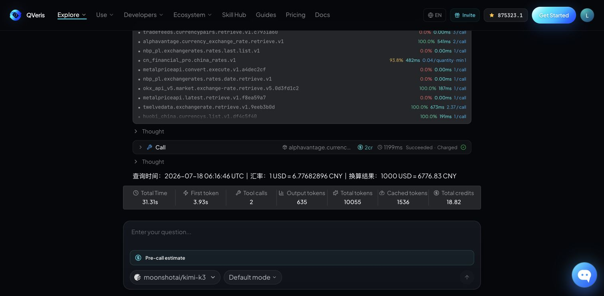
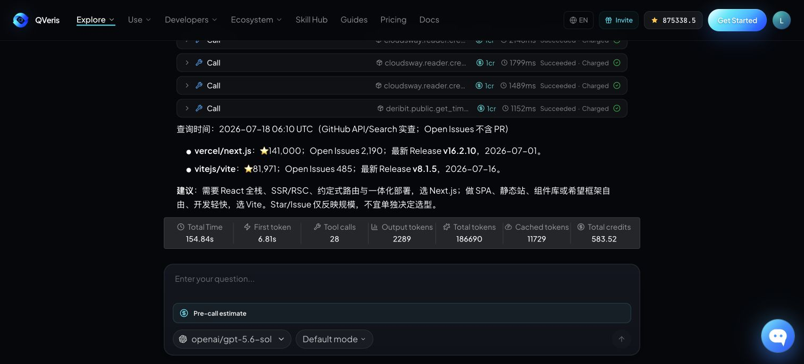
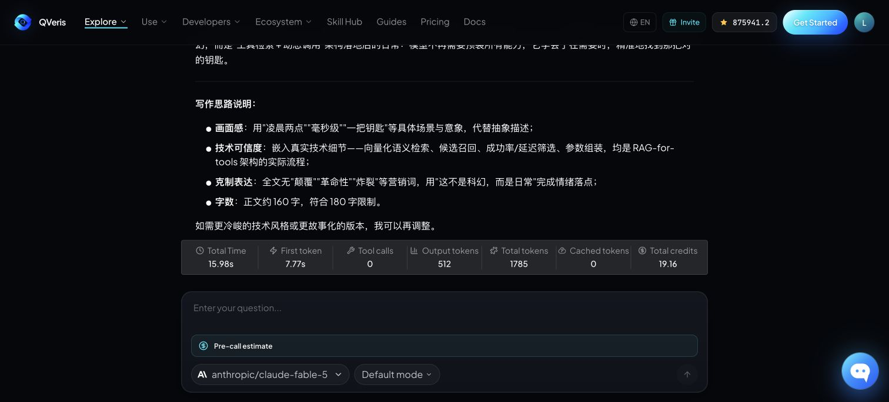

# 最新大模型，不止能聊：在 QVeris.ai Playground 一次体验 Kimi K3、Claude Fable 5 与 GPT-5.6-Sol

当新模型发布的速度越来越快，真正影响使用体验的，已经不只是“模型名单里有没有它”，而是能不能马上用真实问题去验证：它会不会找数据、能不能调用工具、结果是否可追溯，以及一次任务究竟花了多少时间和成本。

现在，Kimi K3、Claude Fable 5、GPT-5.6-Sol 等最新模型已经可以在 [QVeris.ai Playground](https://qveris.ai/playground) 里直接体验。用户不需要分别注册多个模型平台，也不需要先写 API 集成代码，只要选中模型、输入问题，就可以观察从推理到工具调用再到答案生成的完整过程。

这篇文章不做参数表格式的“云评测”。我们直接用最新产品界面，完成三个真实任务：实时汇率换算、开源技术选型、公众号内容创作，并把关键过程和结果完整截图记录下来。

## 一个 Playground，把模型与真实世界连接起来

QVeris Playground 当前接入了 10,000+ 个真实、经过验证的能力。面对需要外部信息的问题，模型可以在同一个对话里完成 **Discover → Inspect → Call → Answer**：

1. **Discover**：根据自然语言需求，从工具库中召回候选能力；
2. **Inspect**：检查参数、成功率、延迟和调用成本；
3. **Call**：带着结构化参数执行真实调用；
4. **Answer**：把返回数据整理成用户真正需要的结论。

工具发现和检查过程免费，实际调用会在界面里显示计费单位、延迟和成功状态。相比只展示一段最终答案，这条链路更适合判断模型究竟是在“凭记忆回答”，还是完成了一次可检查的真实任务。

## 三款新模型，适合三类不同任务

**Kimi K3** 目前是 Playground 的默认模型，提供 1M 上下文。在这次实测中，它能把自然语言问题拆成数据需求，发现、筛选并调用实时汇率工具，适合长上下文分析和多步骤工具任务。

**GPT-5.6-Sol** 提供 1.1M 上下文。在开源项目对比任务中，它完成了多轮检索与工具调用，最后给出带查询时间、具体数据和适用边界的选型建议，适合结构化研究与复杂工具编排。

**Claude Fable 5** 提供 1M 上下文。它在中文内容创作中表现出较好的画面感、结构意识和表达克制，适合品牌内容、公众号开头和长文改写等任务。

Playground 里还可以直接选择 Gemini 3.1、DeepSeek V4、Claude Sonnet 5 等模型。模型选择不再是一项前置的工程决策，而可以在同一个界面里按任务快速试用和比较。

## 案例一：Kimi K3 × 实时汇率——从数据调用到精确换算

第一个任务看似简单：查询当前 USD/CNY 汇率，并计算 1000 美元可以兑换多少人民币。真正的要求是只能调用一个实时工具，答案必须包含查询时间、汇率和换算结果，不能凭模型记忆作答。

> 只调用一个实时汇率工具，查询当前 USD/CNY 汇率，并计算 1000 美元可兑换多少人民币。最终只输出一行：查询时间、汇率、换算结果；不要解释过程。

Kimi K3 先发现 10 个候选工具，比较历史成功率、延迟与调用成本后，选择 Alpha Vantage 的实时汇率能力。调用在 1199ms 内成功，计费 2 credits；最终一行给出查询时间 2026-07-18 06:16:46 UTC、1 USD = 6.77682896 CNY，以及 1000 USD = 6776.83 CNY。

这个案例的价值不在“汇率”本身，而在于它形成了一个可以迁移的闭环：**明确计算目标 → 发现候选工具 → 按质量筛选 → 执行调用 → 校验并换算**。同样的模式可以用于股票估值、商品价格换算、预算核算和跨境采购。

## 案例二：GPT-5.6-Sol × GitHub 数据——从指标查询到技术选型

第二个任务要求对比两个真实开源项目。我们不只问 Star 数，而是同时要求 Open Issues、最近 Release 或 Tag 日期，并把数据转化为面向新项目的选型建议。

> 请调用 GitHub 数据工具，对比 vercel/next.js 与 vitejs/vite：当前 Star 数、Open Issues 数、最近一次 Release 或 Tag 日期，并据此给出面向新项目的选型建议。必须真实调用工具并注明查询时间；最终不超过 300 字。

GPT-5.6-Sol 完成了工具发现、检查和多次调用，并在最终答案中标注查询时间为 2026-07-18 06:10 UTC。实测结果显示：vercel/next.js 为 141,000 Star、2,190 个 Open Issues，最新 Release 为 v16.2.10；vitejs/vite 为 81,971 Star、485 个 Open Issues，最新 Release 为 v8.1.5。

更重要的是，模型没有把流行度直接等同于“更适合”。它把数据与架构需求结合：需要 React 全栈、SSR/RSC、约定式路由与一体化部署时倾向 Next.js；面向 SPA、静态站、组件库或强调框架自由与开发速度时倾向 Vite，并明确提醒 Star 和 Issue 只能反映项目规模。

界面同时记录了 28 次工具调用、总耗时、首 Token 时间、Token 使用量与总 credits。对于技术调研，这种可见性很关键：读者不仅看到结论，也能判断结论经历了怎样的数据获取过程。

## 案例三：Claude Fable 5 × 内容创作——技术可信，也要有人愿意读

工具调用解决“信息从哪里来”，内容模型还要解决“怎样让人读下去”。第三个任务因此刻意不调用外部工具，而是测试 Claude Fable 5 能否把抽象技术写成有画面、有细节、不过度营销的公众号开头。

> 请用不超过 180 字，为“AI Agent 能实时检索并调用 10,000+ 工具”写一个兼具画面感和技术可信度的公众号开头，避免夸张营销词。

Claude Fable 5 选择从“凌晨两点，一条用户请求抵达”切入，用向量化语义检索、候选召回、成功率与延迟筛选、参数组装等具体细节支撑叙事，并以“找到那把对的钥匙”收束。它还主动解释了画面感、技术可信度、克制表达和字数控制的写作思路。

这说明同一个 Playground 不只适合做数据研究。完成事实查证之后，用户还可以切换模型，把结果继续加工成文章开头、产品说明、社交媒体文案或不同语气的版本。

## 怎样复现这三个案例

1. 打开 [QVeris.ai Playground](https://qveris.ai/playground)；
2. 在输入框下方选择 Kimi K3、Claude Fable 5 或 GPT-5.6-Sol；
3. 对数据型任务明确写出“必须真实调用工具、注明查询时间、不要只凭记忆”；
4. 观察 Discover、Inspect 和 Call 卡片，检查成功率、延迟、计费与返回结果；
5. 根据任务需要切换模型，继续做分析、比较或内容加工。

## 三个可以直接复制的 Prompt

**市场研究：**请调用真实市场数据工具，获取两家公司的当前股价、市值与最近季度营收，统一币种和统计周期后比较估值；注明数据时间和来源，不构成投资建议。

**旅行规划：**请调用天气、航班与地图工具，为两个目的地制作周末出行对比；先列数据，再说明取舍，最后给出一个明确推荐。

**产品调研：**请调用真实公开数据与网页读取工具，对比两个开源项目的活跃度、最新版本、Issue 状态和适用场景；不要用 Star 数直接替代技术判断。

## 结语：选模型，更要选完成任务的路径

新模型值得体验，但真正有用的评测不应停留在聊天窗口里。一个模型能否找到正确工具、理解参数、拿到最新数据、控制成本，并把过程压缩成清晰结论，往往比单一排行榜分数更接近真实工作。

在 QVeris.ai Playground，模型、数据与工具被放进同一条可见链路。你可以用 Kimi K3 处理多步骤数据任务，用 GPT-5.6-Sol 做结构化研究，再用 Claude Fable 5 完成内容表达。最好的模型不是固定答案，而是最适合当前任务、并且能够把任务真正做完的那个。

**立即体验：**[打开 QVeris.ai Playground](https://qveris.ai/playground)

注：本文截图与数据采集于 2026 年 7 月 18 日。实时数据会随时间变化；示例中的市场与项目数据仅用于产品功能演示，不构成投资或技术采购建议。
