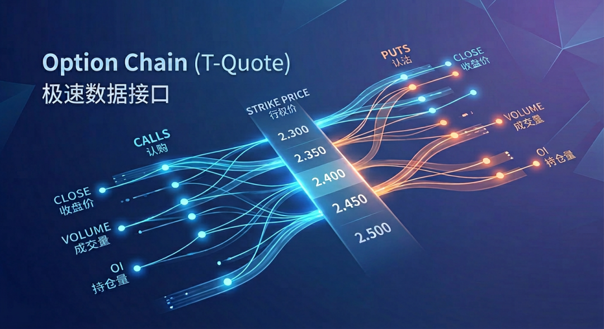
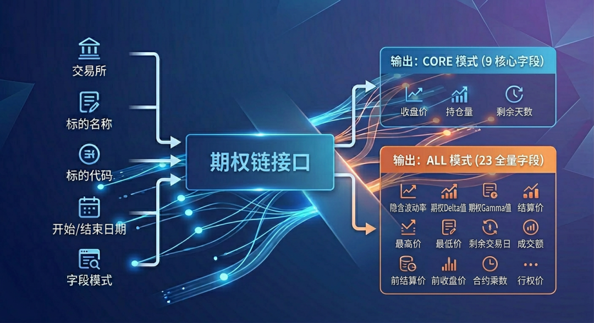
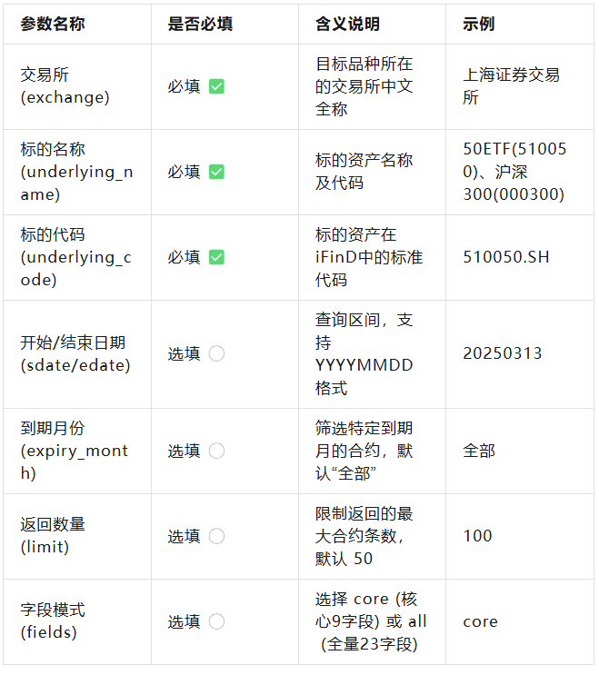
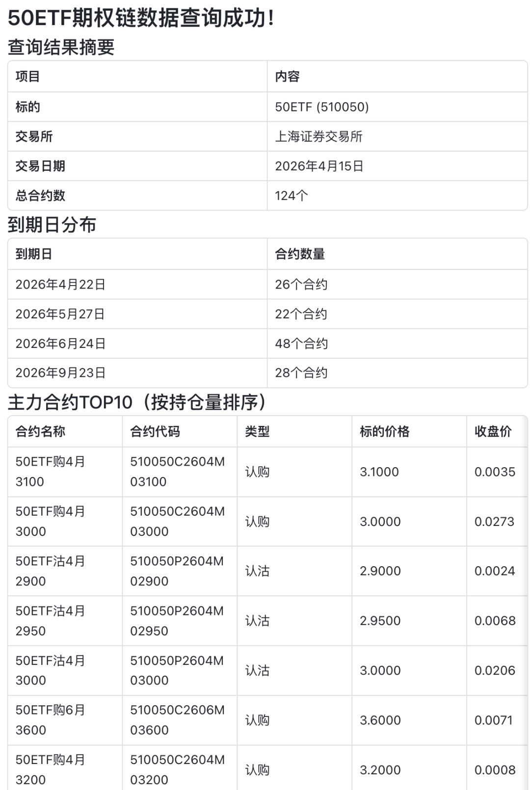

在期权交易与量化分析中，期权链（T型报价）是投资者观察市场情绪、寻找交易机会最核心的视图。

为了帮助大家更高效、便捷地获取高质量的期权数据，我们全新开发了「期权链数据查询工具」！

无论您是关注金融期权（ETF、股指），还是商品期权，这款工具都能为您提供极速、精准的数据支持。

今天，我们就来为您详细盘点这款工具的强大功能与使用方法。

------------------------------------------------------------------------

## 前言：洞察市场的脉搏，不可或缺的期权链

在期权交易、波动率交易以及量化策略回测中，**期权链（Option Chain，即T型报价**）是我们观察市场情绪、寻找套利机会、构建波动率曲面最核心的底层数据。它不仅是一个价格表，更是市场对未来资产价格预期的直观反映。

然而，如何高效、精准地从海量金融终端中提取结构化的期权链数据，一直是许多投研团队和宽客的痛点。

为了解决这一难题，我们通过高度封装底层接口开发了「**期权链数据查询工具**」

------------------------------------------------------------------------

##  

## 核心亮点：为什么选择我们的工具？

1.  ### 🏠 全市场品种无缝覆盖

**工具支持国内主流交易所的各类期权品种，满足您跨市场的投研需求**：

- 金融期权：上海证券交易所、深圳证券交易所（ETF期权），中国金融期货交易所（股指期权）

- 商品期权：上海期货交易所、大连商品交易所、郑州商品交易所、广州期货交易所

    
  

2.  ### ⚡ 灵活的查询维度

**告别死板的数据导出，支持多维度自定义查询**：

- 按日期范围：不仅可以查最新行情，还支持指定历史时间段（默认查询当日）。

- 按到期月份：可一键查询“全部”合约，也可精准定位特定交割月的合约。

- 自定义数据量：自由控制返回的合约数量（默认50条），轻松应对大数据量需求。

    
  

3.  ### 📊 核心与全量数据一键切换

**针对不同的应用场景，工具提供两种数据输出模式**：

- Core（核心模式）：包含最常用的9大核心字段（如收盘价、涨跌幅、成交量、持仓量、标的价格、剩余天数等），响应更轻快。

- All（全量模式）：提供多达23项详尽指标（涵盖开高低收、结算价、内在价值等），满足深度复盘与量化建模需求。

    
  

------------------------------------------------------------------------

参数指南：如何发起一次精准查询？

使用本工具非常简单，只需输入几个关键参数即可获取定制化的数据结果。

**以下是参数说明对照表**：

*(注：日期参数若不填，系统将自动拉取当日北京时间的最新数据。)*

------------------------------------------------------------------------

##  

------------------------------------------------------------------------

## 实战演示：几行指令，洞悉期权市场

为了让大家更直观地感受工具的便利性，我们准备了一个经典的查询场景。

### 场景：查询上交所 50ETF 期权核心数据

需求描述：查询上交所50ETF(510050)在2026年4月15日的期权链数据，用于观察主力合约的持仓量与成交变化。

**传入参数**：

- 交易所：上海证券交易所

- 标的名称：50ETF(510050)

- 标的代码：510050.SH

- 开始日期：20250313

- 结束日期：20250413

- 字段模式：core (默认)

👇 【运行结果演示】 👇

------------------------------------------------------------------------

##  

------------------------------------------------------------------------

##  

## 结语与展望

期权市场瞬息万变，拥有一个稳定、高效的数据抓手是制胜的关键。我们的期权链数据查询工具通过高度封装底层接口，为您屏蔽了繁琐的请求构造和字段解析过程，让您将更多精力聚焦于交易策略本身。

如果您在宏观经济数据分析、量化工具开发方面有更多定制化需求，欢迎在后台留言与我们交流！

\[戳文末右下角分享\]，把好用的工具推荐给您的交易伙伴吧！📈

#
