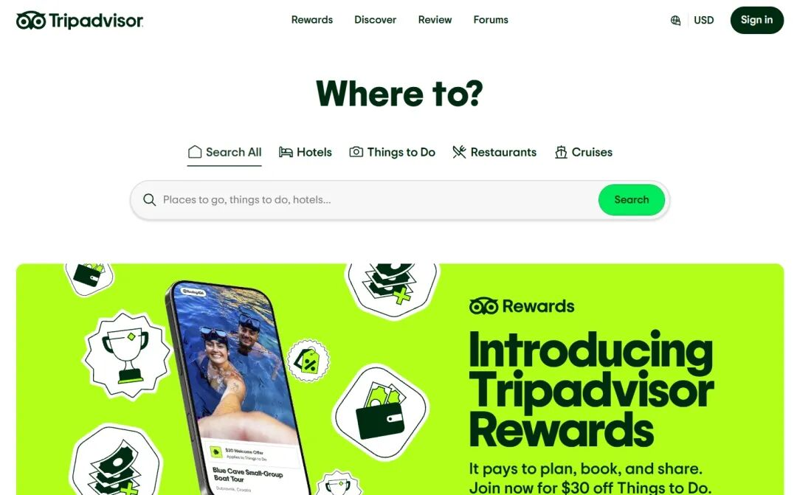
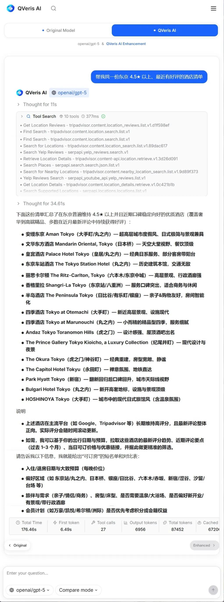

在很多旅行规划、推荐或地点评价场景里，真实、可信的数据至关重要。我们最近为 QVeris 接入了 Tripadvisor Content API，让 Agent 获得了一种全新的现实世界能力。

Tripadvisor 是全球领先的旅行点评与推荐平台，拥有超过 8 百万地点（酒店、餐厅、景点）、10 亿条来自真实游客的评论与评分、以及多语种内容。

过去，Agent 如果要生成地点推荐、评分对比或点评摘要，往往只能依赖训练时的知识、爬虫数据或大致估计，这就会产生很多不准确或不可靠的结果。

现在，通过 QVeris 接入这个 API，Agent 可以：

- 📍 **获取具体地点信息**：包括酒店、餐厅、景点的名称、地址、评分等
- ⭐ **检索真实用户评论与评分**：让建议有“数据支撑”
- 📸 **调用用户照片**：提升旅行建议的可信度
- 🔍 **做出位置搜索与筛选**：如按评分、类型、距离等条件检索地点

这让 Agent 不再只是“说得像”或“估计可能”，而是真正能基于现实世界的数据做出判断和建议。

例如，用户可以向 Agent 提问：

- “帮我找一份东京 4.5★ 以上、最近有好评的酒店清单”
- “把巴黎评价最高的餐厅按评分排名”
- “列出某城市周边的高评分景点与点评摘要”

可以看到，通过调用Tripadvisor的数据，Agent能够独立完成一份详细又准确的酒店清单。

这些任务背后，不是模型“猜答案”，而是 Agent **主动调用 Tripadvisor API、理解数据含义、组合结果给出输出**。

QVeris免费开放这个api给大家使用，欢迎大家来体验！👇

https://qveris.ai
