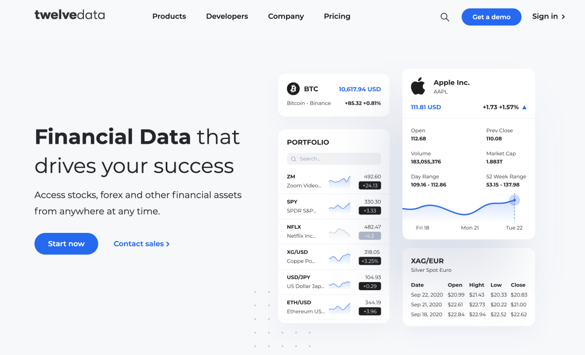
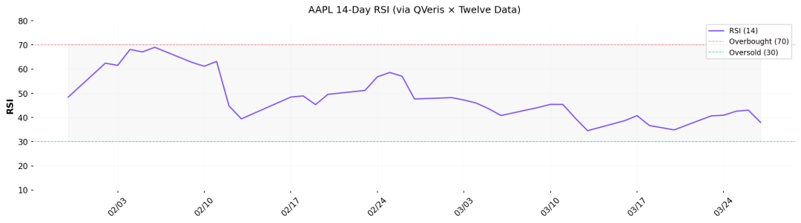
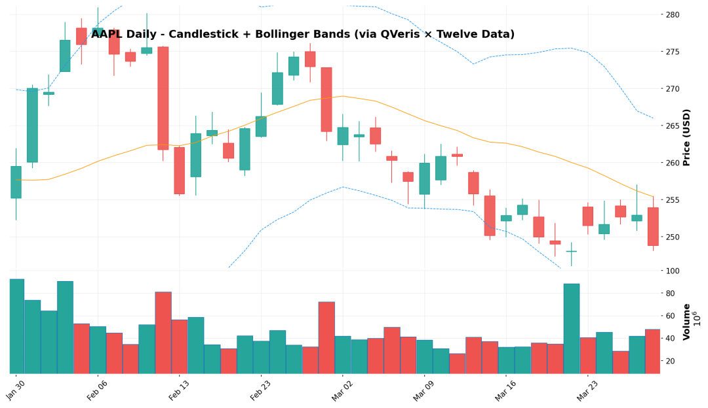
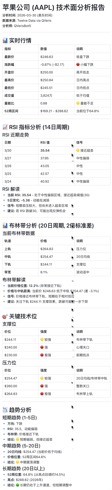

> QVeris「新供应商速递」—— 每期介绍一家新接入的全球数据供应商，实测数据说话

上周有个做量化的朋友在群里问："有没有一个 API，能同时拉美股 K 线和技术指标？最好还能顺便看看外汇和黄金。我现在同时维护三家数据源，快疯了。"

说实话，这个需求在我们接入 Twelve Data 之前还真不太好回答。行情一家、指标一家、外汇又一家，每家的字段格式还不一样。

但现在可以了。我花了一个下午把 Twelve Data 的接口从头到尾跑了一遍，**183 个 API，覆盖美股、外汇、加密货币、大宗商品。**这篇文章记录一下我的测试过程和真实发现。

---

## 先拿苹果做个完整的技术分析

不罗列 API 清单了，直接上手。假设你现在想判断 AAPL 短期走势，需要三样东西：最近的 K 线、RSI 指标、布林带。我来实际走一遍。

### 第一步：拉日线 K 线

返回的数据是标准的 OHLCV 格式，最新一根：开盘 253.90、最高 255.49、最低 248.07、收盘 248.80，成交量 4784 万。**382 毫秒**拿到最近 60 个交易日的完整数据。

几个细节值得说：

一是粒度从 1 分钟到月线共 **12 种**可选，做日内回测和长周期分析都够用；

二是支持盘前盘后数据，美股 4:00am-8:00pm 全覆盖，这个不是每家 API 都有的。

### 第二步：看 RSI

大多数人做技术分析的流程是：拉 K 线 → 本地装 TA-Lib → 自己算指标。Twelve Data 的做法不一样——RSI 直接由服务端算好返回。

AAPL 14 日 RSI 当前值：**37.95**。接近 30 的超卖线，但还没到。

看下面这张 RSI 走势图，1 月底一度跌到 17.9（深度超卖区），随后反弹到 2 月初的 69（接近超买），近期持续回落到 38 附近。这种趋势变化在图上一目了然。

**363 毫秒**返回，不需要在本地维护任何技术分析库。类似的指标 Twelve Data 提供 **90 多种**——MACD、VWAP、Ichimoku、Supertrend、Stochastic——全是服务端直接返回计算结果。对于轻量级策略开发，或者跑在 AI Agent 里做实时分析，省掉本地计算这一步差别很大。

### 第三步：叠加布林带确认

上轨 265.99，中轨 255.38，下轨 244.76。当前价 248.80，在中轨和下轨之间，偏下轨运行。

把 K 线、布林带和成交量画在一起看：

图里可以清楚地看到：2 月初 AAPL 从 260 拉升到 280 附近触及布林带上轨后回落，整个 3 月份一直在中轨下方震荡，最近几天加速下探到接近下轨的位置。成交量在关键转折点明显放大（2/2、2/12、3/20）。

结合 RSI 37.95 看：**短期偏弱，但还没到极端超卖**。如果你是做短线的，这个位置值得关注但还不是无脑抄底的信号。

**三步下来，总共花了不到 1.2 秒的 API 调用时间。**不需要安装任何依赖，不需要本地计算，不需要拼接多家数据源。拿到的数据可以直接画出专业级的技术分析图表。

---

## 意外发现：不只是美股

本来我只是想测测股票接口，结果发现 Twelve Data 的覆盖远超预期。

**外汇**——直接查 EUR/USD 实时汇率，1.14927，345 毫秒。还能做币种换算：输入 1000 欧元，返回 1149.27 美元。支持 100+ 货币对。

**加密货币**——BTC/USD 日线，\$67,423，数据源是 Coinbase Pro，352 毫秒。这意味着你做数字资产和传统资产的跨市场分析，不需要切换数据源。

**黄金**——XAU/USD 现货 \$4,533/盎司，340 毫秒。

**大宗商品**——这是让我最意外的。一个接口返回了 **60 个品种**的完整目录：

<sheet token="SNnose2I1he1zAt3XDqcqpQ8nyd_GNjecl"/>

也就是说，**一个供应商，股票 + 外汇 + 加密 + 大宗商品 + ETF，全部统一格式返回**。同一个参数传 `AAPL` 是美股，传 `EUR/USD` 是外汇，传 `BTC/USD` 是比特币，传 `XAU/USD` 是黄金。接口设计高度一致，切换资产类别几乎零学习成本。

---

## 基本面数据也没落下

除了行情和技术指标，Twelve Data 的基本面数据覆盖也比我预期的全。拿苹果最近的数据举例：

**季度资产负债表**（2025Q4）：总资产 3,793 亿美元，现金 453 亿，长期债务 767 亿，股东权益 882 亿。一次返回最近 6 个季度的完整明细，372 毫秒。

**EPS 盈利追踪**：最近三个季度全部超预期——2026 年 1 月 EPS 实际 \$2.84 vs 预估 \$2.67（超 6.4%），2025 年 10 月 EPS 实际 \$1.85 vs 预估 \$1.77（超 4.5%）。348 毫秒。

**分红记录**：近一年四次分红，每次 \$0.26/股，很稳定。381 毫秒。

这三个接口组合起来，一个投研助手就能在对话中回答"苹果最近的财务状况怎么样"——不是给你一个链接让你自己看报表，而是直接给出结论和数据支撑。

---

## 也不是完美的

说两个实际遇到的问题，供参考。

大宗商品目录接口偏慢，跑了 **7.2 秒**才返回。其他接口基本都在 300-400 毫秒，这个慢了一个数量级。日常使用问题不大（目录不需要频繁调用），但如果你期望所有接口都在秒内响应，这里会有落差。

另外，部分技术指标的历史成功率不是 100%。RSI 的平台统计成功率是 76%，布林带是 100%，MACD Slope 是 83%。大多数失败是参数组合问题（比如没传必需的 symbol），不是接口本身不稳定，但这意味着你在做自动化调用时需要做好错误处理。

还有，Twelve Data 的强项是行情和技术指标，基本面数据虽然有，但深度不如专门做基本面的供应商（比如缺少分部报告、ESG 评分覆盖率不高）。如果你的主要需求是深度投研，可能还需要搭配其他数据源。

---

## 在 QVeris 上怎么体验

如果你已经在用 QVeris 的 AI 助手，直接在对话里说就行：

> 💬 **你**：帮我分析一下苹果公司最近的技术面，看看 RSI 和布林带
> 🤖 **AI**：AAPL 当前 14 日 RSI 为 37.95，接近超卖区间。布林带显示股价 248.80 在中轨（255.38）和下轨（244.76）之间运行，短期偏弱。不过最近一次财报 EPS \$2.84 超预期 6.4%，基本面没有恶化迹象。
>

>
> 💬 **你**：黄金和比特币现在什么价？
> 🤖 **AI**：黄金现货 \$4,533/盎司，BTC \$67,423。
> 💬 **你**：帮我查一下苹果最近几个季度的财报表现
> 🤖 **AI**：最近三个季度 EPS 全部超预期：Q1 超 6.4%，Q4 超 5.4%，Q3 超 4.5%。总资产 3,793 亿，现金储备 453 亿，财务健康。近一年分红 4 次，每次 \$0.26/股。

不用记接口名，不用管参数格式，说人话就行。后台的数据获取、接口选择、格式处理，QVeris 帮你搞定。

---

这是 QVeris「新供应商速递」系列。我们持续接入全球数据供应商，每一家都经过实际调用验证。关注 QVeris，第一时间了解新的数据能力上线。

