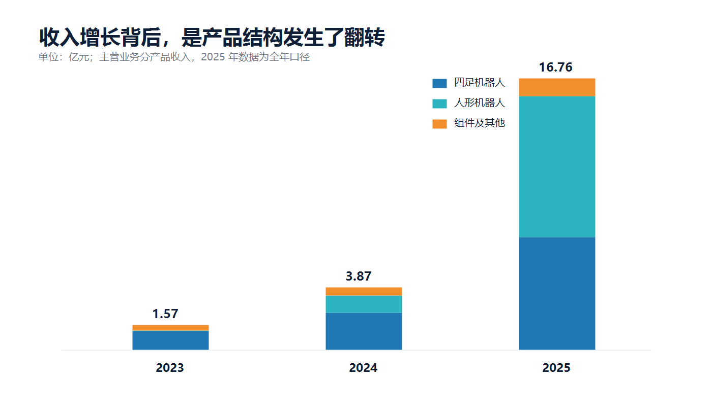
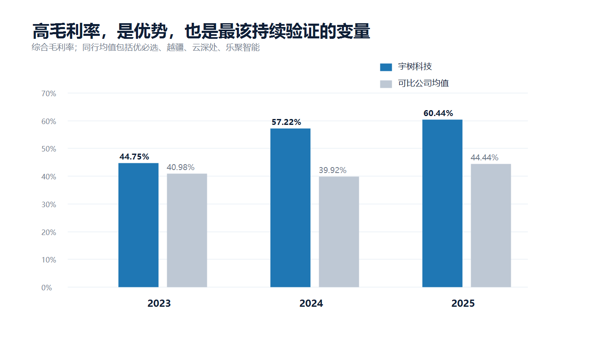
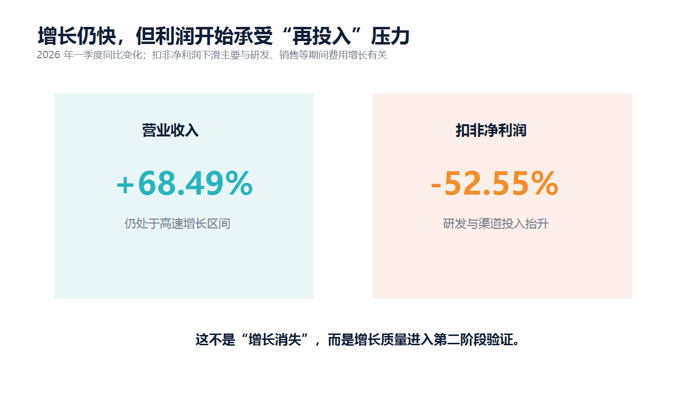

# 拆解宇树IPO：QVeris发现了什么？

150.80 元发行价、219.23 倍市盈率背后，宇树究竟值在哪里？｜更新至 2026 年 8 月 8 日

> 发行价 150.80 元，中一签要缴 7.54 万元，发行市盈率 219.23 倍——宇树 IPO 最值得看的，不是机器人会不会翻跟头，而是它未来要赚多少钱，才能撑起约 610 亿元估值。

宇树是一家自带热搜体质的公司：创始人有话题、机器人会跳舞、视频很容易出圈。但 IPO 不为掌声定价。热度退去后，收入能不能继续涨、60% 的毛利率能不能守住、昂贵的模型投入能不能换来真正会工作的机器人，才决定这家公司究竟值多少钱。

这次我们没有让 AI 凭印象评价宇树，而是用 QVeris 带它去找原始资料：从上交所公告中确认发行价和申购安排，从招股书表格里提取营收、利润和订单，再把不同日期、不同版本的文件放在一起核对。

这一步很重要。普通搜索能告诉你“宇树增长很快”，QVeris 要回答的却是更具体的问题：增长来自哪类机器人？净利润为什么低于扣非利润？60% 的毛利率靠什么支撑？150.80 元的发行价，又把多少未来增长提前算进去了？后文每个判断，都能沿着这条线回到公开资料。

**先交代进度：**宇树科技科创板 IPO 已进入申购倒计时。股票代码 688836，网上申购代码 787836，发行价 150.80 元/股；网上、网下申购日均为 2026 年 8 月 10 日，缴款日为 8 月 12 日。[查看上交所新股发行信息](https://www.sse.com.cn/ipo/home/index.shtml)

<callout emoji="🔎">
**QVeris 的核心发现：**宇树的增长是真的，高估值也是真的。人形机器人已经成为第一大产品线，但 2026 年上半年预计收入继续增长时，扣非利润仍可能下降。219.23 倍发行市盈率买的不是今天的利润，而是未来数年的兑现能力。
</callout>

## 申购前必看：一签 7.54 万元，市场在买什么？

此前分析宇树，重点是判断增长的质量；现在发行价已经落地，研究必须多回答一个问题：市场为这份增长付了多少钱。

| 发行参数 | 最新数据 | QVeris 解读 |
|-|-|-|
| 发行价 | 150.80 元/股 | 定价已经脱离“募资倒推”，进入稀缺资产定价 |
| 发行数量 | 4044.6434 万股 | 占发行后总股本 10% |
| 申购安排 | 8 月 10 日申购；代码 787836 | 网上申购上限 6000 股；中一签为 500 股，对应缴款 7.54 万元 |
| 发行市盈率 | 219.23 倍 | 上交所披露口径，反映的是极高的成长预期 |
| 预计募资总额 | 约 60.99 亿元 | 较 42.02 亿元募投计划高约 18.97 亿元 |
| 发行后市值 | 约 609.93 亿元 | 相当于 2025 年营收的约 35.9 倍 |

约 610 亿元是什么概念？它相当于宇树 2025 年营收的约 35.9 倍。按 2.78 亿元归母净利润计算，市盈率约 219 倍；即使采用剔除股份支付影响后的 5.91 亿元扣非利润，倍数仍超过 100。简单说，投资者付钱买的不是宇树今天赚了多少，而是它未来能否从机器人制造商长成具身智能平台。

**把高估值换成一张“未来考卷”：**如果未来市场给宇树 50 倍市盈率，公司需要做到约 12.2 亿元净利润；如果估值回到 30 倍，净利润要达到约 20.3 亿元。相比 2025 年的 2.78 亿元，分别要增长到约 4.4 倍和 7.3 倍。这不是股价预测，而是告诉读者：当前定价已经把一大段未来写进去了。

## 一、两年营收翻十倍，真正的主角换了

如果只看营收曲线，宇树的速度足以令人侧目。按照更新后的上会稿口径，公司营业收入从 2023 年的 1.59 亿元增至 2024 年的 3.93 亿元，2025 年进一步达到 16.99 亿元；两年时间，收入规模扩大了十倍以上。

但真正改变公司叙事的并非总量，而是产品结构。财务附注显示，2025 年四足机器人收入约 6.98 亿元，人形机器人收入约 8.68 亿元。2023 年，人形机器人收入还只有约 297 万元；到 2025 年，它已经超过四足机器人，成为第一大产品线。

换句话说，宇树已经不只是一家“机器狗公司”。四足机器人帮它跑通了量产和供应链，人形机器人则接过了增长接力棒。两类产品共用不少核心技术和零部件，因此宇树不必从零开始，就能把过去的制造经验迁移到人形机器人。

## 二、净利润 2.78 亿，为什么扣非后反而是 5.91 亿？

这里有一个很反常的数字：2025 年归母净利润约 2.78 亿元，扣非净利润却达到约 5.91 亿元。通常扣掉非经常性损益后，利润应该更少，宇树为什么反而更多？关键在一笔约 3.49 亿元的股份支付费用——它拉低了账面利润，却不是当期真金白银流出去的现金。

因此，2.78 亿元和 5.91 亿元都不能单独代表全部真相。前者受股权激励的会计处理影响，后者又把这部分影响剔除了。更靠谱的办法，是再看现金流：2025 年经营现金流净额约 6.72 亿元，与扣非利润大体接近，说明增长不只是账面上的漂亮数字。

2025 年公司经营活动产生的现金流量净额约 6.72 亿元，同比增长约 249%。现金流与扣非利润大体匹配，说明这一轮增长并不只是应收账款堆出来的账面繁荣。对仍处于商业化早期的机器人公司而言，这比单看净利润增速更有说服力。

| 指标 | 2023 年 | 2024 年 | 2025 年 | 怎么看 |
|-|-|-|-|-|
| 营业收入 | 1.59 亿元 | 3.93 亿元 | 16.99 亿元 | 规模跃迁已经发生 |
| 归母净利润 | -0.11 亿元 | 0.95 亿元 | 2.78 亿元 | 受股份支付影响较大 |
| 扣非净利润 | -0.18 亿元 | 0.78 亿元 | 5.91 亿元 | 更接近主营业务表现 |
| 经营现金流净额 | — | 约 1.92 亿元 | 约 6.72 亿元 | 增长具有现金支撑 |

## 三、60% 毛利率，是护城河还是高点？

比收入增速更值得追问的，是毛利率。2025 年宇树综合毛利率约 60.44%，而优必选、越疆、云深处、乐聚智能四家可比公司的平均值约为 44.44%，差距接近 16 个百分点。2024 年，这一差距约为 17 个百分点。

高毛利率首先来自工程与供应链能力。宇树长期强调核心部组件自研自产，在销量快速放大后，采购、制造和产品迭代形成规模效应；与此同时，人形机器人收入占比提升，也抬高了整体毛利率。问询回复显示，2025 年第三季度人形机器人毛利率约 63.91%，高于同期四足机器人的 53.39%。

但资本市场不会只奖励一个高数字，它会追问这个数字能维持多久。机器人行业仍在快速降价，公司的机器人平均单价从 2022 年约 3.86 万元下降到 2025 年前三季度约 2.72 万元。过去，销量和成本下降跑赢了价格下降；未来如果同行扩产、产品向大众市场下沉，60% 左右的毛利率很可能成为竞争最先触碰的地方。

**60% 毛利率不是可以永久写进估值模型的常数。**上市后更值得盯的是三个变化：机器人售价降了多少、核心零部件成本降得够不够快，以及高毛利的人形机器人还能占多少收入。

## 四、春晚之后：收入还在涨，利润却在掉

监管问询没有回避“流量是否透支需求”。宇树人形机器人 H1 亮相 2025 年春晚，加上“杭州六小龙”等话题发酵，公司在第二季度获得了非常集中的曝光和订单。随后，2025 年第三季度收入环比下降 26.01%。

单季回落不能直接等同于需求反转。公司披露的在手订单从 2024 年末的 1.46 亿元增至 2025 年 9 月末的 2.29 亿元，并在 2025 年末继续增至 2.82 亿元。问题在于，2025 年第二季度形成的流量高峰抬高了比较基数，后续增速自然会回到更正常的区间。

最新数据给这轮高增长踩了一脚刹车。公司预计 2026 年上半年收入为 10.52 亿—11.28 亿元，同比增长 35.62%—45.41%；扣非净利润却预计下降 6.43%—21.97%。收入还在快速增长，但为了研发模型、拓展销售和寻找应用场景，公司花钱的速度更快了。

这说明 2025 年的爆发不能机械外推。研发、销售与场景开发费用正在前置，而新投入何时转化为复购订单和可规模化应用，仍需要后续季度验证。对 219.23 倍发行市盈率而言，35%—45% 的收入增长只是起点，利润恢复速度才是更敏感的变量。

## 五、约 61 亿募资，近一半押在机器人的“大脑”

宇树本次 IPO 原计划募集约 42.02 亿元；按 150.80 元/股和 4044.6434 万股发行数量计算，预计募资总额约 60.99 亿元，比募投项目所需金额高约 18.97 亿元，尚未扣除发行费用。资金变得更充裕，但资本市场也会更严格地追问：多出来的钱如何配置、何时形成回报，是否会因为现金充足而降低投入纪律。

| 募投项目 | 拟投入金额 | 占比 | 隐含判断 |
|-|-|-|-|
| 智能机器人模型研发 | 20.22 亿元 | 48.13% | “大脑”是下一阶段最大短板 |
| 机器人本体研发 | 11.10 亿元 | 26.41% | 继续强化电机、传动、热控等底层能力 |
| 新型机器人产品开发 | 4.45 亿元 | 10.60% | 扩大产品与场景覆盖 |
| 智能制造基地 | 6.24 亿元 | 14.86% | 为更大规模交付准备产能 |

这张资金分配表透露了一个关键信号：宇树最想补的，不是机器人的“身体”，而是“大脑”。会走、会跳、会翻跟头，证明的是硬件和运动控制能力；能听懂指令、看懂环境、自己完成任务，才决定机器人能否真正进入工厂和服务场景。

因此，上市后的宇树不能只靠“多卖机器人”证明自己。20.22 亿元投向模型研发，意味着公司正在押注从硬件供应商变成软硬一体的平台。这条路的想象空间更大，代价也很直接：短期利润会被研发投入压住，市场则会不断追问这些钱何时变成产品和订单。

## 六、QVeris 如何从几百页材料里抓出四个关键问题？

如果把大模型比作一个会思考、会写作的大脑，QVeris 做的事情，就是给这个大脑配上研究工具。它不直接替投资者下结论，而是先找到原始文件、读懂其中的表格、比较前后版本，再把计算过程和出处一起交出来。

在这篇文章里，QVeris 主要完成了四次关键核对：

| 我们想知道什么 | QVeris 怎么查 | 最后发现了什么 |
|-|-|-|
| 宇树到底增长多快？ | 读取招股书和财务附注，拆分不同产品收入 | 2025 年营收约 16.99 亿元；人形机器人收入约 8.68 亿元，已经超过四足机器人 |
| 为什么扣非利润反而更高？ | 从利润表追到股份支付附注 | 约 3.49 亿元股份支付费用压低了账面利润，不能只看一个净利润数字 |
| 2025 年的爆发还能延续吗？ | 把在手订单、一季度数据和上半年预测放在一起看 | 2026 年上半年收入仍预计增长 35.62%—45.41%，但扣非利润仍可能下降 |
| 150.80 元发行价意味着什么？ | 调用上交所最新发行数据，并结合总股本重新计算 | 发行后市值约 610 亿元，发行市盈率 219.23 倍，市场已经提前支付了很高的成长溢价 |

这些信息单独搜索，大多都能找到。真正费时间的是确认哪一份文件最新、数字口径是否一致，以及一个数字会怎样改变另一个结论。比如，看到“2025 年净利润 2.78 亿元”并不难；难的是继续追到股份支付附注，解释为什么扣非利润会达到 5.91 亿元。

QVeris 的价值就在这里：它把原本需要反复下载 PDF、复制表格、比对版本的工作，变成 AI Agent 可以连续完成的研究过程。读者看到的不只是一个答案，还能看到答案来自哪份材料、经过了什么计算。[了解 QVeris for Agents](https://qveris.ai/for-agents)

> **一句话理解：**普通 AI 擅长把话说清楚；QVeris 帮它先把事实查清楚。

## 结语：610 亿元之后，宇树还要证明什么？

宇树已经完成了最难的第一步：把机器人从实验室带到批量销售，并且做出了正向现金流。但 150.80 元的发行价把下一张考卷提前摆在桌面上——守住毛利、获得复购、让模型能力真正落地，缺一项都很难消化约 610 亿元估值。

所以，宇树 IPO 的悬念不是“机器人还能不能火”，而是热度能否变成稳定收入，研发能否变成客户愿意持续付费的能力。2025 年证明了宇树能卖出去；上市以后，它要证明的是自己能长期赚下去。

> 研究宇树 IPO，真正耗时的不是写出结论，而是找到最新公告、读出表格里的数字、解释前后口径，再把计算过程留给读者复查。这正是 QVeris 在这篇文章里完成的工作。

**上市后值得持续跟踪的五个数字：**人形机器人收入占比、综合毛利率、扣非利润增速、经营现金流与利润的匹配度，以及研发费用转化为模型能力和复购订单的速度。

## 资料来源与口径说明

本文优先采用宇树科技更新后的上会稿、审核问询回复、财务报表附注及上交所最新发行数据。发行参数更新至 2026 年 8 月 8 日；预计募资总额、市值和估值倍数为基于公开数据的测算，可能因发行费用、超额配售及会计口径而变化。本文仅作公开资料研究与产品工作流展示，不构成投资建议。

- [宇树科技招股说明书（上会稿）](https://static.sse.com.cn/stock/disclosure/announcement/c/202605/002178_20260525_V4H0.pdf)
- [审核问询回复](https://static.sse.com.cn/stock/disclosure/announcement/c/202603/002178_20260320_BLK4.pdf)
- [宇树科技财务报表附注](https://static.sse.com.cn/stock/disclosure/announcement/c/202606/002178_20260602_EDZD.pdf)
- [宇树科技 IPO 进程](https://www.stcn.com/ipo/detail/3631.html)
- [上海证券交易所新股发行信息（发行价、发行市盈率与申购安排）](https://www.sse.com.cn/ipo/home/index.shtml)
- [QVeris for Agents](https://qveris.ai/for-agents)
