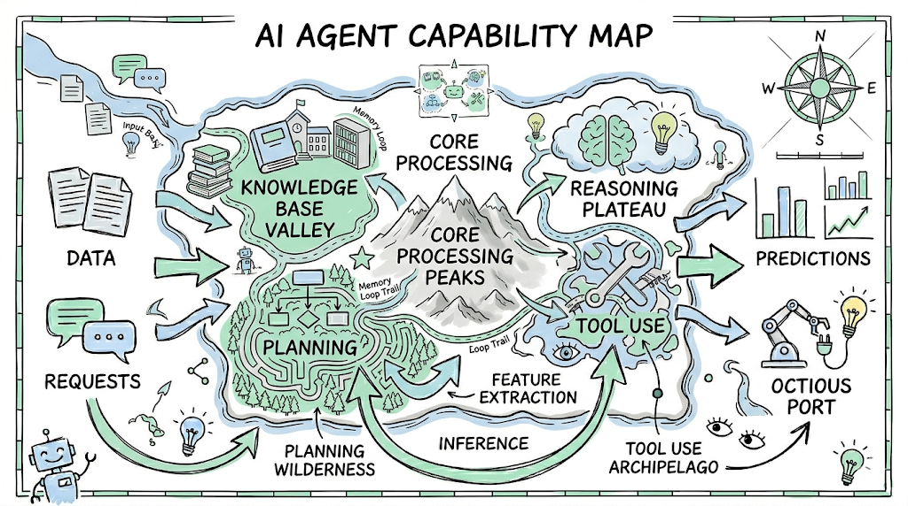
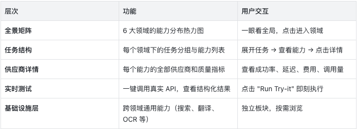
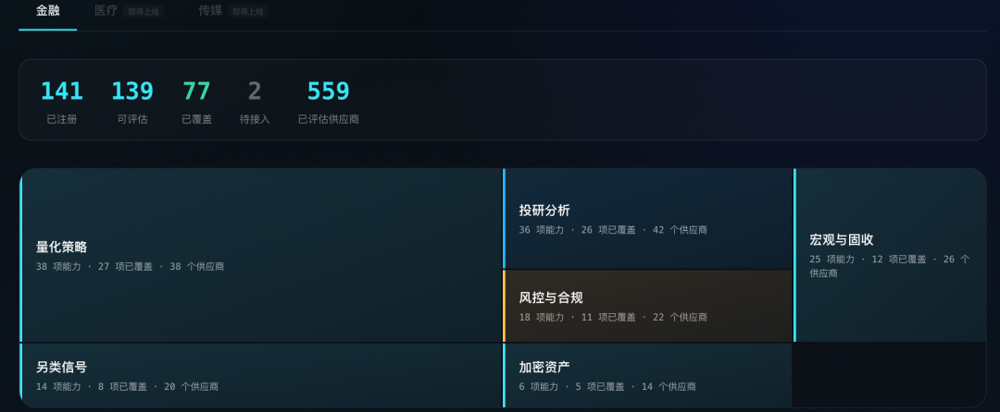
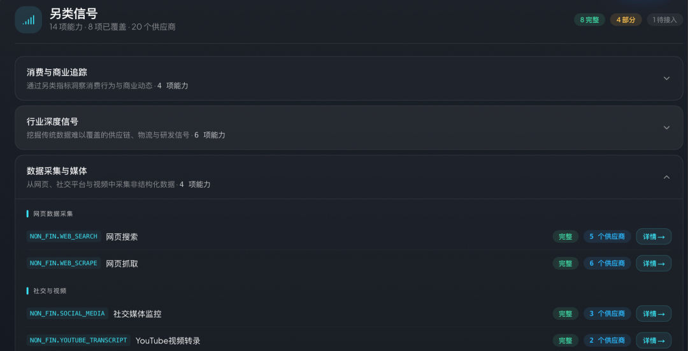
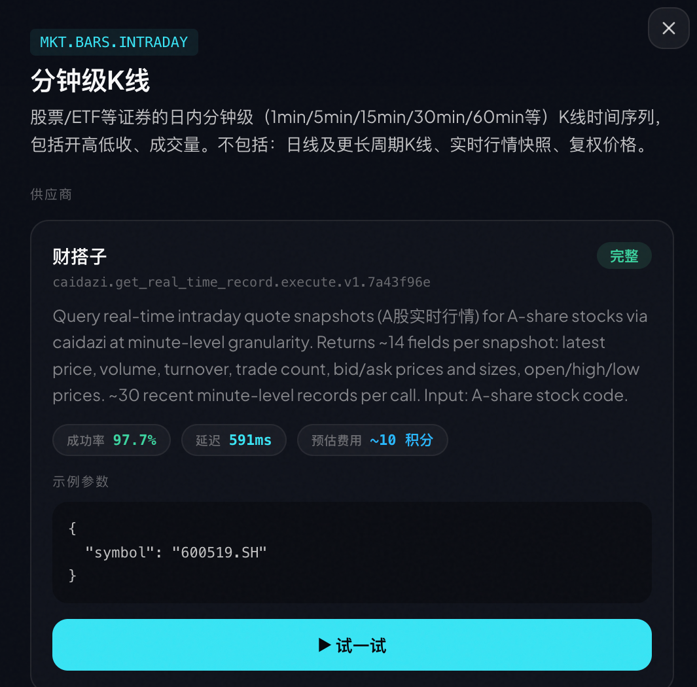

智能体（Agent）正在从"对话工具"变成"行动引擎"。但一个关键问题始终没有好的解决方案：**智能体怎么知道自己能做什么？**

今天，我们推出 **Capability Explorer** — 一个交互式的能力全景地图，让开发者和智能体可以浏览、检视、对比，并实时测试 QVeris 网络中的每一个真实且已验证的能力。

👉 立即体验：qveris.ai/capabilities/explore

#  

# 01.为什么需要 Capability Explorer

#  

传统的 API 目录是一张列表。你搜索一个关键词，得到一串 endpoint，然后花几个小时读文档、调试参数、对比供应商。

对于 AI 智能体来说，这个过程更加痛苦 — 它们无法"浏览文档"，只能依赖开发者预先硬编码的 API 列表。结果就是：

- 🔒 **能力被锁死在配置文件里** — 智能体只能调用开发者提前写好的几个 API

- 🤷 **无法感知新能力** — 即使 QVeris 网络新增了 50 个数据源，智能体不知道

- 💸 **无法做质量和成本决策** — 同一个能力有 3 个供应商，该选哪个？成功率多少？延迟多少？多少钱？

**Capability Explorer 解决了这些问题。** 它把 QVeris 的整个能力网络变成了一个可浏览、可检索、可测试的交互式地图。

#  

# 02.功能全景

#  

Capability Explorer 由五个层次组成，对应智能体发现和使用能力的完整旅程：





#  

# 03.金融领域能力地图

#  

# 金融领域：6 大领域，138 项能力，完整覆盖

首批发布的 Capability Explorer 聚焦**金融领域**，这也是 QVeris 能力网络最成熟的垂直行业。

📊 **金融能力一览**

- 141 项注册能力

- 80+ 项已覆盖（有活跃供应商）

- 6 大领域全面覆盖

- 每个能力附带成功率、延迟、预估费用等质量信号

    
  

**六大领域：**

**🔷 量化交易 (Systematic Trading)**  

回测引擎、订单管理、执行算法、策略模拟。为量化团队构建自动化交易流水线提供基础能力。

**🔵 市场数据 (Market Data)**  

实时行情、历史 K 线、企业行动、指数成分。覆盖美股、港股、A 股多市场数据源。

**🟡 风控合规 (Risk & Compliance)**  

VaR 计算、压力测试、监管检查、反洗钱筛查。满足金融机构的合规需求。

**🔷 投资研究 (Investment Research)**  

基本面分析、财报数据、分析师评级、盈利预测。让智能体具备专业投研能力。

**🟢 另类信号 (Alternative Signals)**  

舆情分析、卫星数据、网页爬取、社交媒体情绪。提供超越传统数据的 Alpha 信号。

**🟣 加密资产 (Crypto & Digital Assets)**  

现货/衍生品数据、链上分析、DeFi TVL、代币指标。覆盖 Web3 数据需求。



#  

# 04.质量信号

#  

# 质量信号：让智能体做出明智选择

每个供应商不只是一个 Tool ID — Capability Explorer 展示了完整的质量画像：

****✅ 成功率**— 历史调用的成功百分比，颜色编码**：

- 🟢 ≥ 95% — 可靠

- 🟡 80-95% — 可用

- 🔴 \< 80% — 需注意

**⚡ 平均延迟** — 典型执行时间（毫秒级精度）

**💰 预估费用** — 每次调用消耗的 credits（1-100 credits，按数据价值定价）

**📈 调用量** — 历史总调用次数，是"经过验证"最直接的证据

**🏆 供应商等级** — FULL / GOOD / PARTIAL，反映实现完整度

💡 **为什么这很重要？**  

当同一个能力有 3 个供应商时，你的智能体可以基于质量信号自动选择：优先选成功率最高的，或者延迟最低的，或者最便宜的。这不是 API 目录，这是**能力路由的决策仪表盘**。



#  

# 05.一键测试

#  

# Try-it：一键测试，眼见为实

浏览能力、对比供应商之后，你可以直接在 Capability Explorer 中**运行真实的 API 调用**。

**每个供应商卡片底部都有一个**"▶ Run Try-it"**按钮。点击后**：

1.  使用预填充的示例参数（或自定义修改）

2.  调用真实的供应商 API

3.  在沙箱环境中执行

4.  返回结构化的 JSON 结果

```
// 示例：调用实时股票行情 API{  "symbol": "AAPL",  "price": 192.53,  "change": 2.15,  "volume": 54382100,  "timestamp": "2026-04-10T15:30:00Z"}
```

  

这不是模拟数据 — 这是**真实的、已验证的**能力在实时运行。

#  

# 06.开发者使用方式

#  

# 开发者集成：从浏览到代码

在 Capability Explorer 中找到心仪的能力后，集成到你的智能体只需要一步。

**通过 QVeris CLI（推荐）：**

```
# 发现能力qveris discover "real-time stock price API" --json# 检查供应商详情qveris inspect 1 --json# 调用qveris call 1 --params '{"symbol":"AAPL"}' --json
```

  

**通过 MCP Server（IDE 集成）：**

```
npx @qverisai/mcp
```

  

**通过 Python SDK：**

```
from qveris import QVerisClientclient = QVerisClient(api_key="your-key")results = client.search("stock price API", limit=5)response = client.execute_tool(    tool_id="polygon.stocks.eod.v2",    parameters={"symbol": "AAPL"})
```

  

#  

# 07.RoadMap

#  

# 路线图：金融只是开始

Capability Explorer 当前已覆盖金融领域的 138 项能力。接下来，我们将扩展到：

- 🏥 **医疗健康** — 临床试验数据、药物信息、医学文献检索

- 🎬 **媒体内容** — 图像/视频生成、文本转语音、内容审核

这两个领域已在 Explorer 中以 "SOON" 标签预告。

#  

# 08.立即体验

#  

🚀 **立即打开 Capability Explorer**

- 🌐 全球：qveris.ai/capabilities/explore

- 🇨🇳 中国：qveris.cn/capabilities/explore

- 📖 文档：qveris.ai/docs

- 💻 GitHub：github.com/QVerisAI/QVerisAI

注册即送 1,000 积分。Discover 和 Inspect 永远免费。

#
