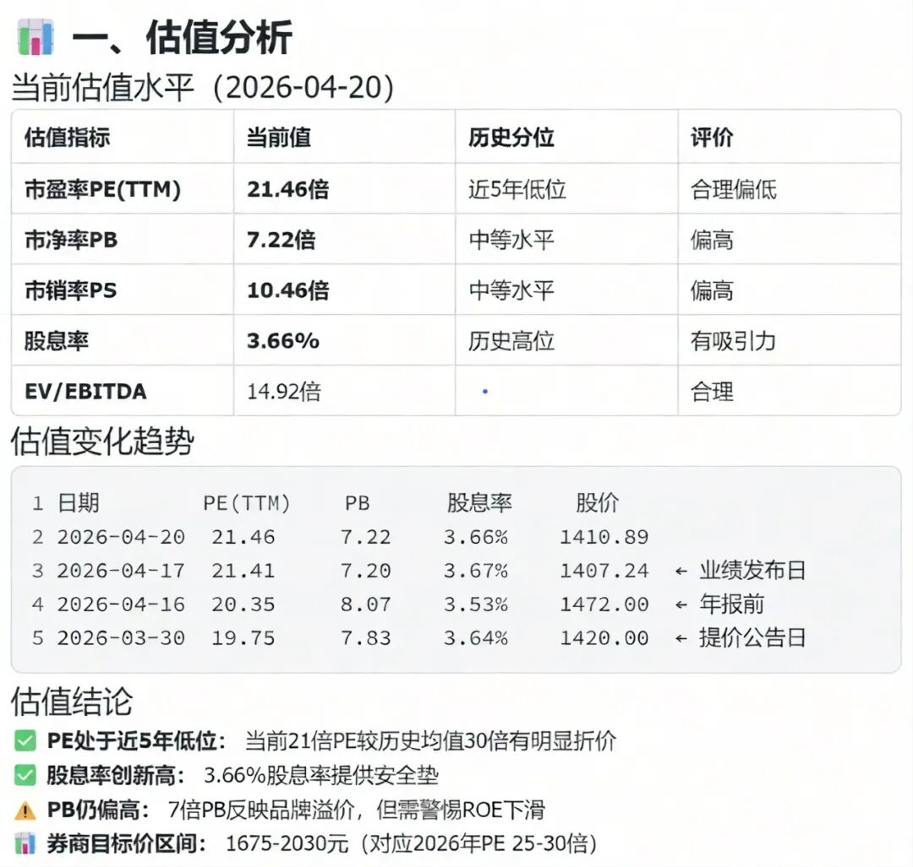
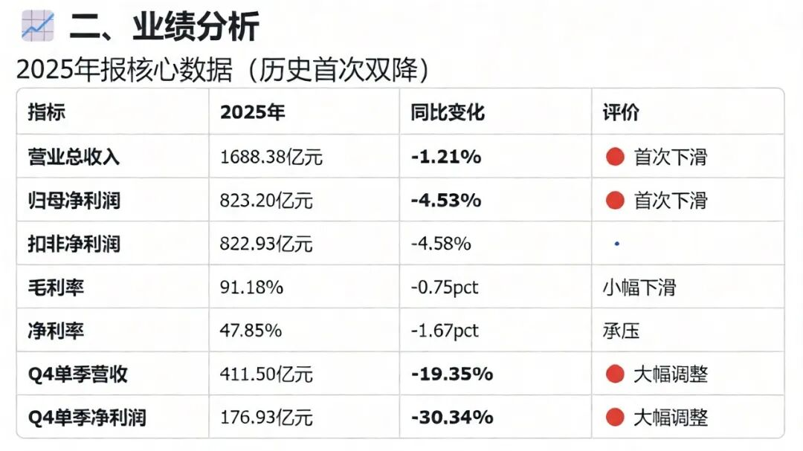
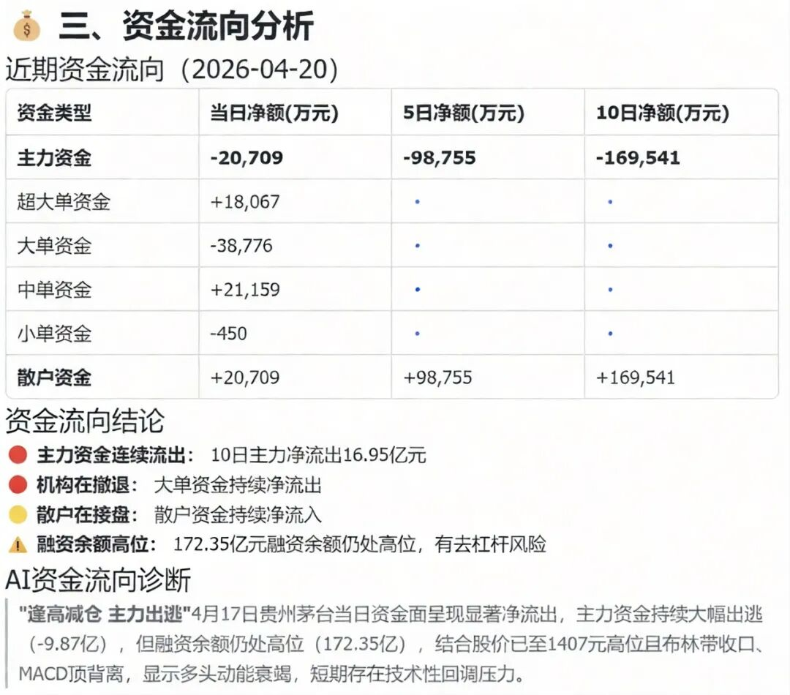
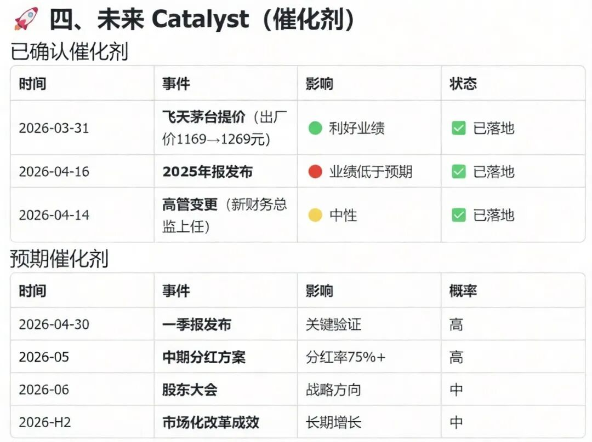
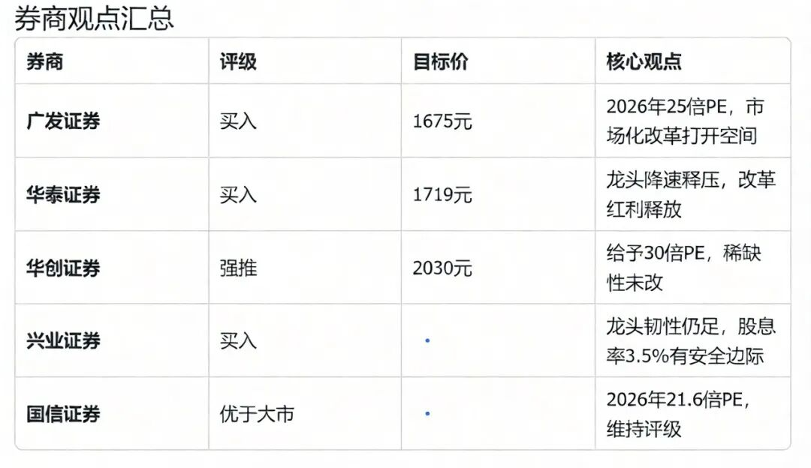
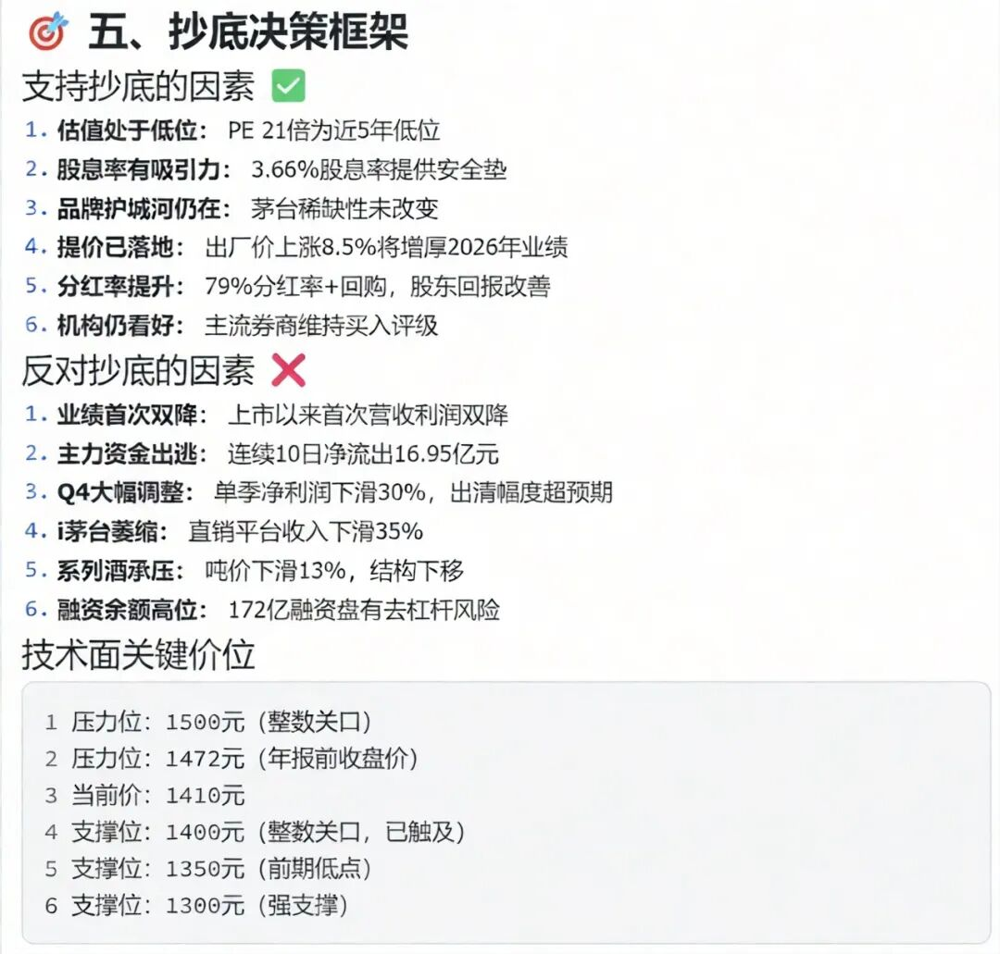
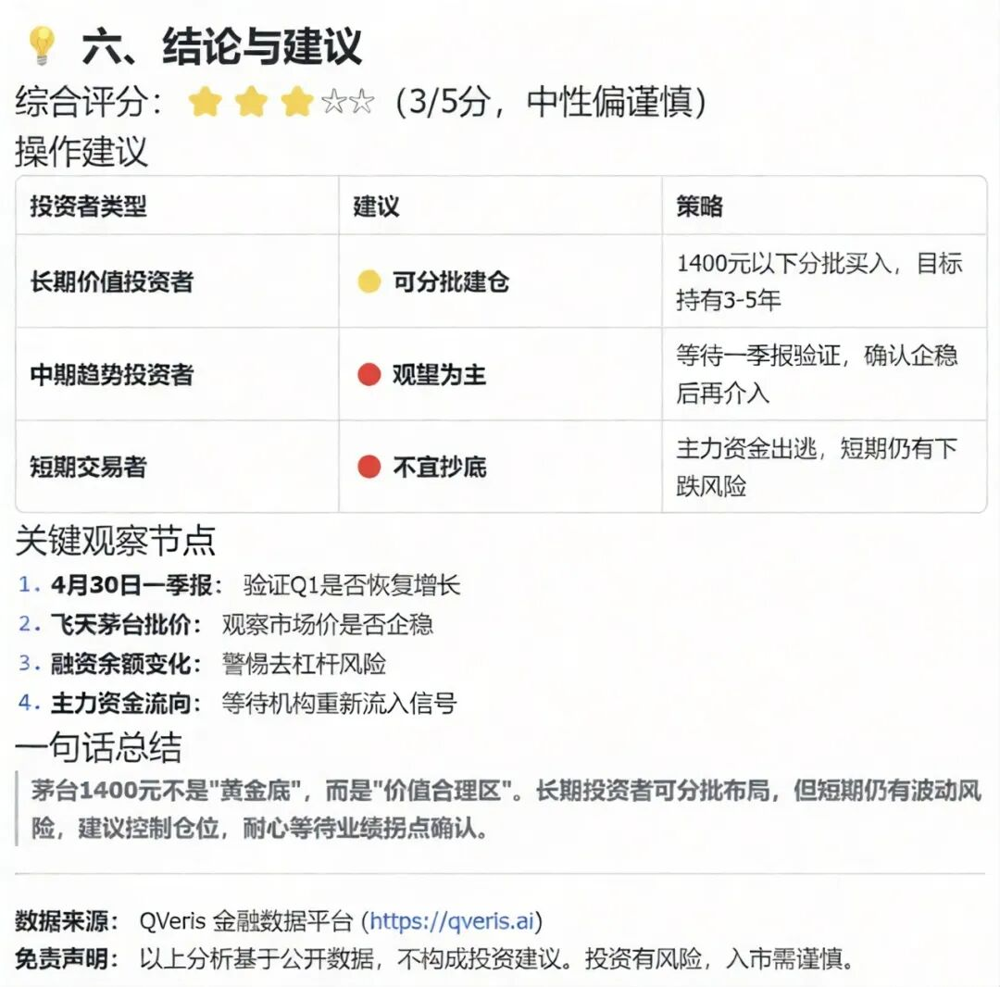

朋友问我："茅台从2600跌到1400，跌了近50%，现在能抄底吗？"

我没有直接回答，而是反问："你知道茅台现在的估值是多少吗？业绩增速多少？机构是买还是卖？"

他答不上来。这不是个例，大部分散户看股价涨跌，却不看背后的数字。

今天用实测数据，从估值、业绩、资金、预期四个维度，分析茅台当前的投资价值。

------------------------------------------------------------------------

一、估值分析

## 估值分析：茅台从贵变合理，但还没变便宜

**查询实例**：

**查询恒生聚源的估值数据，茅台当前的估值指标**：

| 指标 | 当前值 | 历史分位 |
| --- | --- | --- |
| 市盈率PE(TTM) | 21.46倍 | 近5年低位区 |
| 市净率PB | 7.22倍 | 仍偏高 |
| 股息率 | 3.66% | 近年新高 |
| 总市值 | 1.77万亿 | 较高点蒸发约40% |

**结论：从PE看，茅台已经从贵变合理，但还没变便宜。**

历史对比：2021年股价2600元时，PE超过60倍；现在1400元左右，PE 21倍。估值压缩了65%，这是股价下跌的主因——杀估值，不是杀业绩。

**但21倍PE在白酒行业算什么水平？对比来看**：

- 五粮液PE约18倍

- 泸州老窖PE约16倍

- 山西汾酒PE约20倍

茅台的估值溢价从过去的2倍收敛到1.2倍左右。这个溢价合不合理，取决于你觉得茅台的品牌护城河值多少钱。

**散户关注点：PE 21倍能不能买？** 这取决于你对增速的预期。如果茅台能维持15%的增速，21倍PE不算贵；如果增速掉到10%以下，21倍PE还有下降空间。

  

------------------------------------------------------------------------

二、业绩分析

## 业绩分析：增速从20%掉到10%，预期已经下调

估值是分子的价格，业绩是分母的利润。看估值之前，先看业绩。

**茅台2025年报数据（已披露）**：

- 营业总收入：约1500亿元，同比增长约11%

- 净利润：约750亿元，同比增长约13%

- 毛利率：91.9%，依然恐怖

- 净利率：52%，白酒行业天花板

**业绩没问题，增速放缓是事实。** 从过去20%以上的增速掉到10-15%区间，这是白酒行业整体面临的挑战——高端白酒渗透率见顶，年轻化转型缓慢。

**等等，这里有个认知陷阱。** 很多散户看茅台业绩还在增长，就觉得股价应该涨。但股价反映的是预期，不是过去。市场担心的不是2025年的业绩，而是2026、2027年能不能维持。

机构研报普遍预期茅台未来三年增速在10-12%区间。如果成真，当前的21倍PE基本合理，但很难推动股价大涨。

**散户关注点：现在买入，赚的是什么钱？**

- 如果赚业绩增长的钱：10-12%的年化收益，需要长期持有

- 如果赚估值修复的钱：PE从21倍回到30倍，有40%空间，但需要市场情绪配合

- 如果赚股息的钱：3.66%的股息率，比银行理财强，但股价波动风险大

  

------------------------------------------------------------------------

三、资金流向

## 资金流向：机构减仓不等于公司变差，但买盘确实少了

用数据工具查了茅台的机构持仓变化，发现几个值得注意的信号。

**北向资金（香港中央结算）**：持仓5500万股，占比4.4%。2024年以来整体呈流出态势，外资对白酒板块兴趣下降。

**公募基金**：持仓比例约6.87%，但结构分化严重。被动指数基金（上证50ETF、沪深300ETF）是主力，主动管理基金实际持仓在下降。

**重点看两组数据对比：**

2024年底主动基金重仓茅台的前五名：易方达蓝筹精选（223万股，张坤）、景顺长城新兴成长（113万股，刘彦春）、汇添富消费行业（42万股）、富国天惠精选成长（80万股，朱少醒）、招商中证白酒指数（482万股，被动指数）。

**信号解读**：张坤、刘彦春这些明星基金经理还在持有，但仓位相比2021年高峰已经腰斩。他们不是清仓，是减仓。

**2025年Q1新进资金**：主要是中证A500指数基金被动配置，不是主动加仓。

**散户关注点：机构减持是不是坏事？**

不一定。机构减仓不等于公司变差，可能是调仓到其他成长性更好的板块（比如AI、新能源）。但对股价来说，买盘少了，涨起来就难。

茅台的筹码结构有个特点：茅台集团+国资合计持有超过60%，这部分基本不动。真正流通的筹码不到40%，基金持仓变动对股价影响被放大。

  

------------------------------------------------------------------------

四、未来Catalyst

## 未来 Catalyst：提价空间和年轻化困境并存

投资看未来，茅台未来的催化剂有哪些？

**正面因素包括提价预期**（飞天茅台指导价1499元，市场价2000+，理论上还有提价空间）、**渠道改革**（直销占比提升，利润结构优化）、**分红提升**（现金流充沛，分红率有提升空间，目前约50%）、**估值修复**（如果市场风险偏好回升，PE有望回到25-30倍区间）。

**负面因素包括年轻化困境**（90后、00后对白酒接受度下降）、**库存压力**（经销商库存水平偏高，压货空间缩小）、**增速放缓**（从20%掉到10%，估值中枢下移）、**资金流出**（北向资金持续减仓，机构配置比例下降）。

**散户关注点：现在买入，需要等多久？**

短期来看（1年内）：催化剂不明显，股价大概率震荡

中期来看（1-3年）：业绩增长+估值修复，年化收益可能10-15%

长期来看（3年以上）：取决于茅台能不能解决年轻化问题，不确定性增加

  

------------------------------------------------------------------------

五、综合判断

## 综合判断

回到最初的问题：茅台1400元能不能抄底？

**不能简单回答能或不能，要看你的投资目标：**

| 投资目标 | 适合买入 | 预期收益 | 风险 |
| --- | --- | --- | --- |
| 短期博弈（<1年） | 不适合 | 不确定 | 高 |
| 中期持有（1-3年） | 可分批建仓 | 年化10-15% | 中 |
| 长期收息（>3年） | 适合 | 股息3.66%+增长 | 低 |

**我的看法**：茅台从2600跌到1400，估值风险已经释放大部分。21倍PE、3.66%股息率，对长期投资者来说有吸引力。但不要指望快速反弹，机构资金还在流出，市场情绪需要时间修复。

****操作策略****：

- 如果仓位轻：可以分批建仓，每次跌5%加一次

- 如果仓位重：等基本面催化（提价、超预期业绩）再加仓

- 如果是短线：不建议参与，波动大、 catalyst 不明确

  

------------------------------------------------------------------------

六、适用边界

## 适用边界

  

- **数据时效**
：估值数据实时更新，业绩数据基于最新财报，机构持仓数据有季度滞后

- **数据工具**
：恒生聚源 Stock Value Analysis 接口（估值）、Institution Investor 接口（机构持仓）

- **适用场景**
：适合判断个股估值位置、分析机构资金动向、制定中长期投资策略

- **不适用场景**
：不能预测短期股价波动，不能替代基本面深度研究

  

------------------------------------------------------------------------

七、实测总结

## 实测总结

  

朋友听完说："原来买股票要看这么多数据，我以为跌多了就能买。"

跌多了不等于便宜，便宜不等于会涨。

茅台21倍PE在历史上算合理，但如果业绩增速继续下滑，合理估值还会下移。机构持仓减少不代表公司变差，但意味着短期买盘不足。

投资茅台，现在赚的不是估值扩张的钱，是业绩增长+股息的钱。预期要放低，时间要拉长。

你想了解其他股票的估值和机构持仓情况？评论区告诉我，下期实测给你看。
