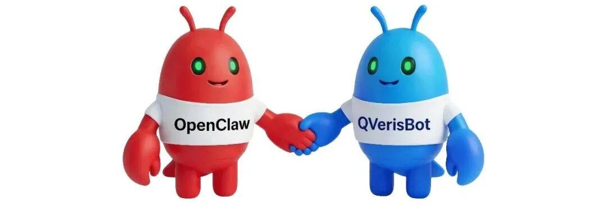
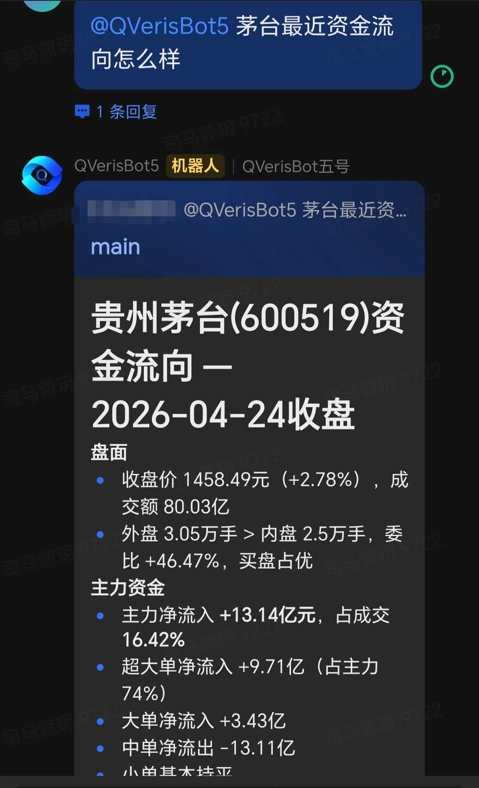
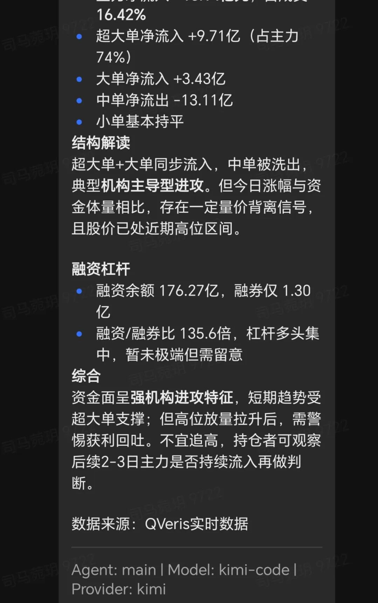
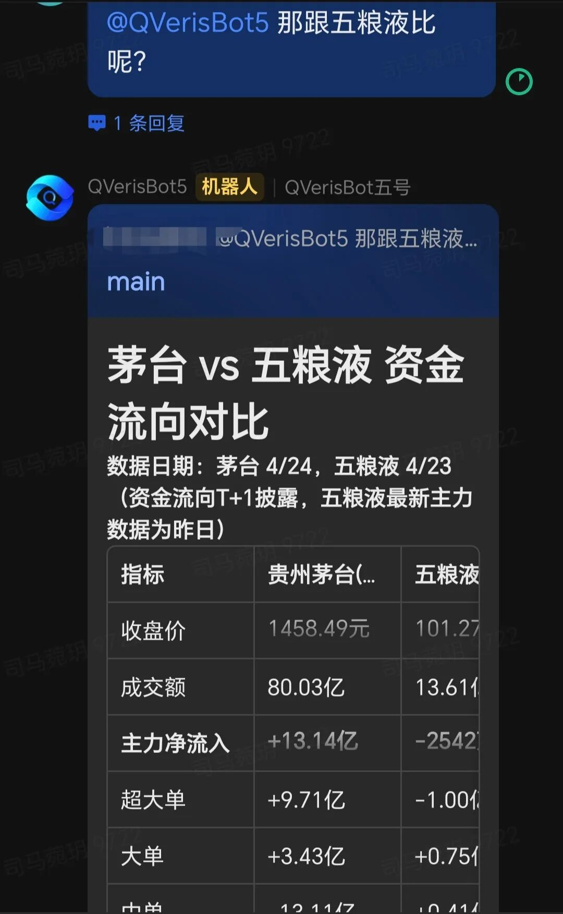
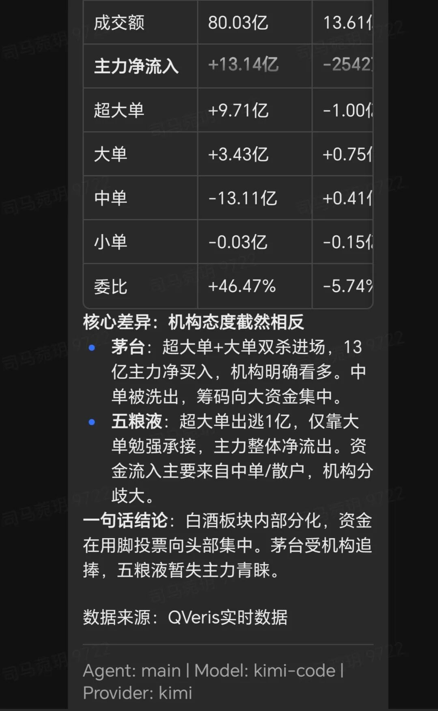
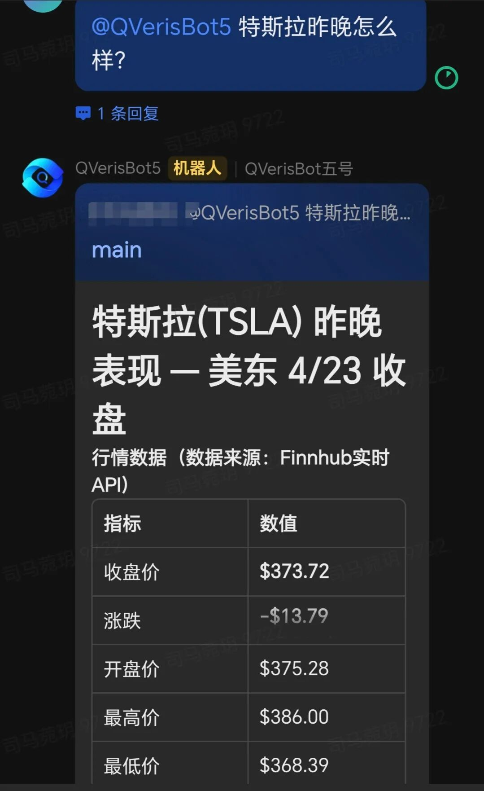
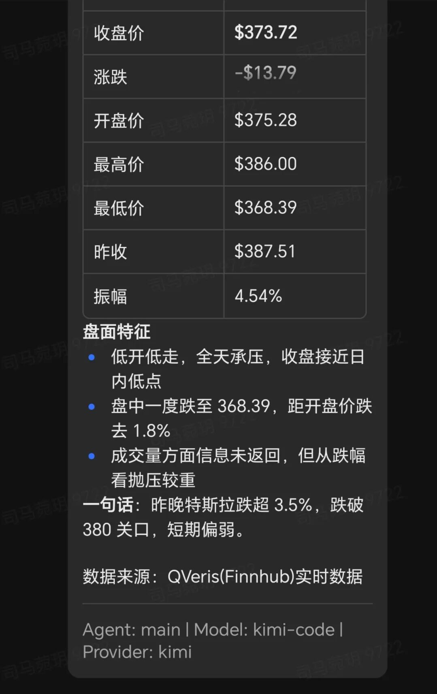
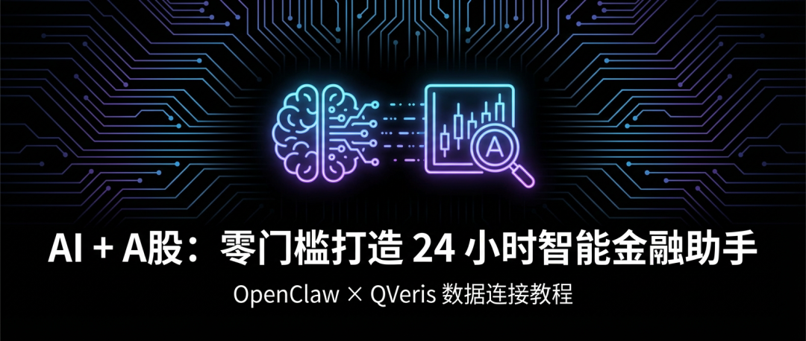
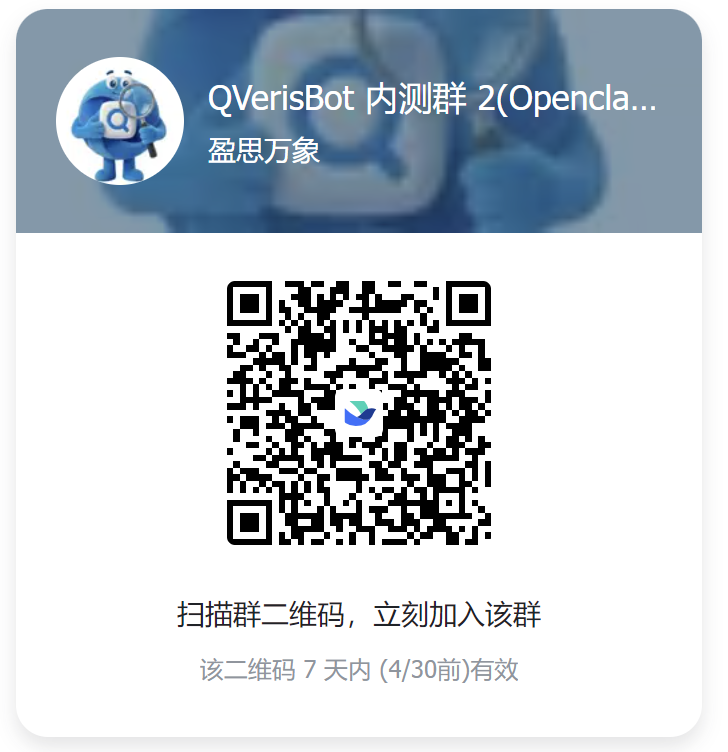

你有没有发现，金融市场上赚钱的人，往往不是最聪明的，而是信息最快的？

你查个数据，要开 5 个网站；想对比两只股票，要手动复制粘贴；看到一条消息，不知道真假。

问题出在哪里？

信息是武器，但你手里拿的是钝刀。

  

上周三，一个朋友在群里发了一张截图——某只票突然拉升 8%，他在问"能不能追"。

我打开行情软件看了眼 K 线，又打开另一个网站查资金流向，再打开第三个看龙虎榜。等我把这三个信息凑齐，已经过去了 3 分钟。票还在涨，但我已经不敢进了——因为我不知道这 8% 背后，是机构在进还是散户在冲。

**这 3 分钟，就是信息差的代价。**

很多平台会告诉你：我们有10万+数据指标。

他们没说的是——这10万个指标，分布在8个不同页面里。你得自己找、自己拼、自己判断。等你拼完，机会早没了。

我们不一样。

数据有几秒延迟，不是最快的，但对大多数交易者够用。界面不够花哨，但你要的指标，3秒就能找到。

我们不是Bloomberg，但想让每个散户都用得起专业数据。

怎么做到的？

恒生聚源的A股深度数据、EODHD的全球行情、Financial Modeling Prep的美股财务——这些原本要分别签约、分别对接的数据源，我们全部接进了同一个能力网络。

不再是你追着数据跑，而是你开口问，答案就来。

**你只需要发一句话**：

案例一

👤 **"茅台最近资金流向怎么样？"**

🤖 **"近 5 日主力净流入 12.3 亿，散户净流出 8.7 亿。筹码正在向机构集中。"**

案例二

👤 **"那跟五粮液比呢？"**

🤖 **"五粮液主力净流入 3.1 亿，散户流出 2.4 亿。茅台的机构介入更深。"**

案例三

👤 **"特斯拉昨晚怎么样？"**

🤖 **"TSLA 涨 2.3%，盘后有大宗交易，溢价 0.8%。"**

**三个市场，三种数据，一段对话搞定。**

你不用知道背后是哪个供应商在跑，不用关心 API 文档怎么写，不用算这次调用花了多少钱。你只需要问，然后得到答案。

如果你要做高频交易，毫秒级延迟决定生死——QVeris 不适合你，你需要直接对接交易所。

如果你要完整的 Level 2 逐笔成交——我们目前没有，可能在很长一段时间里都不会有。

**但对于另外 95% 的人来说：**

你想知道机构在买什么，不用等财报出来。

你想对比两只票的估值，不用只看K线猜涨跌。

你想验证一条消息的真假，不用被情绪带着跑。

这些，QVeris够用了。

  

以前，专业数据是机构的特权，他们花几十万买终端，雇专人盯数据，用算法抢在散户前面。

现在，QVeris 把它变成了你的日常。

不免费，按调用计费，用多少付多少。但一个月几十块，就可以摸到原来几万元才能看到的数据。

当 AI 可以把自然语言翻译成数据查询，当能力路由可以把 100 个供应商变成 1 个入口——信息差的壁垒，就开始崩塌了。

QVeris.ai —— 这一次，你和机构站在同一起跑线。

  

可立即加入飞书群体验

