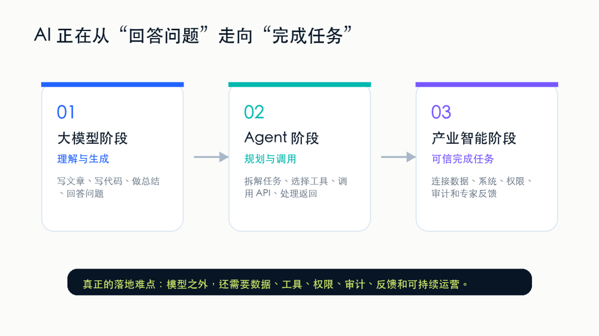
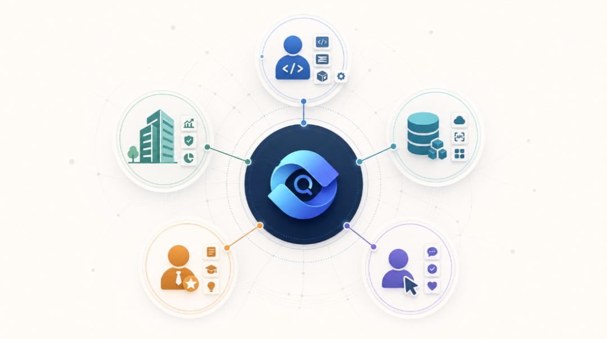
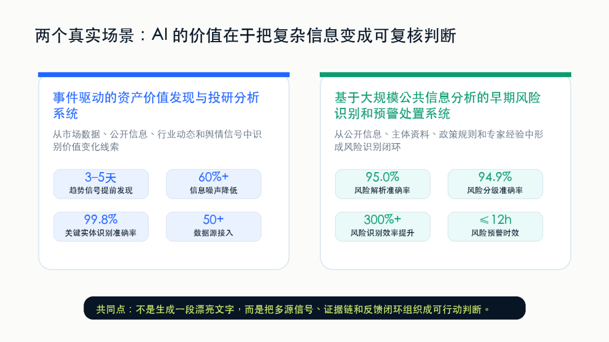
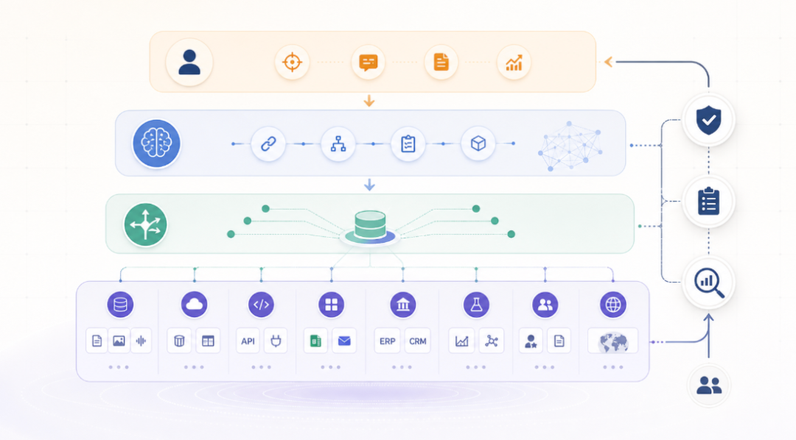

QVeris · 行业观察 

 图 1：AI 的下一步，不是更会聊天，而是更可靠地连接真实世界。 

最近一年，很多人已经不再问"AI 能不能写文章、写代码、做总结"。这些问题的答案基本已经清楚了。AI 能，而且很多时候做得不错。 

但当我们真的想把 AI 放进工作流里，让它帮我们完成一个真实任务时，问题马上变复杂了。 

一个金融分析师想让 AI 分析某只股票或 ETF 的机会。

AI 可以写出一段逻辑很顺的分析，但它有没有拉到最新行情？有没有看公告？有没有核对新闻来源？有没有检查资金流、行业数据和历史相似事件？ 

一个企业经营者想让 AI 帮忙分析经营异常。

AI 可以总结一段"可能原因"，但它能不能真正连到 CRM、ERP、财务系统、工单系统？它知道哪些数据能看、哪些不能看吗？它的判断过程能不能被复核？ 

一个产业投资人想让 AI 判断某项复杂资产是否值得继续跟进。

AI 可以给出概念解释和行业判断，但它有没有系统性核对关键证据、合规约束、竞争格局、交易案例和潜在需求？它给出的价值判断，能不能追溯到证据链？ 

**这些场景里，AI 的问题往往不是"不够会说"，而是"不够会做"。更准确地说，是它还没有稳定、可信、低成本地连接真实世界的能力。**
## 幻觉很多时候不是因为 AI 不聪明

  

我们经常说 AI 会"幻觉"。但在真实业务里，很多所谓幻觉，并不只是模型能力不够。它常常来自更基础的问题：AI 没有拿到最新数据，不知道该调用哪个工具，不理解 API 的参数和限制，不知道返回结果是否可信，也不知道企业里的权限、审计和合规边界。 

这就像让一个很聪明的人坐在一间没有网络、没有工具、没有资料库的房间里，让他回答所有现实问题。他可能会给出一个听起来很合理的答案，但这个答案未必可靠。 

大模型本身越来越强，这是确定的。但如果模型不能可靠地连接数据、工具、系统和流程，它就很难从"会回答"走向"能办事"。 

 图 2：AI 从回答问题走向完成任务，难点也从生成质量走向真实世界连接能力。 
## 真实世界不是一个聊天框

  

真实世界里的任务，通常不是一句 Prompt 就能解决的。

一个真实任务往往包含很多步骤：先理解目标，再拆解任务，再找数据，再选工具，再验证结果，再生成结论，最后还要让人能复核、能追责、能继续迭代。 

**例如**：

金融投研不是"搜索资料"。

它需要从新闻、公告、行情、资金流、行业数据和舆情中发现信号，再判断这些信号是否真的影响资产价格。 

公共治理也不是"看舆情"。

它需要从大量公开信息里识别风险事件、主体关系、风险等级和处置建议，而且过程要可解释、可追溯。 

复杂产业资产判断更不是"让 AI 写一份报告"。

它需要把技术资料、公开证据、合规规则、竞争格局、交易案例、潜在需求和资源窗口放到同一个价值判断框架里。 

这些任务都有一个共同特点：它们需要 AI 连接真实世界的能力，而不只是生成一段文字。 
## 这件事跟谁有关？

 图 3：真实世界能力网络的价值，最终会落到不同人群的工作效率和决策质量上。 

如果 AI 只是一个聊天工具，那么它主要影响写作、客服、编程、知识问答这些场景。但如果 AI 开始真正调用工具、连接系统、参与任务执行，它影响的人会多得多。 

它和开发者有关。

今天开发者要让一个 AI Agent 调用外部能力，往往需要查文档、注册账号、写适配代码、处理鉴权、调参数、写异常逻辑、维护接口变化。

大量时间花在重复的"胶水工作"上，而不是业务创新上。 

它和企业有关。

企业不是不想用 AI，而是不敢随便让 AI 进入核心流程。原因很现实：权限怎么管？数据怎么控？调用了什么工具？结果从哪里来？出了错谁负责？成本怎么核算？没有这些问题的答案，AI 很难进入生产系统。 

它和数据、API、SaaS 服务商有关。

今天互联网上有很多优质数据源和工具服务，但它们大多是给人和程序员使用的。Agent 时代，这些能力需要被 AI 发现、理解和正确调用。 

它和专业人士有关。金融分析师、律师、医生、咨询顾问、科研人员、企业运营者，并不一定需要一个"替代自己"的 AI。

他们更需要一个能帮自己收集证据、调用工具、整理材料、发现异常、形成初步判断的助手。 
## 我们看到的几个真实案例

图 4：两个场景都说明，AI 的价值不只是生成内容，而是组织证据、状态和反馈。 

QVeris 做这件事，并不是从概念出发，而是从很多真实场景里被反复推到这个问题面前。 

**在一个事件驱动的资产价值发现与投研分析项目里，我们面对的问题是**：

市场信息太多、太噪、太快。公开信息、市场数据、行业动态、舆情变化和主体关系，每一类信息单独看都可能有用，也可能只是噪声。

系统要做的不是把资料堆给分析师，而是识别哪些事件可能影响资产价值，哪些信号值得验证，哪些变化可能形成策略机会。 

**在一个基于大规模公共信息分析的早期风险识别和预警处置项目里**：

公开信息、主体资料、政策规则、事件文本、专家经验混在一起。

风险往往隐藏在弱信号里，而且需要尽早识别、分级和处置。

这个系统不是一个简单的信息看板，而是把风险事件、主体关系、风险语义、专家规则和反馈结果组织成一个可运行闭环。 

**这类场景提醒我们：**

**AI 真正有价值的地方，不是替人"写一段分析"，而是帮助人把复杂信息变成可验证、可追溯、可复核的判断过程。**
## 为什么这件事现在变重要？

  

因为 AI Agent 正在从实验阶段走向生产阶段。

在实验阶段，一个 Demo 只要能跑通，就足够让人兴奋。

**但在生产阶段，问题会完全不同**：

能不能稳定调用？

能不能解释结果？

能不能控制权限？

能不能审计过程？

能不能评估成本？

能不能接入企业系统？

能不能让专家反馈回写？

能不能在出错时恢复？ 

这些问题都不是大模型单独能解决的。

模型负责理解和推理，Agent 负责规划和执行，但在模型和真实世界之间，还需要一层基础设施：帮助 Agent 发现能力、检查能力、调用能力、记录过程、评估结果，并持续校准。 

图 5：QVeris 希望成为模型、Agent 和真实世界能力之间的路由层。 
## QVeris 想做什么？

  

我们做 QVeris，是希望为 AI Agent 构建一张真实世界能力网络。

这张网络里，不只是 API。它也包括数据源、工具、企业系统、专业方法、云服务、行业知识和可执行流程。 

我们希望 AI Agent 在面对一个任务时，不是凭空生成答案，而是能找到合适的数据和工具，理解它们的参数、能力和边界，在权限允许的前提下调用它们，把调用过程记录下来，把结果交给人类专家复核，再把反馈回写到系统里。 

这也是我们为什么一直强调几个关键词：能力发现、能力评估、能力调用、可信执行、反馈治理。听起来不如"一个全能 AI"那么刺激，但它更接近真实生产。 

目前 QVeris 已经围绕 10,000+ 可调用能力构建能力网络，并在 REST API、MCP Server、CLI、QVerisBot、Skill Hub、Capability Map 等产品形态中持续推进。 
## 我们希望这件事对别人有用

  

如果 QVeris 只是在做一个自己的产品，那这件事不够有意义。我们真正希望它对更多人有用。 

- 对开发者，它应该减少重复接工具、写适配、查文档的成本。

- 对企业，它应该降低 AI 进入生产系统的风险。

- 对数据和工具服务商，它应该提供新的分发和调用入口。

- 对专业人士，它应该放大判断力，而不是替代判断。

- 对普通用户，它应该让复杂能力更容易被自然语言调用。 

这也是我们理解的"利他"。不是说 AI 会替代多少人，而是让更多人能用上过去很贵、很复杂、很分散的能力。 

**搜索引擎让信息更容易获得。**

**云计算让算力更容易获得。**

**移动互联网让服务更容易获得。**

**大模型让智能更容易获得。**

**而 Agent 时代，还需要让真实世界的能力更容易获得。**

这就是 QVeris 想做的事情。让 AI 少一点幻觉，多一点真实世界的能力。让 AI 不只是更会说，而是更可靠地帮助人完成事情。 

我们也诚挚欢迎 AI 行业同仁、产业伙伴，以及数据、工具、API、SaaS、云服务和开发者生态中的伙伴与我们交流合作。

QVeris 希望与更多真实场景的建设者一起，把分散的能力连接起来，把可验证的数据、工具和专业方法组织成 AI 可以可靠调用的基础设施，共同推动 AI 从演示走向生产、从单点应用走向千行百业的真实落地。
