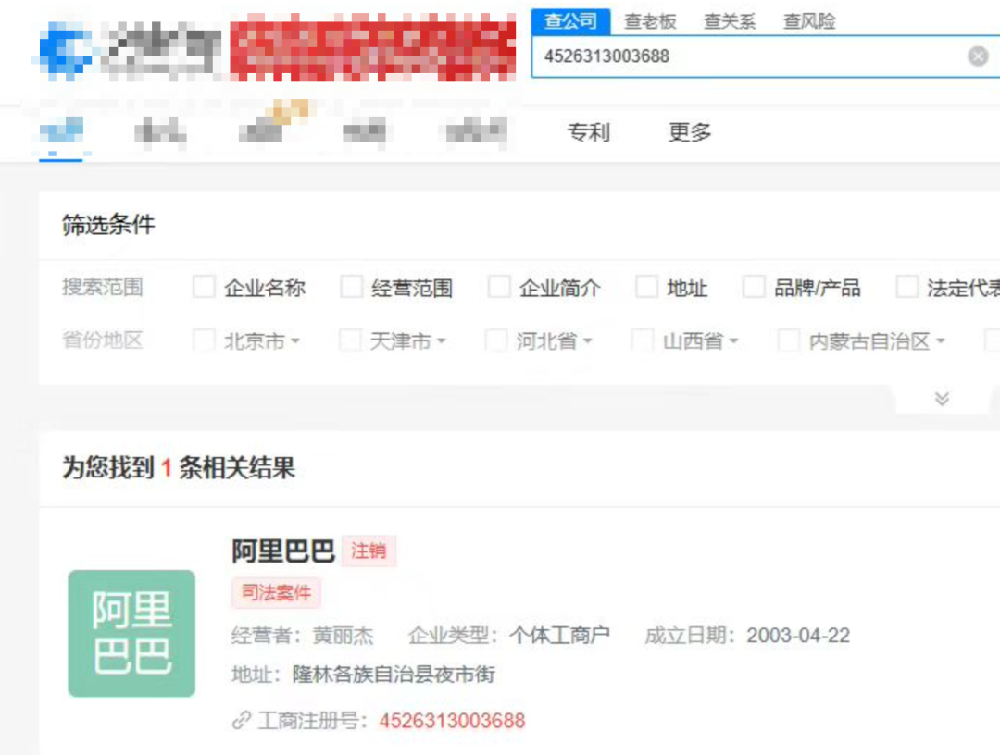

QVeris · QVeris方法论 

> QVeris 如何把多源金融能力组织成 Agent 可质证的证据网络
## 一个问题，不该只查一个来源

**假设用户问**：

>
> 宁德时代最近为什么波动？ 
>
一个很快的 AI 回答可能是：可能和电池行业消息、锂价变化、订单预期有关。

这句话听起来没错，但在金融场景里，听起来像答案，不代表它真的经得起追问。

>
> ❓ 关键问题不是 AI 能不能说出一个原因，而是这个原因有没有被真实数据支持。 
>
单看股票数据，我们只能知道市场有没有反应：股价动了没有，成交有没有放大，资金有没有变化。

但市场为什么动，往往要去新闻里找事件，去企业关系里看主体和传导路径，去研报里看机构是不是已经把这件事纳入预期。

所以，金融 Agent 真正要解决的不是"更快说一句解释"，而是把不同来源放在一起质证：哪些信息互相支持，哪些只是线索，哪些地方还不能下结论。
## 四类数据，各自证明什么

通过 QVeris，Agent 面对的不是几个孤立接口，而是一组可发现、可检查、可组合的金融能力：股票数据、企业信息、研报和新闻分别承担不同的证据角色。它们不是四个可以随便替换的数据接口，而是四类可以相互质证的证据来源。

| 数据来源 | 主要回答的问题 | 在质证里的角色 |
| --- | --- | --- |
| 股票数据 | 市场有没有反应，价格、成交、资金、波动是否异常 | 确认"市场是否动了" |
| 新闻 | 发生了什么事，外部传播和舆情怎么变化 | 提供事件线索 |
| 企业信息和关系网络 | 主体是谁，股权关系如何，供应链是否可能传导影响 | 确认"这件事到底影响谁" |
| 研报 | 机构如何解释，预期、估值、行业判断是否变化 | 提供专业解释和预期变化 |

单一来源只能回答一部分问题。股票数据告诉我们市场有没有动，但不天然解释原因；新闻告诉我们发生了什么，但不一定说明事件和上市主体之间的关系；企业信息能确认主体和关系，但不一定说明市场已经反应；研报能提供解释框架，但也需要用事实和市场数据验证。

>
> ✅ 多源质证的价值，就是把这些"局部事实"组织起来，变成一条可追问的证据链。 
>
## 企业关系不是配角

很多人做金融 Agent，会先想到行情、公告、新闻、研报。但在很多问题里，企业信息和关系网络反而是最容易被低估的一层。

因为金融问题里的"公司名"，经常不是一个干净的查询条件。

比如用户说"阿里巴巴"，在股票语境里可能指上市公司或股票标的；在新闻语境里可能是品牌或集团；在企业工商语境里，接口可能需要的是具体法人主体。不能奢望大模型基座天然背下所有名称和主体之间的映射。

 甚至有企业就叫四个字阿里巴巴 

宁德时代这类产业链公司也一样。用户关心的可能是上市主体，新闻里提到的可能是子公司、供应商、客户、海外项目公司，或者某个上游材料企业。只看关键词，很容易把"名字相关"误认为"风险相关"。

所以企业信息不只是"查一下工商资料"。在多源质证里，它承担的是关系确认：这个主体和用户关心的标的是什么关系，它是核心子公司、供应商客户、参股公司，还是只是名字相近的外围主体。
## 多源质证不是多调几个接口

多源质证听起来像是"把股票、企业、新闻、研报都查一遍"。但如果只是机械地多调几个接口，Agent 仍然可能给出一个拼凑出来的答案。

真正的关键是，Agent 要知道每一次调用在验证哪一个假设。

>
> 📌 好的金融 Agent 不是调用更多工具，而是知道每一次调用在证明什么。 
>
如果多个来源互相支持，结论的置信度可以更高。如果新闻有线索，但股票数据没有明显反应，研报也没有更新，那更稳妥的表达就不是"确定利好"或"确定利空"，而是"存在事件线索，但尚未形成多源确认"。

在金融场景里，这种克制很重要。因为很多时候，最危险的不是 AI 不回答，而是它用很确定的语气讲了一个只有单一来源支持的判断。
## 一个更好的回答长什么样

**普通回答可能是**：

>
> 宁德时代波动可能和电池行业消息有关。 
>
这个回答太快，也太薄。它没有告诉用户：市场是否真的动了，消息来自哪里，事件是否影响宁德时代本身，机构是否已经调整预期。

**一个更好的金融 Agent 回答，应该更像这样**：

**这时更好的回答可以直接分层表达**：

**市场反应**：股票数据确认近期存在波动，但行情本身不能解释原因。

**事件线索**：新闻侧出现与电池产业链、订单、政策或价格变化相关的线索。

**关系传导**：企业关系和供应链数据用于判断，这件事是否影响宁德时代核心主体、子公司、供应商或下游客户。

**机构预期**：研报侧用于观察机构是否调整行业判断、盈利预期或风险提示。

**结论边界**：目前可以说"存在多源线索支持的行业影响"，但不能直接下确定结论；哪些信息已被多源确认，哪些仍只是单源线索，需要分开表达。

这个回答不一定更短，但更可信。因为它不是只给答案，而是把答案背后的来源、路径和不确定性一起交代出来。
## QVeris 的价值：把分散金融能力变成可质证的证据网络

QVeris 的价值不是把不同数据源简单接到一起，而是把分散的金融能力变成 Agent 可发现、可检查、可调用、可追溯的证据网络。真正的多源质证仍然由用户的 Agent 完成，但如果没有这样的能力网络，Agent 很容易停留在"凭印象回答"或"硬编码调接口"的阶段。

>
> 📌 也就是说，QVeris 不替 Agent 下最终结论；它把工具发现、参数检查、质量信号、结构化调用和审计留痕组织起来，让 Agent 有条件把多个来源变成一条能被追问的证据链。 
>
**有了这些上下文，Agent 才能进一步判断**：

- 用户问的是股票表现，还是企业主体，还是行业事件？

- 这个问题应该先查市场数据，还是先做实体识别？

- 新闻里的主体和股票标的是不是同一个对象？

- 股权穿透和供应链关系能不能说明影响路径？

- 研报观点和市场数据是否互相支持？

- 如果来源之间冲突，应该如何保留不确定性？

>
> ✅ 金融 Agent 的目标不是更快给出一句答案，而是更可靠地说明：这个答案为什么可信。 
>
在我看来，这才是金融 Agent 和普通问答机器人最大的区别。

普通问答追求的是"像人一样回答"。金融 Agent 更应该追求的是"像研究员一样留下证据"。

答案只是最后一行。真正重要的是：这个答案被哪些来源支持，哪些地方还不确定，哪些证据之间存在冲突，以及这条证据链是否经得起用户继续追问。

这也是 QVeris 做能力路由、工具理解和审计留痕的意义：它不是替 Agent 完成最终判断，而是让用户的 Agent 能理解工具边界、选择验证路径、结构化调用能力，并留下可审计的证据链，最终把多源信息组织成可验证的判断。

---

原文链接：[微信公众号原文](https://mp.weixin.qq.com/s/v_MHLufYkRaAKE0a1nbTww)
