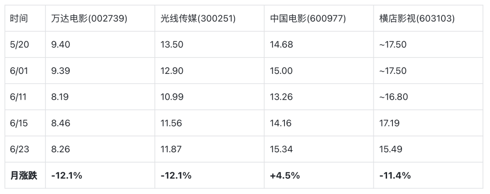
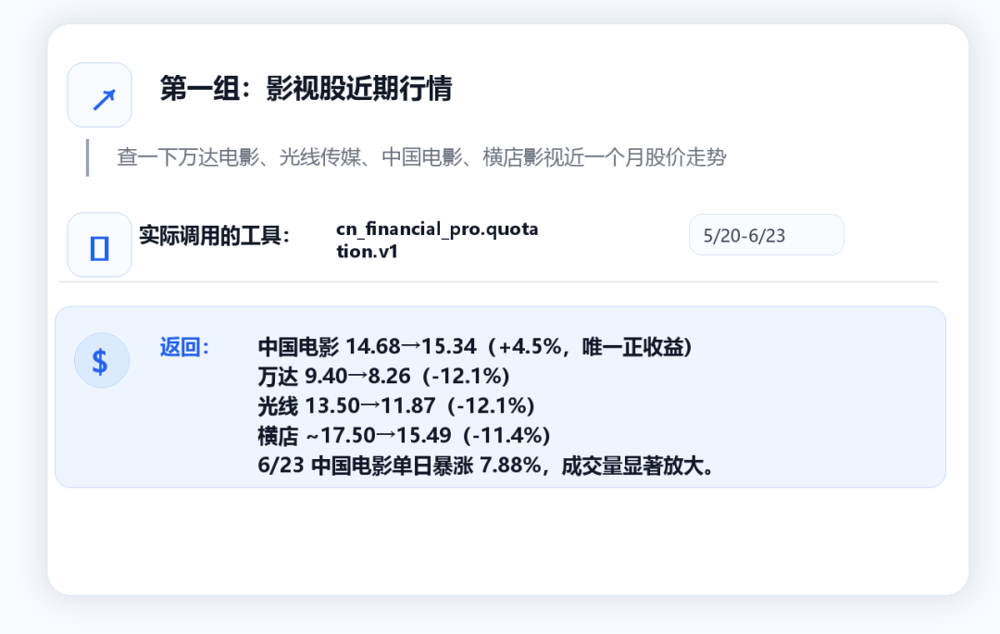
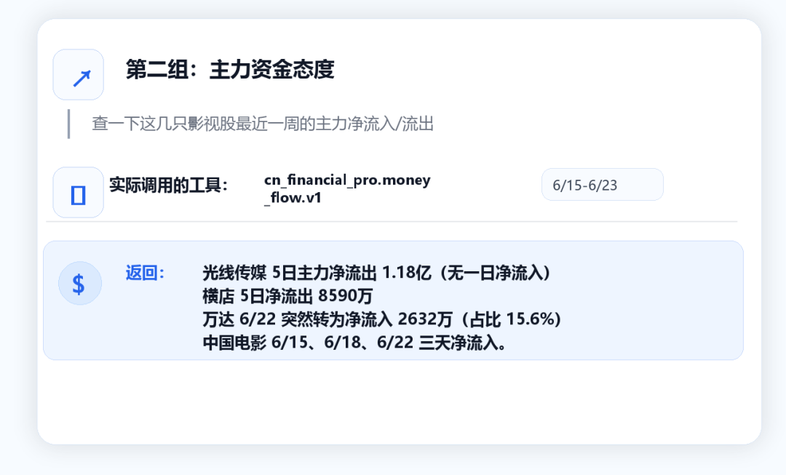
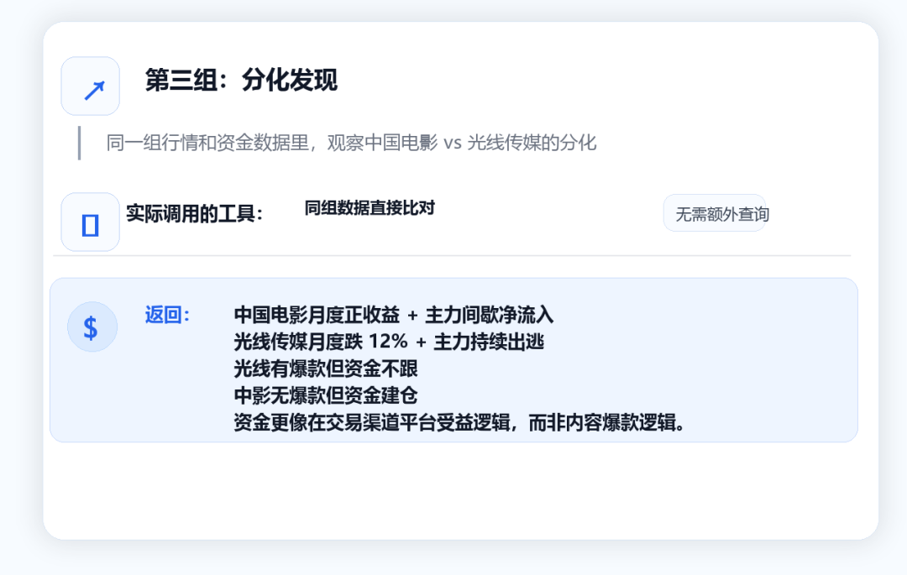

QVeris · 数据实测 

端午档 3.92 亿票房、144 万场次双破纪录。暑期档超 60 部新片压阵。"2026 电影经济促进年"带来了全年 12 亿惠民观影补贴。

消息面上热闹非凡。但影视股到底有没有反应？我在 QVeris 上把票房数据和公司行情拉了一遍——答案比新闻标题复杂。
## 先看票房基本面：政策在发力，数据在说话

"2026 电影经济促进年"由国家电影局、中央广播电视总台、商务部联合推动，2 月在北京启动。不算喊口号——春节档就投放了消费补贴，结果档期总票房 57.52 亿，平均票价从原来的 50+ 元降到了 47.8 元。

暑期档延续了力度。截至 6 月 21 日，暑期档总票房超过 11.82 亿元。端午三天假期近 20 部影片集中上映，创下近十年同期新高。

热片方面，《给阿嬷的情书》累计票房超 15.87 亿元，暂列年度亚军。《飞驰人生 3》《镖人》分列年度票房前列。中信建投的研报判断是：暑期档头部影片供给数量和质量均优于去年，票房有望持续增长。

政策 + 票房双利好，影视股该起飞了吧？

等一下——我把 QVeris 拉出来的股价数据看了一遍，事情没那么简单。
## 影视股行情：同一板块，四张不同的脸

通过 QVeris 直连 cn_financial_pro，我拉了四只影视核心标的近一个月（5 月 20 日 - 6 月 23 日）的日线数据：

中国电影是唯一一个月度正收益的——而且 6 月 23 日单日涨了 7.88%，成交量暴增。万达和光线虽然月跌 12%，但最近两天（6/22-23）出现了反弹迹象。

有意思的是：政策利好是普惠的——每家公司都能受益于观影补贴和档期热度。但股价反应完全分化。

这说明市场不是在交易"影视板块利好"这个大概念，而是在挑具体标的。

## 资金流向：谁在买，谁在逃？

**股价只是表面。我在 QVeris 上又调了主力净流入数据，这才看到了真正的分歧**：

| 标的 | 6/15 | 6/16 | 6/17 | 6/18 | 6/22 | 周累计 |
| --- | --- | --- | --- | --- | --- | --- |
| 万达电影 | -1837万 | -51万 | -5624万 | -762万 | +2632万 | -6642万 |
| 光线传媒 | -1905万 | -1024万 | -3754万 | -2843万 | -2301万 | -1.18亿 |
| 中国电影 | +2720万 | -945万 | -9577万 | +1525万 | +1402万 | -4875万 |
| 横店影视 | -2021万 | -2004万 | -1340万 | -573万 | -2652万 | -8590万 |

注意万达——6 月 22 日主力突然转为净流入 2632 万，占当日成交额 15.6%。这是过去两周第一次像样的主力回流。

光线传媒最弱：5 日主力累计净流出 1.18 亿，20 日累计流出 4.44 亿。资金态度很明确——不参与。

中国电影最值得看：虽然 6/17 那天被砸了 9577 万（那天整个板块都在跌），但 6/15 和 6/22 都出现了净流入。结合今天 7.88% 的涨幅来看，资金在分批建仓。

坦白说，我一开始以为光线传媒应该是龙头——毕竟《给阿嬷的情书》破 15 亿，它是主要出品方之一。但数据显示钱在往中国电影走。我是看了三遍资金流向才接受的——这个反馈让我重新理解了"市场是怎么思考的"。

光线虽然有爆款，但市场可能在担心单一影片的票房集中度风险——一部片子占了大部分营收预期，后续内容储备的可见度不够。而中国电影是发行 + 放映 + 制片的综合平台，政策红利（12 亿补贴主要走院线渠道）直接传导到它身上。

但话说回来，一周的数据说明力有限。暑期档真正的高潮在 7 月中下旬——那时的票房数据和资金流向才更值得拿 QVeris 重新拉一次。
## 怎么通过 QVeris 自己追踪？

如果你也想实时盯影视板块，体验大概是这样——

👤 **"帮我拉一下万达电影、光线传媒、中国电影近一个月的走势和资金流向"**

🤖 **"5/20 到 6/23，万达从 9.40 跌到 8.26（-12.1%），光线从 13.50 跌到 11.87（-12.1%），中国电影从 14.68 涨到 15.34（+4.5%）。资金面上，光线 5 日主力净流出 1.18 亿，中国电影 5 日净流出 4875 万，但 6/22 单日净流入 1402 万。横店影视持续流出，5 日累计 -8590 万。"**

👤 **"暑期档票房数据能查到吗？"**

🤖 **"目前 QVeris 上的 cn_financial_pro 主要覆盖 A 股行情和资金流向数据。票房实时榜单需要通过灯塔专业版或猫眼专业版获取，不在当前数据源覆盖范围内。但你可以通过追踪影视股的资金动向反向验证票房预期——如果机构提前看好某部片子，通常会在上映前 1-2 周开始布局相关公司。"**

👤 **"中国电影 6/23 涨了 7.88%，有持续性吗？"**

🤖 **"6/23 中国电影收盘 15.34（+7.88%），成交量显著放大。但从资金面看，20 日 DDE 仍为 -2.27 亿，说明中长线资金仍在减仓。短期反弹的动力可能来自暑期档预期博弈，能否持续需要看后续票房数据能否超预期。目前只能说短线有资金关注，但中线趋势尚未确认反转。"**
## 适用边界

这篇文章的数据窗口是 5 月 20 日 - 6 月 23 日，覆盖了暑期档启动初期但未进入旺季。真正的票房高峰通常在 7 月中下旬到 8 月，目前的数据只能反映预热阶段的市场预期。

几个局限需要说明：票房分账数据、单片出品方盈利测算、港股影视标的（如阿里影业、猫眼娱乐）的对比，这篇都没有覆盖。QVeris 目前通过 cn_financial_pro 可以覆盖 A 股行情和资金流，如果想做更完整的产业链分析，建议同时拉取港股数据和其他财报数据源。

这篇文章提供的是一组可验证的观测数据，不构成投资建议。

>
> 免责声明：本文数据来自 QVeris 平台的实时 API 调用，仅供参考，不构成投资建议。市场有风险，投资需谨慎。数据截止日期：2026 年 6 月 23 日。 
>
