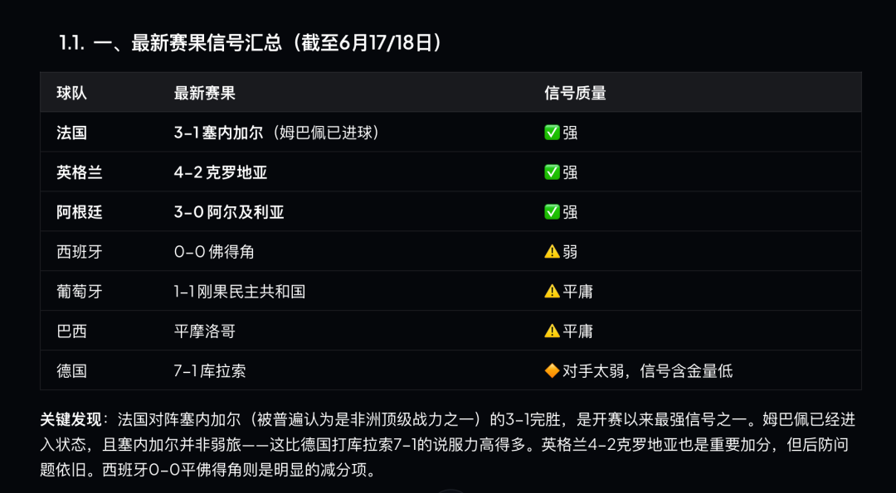
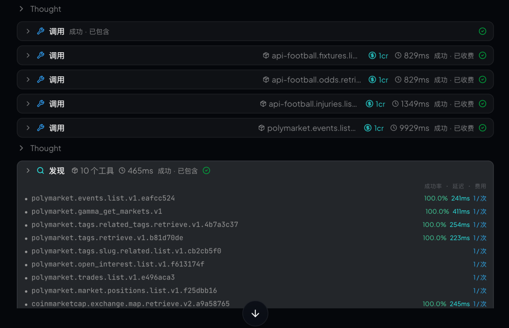
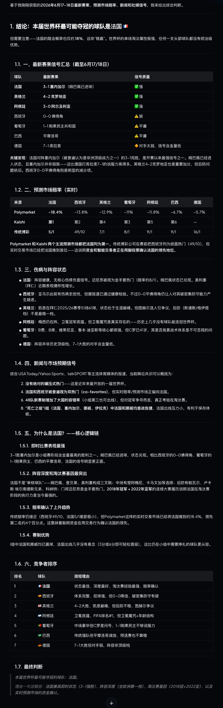

QVeris · 案例演示 

>
> 核心观点：预测冠军不是让大模型凭感觉押一个队，而是让 Agent 通过 QVeris 调用真实世界信号，持续更新"谁更可能夺冠"的判断。
>
> QVeris
>
**用 QVeris 的 Discover · Inspect · Call，把世界杯冠军预测变成一个可更新的多信号工作流**
## 为什么"猜谁夺冠"是一个很适合用 QVeris 来调用

世界杯开始后，最容易引发讨论的问题永远是：谁能夺冠？

传统回答通常有三种：第一种，看赔率，谁是热门就押谁；第二种，看球迷情绪，谁声音大就觉得谁有戏；第三种，让大模型直接猜一个答案。问题是，这三种方法都不够稳定。赔率是市场预期，不等于比赛结果；球迷情绪容易被单场表现放大；大模型如果只靠记忆和语言推理，很容易给出看似合理但缺少实时依据的判断。

真正有价值的不是让 AI 说一句"我看好西班牙"或"法国概率最高"，而是让 Agent 像一个赛事情报分析员一样，持续接入真实世界数据：赛程、战绩、阵容、伤病、球员状态、赔率变化、新闻事件、社媒热度、主办城市天气、旅行距离、历史淘汰赛表现，甚至舆情反转和突发事件。

这正是 QVeris 能力最容易被理解的场景：它不是让 Agent "凭感觉预测"，而是让 Agent 能够发现、检查并调用一组真实世界能力，把分散的数据源变成可执行的冠军预测工作流。
## 案例设定

##  

##  

##  

##  

##  

假设一家体育媒体、内容平台或品牌营销团队，想搭建一个 World Cup Champion Intelligence Agent。运营人员只需要输入一句话：

"请基于最新比赛结果、球队状态、伤病、赔率、新闻和社媒信号，判断本届世界杯谁最可能夺冠，并解释为什么。"

普通聊天机器人可能会直接给出一个球队名字。但在 QVeris 的工作流里，Agent 会先把这个问题拆成多个子任务：哪些球队是市场热门？哪些球队近期状态最好？哪些球队小组路径更轻松？哪些球队阵容有伤病隐患？哪些球队拥有更强淘汰赛经验？社媒和新闻是否出现重大利好或风险？

最终输出的不只是一个答案，而是一份可以滚动更新的"夺冠概率雷达"：第一候选、第二候选、黑马、风险球队，以及每个判断背后的数据来源和信号强弱。

## QVeris 如何让 Agent 从"会说"变成"会查、会算、会验证"

QVeris 官网强调的核心能力是 capability routing network：让 AI Agent 通过统一协议 Discover、Inspect、Call 真实世界能力。放到世界杯夺冠预测里，这套机制可以拆成三步。

第一步，Discover：Agent 用自然语言寻找能力。例如搜索"世界杯实时赛程与比分""国家队伤病新闻""球队 Elo / FIFA 排名""赔率变化""社媒热度""天气与主办城市信息"等能力。它不需要开发者提前把所有接口写死，而是根据任务动态找到候选工具。

第二步，Inspect：Agent 检查每个能力的参数、返回结构、延迟、成功率和成本。比如某个赛程工具是否支持国家队筛选，某个新闻工具是否支持时间范围，某个赔率工具是否能返回历史变化，某个社媒工具是否能按关键词聚合热度。

第三步，Call：Agent 调用最合适的能力，并拿到结构化结果。之后再把结果放入一套可解释的预测模型里，形成"为什么看好这支球队"的判断链路。

这就是 QVeris 与普通 API 调用的区别：开发者不是为每个场景手动接一堆接口，而是让 Agent 通过 QVeris 在任务现场找到并调用能力。

## 预测模型：不要迷信单一指标，而是做多信号交叉验证

在这个案例里，Agent 不直接问"谁最强"，而是建立一个多信号评分模型。每个信号都可以由 QVeris 路由到不同能力，再统一汇总。一个简化版本如下：

| 维度 | 权重 | 可调用信号 | 作用 |
| --- | --- | --- | --- |
| 球队硬实力 | 30% | FIFA/Elo 排名、阵容身价、核心球员状态、攻防效率 | 决定上限 |
| 近期状态 | 20% | 近 10 场战绩、进球/失球、首场表现、关键球员出场时间 | 决定当下热度是否真实 |
| 赛程路径 | 15% | 小组强度、潜在淘汰赛对手、旅行距离、休息天数 | 决定夺冠难度 |
| 伤病与阵容稳定性 | 15% | 伤病名单、停赛风险、主力轮换、教练调整 | 决定下限 |
| 市场预期 | 10% | 赔率、预测模型、专家调查、资金流向 | 反映外部共识 |
| 舆情与心理信号 | 10% | 新闻情绪、社媒热度、争议事件、压力管理 | 捕捉非结构化变量 |

## 如果今天让 QVeris Agent 猜冠军

基于赛前公开预测、市场赔率、超级计算机模型和开赛初期表现，一个合理的样例结论可以这样写：

**第一候选：法国。**

**第一：即战力最强**，法国3-1击败塞内加尔是首轮含金量最高的胜利——对手强、比分有说服力、超级巨星已兑现。相比之下西班牙0-0佛得角、葡萄牙1-1刚果、巴西平摩洛哥，都有明显瑕疵。

**第二：阵容深度全赛事第一，**

- **锋线：** 姆巴佩 + 登贝莱 + 奥利塞/巴尔科拉——四个爆点

- **中场：** 卡马文加 + 楚阿梅尼 + 扎伊尔-埃梅里——年轻、覆盖大、技术好

- **后防：** 萨利巴 + 科纳特 + 孔德——英超/西甲顶级

- **门将：** 迈尼昂——金手套热门

没有其他球队能在这四个位置都拿出同等级配置。

**第三：淘汰赛基因最成熟**

2018冠军 → 2022亚军（点球惜败）→ 2026。德尚的法国在世界杯淘汰赛里已经证明过：他们不会被压力压垮。

**第四：小组优势：** 法国在"死亡之组"I组（法国、塞内加尔、挪威、伊拉克）已拿3分，挪威也赢了。法国出线几乎无悬念，可以更从容地管理体能——48队赛制下这一点非常关键。

**第五：赔率正在确认领先**

预测市场的交易量已超过20亿美元（Polymarket + Kalshi合计）。这不是随机的投注，而是真金白银的信息聚合——资金正在用法国的"合约"投票。

对 Agent 来说，Agent 会把法国归类为"高下限 + 高爆发"的冠军候选。

**第二候选：西班牙。** 最接近法国，西班牙仍然是极强候选。优点是体系完整、控球能力强、能在北美高温环境下通过控球节省体能，且有亚马尔这种改变比赛的球员。但短期风险是：0-0 佛得角让市场怀疑其破密集防守效率，预测市场价格已回落。

**第三梯队：英格兰、阿根廷、葡萄牙。** 英格兰拥有阵容厚度和市场支持，但大赛关键节点的稳定性仍是变量；阿根廷是卫冕冠军，经验和精神属性强，但核心年龄结构与连续夺冠难度需要打折；葡萄牙阵容完整度高，具备黑马冠军的潜质。

**风险观察：巴西。** 巴西永远是冠军候选，但如果开局表现暴露攻防平衡和阵容稳定问题，Agent 不会因为历史光环继续盲目高估，而会把它标记为"上限很高、波动较大"的风险热门。

**黑马观察：荷兰、摩洛哥、日本。** 黑马不是指一定能夺冠，而是指在路径、攻防结构、团队纪律或舆情势能上，可能产生超预期表现。QVeris Agent 的价值在于持续监控这些信号是否从"噪音"变成"趋势"。
## 最终输出示例：Agent 不是押答案，而是输出可更新的冠军雷达

如果把这套分析压缩成一份运营可读的结论，World Cup Champion Intelligence Agent 可以输出：

**当前最可能夺冠：法国。**

**最强竞争者：西班牙。**

**高关注候选：英格兰、阿根廷、葡萄牙。**

**高波动热门：巴西。**

**黑马观察：荷兰、摩洛哥、日本。**

但这不是一个静态答案。每一轮比赛结束后，Agent 都应该重新调用赛果、伤病、赔率、新闻和社媒信号，更新评分。如果西班牙核心受伤，法国赔率快速下调，阿根廷连续低消耗晋级，或者某支黑马球队在淘汰赛路径上避开强敌，冠军雷达都应该自动变化。

这才是"用 QVeris 猜冠军"的真正意义：不是预测一次，而是把预测变成一个持续运行、可验证、可复盘的智能工作流。
## 为什么这个案例能突出 QVeris 的产品价值

第一，世界杯预测天然需要多源数据。没有任何一个单一 API 能完整回答"谁能夺冠"。Agent 必须同时处理赛程、球队、新闻、伤病、赔率、社媒、城市与历史数据。QVeris 的能力路由网络，正好解决"工具太分散、Agent 不知道用哪个"的问题。

第二，预测问题需要可解释性。一个好的 Agent 不能只说"我觉得西班牙会赢"，而要解释依据：哪些指标支持西班牙，哪些指标支持法国，哪些指标提示巴西有风险。QVeris 通过 Inspect 和结构化 Call，让每一步都能被追踪和复盘。

第三，世界杯是实时事件。赛前预测、首轮比赛后预测、小组赛结束后预测、淘汰赛前预测，答案可能完全不同。QVeris 能让 Agent 按需调用实时能力，而不是依赖过时记忆。

第四，这不只是体育案例，也可以迁移到金融、品牌、舆情和商业决策。例如"哪家公司最可能成为 AI 赢家""哪个行业正在形成交易机会""哪个品牌正在获得社媒势能"，本质上都是多信号、多工具、多阶段判断问题。

## 文章结论

如果让普通大模型猜世界杯冠军，它可能给出一个听起来很像专家的答案。

如果让 QVeris 支持的 Agent 猜世界杯冠军，它应该先找到数据，再检查工具，再调用能力，最后基于多源信号给出可解释、可更新、可复盘的判断。

因此，这个案例的重点不在于"AI 猜中了谁"，而在于"Agent 是如何完成预测这件事的"。

世界杯只是一个入口。真正被展示出来的是 QVeris 的核心能力：让 Agent 从语言推理走向真实世界行动，从单次回答走向连续工作流，从"会说"变成"会查、会算、会验证、会更新"。

**免责声明**

本文为 QVeris 产品能力演示案例，不构成体育投注、投资或商业决策建议。文中的冠军判断为样例推演，实际结果会随比赛、伤病、赛程和突发事件持续变化。

---

原文链接：[微信公众号原文](https://mp.weixin.qq.com/s?src=11&timestamp=1782306755&ver=6802&signature=ZTARrA9sslALul3HMSjo7l29ljsjB2I3UGwY3bGIayo1tLsq10JKERf7oQWn1DpUPc*Edaag9D2Y8IXF*yb2OimadVBPwKq0yAN7BqQh3NVQTD7lMEinq3q0ghX-yCiG&new=1)
