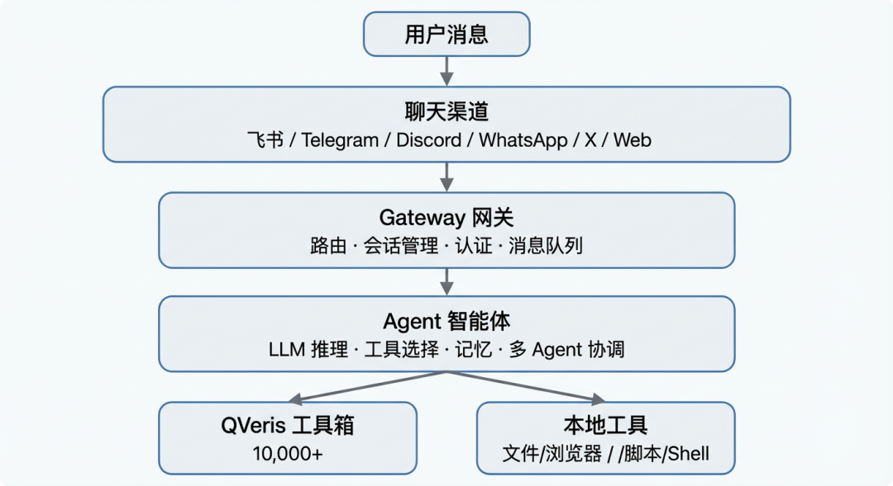

基于 OpenClaw 打造，集成 QVeris 万级工具生态，支持飞书、Telegram、Discord 等全平台接入

## 01.

## 一句话定位

**QVerisBot = OpenClaw 的本地优先架构 + QVeris 的万级工具生态 + 全平台即时通讯接入**

如果说 OpenClaw 是一台"能干活的 AI 电脑"，那 QVerisBot 就是给这台电脑装上了"万能工具箱"——让它不仅能思考，还能真正连接真实世界。

## 02.

## 什么是 OpenClaw？

在介绍 QVerisBot 之前，有必要先了解它的底座——OpenClaw。

OpenClaw 是由 Peter Steinberger 开发的开源个人 AI 助手框架，2026 年 1 月发布后迅速引爆全球开发者社区。它的核心理念是**本地优先（Local-First）：**

- **运行在你自己的电脑上**：Mac、Windows、Linux 均可，数据不出本机
- **多渠道接入**：WhatsApp、Telegram、Discord、Slack、Google Chat、Signal、iMessage、BlueBubbles、Microsoft Teams、Matrix、Zalo、Zalo Personal、WebChat、飞书、X……一个网关进程连接所有聊天应用
- **Agent 原生架构**：内置工具调用、会话管理、持久记忆、多 Agent 路由
- **开源可扩展**：MIT 协议，社区驱动，技能（Skills）系统支持无限扩展

用户评价最多的一句话是："It's running my company."——它不是聊天机器人，而是一个**真正能做事的 AI 同事。**

## OpenClaw 的核心能力


## 03.

## 那 QVerisBot 是什么？

**QVerisBot 是 QVeris AI 团队基于 OpenClaw 打造的生产级 AI 助手发行版。**

它保留了 OpenClaw 的全部本地优先架构，并在此基础上增加了一层 **QVeris 产品层**——专为专业场景和企业用户设计：


## QVerisBot 的独特之处

这是 QVerisBot 与原版 OpenClaw 最核心的差异。

普通的 AI 助手要调用外部工具，开发者需要逐个寻找 API、阅读文档、编写适配代码、处理鉴权——每个工具接入平均耗时 5-30 分钟。而 QVerisBot 内置了 QVeris 工具搜索和执行引擎：

- **语义级搜索**：用自然语言描述需求（如"查询北京天气"），系统自动在 10,000+ 工具（来自 500+ 提供商）中匹配最佳选项
- **标准化调用**：一个统一接口调度万级工具，屏蔽底层异构差异
- **动态路由**：当某个工具不可用时，自动切换至同类备选方案
- **质量保证**：每个工具有成功率评分和延迟统计，优先推荐高质量工具

**实际效果**：在全球顶级开源和闭源大模型的实测中，接入 QVeris 后复杂任务完美解决率提升了 100+%，整体任务失败率从 20% 左右降至 0%。

QVerisBot 对飞书（Lark）进行了深度适配：

- **WebSocket 长连接**：实时消息推送，零延迟响应
- **群聊 + 私聊**：支持 @机器人 触发，也支持私聊对话
- **富媒体支持**：图片、文件、卡片消息
- **权限精细化**：群策略（groupPolicy）、私聊策略（dmPolicy）独立配置
- **中文优化**：可配置 `promptSuffix` 自动附加中文提示

这意味着，国内团队可以直接在飞书群里拥有一个 7×24 小时在线的 AI 助手，它能查数据、写报告、监控市场、管理日程——而所有数据都在你自己的服务器上。

QVerisBot 内置了完整的 X（Twitter）操作能力：


关键特性：**跨渠道操作**。你可以在飞书群里说"帮我回复 @karpathy 的最新推文"，QVerisBot 会直接通过 X API 完成操作——无需切换平台。


QVerisBot 独有的 `qverisbot migrate` 命令支持跨操作系统迁移 bot 的完整状态：

```plaintext

bashqverisbot migrate export  # 导出知识、记忆和技能（自动剥离凭证）qverisbot migrate import  # 导入到新环境qverisbot migrate doctor  # 诊断迁移兼容性

```

**核心特性：**

- **安全剥离**：导出时自动移除所有敏感凭证和 API Key
- **完整保留**：知识库、技能配置、记忆、定时任务全部保留
- **跨平台**：Mac → Linux → Windows 无缝切换
- **企业级**：支持备份策略和版本管理

这是 QVerisBot 独有的功能，OpenClaw 不支持此迁移机制。

QVerisBot 原生支持 HTTP Proxy 配置，方便在网络受限环境部署：

```plaintext

bashexport HTTP_PROXY=http://proxy.example.com:8080export HTTPS_PROXY=http://proxy.example.com:8080qverisbot gateway

```

适合企业内网、跨国团队等场景。

## 04.

## OpenClaw vs QVerisBot：如何选择？


**一句话总结**：OpenClaw 是框架，QVerisBot 是产品。如果你是开发者想深度定制，选 OpenClaw；如果你想快速拥有一个能干活的专业 AI 助手，选 QVerisBot。

## 05.

## 使用场景

## 场景一：7×24 小时金融分析师

在飞书群中部署 QVerisBot，输入：

@QVerisBot 每 15 分钟帮我查看 A 股涨跌幅较大的股票，推荐增长潜力大的个股

它会自动创建定时任务，接入同花顺、东方财富等金融数据源，实时推送分析报告。当一个数据源不可用时，自动切换到备用源——这就是 QVeris 动态路由的价值。

## 场景二：内容创作与社交媒体运营

在飞书中说"搜索 AI Agent 最新热点，写一条英文推文"

QVerisBot 通过 QVeris 搜索最新信息，撰写推文，通过 X API 直接发布

设定定时任务，每天自动扫描关键账号动态并生成互动建议

## 场景三：多源数据查询助手

QVerisBot 集成 500+ 提供商的数据源，覆盖金融、科研、出行、社交等多个领域：

**金融数据：** Binance、i_FinD、CoinGecko、Etherscan、Alpha Vantage、...

**搜索与内容：** Brave Search、Firecrawl、NewsAPI、arXiv、PubMed

**商业信息：** Crunchbase、LinkedIn、Notion

**生活服务：** OpenWeather、Amadeus、Google Maps、World Bank

```plaintext

你：查一下比特币现在的价格，再看看美联储最近的利率决议QVerisBot：通过 CoinGecko/Binance 获取 BTC 实时价格通过 NewsAPI 获取美联储最新动态整合多个数据源给出综合分析

```

## 场景四：企业级自动化工作流

- **邮件管理**：连接 Gmail/Outlook，自动分类、优先级排序、草拟回复
- **日程管理**：查看日历、创建会议、发送提醒
- **项目管理**：对接 GitHub/Jira，追踪进度、生成报告
- **知识管理**：连接飞书知识库，搜索文档、整理笔记

## 场景五：开发者的瑞士军刀

-  用自然语言查询各种 API 数据（天气、汇率、股票、地理编码……）
-  自动生成图表和可视化报告
-  监控服务状态，异常时自动告警
-  管理多台服务器，批量执行运维任务

## 系统要求


## 06.

## 技术架构



## 核心技术指标


## 07.

## 快速开始

## 方式一：npm 安装（推荐）

```plaintext

bashnpm i -g @qverisai/qverisbotqverisbot onboard

```

**注意**：`qverisbot` 是主命令，`openclaw` 作为兼容别名也可使用。

## 方式二：一键脚本

**macOS/Linux：**

```plaintext

bashcurl -fsSL https://qveris.ai/qverisbot/install.sh | bash

```

**Windows PowerShell：**

```plaintext

powershellirm https://qveris.ai/qverisbot/install.ps1 | iex

```

## 方式三：从源码构建

```plaintext

bashgit clone https://github.com/QVerisAI/QVerisBot.gitcd QVerisBotpnpm install && pnpm buildpnpm qverisbot onboard

```

运行 `qverisbot onboard` 后，向导会引导你完成：

1. 模型配置（支持 Claude、GPT、Kimi、DeepSeek 等）
2. QVeris API Key 配置
3. 渠道配置（飞书 / Telegram / Discord 等）
4. 启动网关

```plaintext

bashqverisbot gateway --port 18789

```

然后在你的飞书/Telegram/Discord 里给机器人发条消息，开始体验。

## 08.

## 为什么选择 QVerisBot？


## 09.

## 关于 QVeris AI

QVeris AI 聚焦于 **Agent 时代的行动基础设施层**，致力于构建 AI 可理解、可调用的"能力互联网"。

**QVeris 当前定位： 面向智能体的搜索和行动引擎，让智能体能够通过语义搜索发现并一键调用 10,000+ 工具。**

**QVerisFlow（下一代产品，开发中）：** 负责完整的自主工作流编排，实现从需求理解到任务执行的全链路自动化。

**官网：**

https://qveris.ai

**QVerisBot GitHub：**

https://github.com/QVerisAI/QVerisBot

**OpenClaw GitHub：**

https://github.com/openclaw/openclaw

"我们希望成为 Model Agent 体系中的 Google。Google 不生产网页但索引全网信息，QVeris 不生产工具但索引和分发全网能力。" —— 王林芳，QVeris AI 创始人兼 CEO

***QVeris原创首发，转载请注明出处***
