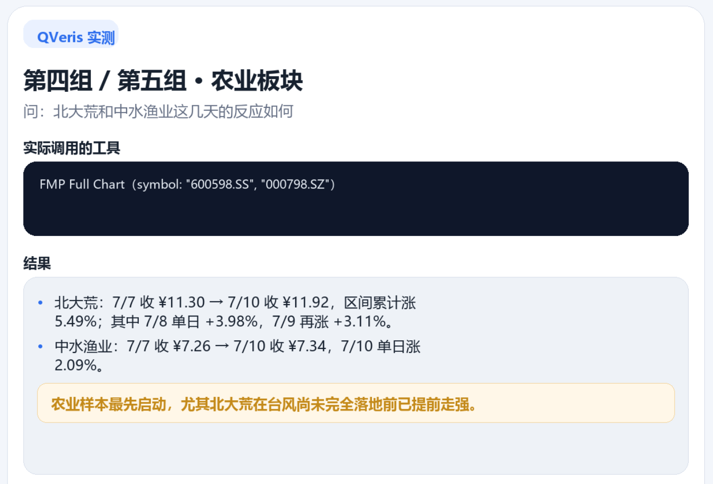
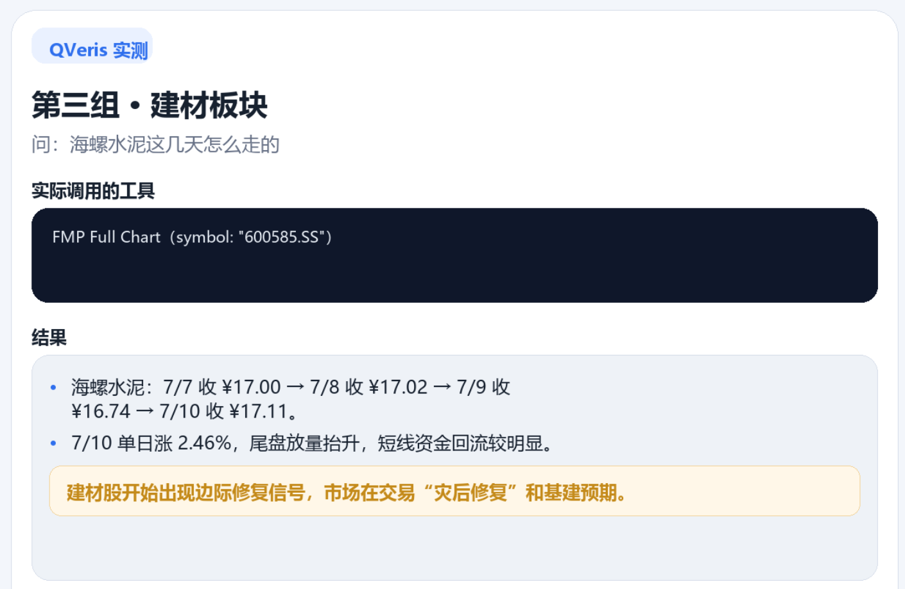
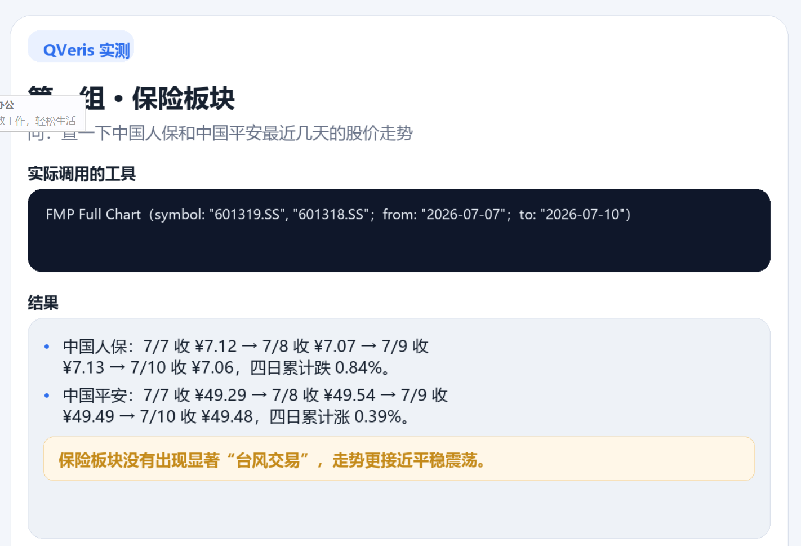
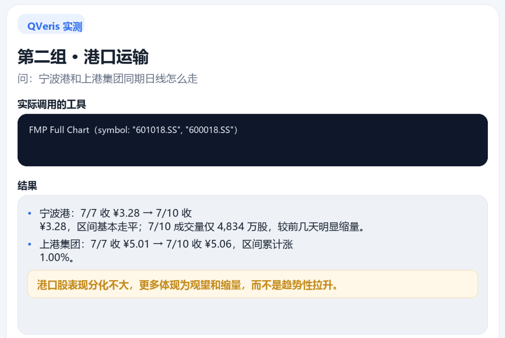

# 台风会影响股市吗？用 QVeris 复盘"巴威"冲击

7 月 11 日晚上 11 点 20 分，超强台风"巴威"在浙江玉环登陆，最大风力 14 级。

上海近 30 万人紧急转移，浙闽港口全线封航，宁波虾塘大面积损毁。社交媒体上一片"利好保险""买防汛概念股"的声音。但你翻一翻 7 月 10 日——台风登陆前末个交易日——的行情，会发现一件反直觉的事。

市场没在恐慌。

中国人保跌了 0.84%，是受影响板块里唯一跌的。中国平安涨了 0.39%。宁波港平盘，上港集团涨了 1%。海螺水泥涨了 0.65%。北大荒——不对，这家甚至不是微涨，是涨了 5.49%。

这跟我脑子里预演的剧本完全不一样。台风要来，保险该跌（理赔压力），港口该跌（停运），建材该跌（工地停工），农业更该跌（庄稼全完）。结果呢？

数据不会骗人。我们拉了一下 7 月 7 日到 7 月 10 日的真实行情，发现市场不只没恐慌，反而在偷偷押注一个完全不同的逻辑。

先说清楚我测了什么。通过 QVeris 调了 FMP 的 A 股日线数据，覆盖 7 只受影响板块的代表性标的——中国人保、中国平安（保险）、宁波港、上港集团（港口运输）、海螺水泥（建材）、北大荒（农业种植）、中水渔业（水产养殖）。同时调了 Caidazi 申万一级行业日线，看了四个板块在台风周的整体走势。

先说第一层——散户直觉该发生什么。

常识告诉我们三件事：保险要理赔，港口要停运，庄稼要被淹。如果你在 7 月 9 日打开雪球搜"巴威 概念股"，评论区基本是这套剧本。有人在算理赔金额："利奇马那年保险赔了 30 亿，巴威差不多，这周基本面要崩。"有人提前布局："建筑装饰该涨了，灾后重建是确定的。"

听起来都有道理。但真实行情是这样的——

| 板块 | 代表标的 | 7/7 收盘 | 7/10 收盘 | 变动 |
|-|-|-|-|-|
| 农业 | 北大荒 | 11.30 | 11.92 | **+5.49%** |
| 水产 | 中水渔业 | 7.26 | 7.34 | +1.10% |
| 建材 | 海螺水泥 | 17.00 | 17.11 | +0.65% |
| 港口 | 上港集团 | 5.01 | 5.06 | +1.00% |
| 港口 | 宁波港 | 3.28 | 3.28 | 0.00% |
| 保险 | 中国平安 | 49.29 | 49.48 | +0.39% |
| 保险 | 中国人保 | 7.12 | 7.06 | -0.84% |

七个标的，五个涨、一个平、只有一个跌。

申万行业指数的走势更说明问题。农林牧渔板块 7 月 10 日大涨 2.00%，而前两天它刚跌了 1.51% 和 2.35%——V 型反转比个股还猛。交通运输从 -2.05% 一步步收到 +0.31%。建筑装饰更从 -2.61% 直接拉回 +1.08%。三个受影响最深的板块，在台风逼近时集体翻红。

第二层真相呼之欲出：散户直觉全错了。市场不只没按"台风利空"走，反而集体翻红。为什么？

答案藏在第三层——市场的交易逻辑比"利好/利空"二元判断复杂得多。

先说农业为什么涨。北大荒 +5.49% 靠的不是想象力。市场在赌一个链条：台风损毁农作物 → 供给减少 → 农产品涨价。台风还没登陆，玉米、水稻的供给缺口预期已经反映在股价里。2020 年东北台风三连击，玉米倒伏直接引发期货暴涨。市场有记忆。中水渔业涨 1.10% 同一套逻辑。台风对农业的影响方向，取决于你站在生产端（受损）还是价格端（受益）。7 月 10 日的市场站在了价格端。

建筑装饰为什么涨？7/7 跌了 2.61%，7/10 涨了 1.08%。这个 V 字头就是"灾后重建"预期生效的时刻。市场不等台风过境，它提前两天就动手了。2019 年利奇马之后建筑原材料确有一波持续上涨。市场在复制历史。

保险股最反常识——我测之前也以为这块是最确定会跌的。结果打脸了。中国平安涨了 0.39%，中国人保跌 0.84% 也不像崩盘。换句话说，市场对保险股的"台风利空"已经钝化了。经历了山竹、利奇马、烟花、格美一轮又一轮，保险股的台风折价基本消化完毕。每次台风来了就抛保险股的人，在过去五年里大概率在台风过后发现自己卖在了最低点。

市场会学习。就这么简单。以前我也觉得台风对保险股是大级别的利空因素，现在回头看，利空早就被定价了，剩下的只是噪音。

港口呢？上港涨 1%，宁波港平盘。封航利空去哪了？宁波港 7/8-7/9 波动了一下，到 7/10 交易量只有平时的三分之二——没人在恐慌性抛售。市场的判断很冷静：封几天就恢复了，不影响长期价值。

说句不好听的，"台风概念股"这套说法本身就是散户编的故事。台风来了买保险、买建材、买防汛—— 2018 年山竹那会儿兴许有用。到了 2026 年，市场太懂了。懂到已经把所有的价格影响都提前定价了。

扯远了。回到数据本身。

一个台风，七只股票，四天数据。样本量不够下普适结论。换个台风、换个时点，结果可能完全不同。2018 年山竹登陆那天沪指跌超 1%，25 只跌停——因为当时大盘在去杠杆阵痛中，台风只是加速了恐慌释放。台风的冲击力，取决于大盘状态和宏观情绪，不是台风本身多强。

这也是为什么我不建议看着台风天气预报炒股。就算猜对了路径和强度，你也猜不对市场在特定时点把台风定价成了什么。

---

**数据实测总结**

| 问 QVeris | 拿到的数据 |
|-|-|
| 中国人保 | ¥7.06，跌 0.84%，唯一跌的 |
| 中国平安 | ¥49.48，涨 0.39%，稳得反常 |
| 宁波港 | ¥3.28，平盘，成交量萎缩 |
| 上港集团 | ¥5.06，涨 1.00% |
| 海螺水泥 | ¥17.11，7/10 单日 +2.46% |
| 北大荒 | ¥11.92，累计暴涨 5.49% |
| 中水渔业 | ¥7.34，7/10 单日 +2.09% |
| 申万农林牧渔 | 从 -2.35% 拉到 +2.00%，V 型 |
| 申万交通运输 | 从 -2.05% 收到 +0.31% |
| 申万建筑装饰 | 从 -2.61% 拉到 +1.08% |

七只标的 5 涨 1 平 1 跌，三个受影响最深的行业板块在台风逼近时集体翻红。市场没在恐慌，而是在提前定价——农业涨的是供给短缺推高价格，建筑涨的是灾后重建需求，保险股反而最淡定。

如果你也想查这类数据，体验大概是这样——

👤 **"帮我拉一下中国人保、中国平安、宁波港、海螺水泥、北大荒最近 5 天的日线"**

🤖 **"7/7 到 7/10，北大荒涨了 5.49%，农林牧渔板块涨了 2.00%。中国人保跌了 0.84% 是七只里唯一跌的。剩下五只全涨。"**

👤 **"那申万行业指数呢？台风逼近这周怎么走的？"**

🤖 **"农林牧渔从 -1.51% 到 -2.35% 再到 +2.00%，V 型反转。建筑装饰从 -2.61% 收到 +1.08%。交通运输从 -2.05% 收到 +0.31%。受影响最深的三个板块，台风逼近时全部翻红。"**

👤 **"所以台风对 A 股到底有没有影响？"**

🤖 **"有，但方向跟你直觉相反。市场不是恐慌，是提前定价——农业涨因为供给短缺推高价格，建筑涨因为灾后重建需求。保险反而最淡定，理赔成本已经被市场消化完了。"**

\*\*适用边界\*\*：本文结论基于 FMP 的 A 股日线数据和 Caidazi 的申万行业日线，覆盖 7 只标的 + 4 个行业板块在 7/7-7/10 期间的行情。适合想理解突发事件对市场真实影响的投资者。不适合做短线交易决策——台风交易赚的是时间差，不是趋势的钱。数据样本有限，结论仅供参考。 \*\*QVeris 数据实测\*\* — 本文数据来自 FMP 和 Caidazi 等多家供应商，通过 QVeris 能力路由网络实时调取。

QVeris 是 AI agent 的能力路由网络——一个统一协议，发现和调用上万个实时数据工具。

- AI 助手用户：qveris.cn/plugins（30 秒安装插件，发句话就能查数据）
- 开发者：npx -y @qverisai/mcp（IDE 集成）或 npm install -g @qverisai/cli（命令行）
- Agent 构建者：openclaw plugins install @qverisai/qveris

官网：qveris.cn

*免责声明：本文仅为数据分析和行业研究，不构成任何投资建议。市场有风险，投资需谨慎。数据来源为 FMP 和 Caidazi，通过 QVeris 平台调用，对数据的完整性和准确性不作保证，请以官方数据为准。*
