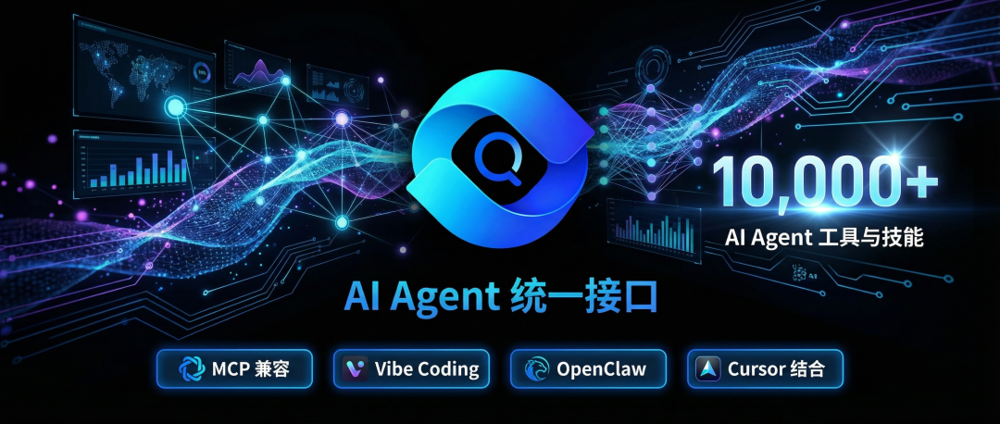

作者： 王林芳，QVeris AI 创始人兼 CEO

关键词： LangChain, QVeris, Agent Infra, 自主运行, 动态工作流, 工具发现

## **写在前面**

**首先声明：LangChain 是一个很棒的项目。**

作为 AI Agent 领域的同行，我们非常尊重 LangChain 团队所做的贡献。他们开源的框架帮助无数开发者进入 Agent 开发领域，12.5 亿美元的估值也证明了市场对 Agent 基础设施的看好。

但我们也经常被问到：**"你们和 LangChain 有什么区别？为什么不直接做 LangChain 的插件？"**

这篇文章不是简单的功能对比，而是想解释一个更底层的判断：我们对智能体未来运行方式的根本理解，与 LangChain 完全不同。

## **一、我们对智能体未来的三个核心判断**

在创办 QVeris 之前，我们在C端智能助理和B端智能体系统的深度实践让我们对 AI 系统的演化有了一些思考。关于智能体（Agent）的未来，我们有三个核心判断：

**判断 1：工作流不会是硬编码的，而是动态 Loop**

LangChain 的假设： 智能体的工作流是可以预定义、硬编码的。开发者用 Chains 把步骤 A→B→C 串起来，Agent 就按这个流程执行。

我们的判断： 真正有用的智能体工作流，永远无法在运行前完全确定。

现实中的 Agent 工作流更像这样：

```plaintext

需求 → 规划 → 执行 → 反馈 → 重新规划 → 执行 → 反馈 → 发现新需求 → 搜索新能力 → 评估 → 选择 → 调用 → 验证 → 继续迭代 → ... → 目标完成

```

这是一个动态循环，不是预定义的链条。

举个例子：

- 你说："帮我准备明天的投资人会议"
- Agent 执行时发现：需要查公司财报 → 发现财报数据不全 → 需要搜索竞品动态 → 发现竞品刚发布新产品 → 需要调整演讲重点 → 需要生成新的对比图表 → 发现没有合适工具 → 需要寻找可视化工具 → ...

每一步执行都可能产生新的需求，每个新需求都可能需要新的能力。预定义的 Chain 无法应对这种复杂性。

**判断 2：单一大模型/Agent 无法完成 100% 的工作**

当前的幻觉： 很多人觉得 GPT-5 或者 Claude Opus 等模型足够强大，可以完成所有任务。

我们的判断： 再强大的模型，也不可能独立完成复杂工作。

为什么？

- 数据边界：模型没有实时数据，无法获取最新股价、天气、新闻
- 能力边界：模型不能发送邮件、操作数据库、调用 API
- 权限边界：模型不能访问你的内部系统、客户数据、私有知识库
- 物理边界：模型不能控制硬件、机器人、IoT 设备

完成真正的工作，必须调用外部数据、工具和能力。

这不是模型的缺陷，这是架构层面的必然。大模型负责"思考"，外部工具负责"执行"，两者必须协作。

**判断 3：动态能力发现与调用是核心基础设施**

既然工作流是动态的，既然需要外部能力，那么核心问题是什么？

我们认为，未来智能体使用外部能力的核心流程是：

```plaintext

动态需求定义 → 能力搜索 → 评估 → 选择 → 调用 → 验证 → 付费

```

这不是简单的"调用 API"，而是一个完整的决策链条：

动态需求定义：根据当前上下文，实时确定需要什么能力

能力搜索：在海量工具中发现匹配的能力（不是硬编码，是实时搜索）

- 评估：多个可选工具，哪个最可靠？哪个最快？哪个最便宜？
- 选择：基于评估结果，动态选择最佳工具
- 调用：执行调用，处理参数映射、错误重试
- 验证：调用结果是否正确？是否需要重试？
- 付费：如果是商业 API，如何处理计费？

这个流程，才是智能体自主运行的核心基础设施。

## **二、LangChain 的设计哲学：预定义与组装**

理解了我们的三个判断，再来看 LangChain 的设计，就能理解为什么我们没有选择同样的路径。

LangChain 的核心抽象是：Chains（链）和 Agents（代理）。

**Chains：预定义的工作流**

```plaintext

## LangChain 的典型用法chain = LLMChain(    llm=OpenAI(),    prompt=PromptTemplate(template="..."),    output_parser=OutputParser())result = chain.run(input)

```

Chains 的本质是：**开发者预定义步骤，Agent 按步骤执行。**

这在很多场景下很有用。比如：

- 客服机器人：问题分类 → 检索知识库 → 生成回答
- 数据分析：读取 CSV → 清洗数据 → 生成图表 → 解释结果
- 内容生成：研究主题 → 撰写大纲 → 生成段落 → 润色

**但这些场景有一个共同点：流程是相对确定的。**

**Agents：有限的动态决策**

LangChain 也有 Agents，看起来可以动态决策：

```plaintext

agent = initialize_agent(tools, llm, agent="zero-shot-react-description")

```

Agent 可以根据上下文决定调用哪个工具。**但工具集合是预定义的：**

```plaintext

tools = [tool_1, tool_2, tool_3]  # 开发者提前定义好的工具

```

如果执行过程中发现需要 tool_4，而 tool_4 不在预定义列表里，Agent 就无能为力了。

**总结一下 LangChain 的哲学**

- 工作流：预定义（Chains）或有限动态（Agents）
- 工具：硬编码，开发者提前配置
- 适用场景：流程相对确定、工具集合已知、开发者愿意投入时间配置

这没问题，但我们认为这只是 Agent 生态的一部分，不是全部。

## **三、QVeris 的设计哲学：自主运行与动态发现**

基于前面的三个判断，QVeris 走了完全不同的路。

核心理念：智能体自主运行时，不应该有"配置"这个概念

当 LangChain 要求开发者：

- 预先定义好所有工具
- 预先写好所有 Prompt 模板
- 预先设计好工作流步骤

我们问了一个问题：**如果智能体真的要自主运行，它怎么能依赖开发者的预先配置？**

**真正自主的智能体，应该能够**：

- 根据当前上下文，实时理解自己需要什么能力
- 在没有任何预先配置的情况下，发现合适的能力
- 动态评估、选择、调用、验证

**QVeris 的当前能力：搜索与执行**

QVeris 目前提供的核心是面向智能体的**统一能力搜索与执行接口**。无需预先配置任何工具，智能体在运行时动态发现并调用能力：

```plaintext

pythonimport qveris# 第一步：搜索 — 用自然语言描述你的需求results = qveris.search("查询苹果公司实时股价")# 返回：按成功率、延迟、供应商信息排序的匹配工具列表# —— 从 10,000+ 工具中实时检索# 第二步：执行 — 通过统一接口调用data = qveris.execute(    tool_id=results[0].id,    params={"symbol": "AAPL"})# QVeris 自动处理：认证、参数映射、错误重试、结果标准化# —— 无论底层是什么协议

```

**与 LangChain 的关键差异：不需要预先配置任何工具。**

智能体不需要知道该用哪个金融 API、如何认证、参数格式是什么。它描述一个需求，QVeris 找到最佳选项，一次 `execute` 调用搞定其余一切。

**在真实的智能体工作流中**，这自然地串联起来：

- 智能体在准备投资人会议 → 需要财务数据 → `qveris.search("公司财报数据")` → 拿到结果 → `qveris.execute(...)` → 数据到手
- 发现还需要竞品信息 → `qveris.search("竞品分析工具")` → 找到一个 → 执行调用
- 每个新需求都动态解决，无需任何预先配置

**两大核心支撑**

1. **语义级能力搜索（10,000+ 工具）**
- 不是预定义的工具列表——是针对能力的实时语义搜索引擎
- 智能体用自然语言描述需求，系统返回按可靠性（成功率）、速度（延迟）和相关性排序的最佳匹配
- 质量信号是真实的：每个工具都有基于实际使用的成功率和执行时间统计

1. **统一执行层**
- 一个标准化接口调用任何工具——无论底层是 REST API、GraphQL 还是自定义服务
- 自动处理：认证、参数映射、错误重试、结果标准化
- 一致的输出格式，无论调用了什么工具
-  动态路由：当某个工具不可用时，QVeris 自动推荐同类别的替代方案

**下一步：QVerisFlow**

今天的搜索与执行层是基础。但我们的愿景更远。

**QVerisFlow**（开发中）将在此之上增加编排层——让智能体能够执行完全自主的工作流：

```plaintext

动态需求识别 → 能力搜索 → 评估 → 选择 → 调用 → 验证 → 计费 → 循环

```

智能体不仅是找到并调用单个工具，而是自主地**规划、执行、验证、迭代**复杂的多步骤任务——QVeris 在每一步提供能力发现支持。

打个比方：**今天的 QVeris 是智能体能力的"Google 搜索"。QVerisFlow 将是"Google Workspace"——建立在搜索基础之上的完整生产力平台。**

## **四、两种哲学，两种场景**

理解了底层哲学的差异，我们就能回答"什么时候用哪个"：

**用 LangChain，如果你：**

- 流程是确定的：比如客服机器人、标准数据分析流程
- 工具集合是已知的：只需要 5-10 个内部工具
- 愿意投入配置时间：开发者愿意花时间写 Chains、配置 Tools
- 需要深度定制：对每一步的执行逻辑有精细控制需求
- 团队有足够技术能力：有专业的 Python 开发者

**典型场景：**

- 企业内部自动化流程
- 标准化的客服/销售助手
- 已知工具集合的数据处理流水线

**用 QVeris，如果你：**

- 流程不确定：每次执行都可能遇到新情况、新需求
- 工具需求是动态的：无法预先知道需要哪些工具
- 不想花时间配置：希望"描述需求，自动执行"
- 需要访问大量外部能力：需要 100+ 甚至 1000+ 个工具
- 团队没有专职 AI 工程师：产品经理、业务人员也能使用

**典型场景：**

- 个人效率助手（"帮我完成 X"，X 每次都不同）
- 研究助理（需要查各种数据、生成各种格式）
- 创业团队快速原型（没有专职 AI 工程师）
- 跨领域任务（需要调用各种不相关的工具）

## **五、未来：互补的生态，不是替代的竞争**

写这篇文章不是为了证明 QVeris 比 LangChain 好。

事实上，我们认为 两者都是必要的，而且应该是互补的。

**一个可能的未来架构**

```plaintext

┌─────────────────────────────────────────┐│  应用层：垂直 Agent（写作、编程、客服）        ││  使用者：终端用户                         │├─────────────────────────────────────────┤│  编排层：动态规划与执行（QVeris）            ││  功能：需求理解 → 能力发现 → 动态调用       │├─────────────────────────────────────────┤│  框架层：Agent 基础设施（LangChain）        ││  功能：记忆管理、错误处理、日志追踪          │├─────────────────────────────────────────┤│  工具层：具体能力实现（各种 API、服务）      ││  来源：第三方 SaaS、开源工具、内部系统       │└─────────────────────────────────────────┘

```

在这个架构里：

- LangChain 提供底层的基础设施（记忆、日志、错误处理）
- QVeris 提供动态的能力发现与编排
- 开发者 可以按需组合

**一个实际的例子**

假设你要构建一个"投资研究助手"：

**用纯 LangChain：**

- 你需要预先配置：财报 API、新闻 API、股票数据 API、PPT 生成工具
- 你需要设计 Chain：查财报 → 查新闻 → 分析 → 生成 PPT
- 如果某天需要"查专利数据"，你需要修改代码，新增工具

**用 LangChain + QVeris：**

- LangChain 负责：对话管理、记忆、错误处理
- QVeris 负责：当 Agent 说"我需要查专利数据"，实时发现专利查询工具并调用
- 你不需要预先配置专利工具，QVeris 自动处理

这就是互补的价值。

## **六、写在最后：关于智能体的未来**

回到文章开头的三个判断：

1. 工作流是动态 Loop，不是预定义 Chain — 这意味着我们需要完全不同的编排层
1. 单一大模型无法完成 100% 工作 — 这意味着工具发现与调用是核心基础设施
1. 动态能力发现是核心流程 — 这意味着"语义级发现 + 动态路由"是下一代基础设施

QVeris 正是基于这些判断设计的。

我们不是要做另一个 LangChain。

我们要做的是：**当智能体真正开始自主运行、高度协作时，它们需要的基础设施。**

这个基础设施的核心不是"如何组装工具"，而是"如何让智能体在没有任何预先配置的情况下，发现、评估、调用、验证外部能力"。

**这就是 QVeris。**

**关于作者**

王林芳，QVeris AI 创始人兼 CEO。前 Liblib CTO，清华电子系本硕，微软亚研院背景。在 Bing 搜索引擎工作期间负责大规模信息检索和知识图谱，在 Liblib 期间打造了中国领先的多模态模型社区。2025 年创立 QVeris，致力于打造 AI Agent 时代的"能力发现与执行基础设施"。

我们相信： 未来的智能体不应该依赖人类的预先配置，而应该能够自主发现、评估、调用外部能力，完成复杂任务。

延伸阅读：

QVeris 官方文档:

https://qveris.ai/docs

讨论： 你对智能体的未来有什么判断？欢迎在评论区分享你的观点。

*QVeris AI 原创首发，转载请注明出处。*
