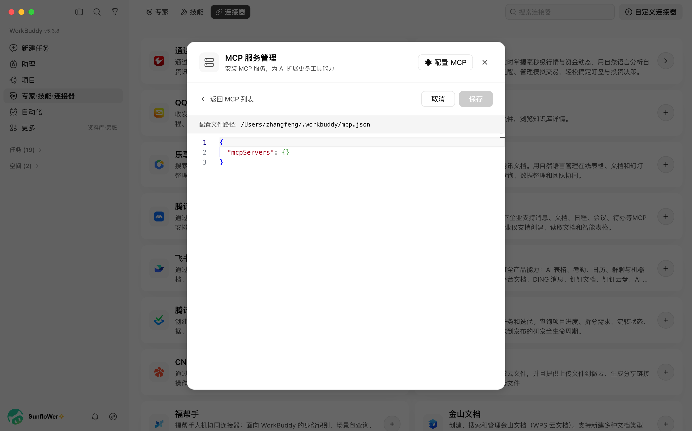
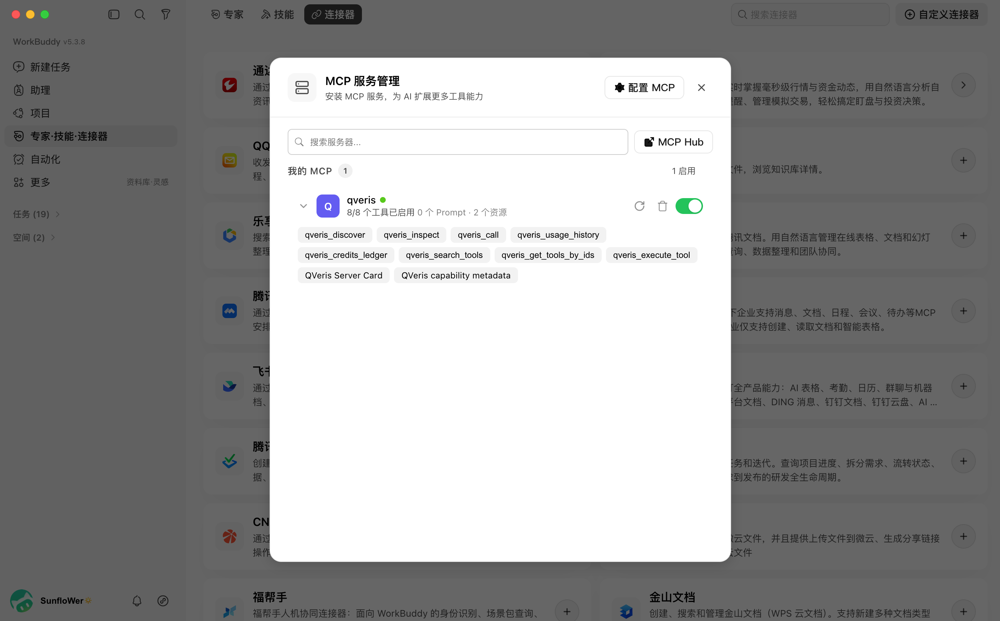
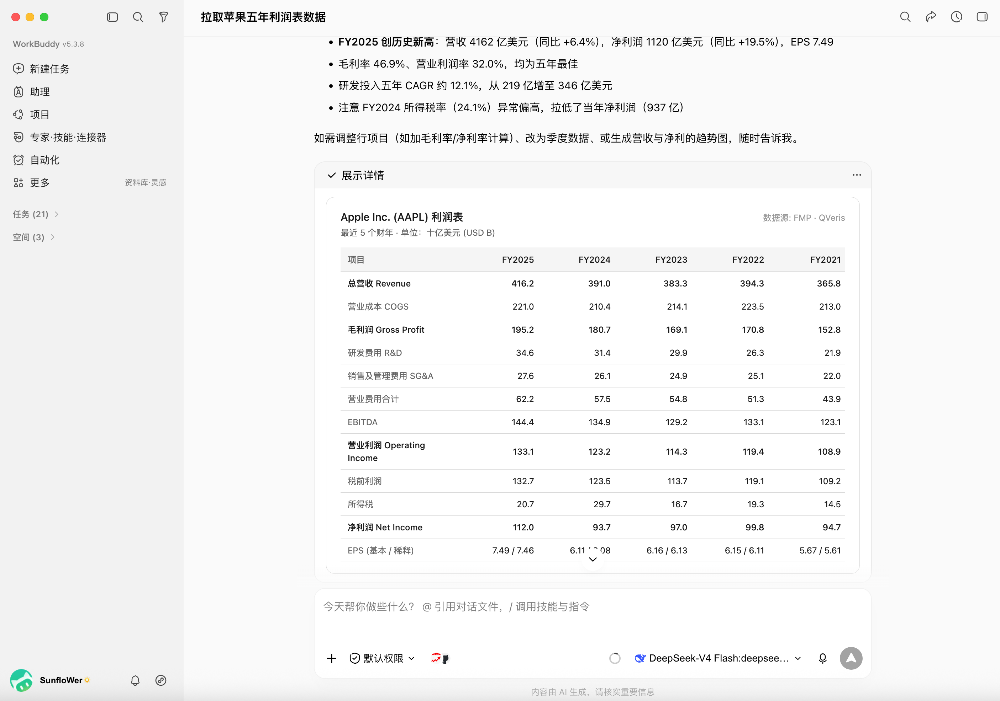
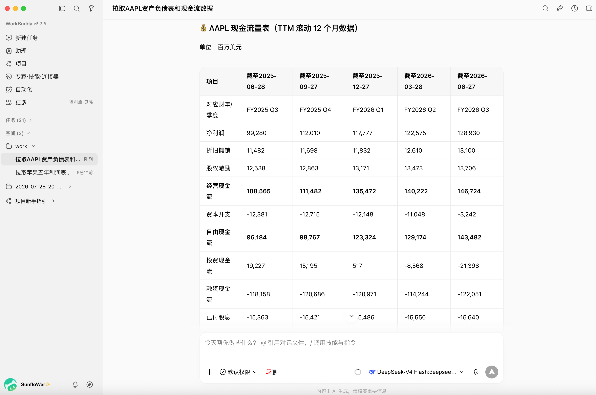

**MCP 接入实战指南**

### 别再让 WorkBuddy 只会整理文件：一键接入 QVeris，让 AI 直接查数据、做分析、交付报告

只需一个 URL 和 API Key，无需部署服务器，也不用写代码。接入 QVeris Hosted MCP 后，WorkBuddy 即可调用 10,000+ 外部能力，获取实时信息、分析市场与竞品、处理 PDF/OCR，并自动生成报告、Excel 和 PPT。

## 4 步把 QVeris Hosted MCP 接入 WorkBuddy

**先说结论**  Hosted MCP 走远程 Streamable HTTP。它不需要在本机安装 Node.js，也不需要通过 npx 启动后台进程。准备好 QVeris API Key 后，在 WorkBuddy 中填入 1 个 URL 和 1 个 Authorization Header，即可完成接入。

适用对象：个人研究、运营、产品、数据分析与企业知识工作者

# 一、为什么要把 QVeris 接到 WorkBuddy

WorkBuddy 擅长理解目标、拆解任务、操作本地文件并交付文档、表格或演示稿；QVeris 提供面向 Agent 的能力路由，让模型可以先发现合适的工具，再检查参数与成本，最后执行真实调用。两者组合后，工作流从“问答”变成“取数 - 核验 - 分析 - 交付”。

| **环节** | **仅使用 WorkBuddy** | **接入 QVeris Hosted MCP 后** |
|-|-|-|
| 信息来源 | 本地文件、模型知识、已安装能力 | 按任务发现外部实时数据与专业接口 |
| 执行方式 | 读写文件、生成内容 | Discover → Inspect/Probe → Call → 审计 |
| 交付结果 | 文档、表格、PPT、代码 | 外部数据 + 本地加工 + 可追溯交付物 |

**关键区别**  本地 stdio 方案通常依赖 Node.js 与 npx；Hosted MCP 是远程 HTTP 服务。本指南只讲 Hosted MCP，避免把两种配置混在一起。

# 二、接入前准备

1. 安装并登录 WorkBuddy，确认当前版本支持 HTTP/Streamable HTTP 类型的 MCP Server。
2. 注册登录 QVeris，在 Dashboard 的 API Keys 页面创建一枚专用密钥。建议按用途单独创建，便于后续轮换和停用。
3. 电脑已经安装 Node.js 18 或更高版本

QVeris 官方 MCP Server 通过 `npx` 启动，当前文档要求 Node.js 18+ 和有效的 `QVERIS_API_KEY`。

**密钥安全**  API Key 相当于访问凭证。不要把真实 Key 放进公开截图、群聊、文章或代码仓库；本文所有配置均使用占位符。

# 三、4 步完成接入

## 第 1 步：获取 QVeris API Key

登录 QVeris 后进入 Dashboard / API Keys，创建或复制一枚 Key。只在 WorkBuddy 的本地配置中使用；如果怀疑泄露，立即在 QVeris 后台撤销并重新生成。


## 第 2 步：打开 WorkBuddy 的 MCP 配置

不同版本的入口名称可能略有差异。新版桌面端通常可按以下路径进入：

 **常见入口是：侧边栏「专家·技能·连接器」→「连接器」→「自定义连接器」→「配置 MCP」。**“MCP 配置” → “配置 MCP / 编辑 mcp.json”。



- 用户级：配置一次，对所有任务或项目生效。
- 项目级：只在当前工作目录或项目中生效，适合测试和权限隔离。

## 第 3 步：粘贴 Hosted MCP 配置

将下面 JSON 粘贴到 MCP 配置中，把 YOUR_QVERIS_API_KEY 替换为你的真实 Key：

```JSON
{
  "mcpServers": {
    "qveris": {
      "type": "http",
      "url": "https://mcp.qveris.ai/mcp",
      "headers": {
        "Authorization": "Bearer YOUR_QVERIS_API_KEY"
      }
    }
  }
}
```

这里最容易写错的是 Authorization：Bearer 后面必须有一个空格，再跟 API Key。保存前同时检查英文双引号、逗号和花括号是否完整。


 图 1  QVeris 官方 Hosted MCP：远程 URL 与 Bearer Header 配置  [来源：QVeris MCP Server Documentation](https://qveris.ai/docs/mcp-server)


 图 2  WorkBuddy 官方 MCP 文档：HTTP 类型支持 type、url 与 headers  [来源：WorkBuddy MCP Usage Documentation](https://www.workbuddy.ai/docs/cli/mcp)

## 第 4 步：重连并验证

保存配置后，点击返回MCP列表，首次配置需要点击信任，等待授权完成新建一个任务会话或重启 WorkBuddy。若版本提供 MCP 状态页，确认 qveris 显示已连接；也可以输入 /mcp 查看服务器与诊断信息。成功时应能看到以下 8 个 QVeris 工具：



- discover：用自然语言发现候选能力；官方说明该动作免费。
- inspect：查看工具参数、示例、成功率与延迟等信息。
- probe：验证参数与报价，不真正执行，也不消耗调用 credits。
- call：执行选中的工具并返回结构化结果。
- usage_history：按 execution_id 核对调用状态与最终扣费结果。
- credits_ledger：查看 credits 的消费、赠送与余额变动。

# 四、第一次测试：先跑一个容易核验的小任务

第一次不要直接跑复杂调研。先用天气类任务验证“能发现、能检查、能调用、能生成文件”这四个环节。可直接复制下面的提示词：

> 请使用 QVeris 完成以下任务：  
> 1. 先 discover 适合查询北京未来 3 天天气的能力；  
> 2. 用 inspect 检查必填参数、延迟、成功率和计费；  
> 3. 用 probe 校验参数和报价，不要立即执行；  
> 4. 若预计费用不超过 10 credits，则 call 查询；超过则先询问我；  
> 5. 输出《北京三日出行建议.md》，保留查询时间、工具来源、天气结果和异常说明。

验证通过的标准：

- WorkBuddy 能识别并调用 qveris，而不是只凭模型知识回答；
- 执行记录中能看到 Discover/Inspect/Probe/Call 的链路；
- 结果包含实时数据、查询时间或 execution_id；
- 当前工作目录生成了要求的 Markdown 文件；
- 需要时可以通过 usage_history 或 credits_ledger 核对费用。

# 五、实际案例：把 AAPL 财务数据变成可交付分析

下面是一组公开的真实 QVeris 调用案例。任务要求调用 FMP 能力，拉取 AAPL 最近 5 个财年的利润表、资产负债表与 TTM 现金流，再整理成适合查看的表格。将 QVeris 接入 WorkBuddy 后，可以用同类提示词让 WorkBuddy继续生成 Excel、研究简报或汇报 PPT。

> 请使用 QVeris FMP 拉取 AAPL 最近 5 个财年的利润表、资产负债表与 TTM 现金流。  
> 核验年度、币种和单位；保留工具名与查询时间。  
> 最终生成：1 份 Excel 数据表、1 份 800 字中文分析简报、1 页汇报提纲。



 图 3  真实调用结果：AAPL 五年利润表已被整理为可读表格  [公开实测来源：QVeris Friends](https://blog.csdn.net/QVeris_Friends/article/details/161999346)

 



图 4  真实调用结果：AAPL 五年资产负债数据返回成功  [公开实测来源：QVeris Friends](https://blog.csdn.net/QVeris_Friends/article/details/161999346)

**案例说明**  图 3、图 4 来自公开发布的 QVeris 真实调用记录，密钥已脱敏。数据会随调用日期、上游 Provider 与订阅权限变化；复现时应以当次返回值为准。

# 六、接入后能做什么

| **场景** | **QVeris 负责** | **WorkBuddy 负责** | **典型交付物** |
|-|-|-|-|
| 竞品与行业研究 | 查询近期新闻、产品更新、定价与公开资料 | 去重、核验、比较与写作 | 竞品表、趋势报告、汇报提纲 |
| 金融与投研 | 行情、三大表、指标、公告与专业数据接口 | 分析口径、图表与结论 | Excel、投研简报、PPT |
| 内容运营 | 检索热点、来源与背景资料 | 选题、标题、脚本和发布素材 | 选题库、内容排期、稿件 |
| 文档处理 | OCR、PDF 解析、结构化抽取与知识检索 | 结合本地文件完成整理 | 摘要、问题清单、数据表 |
| 位置与生活服务 | 天气、地图、路线与地点信息 | 形成场景化建议 | 出行方案、活动手册、提醒 |
| 自动化交付 | 寻找并调用任务所需外部能力 | 在本地组合多种文件 | 报告 + 表格 + 演示稿 |
| 费用与审计 | 返回 execution_id、Usage 与 Ledger | 将调用记录写入交付物 | 可追踪的执行日志 |

# 七、让结果更可靠的提示词公式

**推荐公式**  目标 + 数据范围 + 核验要求 + 预算边界 + 最终交付物

例如，与其只说“帮我查三家公司”，不如写成：

> 调用 QVeris 查询 A、B、C 三家公司最近 30 天的产品更新、定价变化与融资信息。  
> 每项结论至少保留 1 个来源和查询时间；无法确认的内容标记为“待核验”。  
> 调用前先 inspect；预计费用超过 30 credits 时先询问。  
> 最终生成 Excel 对比表和 1000 字分析报告。

这类指令能让 WorkBuddy 明确何时取数、如何核验、什么时候停下来询问，以及最终要交付什么，而不是只返回一段无法复用的聊天文本。

# 八、常见问题与排错

| **现象** | **可能原因** | **处理方法** |
|-|-|-|
| MCP 列表里没有 qveris | JSON 未保存、配置层级错误、当前版本未加载 HTTP MCP | 检查 mcpServers 层级；新建会话或重启；在 /mcp 查看诊断。 |
| 状态为红色/连接失败 | URL、type、Header 或 JSON 语法错误 | 确认 type=http、URL 完整、Bearer 后有空格，并使用英文标点。 |
| 返回 401 | Key 缺失、无效或已撤销 | 重新生成 Key，更新配置后必须新建 MCP 会话。 |
| 返回 503 | QVeris 密钥验证服务暂时不可用 | 稍后重连，不要反复修改正确配置。 |
| 能看到工具但 call 失败 | 参数不匹配、Provider 权限或余额问题 | 先 inspect/probe；检查 Usage、Ledger 与上游覆盖范围。 |
| 回答像模型自己编的 | 任务没有明确要求使用 QVeris | 在提示词中写明“必须使用 qveris，并保留工具名/查询时间”。 |

# 九、安全与使用边界

- 为不同用途创建不同 API Key；不用时及时撤销。
- 不要把真实 Key 放入截图、公开文档、Git 仓库或团队群聊。
- 第一次使用新能力时先 Inspect 或 Probe；涉及付费、高风险或外部写入时保留人工确认。
- 不要把预结算费用当作最终扣费，执行后以 usage_history 和 credits_ledger 为准。
- 外部数据可能受时间、地区、订阅权限和 Provider 状态影响；关键结论必须保留来源与查询时间。
- 企业环境应按最小权限原则设置 MCP 工具权限，并对敏感数据、写操作和自动化任务增加审批。

# 十、上线前 30 秒检查清单

- MCP 类型是 http，而不是 stdio 或 sse。
- 服务地址完整填写为 https://mcp.qveris.ai/mcp。
- Authorization 的值以 Bearer + 空格开头，截图中没有真实 Key。
- 保存配置后已新建任务会话或重启 WorkBuddy。
- qveris 已连接，并能看到 discover、inspect、probe、call 等工具。
- 首个任务设置了费用边界，并要求保留来源、查询时间与 execution_id。

**一句话总结**  WorkBuddy 负责理解任务与交付文件，QVeris 负责发现、检查和调用外部能力；Hosted MCP 用一条远程 HTTP 连接把两者接起来。

# 参考资料

- [QVeris MCP Server Documentation](https://qveris.ai/docs/mcp-server)：Hosted MCP URL、HTTP 配置、6 个 canonical tools 与 401/503 说明。
- [WorkBuddy MCP Usage Documentation](https://www.workbuddy.ai/docs/cli/mcp)：HTTP MCP 的 type、url、headers、配置范围与 /mcp 诊断。
- [WorkBuddy 官网](https://www.workbuddy.ai/)：产品定位与公开功能说明。
- [WorkBuddy 接上 QVeris，3 分钟从电脑助手变成全能 Agent](https://blog.csdn.net/QVeris_Friends/article/details/163299367)：WorkBuddy 桌面端公开配置入口与首次测试思路。
- [我让 QVeris 读了一遍 Apple 基本面](https://blog.csdn.net/QVeris_Friends/article/details/161999346)：图 3、图 4 的公开真实调用案例；页面标注 CC BY-SA 4.0。

文档说明：本文按 2026-08-06 可查的公开资料编写。WorkBuddy 界面和 QVeris 能力目录会持续更新，请以当前客户端和官方文档为准。
