Data-tested, 5-minute read

   At 9:40 on Tuesday morning, BYD was up 3%. You were staring at the intraday chart with a buy order ready in your hand. **Do you chase?**

   If you chase, you worry about buying the top. If you do not, you worry about missing the move.

   Every retail investor knows this feeling. But did you know that **one data point was already screaming at that moment**? The CCI indicator had shot up to 305.

     What is CCI? An indicator that can “scream”

    CCI stands for Commodity Channel Index. Think of it as a “thermometer” for stock price behavior.

    Normal temperature (between ±100): the stock is moving within its normal range. Nothing unusual, so there is no need to get too nervous.

    Fever (above +100): the stock is heating up and entering a strong zone. It shows strong buying pressure, but it may also mean the move is getting overheated.

    High fever (above +200 or even +300): the stock is extremely excited and has risen too fast in the short term. This could be the start of a major upward leg, or it could be a temporary top. Extra caution is needed.

  

**What makes CCI distinctive**:

  

    It is more sensitive than MACD and KDJ, so it can send signals earlier. But precisely because it is sensitive, it can also “flatten out” in extremely strong markets. It may already be at +300 and still keep rising to +500.

  

**Back to the example above**:

  

    Ten minutes after the open, CCI had already surged to 305. That is like a human body temperature hitting 42°C. It is no longer “a little hot”; the machine is sounding an alarm. Whether to chase at that point requires calm judgment, not an emotional jump into the trade.

01 What retail investors can see: the blind spot of daily CCI

   Open almost any free market data app, and the default CCI indicator is shown at the daily level.

   Daily CCI is useful. Above +100 is considered overbought, while below -100 is considered oversold. That logic is fine.

   The problem is that daily CCI lags.

   By the time you see daily CCI break above +100, the stock may already be up 5%. Entering at that point can mean becoming exit liquidity.

   Put simply, daily CCI is a “confirmation tool,” not an “early warning tool.”

02 What you only see with paid data: the practical value of minute-level CCI

   We tested this minute-level CCI interface using BYD data from April 22.

First 5 minutes after the open  
CCI = -149  
A typical oversold zone

   What does that mean? After opening selling pressure was released, the stock had already been pushed to a relatively low level. If you only looked at candlestick patterns, you might think it was “still falling,” but CCI was already saying “this has fallen too far.”

The following 15 minutes  
CCI = +305  
Extreme overbought, peak sentiment

   What does +305 mean? The normal fluctuation range for CCI is -100 to +100. Breaking above +100 is already overbought, +200 is seriously overbought, and **+305 is essentially the peak of extreme sentiment**.

| Time | CCI | Price | Signal |
| --- | --- | --- | --- |
| 09:35 | -149 | 101.76 | Oversold |
| 09:40 | +279 | 102.10 | Breakout |
| 09:45 | +305 | 102.19 | Extreme overbought |
| 10:00 | -94 | 101.52 | Pullback |

   Key finding: after CCI fell back from +305, the price only then began to move sideways. Minute-level CCI reflected the sentiment inflection point before price did.

03 What you still need to calculate yourself: CCI is not a master key

   After testing a full morning of data, the honest answer is this: **CCI has traps too**.

   CCI is not friendly to range-bound markets. If a stock moves within a narrow band, CCI can repeatedly cross +100 and -100, **creating a large number of false signals**. I have seen a sideways stock whose CCI crossed back and forth six times in one day. The signals were basically unusable.

   Another issue is parameter settings. The default CCI period is 14, which is a bit too sensitive for minute-level use. Adjusting it to 20 makes it more stable, but it also increases lag.

   Interestingly, I compared CATL’s minute-level CCI on the same day:

   • BYD CCI: -149 → **+305** → -94 (spike and pullback)  
   • CATL CCI: -4 → -88 → **-150** (under pressure all day)

   On the same day, two leading new energy stocks moved very differently. CCI is an “individual stock sentiment indicator,” not a “sector trend indicator.”

04 Boundaries: where it works best

✓ Suitable scenarios

   • **Short-term trading**: use minute-level CCI to judge intraday entry and exit points

   • **Extreme moves**: when CCI rises above +200 or falls below -200, watch for sentiment reversal

   • **Trend confirmation**: combine CCI breaks above +100 or below -100 with volume before making decisions

✗ Unsuitable scenarios

   • Range-bound markets: it can generate many false signals

   • Long-term holding: it has limited value for decisions with a holding period longer than one week

   • Full-market scanning: each stock needs to be queried individually, so it is not suitable for bulk stock screening

05 How do you use it? Three sample conversations

   If you also want to check this kind of data, the experience looks roughly like this:

   👤 "Help me look at BYD’s minute-level CCI trend today"

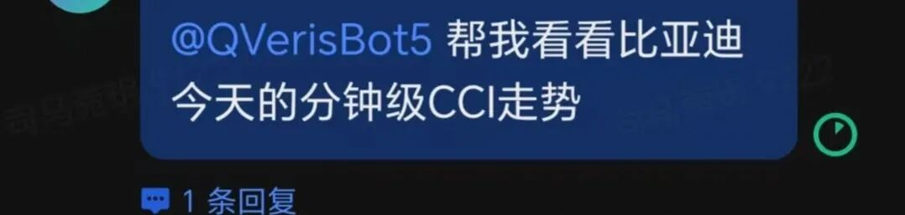

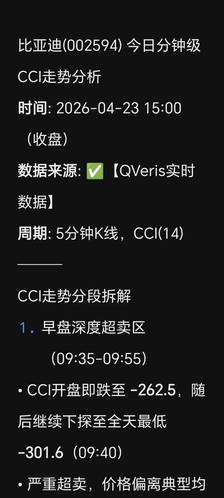

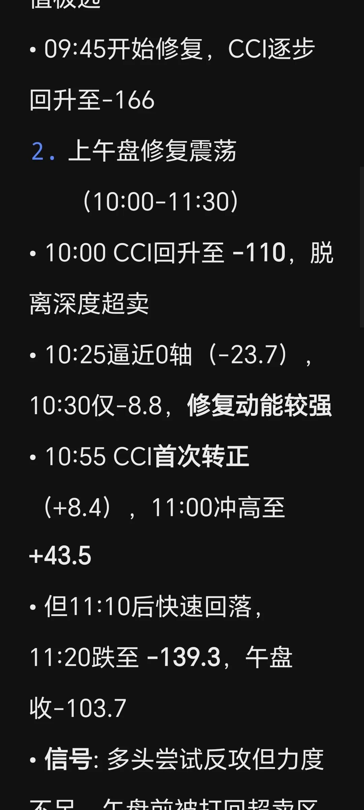

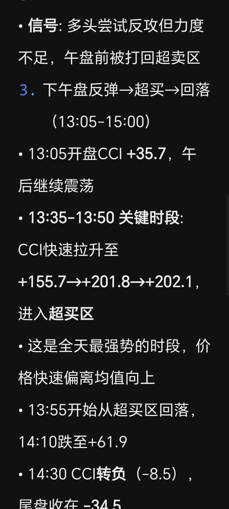

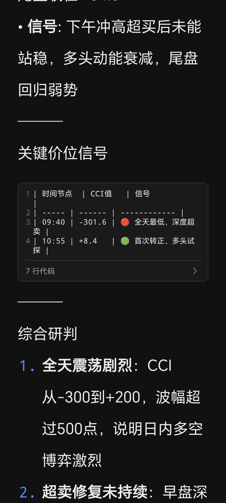

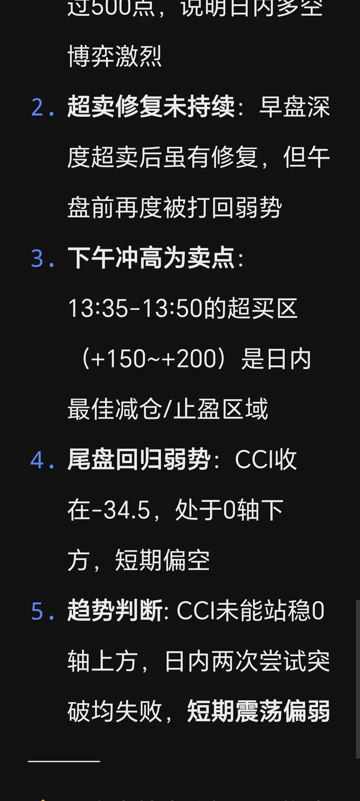

  🤖 BYD (002594.SZ) showed sharp CCI volatility on the morning of April 22: five minutes after the open, CCI was -**149**, in the oversold zone. It then rebounded quickly, reaching **+279** at 9:40 and surging to an extreme overbought level of **+305** at 9:45. CCI reflected the sentiment inflection point about 15 minutes before price did.

   👤 "What about CATL on the same day?"

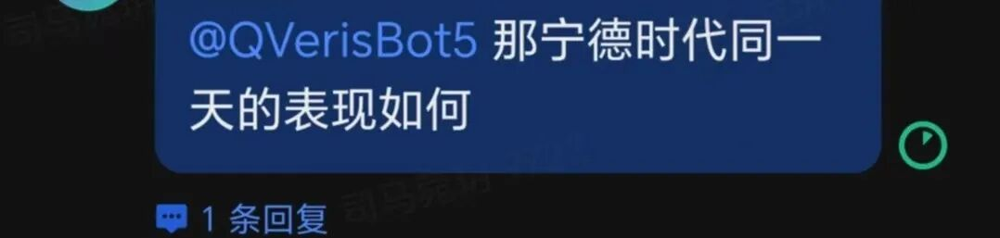

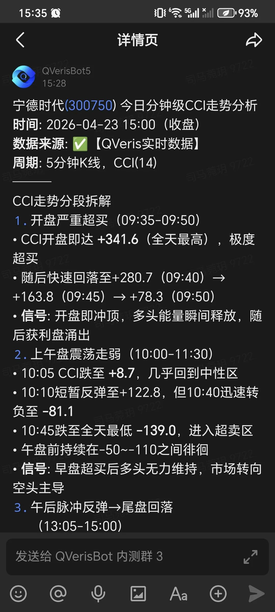

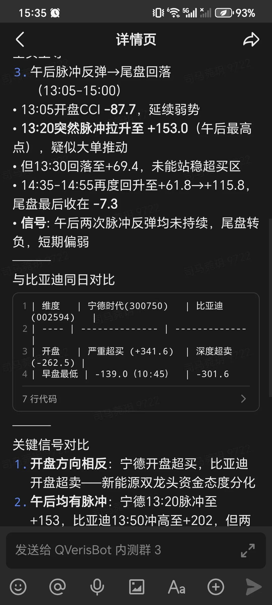

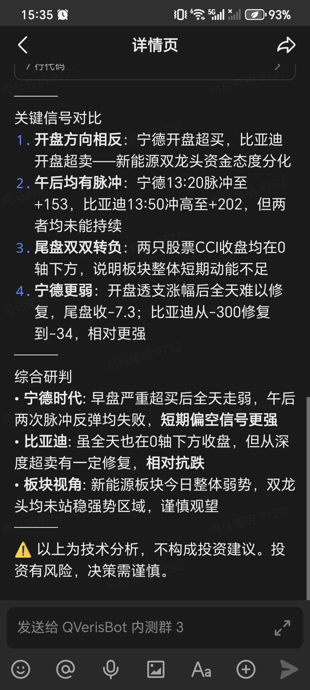

🤖 CATL (300750.SZ) had a generally weaker CCI profile on the same day. In the morning session, it fluctuated between -4 and -150 and stayed in negative territory throughout the day. This shows that even within the same new energy sector, capital sentiment was clearly diverging.

   👤 "If CCI breaks above +100, can I definitely chase?"

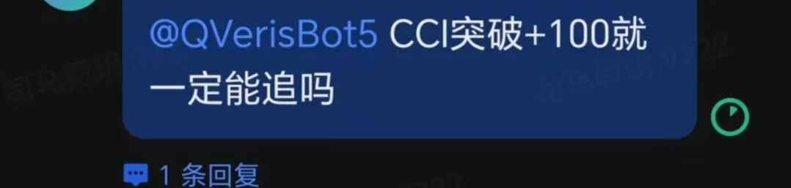

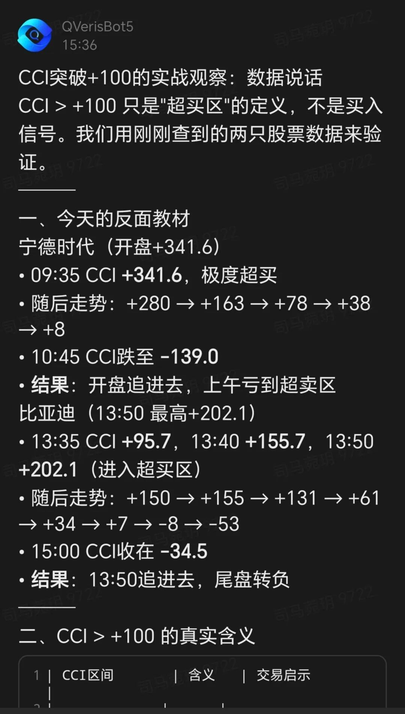

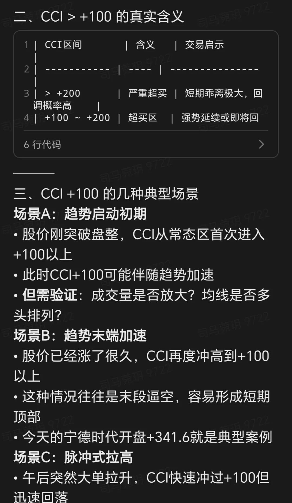

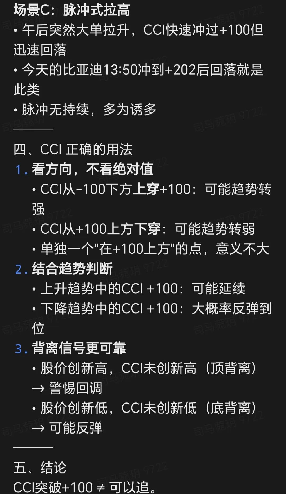

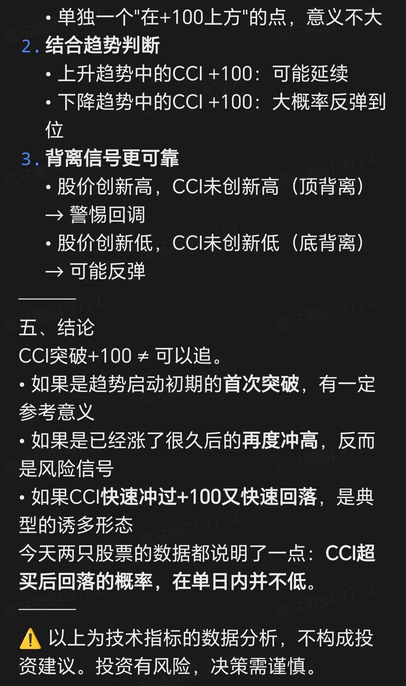

 🤖 Not necessarily. A break above +100 only means CCI has entered the overbought zone; it does not mean the stock will immediately fall. The key is to watch two things: first, whether CCI enters an extreme zone above +200; second, whether volume contracts when CCI starts to fall back.

 Join the Feishu group to try it now

     The value of minute-level CCI is that it fills the gap left by daily indicators. **It is not a replacement. It is a supplement**.
