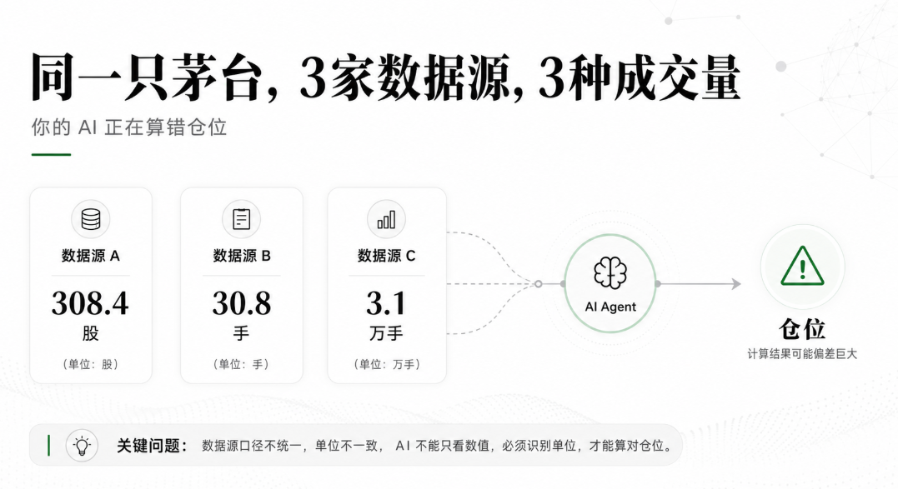
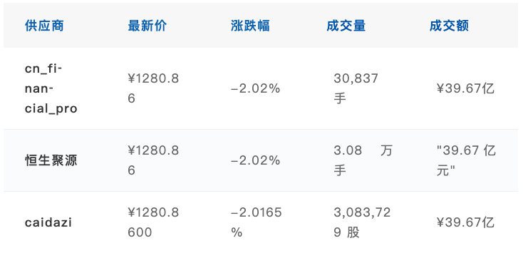
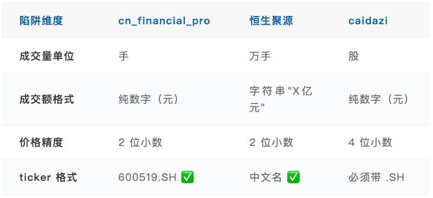

QVeris · Data Test

> If an AI Agent tells you, "Moutai traded only 30,837 shares today, almost nobody is trading it," would you believe it?

In June 2026, open your AI assistant right now and try checking it. It is not lying. The data source really does return 30,837. But it does not know that the unit is "lots," not "shares." That is a full 100x difference.

And in A-share data, there are at least three traps like this.

##  

##  

At 11:49 on June 3, 2026, we queried three A-share market data sources at the same time.

If you open the APIs of three mainstream A-share data sources and query Kweichow Moutai (600519) at the same time, these are the three answers you will get:

The price is exactly the same. The percentage change is exactly the same.

**But the trading volume differs by three orders of magnitude: 30,837 vs 3.08 vs 3,083,729.**

This is not a data-source bug. 30,837 lots × 100 = 3,083,700 shares ≈ 3.08 ten-thousand lots. All three providers are describing the same thing, but nobody tells your AI Agent that "lots," "ten-thousand lots," and "shares" are not the same unit.
## Position Misjudgment: Agents Will Not Discover This on Their Own

##  

Now imagine this scenario: your AI financial assistant receives a task: "Calculate Moutai's turnover rate today."

It calls the cn_financial_pro API. The API returns `volume: 30837`. HTTP 200. The JSON format is valid. The number is valid. Turnover rate = trading volume ÷ free float = 30,837 ÷ 1.25 billion ≈ 0.0025%. It tells you: "Moutai's turnover rate today is extremely low; almost nobody traded it."

**But the actual turnover rate is 0.25%. The Agent undercounted by 100x.**

Where is the error? The Agent does not recognize "lots."

In A-shares, the unified rule is that 1 lot = 100 shares. Any retail investor knows this at a glance. But U.S. stocks do not have "lots." In Hong Kong stocks, the definition of one lot varies by stock. An AI trained on global data does not naturally have the concept of an A-share "lot."

Even more importantly, the API response has no field indicating that the unit of `volume` is lots. It only has a bare number: 30837. Once the Agent receives that number, it has only one default way to handle it: treat it as shares.
## Worse Than "Lots": Turnover Is a Chinese String

The turnover trap is even more subtle than trading volume. cn_financial_pro returns a pure number, `3966577000`, which can be directly divided by a listed company's total share capital to calculate derived metrics such as market value. But Gildata returns `"39.67亿元"`, a Chinese string.

**What does an Agent do when it reads `"39.67亿元"`?**

There are three possible mistakes, and none of them is correct:

1. **Parsing fails and throws an error** → your entire analysis workflow gets blocked

2. **Treat it as text and output it unchanged** → "Moutai turnover: 39.67亿元" — you cannot use that text for comparative analysis

3. **The most damaging case: treat it as the number 39.67** → the Agent silently treats ¥39.67 as the turnover, when the actual value is ¥3,967,000,000. That is a 100-million-fold difference. The Agent does not error, does not warn you, and does not even hesitate.

None of these outcomes happens because the data is wrong. The data itself is completely correct. `"39.67亿元"` is a correct turnover value. The problem is that between the API protocol and the AI Agent, there is a missing layer of "format translation."

**  
**
## The Silent Suffix Trap: HTTP 200 + Empty Table = Agent Thinks "No Data"

In testing, we found an even more hidden issue. Call caidazi with `600519` without a suffix, and it returns HTTP 200 with a fully structured table, but the data rows are empty. Call it again with `600519.SH`, and all the data appears intact.

What the Agent sees: HTTP 200 → "call succeeded" → no data rows → "Moutai has no market data today" → skip this stock and continue calculating.

**It will never tell you that the ticker is missing the `.SH` suffix.** It will only report "not found." You will never know that the data for this stock is actually complete and available. You only used the wrong dialect.

That is a silent failure. It does not interrupt your workflow. It simply makes your analysis incomplete without a sound. This is far more dangerous than an explicit error.
## The Good News Inside the Bad News: All Three Providers Agree on Price

Look at it from the other side: A-share data is fundamentally different from U.S. stock data. When we tested U.S. stocks, the same AAPL quote showed price discrepancies across Finnhub, Twelve Data, and EODHD because after-hours prices and closing prices used different baselines.

**For A-shares, all three providers were 100% consistent on the two most important dimensions: price and percentage change.** We tested three stocks at the same time: Moutai, Ping An Bank, and CATL. Every provider's quote for every stock matched exactly.

The reason is simple: A-shares have unified raw exchange market data. Providers are essentially redistributing the same underlying data, so there is no disagreement on the most fundamental metric: latest price.

The real problem is not the accuracy of the data itself. **It is the "packaging" of the data: units, formats, and field names are designed independently by each provider and do not interoperate.**

This table is a miniature version of a "provider shape profile."

Every time you integrate an A-share data source, you need to maintain a mapping like this inside the Agent. If you do not, the Agent will process all three providers with a default parser, and it will run into every trap in this table.
## QVeris Unit Normalization: The Agent Never Sees "Lots" or "Hundreds of Millions of Yuan"

The previous article covered the ticker dialect translation layer in the QVeris foundation. This article covers the other half of the same layer: the **unit normalization engine**.

On every call, three things are automatically completed before the data reaches the Agent:

**Normalize units.** No matter what unit the provider returns — lots, ten-thousand lots, or shares — the foundation converts everything into "shares." cn's 30,837 lots → 3,083,700 shares. Gildata's 3.08 ten-thousand lots → 3,080,000 shares. caidazi's 3,083,729 shares → unchanged. The Agent always receives the same unit.

**Parse strings.** Gildata returns `"39.67亿元"` → automatically parsed into `3967000000`. All turnover values presented to the Agent are pure numbers in "yuan."

**Detect empty responses.** caidazi returns an empty table → the foundation automatically marks `empty_result` and attaches a reason hint, such as "ticker is missing the .SH suffix." The Agent receives a clear failure signal, not a mistaken "no data" conclusion.

The maintenance cost for these three things belongs in the foundation, not in the Agent. For every new A-share provider integrated, QVeris only needs to maintain one more shape profile. The Agent does not need to change anything.

**The Agent does not need to know what a "lot" is, just as you do not need to know how undersea cables are routed.**

**  
**

## Applicability Boundaries

Test coverage:

✅ 3 A-share real-time quote providers × 3 stocks (Moutai, Ping An Bank, CATL)

✅ Trading volume unit differences (lots / ten-thousand lots / shares)

✅ Turnover format differences (pure numbers vs strings with Chinese units)

✅ Empty responses caused by caidazi ticker suffix requirements

✅ Verification of A-share price consistency across providers

If you want to use A-share data inside an Agent, you do not need to write a separate unit converter for every provider. QVeris has already normalized it. What you receive is always trading volume in "shares" and turnover in "yuan."
