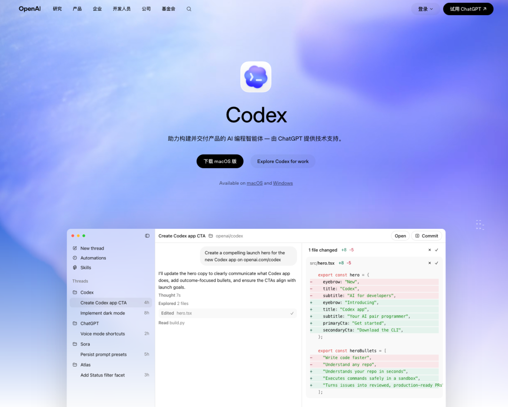
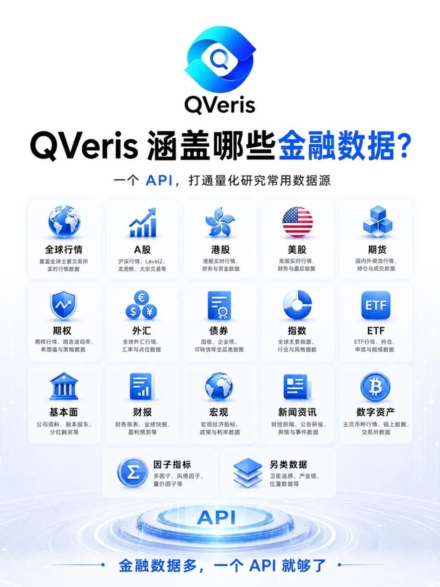
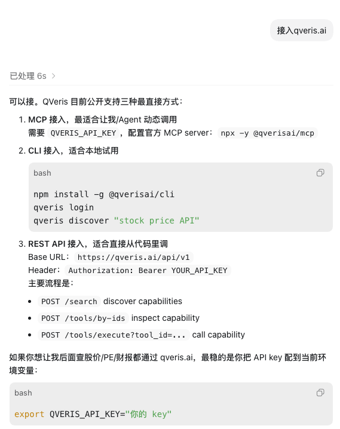
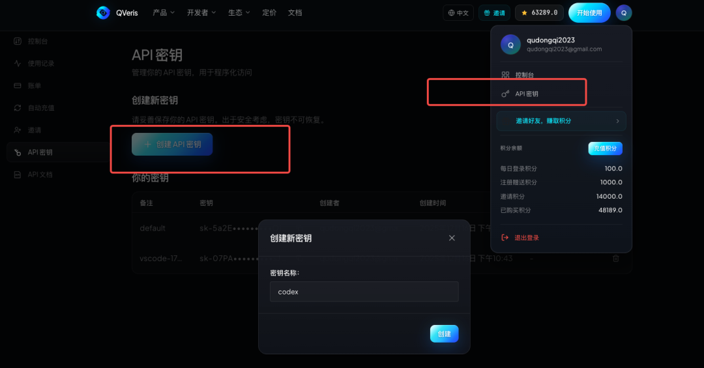
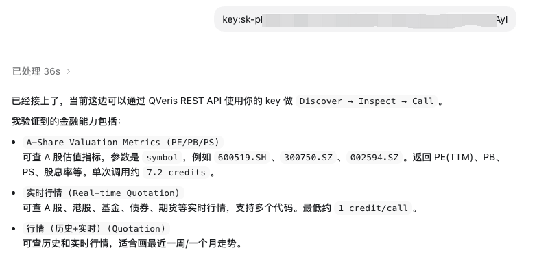
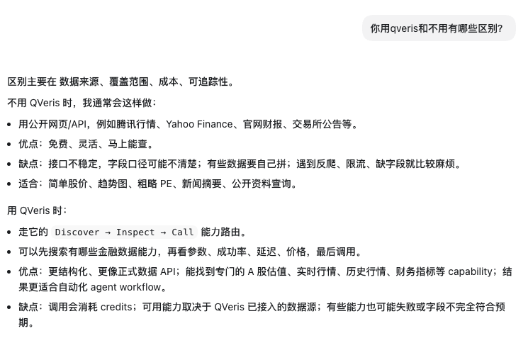
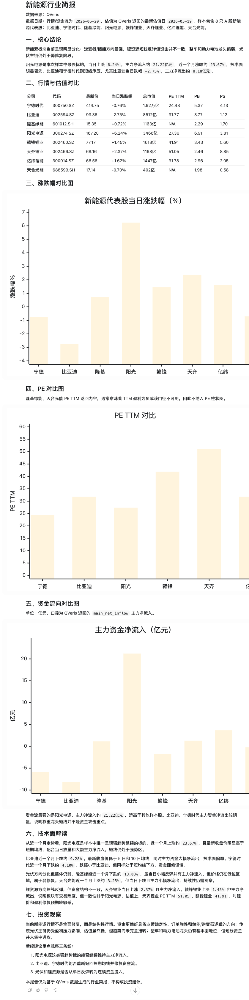

QVeris · Technical Deep Dive

It is 2 a.m. You have just finished the eighth version of your report.

Three hours earlier, your manager said one sentence: tomorrow's presentation needs capital flow data for these 50 stocks.

You open Wind, look them up one by one, copy rows into Excel until your eyes blur, and write formulas until everything starts to break down.

Meanwhile, the intern on the next team has already sent the charts and analysis conclusions to the group chat in the time it took to drink a cup of coffee.

What made the difference? They used a combination you have not discovered yet: **Codex + QVeris**.

Today, we will show how one sentence can let AI complete in 30 seconds what used to take you 3 hours.

Demo video: using codex + qveris from the terminal

01 What exactly is this combination?

Codex: your AI assistant

Codex, released by OpenAI, is not a chatbot. It is an AI assistant that can work independently.

Download: https://openai.com/zh-Hans-CN/codex/

You can speak to it in plain language:

- Check Kweichow Moutai's stock price over the past week and draw a trend line

- Compare the P/E ratios of CATL and BYD

- Find the top 10 stocks by northbound capital net inflow this week

But there is one problem: Codex itself does not understand financial data. It needs a **data interface**.

In most cases, it relies on web search data, so for finance, rigor and accuracy still need to be controlled by you.

QVeris: a professional financial data interface

**QVeris (qveris.ai) is the financial data platform we built**, aggregating major global data providers:

- Real-time quotes for A-shares, Hong Kong stocks, and U.S. stocks

- Financial metrics, capital flows, and valuation data

- Cryptocurrency, foreign exchange, and futures

Once QVeris is connected to Codex, Codex can directly call these data capabilities.

**How do you use it? Three steps:**

1. Configure QVeris access in Codex

Tell your Codex directly: "connect qveris.ai"

2. Register on qveris.ai and get an API Key

3. Give the API Key to Codex, and it can start calling QVeris

It is that simple. No coding required. No need to understand API documentation.

02 What does it feel like after connecting?

**First, let's see what Codex says officially**:

Now let's look at three real scenarios:

Scenario 1: Urgent stock screening (30 seconds)

**You say to Codex**:

Use QVeris to screen consumer stocks with a market cap of 10-50 billion, up more than 10% over the past month, and sort them by P/E ratio.

30 seconds later, Codex retrieves the data through the QVeris interface and returns:

- A list of 15 stocks that meet the criteria

- Market cap, gain, PE, and PB for each stock

- A comparative bar chart

- A one-sentence analysis: 3 of them have PE ratios more than 20% below the industry average

By the time you finish your coffee, the data is already ready.

Scenario 2: Intelligent monitoring (automatic market watch)

You say: Use QVeris to monitor Kweichow Moutai and notify me when northbound capital net inflow exceeds 100 million in a single day.

Codex checks the data every 15 minutes through the QVeris interface. When the condition is triggered, your phone immediately receives:

- Current net inflow: 130 million

- Data source: QVeris real-time interface

- Brief analysis: the unusual movement is related to last night's better-than-expected quarterly report

You sleep while AI watches the data for you.

Scenario 3: Batch report writing (5 minutes)

A client needs a briefing on the new energy sector.

Codex automatically:

1. Calls QVeris to retrieve data for 8 stocks, including BYD and CATL

2. Generates comparison charts for price changes, PE, and capital flows

3. Provides a technical interpretation based on QVeris data

4. Outputs a complete report format

A first draft is ready in 5 minutes. You only need to refine the conclusions.

03 Why is this an opportunity for everyone?

The traditional barriers to financial analysis:

- Learn Python/R → 3 months

- Find data sources and handle API authentication → painful

- Create one professional chart → 2 hours of back-and-forth

Now:

- **QVeris provides a unified data interface** → no need to find data sources yourself

- **Codex calls it through natural language** → no need to write code

- **Together, one sentence produces results** → 100x efficiency improvement

The threshold for using these tools has dropped from "professional programmer" to "anyone who can describe what they need."

04 Practical boundaries: what it can and cannot do

Based on testing, this combination is strong in the following scenarios:

**What it can do**:

- Data querying and screening, such as finding stocks that meet specific conditions

- Simple statistical analysis, such as comparison, ranking, and trend analysis

- Automatic chart generation

- Scheduled monitoring and alerts

- Rapid report framework generation

**What it cannot do**:

- Complex multi-factor quant models, which still require manual verification

- Millisecond-level high-frequency trading, due to latency constraints

- Replace professional investment advice, since the data is for reference only

05 How do you get started?

Four steps:

1. **Open Codex** (OpenAI's AI assistant)

2. **Register an account on qveris.ai and get an API Key**

3. **Configure the QVeris interface in Codex and enter the API Key**

4. **Describe your request in natural language, and Codex will automatically call QVeris to retrieve the data**

The whole process is like installing an app on your phone: configure it once, then use it continuously.

07 Final Thoughts

The power of financial data analysis is shifting from "professional programmers" to "ordinary people with ideas."

**QVeris provides the data interface, and Codex provides the natural-language interaction**. Together, they let anyone call professional-grade financial data in plain language.

In the past, data was the threshold and technology was the barrier. Now, once QVeris is connected, natural language becomes the master key.

The tools are ready. The question is whether you will use them.

Disclaimer: This article is for technical discussion only and does not constitute investment advice. The stock market involves risk; invest with caution.
