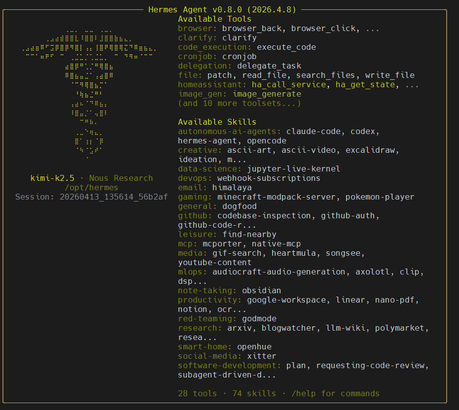
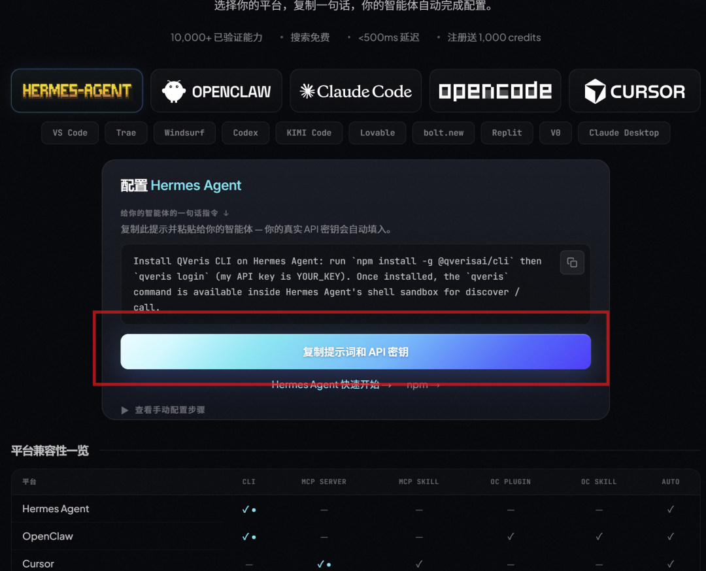
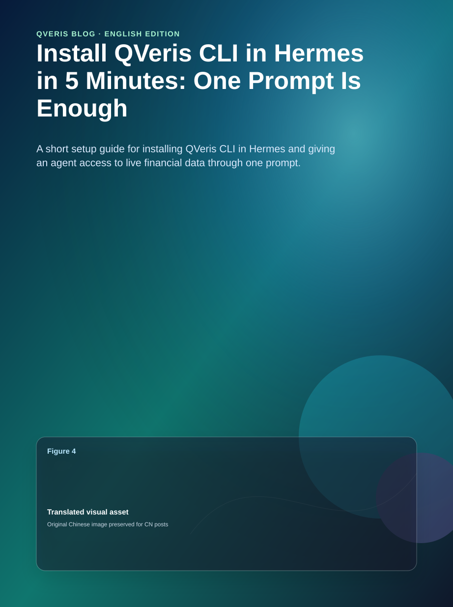
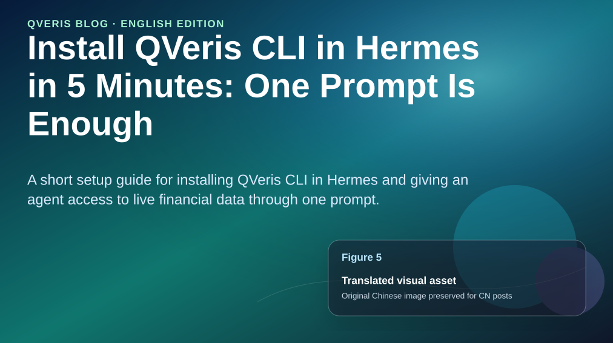
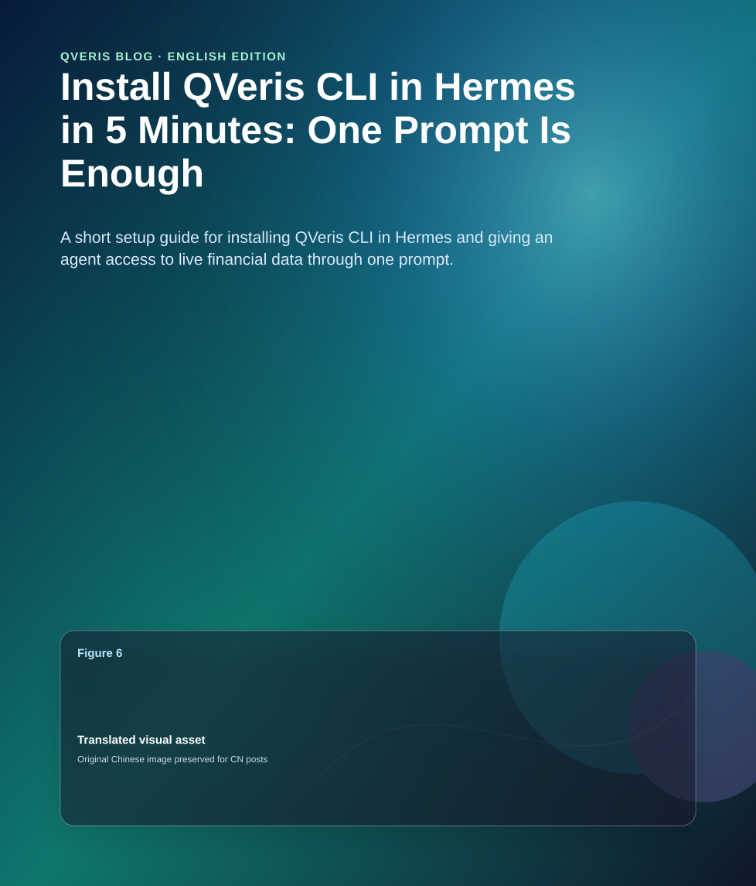
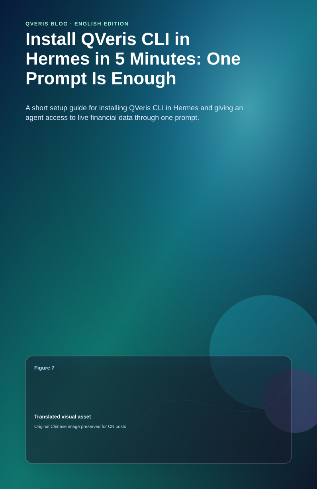
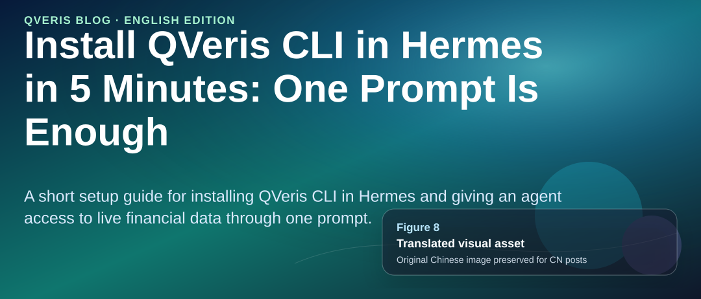
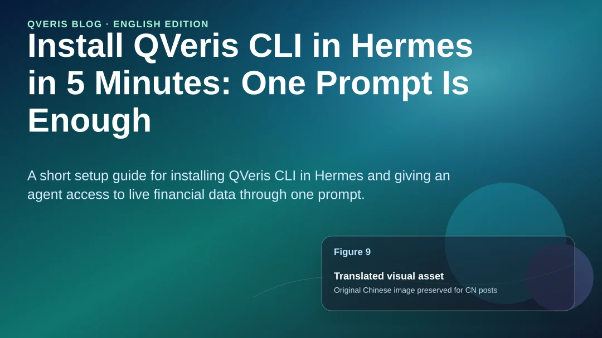

In the past, adding a new CLI to Hermes Agent usually meant SSHing into the host machine, running npm install, configuring credentials by hand, and finally restarting the agent.

QVeris offers a different path:

Paste one English prompt into Hermes, and Hermes will install QVeris CLI inside its own shell sandbox, log in, and make it immediately available through discover / call.

You do not need to run a single command on the host machine.

This article is a 5-minute getting-started guide for that workflow.

1. Hermes Agent Overview

Hermes Agent is an open-source autonomous AI agent released by Nous Research in February 2026. Unlike IDE code completion tools or “chatbots wrapped in a browser,” Hermes runs persistently on your own server or local machine. It has persistent memory and a tool sandbox, and the longer it runs, the more context it accumulates and the stronger it becomes.

**Key features**:

- Supports Linux / macOS / WSL2, installs with a single curl command, and requires no prerequisites

- Built-in shell sandbox that can load external tools / skills / CLIs

- Persistent memory: key facts, preferences, and past decisions can be reused across sessions

- Open extension protocol: any standards-compliant CLI can be attached as an “external capability”

The goal of this article is to attach QVeris’s official CLI (`@qverisai/cli`) as a first-class tool inside Hermes’s shell sandbox, so Hermes can directly discover and call the research, data, and analysis capabilities exposed by QVeris.

2. Prerequisites

- A machine with Hermes Agent already installed (Linux / macOS / WSL2)

- Node.js / npm available inside the Hermes sandbox (the default image usually includes them; if not, ask Hermes to install them first)

- A valid QVeris API key (register at https://qveris.ai and generate one in the user center)

**If Hermes Agent is not installed yet, run this on the host machine first**:

| Bash curl -fsSL https://raw.githubusercontent.com/NousResearch/hermes-agent/main/scripts/install.sh \| bash hermes setup |
| --- |

3. Let Hermes Install QVeris CLI Itself

The QVeris website does not ask you to run npm install in the host shell when connecting to Hermes. Instead, you give Hermes a natural-language instruction, and Hermes completes the installation and login inside its own shell sandbox.

3.1 Official prompt (copy and paste directly into the Hermes conversation)

From the Hermes Agent entry on https://qveris.ai/plugins, copy this exactly:

Install QVeris CLI on Hermes Agent: run npm install -g @qverisai/cli then qveris login (my API key is YOUR_KEY). Once installed, the qveris command is available inside Hermes Agent's shell sandbox for discover / call.

Before pasting, replace YOUR_KEY with your own QVeris API key generated from the https://qveris.ai user center. Do not change anything else.

3.2 What Hermes Will Do

**After receiving this instruction, Hermes will run the following steps inside its shell sandbox**:

1.  npm install -g @qverisai/cli —— install QVeris CLI globally

2.  qveris login —— log in with the API key you provided, writing credentials to `~/.config/qveris/` inside the sandbox

3.  Verify that the `qveris` command is available and register it as a first-class tool that can be called through discover / call in later conversations

The whole process happens inside the sandbox. It does not pollute the host machine’s PATH, and you do not need to restart Hermes.

3.3 Verification

**After the instruction finishes, ask this in the same Hermes conversation**:

Can you call qveris now? List the capabilities shown by qveris discover.

Hermes should return a capability list covering modules such as data, research, and analysis. If Hermes says it cannot find `qveris`, jump to the FAQ in section 5.

⚠️ API key security: this prompt requires pasting a real key. Hermes’s local sandbox is safe, but do not send the completed prompt with the key to a group chat, share it in screenshots, or copy it into public documents. If you paste it by mistake, immediately revoke the key in the QVeris user center.

4. Usage Examples

All examples below are asked directly in the Hermes conversation. Hermes will decide on its own when to call `qveris discover` / `qveris call`.

Example 1: Analyze A-share sector moves

Best for: quick after-market intraday review

**Say to Hermes**:

Help me check which three A-share sectors gained the most today. For each one, explain the core logic driving the move, and give me a summary in no more than three sentences. Use qveris to fetch the data.

**Expected behavior**:

1.  Hermes calls `qveris discover` to find capabilities related to market data / sector rankings

2.  It uses `qveris call` to fetch the day’s gainers

3.  It combines QVeris news / research-report summary capabilities to explain the drivers

4.  It condenses the result into a three-sentence conclusion

Example 2: Generate a company fundamentals snapshot

Best for: a 5-minute warm-up before due diligence

**Say to Hermes**:

Use qveris to generate a one-page fundamentals snapshot for CATL, including revenue / net profit trends over the last 4 quarters, the share of major business lines, and one risk note. Output it in Markdown.

Example 3: Research a technical topic

Best for: using QVeris as “deep search with citations”

**Say to Hermes**:

Use qveris to research representative work from the past six months on “KV cache compression in the LLM inference layer.” Classify the work by methodology, and for each category provide a 1-2 sentence summary plus representative paper links.

5. FAQ

Q: Hermes says it cannot find the `qveris` command in its sandbox

- Ask Hermes: “Paste the output of `which qveris` and `npm ls -g --depth=0`” to debug

- If npm install did not succeed, ask Hermes to check the Node.js / npm versions inside the sandbox and upgrade them first if needed

- If it is a sandbox permission issue, ask Hermes to install into the user directory with `npm install --prefix ~/.local -g @qverisai/cli`

Q: `qveris login` reports “invalid api key”

- Confirm that YOUR_KEY in the prompt has been replaced with a real key, with no extra spaces or quotation marks

- Confirm that the key is the latest key generated from the https://qveris.ai user center and has not been revoked

- Confirm that your QVeris account still has available quota

Q: Can I use an environment variable instead of `qveris login`?

Yes. Tell Hermes directly: “Write `QVERIS_API_KEY=` into the sandbox shell initialization script, then skip the `qveris login` step.” This is recommended for CI or headless scenarios.

 

