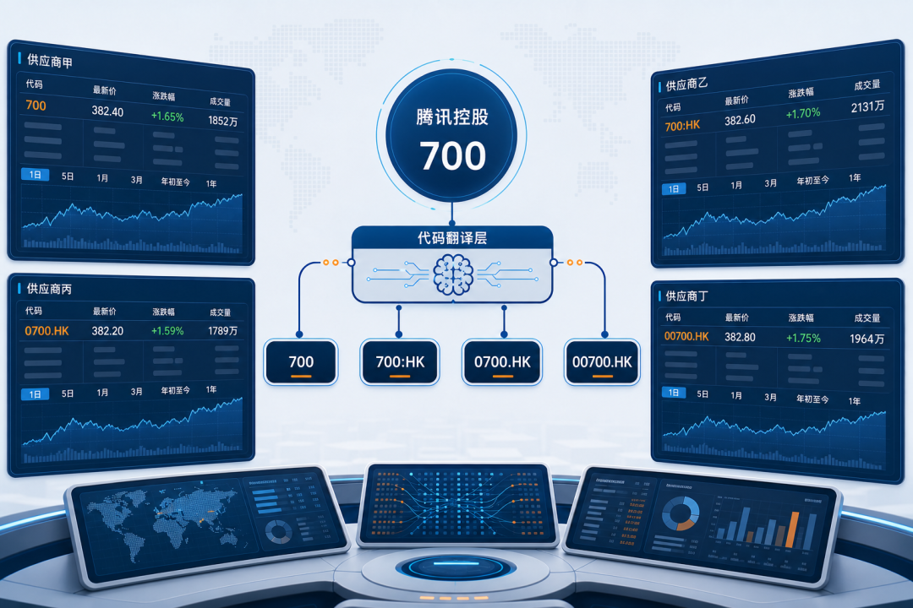
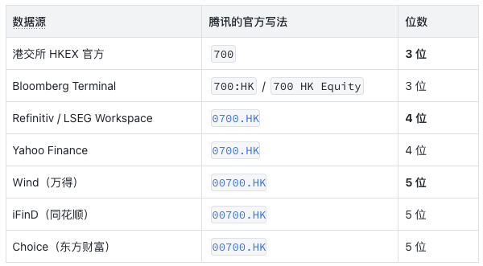
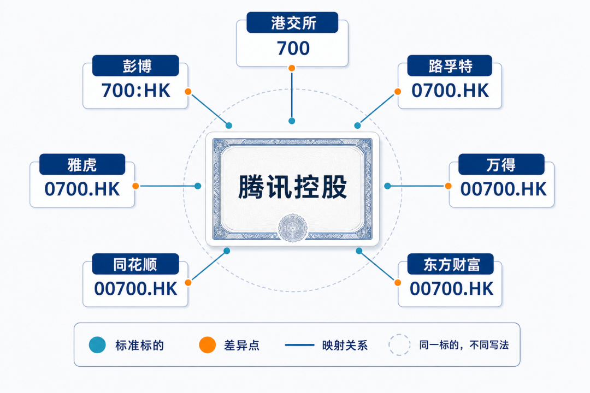
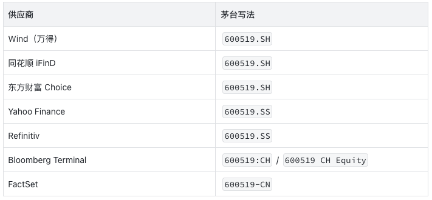
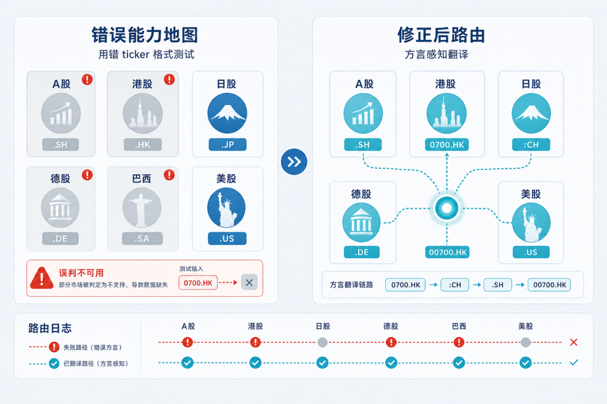
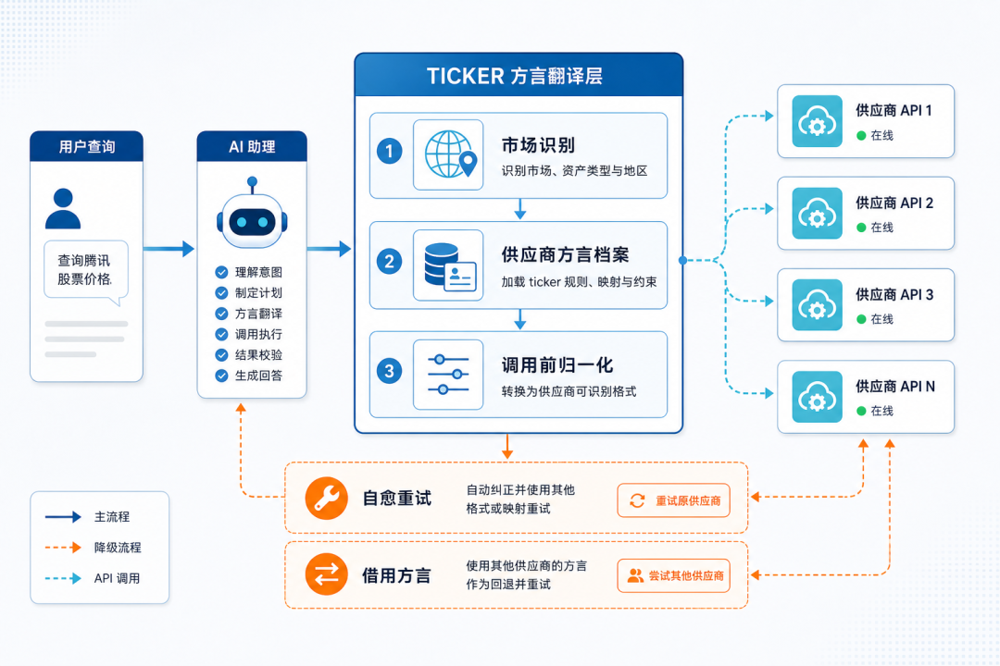
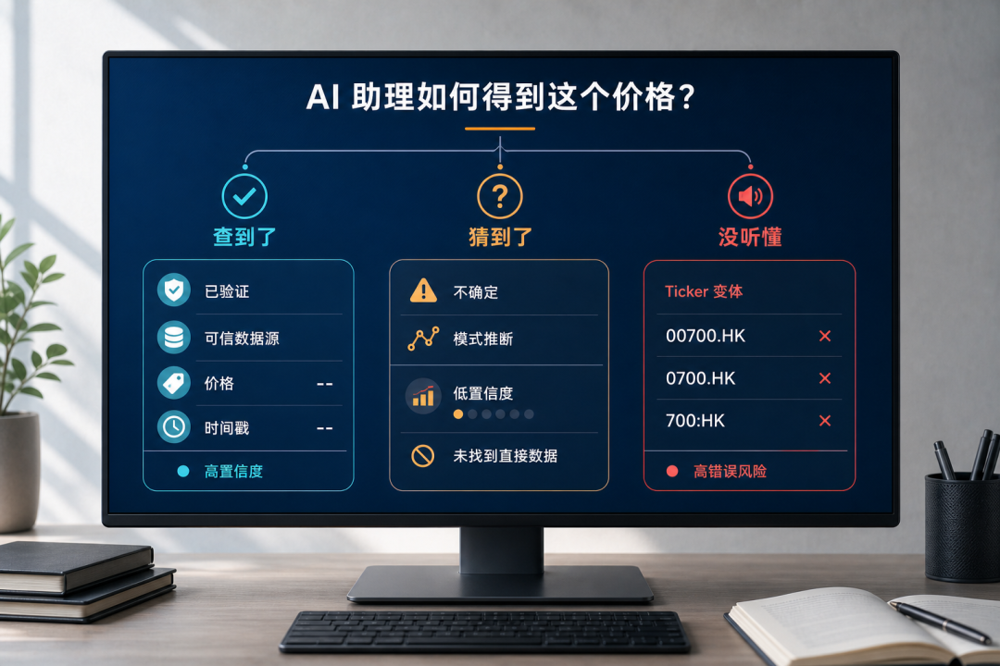

QVeris · Data-Tested

> Starting with seven ways to write a single Hong Kong stock code: the easiest place for an AI financial assistant to stumble is not the model. It is the ticker.

Figure 1: Hero — Tencent Holdings 700 + ticker translation layer overview across terminals
## One Tencent Has Seven Names Across Mainstream Paid Data Sources

If you ask an AI assistant, "How much is Tencent up today?", which ticker should it use when querying the data source? We went through the official documentation of multiple **paid institutional terminals**:

Figure 2: Tencent Holdings ticker dialect map across seven vendors

**  
**

**No two systems are exactly the same.**

HKEX itself uses a bare three-digit number. Bloomberg keeps the bare number and adds an exchange code. Refinitiv, when it defined RICs (Reuters Instrument Codes) years ago, padded the code to four digits, which became the standard for many European and U.S. institutions. Wind, when building out its domestic market system, padded one more zero on the left to make it five digits, so A-share tickers like `600519.SH` (six digits) and Hong Kong tickers like `00700.HK` (five digits) visually line up.

Each vendor has its own historical reason. **But to an AI Agent, these are four completely different strings.**

A-shares are even more interesting. For the same Kweichow Moutai stock (600519), mainstream paid sources write the ticker like this:

The three domestic vendors unexpectedly agree on A-share notation: all use `.SH`. **But once you move to overseas data sources, Yahoo and Refinitiv use `.SS`, Bloomberg uses `:CH`, and FactSet uses a hyphen plus `-CN`.**

From inside the domestic market, it may look unified. Once you reach overseas data sources, it is clearly not the same thing at all.
## The Agent Did Not Query the Wrong Thing. Vendors Simply Do Not Understand Each Other

This "dialect" problem is far more subtle than "the Agent made up a number."

A common industry approach is to write one representative ticker for each market, such as `CN → 600519.SH` and `HK → 0700.HK`, then use that global table to probe each vendor's capabilities. If the query works, mark the vendor as "supports this market"; if it fails, mark it as "unsupported" and cache the result for dozens of days.

What happens next?

**Several international paid data sources get falsely labeled as "not supporting A-shares."** They do support A-shares. They just speak the A-share dialect as `.SS` or `:CH`, not `.SH`. Use the same interface, change `.SH` to `.SS`, and Moutai's complete K-line data at ¥1330+ comes back in full. The same vendor can query Hong Kong stocks with `0700.HK`, Japanese stocks with `7203.T`, German stocks with `SAP.DE`, Brazilian stocks with `PETR4.SA`, and U.S. stocks with `AAPL`. All of them work.**  
**

**It fully covers mainstream markets across Asia-Pacific, Europe, and South America. Nobody had simply told it which ticker dialect you were speaking.**

Figure 3: Incorrect capability map vs corrected routing comparison

The cost of this kind of false negative is much higher in the Agent era than it was for human users.

If an analyst finds that a terminal cannot retrieve A-shares, they will try another format or call customer support. An Agent will not. It trusts the capability map you gave it. **If the map says "this vendor does not support A-shares," it will never ask that vendor again.** The more vendors are falsely excluded, the fewer data sources the Agent can use. In the end, it has to make do with the few remaining sources. Or worse, **it generates a plausible-looking answer from memory in its training data.**

Someone on V2EX once listed three real Agent failure cases: one Agent treated 24-hour cumulative trading volume as the volume of a single K-line, missing by several thousand times; another entered an infinite retry loop after an API rate limit and burned through a full day's token quota in two minutes; another failed a tool call without reporting an error, then **fabricated a plausible-looking price based on parameterized memory**. In March 2025, an AI customer service system at a financial institution generated false wealth-management product information, causing a single customer loss of more than RMB 5 million.

These stories look very different on the surface, but they share the same root cause: **there is a missing layer of "translation" between the Agent and the tools.**
## The "Dialect Translation Layer" We Recently Built

Over the past month, the QVeris team merged 35 PRs into the tool-calling foundation. The work was not about new features. It was about adding a dialect translation layer to the "Agent → tool" chain.

This translation layer does three things:

**First, automatically identify the market.** When you pass in a ticker, whether it is `600519`, `0700`, or `AAPL`, we first determine which market it belongs to. That is the prerequisite for routing. If you do not know which country's stock it is, you do not know where to route it.

**Second, build a "dialect profile" for each vendor.** We run real tests using the smallest callable sample for each vendor and each market: what accent this vendor uses for A-shares, what accent that vendor uses for Hong Kong stocks, what accent a third vendor uses for Brazilian stocks. These are not copied from documentation. They are archived only after a real API call returns real data. **Documentation can go stale. Live tests do not.** Internally, we call this profile the "vendor dialect table," and it self-heals automatically with each round of calls.

**Third, translate the dialect automatically before the call.** The Agent gives us a ticker, such as `600519.SH`. Based on the vendor it is being routed to, **the routing layer automatically translates it into the dialect that vendor understands**: `600519.SS` for Yahoo / Refinitiv, `600519:CH` for Bloomberg, `600519-CN` for FactSet, or `600519` without a suffix for Tushare. The Agent does not need to know this translation layer exists, **just as you do not need to understand submarine cables to make an overseas phone call**.

Figure 4: TICKER dialect translation layer architecture: user → AI → three steps → vendor API + fallback

There is also a fallback layer behind these three steps. When a given "vendor × market" combination does not yet have a dialect profile, **we use cross-vendor borrowing plus an on-the-fly dialect normalization engine**. Only as a last resort do we fall back to global constants. Four layers of degradation, each with a data-driven basis.

After completing this system, what we saw was not just "how much the call success rate improved." That kind of number can go into any promotional material. What we saw was **vendors previously misjudged by dialect differences being rehabilitated one by one**: A-share, Hong Kong stock, Japanese stock, and Brazilian stock coverage each moved from "assumed unsupported" back to "actually usable."

Figure 5: Found it / Guessed it / Did not understand it — three-state comparison

Tencent was up nearly 7% today. But that is only one of the cleanest examples in the ticker ocean. There are also renamed stocks, delisted stocks, suspended stocks, adjusted prices, and unit ambiguity. Each one can trip up an Agent. Each one needs a layer of "translation."

The next time your AI assistant tells you the real-time price of a stock, remember to ask one question:

**Did you look it up, or did you guess? Or did it never understand which Tencent you meant in the first place?**

**  
**
