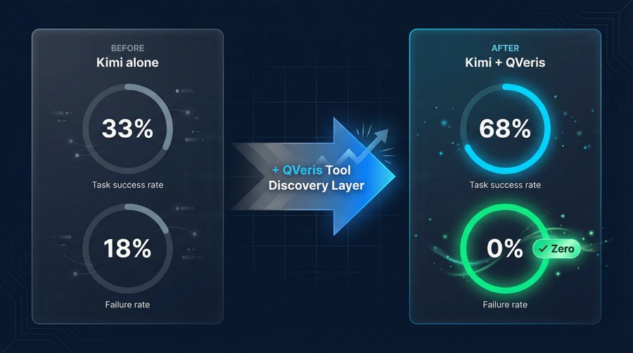
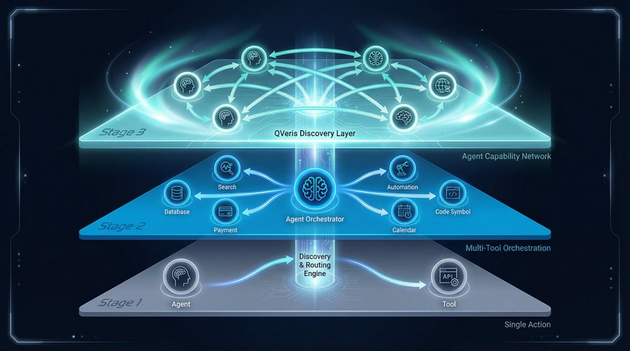

Early 2026. Something interesting happened.

A team called EvoMap launched a product that lets AI agents share problem-solving experience with each other. The founder called it the GEP Protocol (Genome Evolution Protocol): one agent cracks a hard problem, and 99 other agents can reuse that experience for a few cents — cutting redundant trial-and-error costs by 99%.

From an OpenClaw plugin to closing an angel round: less than two weeks.

Why now? That question deserves a serious answer.

## A Species, Hatching

On February 25, 2026, NVIDIA reported the strongest quarter in its history: $68.1 billion in revenue, up 73% year-over-year.

On the earnings call, Jensen Huang said something brief but weighty:

> "The inflection point for Agentic AI has arrived."

Not a prediction. A statement of fact.

A year earlier, Sam Altman had written in his January 6, 2025 blog post *Reflections*:

> "We believe we may see the first AI agents join the workforce and materially change the output of companies."

Looking back now, that judgment has played out exactly as predicted.

PwC surveyed 1,000 U.S. business leaders: 79% of organizations have already deployed AI agents. McKinsey reports that 85% have integrated agents into at least one core workflow. Salesforce disclosed that AI agent creation and deployment on its platform grew 119% in the first half of 2025.

But behind the numbers, something more fundamental is shifting.

The nature of AI agents is undergoing a qualitative change.

They are no longer just "smart tools." They are autonomous actors — capable of independently completing complex tasks, selecting and using tools, and collaborating with other agents. As Karpathy wrote in his 2025 year-end review: Claude Code "convincingly demonstrated what an LLM Agent truly looks like — no longer a simple Q&A bot, but something that operates in a loop, continuously solving problems."

This is the hatching moment of a species.

## When a Species Forms a Society, New Needs Emerge

Evolutionary history teaches us: when a species goes from isolated individuals to a group, everything changes.

Groups need communication. Groups need coordination. Groups need specialization.

Agents are no different.

When eight agents are running in parallel on a task, the bottleneck isn't compute — it's **coordination**. Does the other agent know what I'm doing? Can I call on the capabilities it's already developed? Who handles which part of this complex workflow, and who actually has the ability to do it?

Karpathy recently ran an experiment: four Claudes and four Codex instances working in parallel on a nanochat project. The result: chaos. Not because any individual agent wasn't smart enough, but because there was no mechanism for them to know what each other was doing — or what each other could do.

This isn't an engineering detail. It's a fundamental infrastructure problem for any agent society.

In 2026, the entire industry has woken up to this. Gartner named "the shift from single-agent to multi-agent collaborative orchestration" its top trend of the year. IBM introduced the Super Agent concept: the enterprise of the future doesn't deploy one agent — it operates an agent *network*, where each node has its specialty and the whole accomplishes what no single agent could.

In a very real sense, agents are forming a society.

## The Core Problem of Any Society: Who Knows What?

Human societies faced the same problem at their formation.

In 1998, there were over a million web pages on the internet — but no way to systematically find what you needed. People relied on bookmarks, word of mouth, Yahoo's directory. The world looked information-rich but was deeply chaotic: no one could index it, and no one could surface the most relevant result in milliseconds when you needed it.

Then Google appeared.

Not because Google created the content on the internet. Because it built a **discovery and routing mechanism** — crawlers, indexing, PageRank. For the first time, the ocean of scattered human knowledge became searchable by anyone, for anything.

Today's agent ecosystem is at the 1998 moment of the internet.

There are already more than 10,000 tools and APIs available for agents to use. But they're scattered everywhere, with no unified semantic index. When an agent faces a new task, it can only use the tools it already "knows" — which is usually a tiny fraction of what exists.

The deeper problem: **agents don't know what tools exist.**

An agent working with financial data knows Alpha Vantage. It doesn't know there's also Polygon, Finnhub, or Tiingo. It uses the one it's familiar with, even if that's not the best fit. This isn't an intelligence problem. It's a visibility problem. The agent is blind.

## The Real Bottleneck Isn't Intelligence

Let me share a concrete data point.

We ran a before-and-after test connecting Kimi to the QVeris tool discovery layer. Same model, same tasks. After connecting: **the perfect resolution rate on complex tasks rose from 33% to 68%. The** **failure rate** **dropped from 18% to zero.**

The model didn't change. What changed was how many tools it could see, and how quickly it could find the right one.

IBM's 2026 report *Goals for AI and Technology Leaders* put it plainly:

> "The proof-of-concept phase is over. In 2026, the challenge isn't whether agentic AI works — it's whether you can deploy it reliably across your organization, at scale."

Reliability requires accuracy. Accuracy requires finding the right tool. And finding the right tool requires **a dedicated discovery and routing mechanism** — just like the fastest car on the highway still needs navigation.

This is why the tool discovery layer is the most underrated — and most critical — piece of agent infrastructure.

## The Search Engine Story Is Repeating Itself

I spent several years at Bing, working on web crawling, indexing, and multimodal understanding at the scale of hundreds of billions of pages.

That experience taught me one thing clearly: **the value of a** **search engine** **was never how much content it stored. It was how accurately and quickly it could route the right content to the right person.**

Google is, at its core, a routing system. It takes a user's query intent and routes it to the most relevant content node. That sounds simple. In practice, it's a hundred-billion-dollar engineering challenge — built on insights like PageRank and iterated over two decades.

Today, the agent ecosystem needs exactly the same thing.

Not another tool. A mechanism that makes all tools discoverable. Not a replacement for LangChain or MCP — but a **semantic discovery and routing layer sitting above all protocols**, the way Google sits above whatever server technology a website runs on.

We call this the action infrastructure for the agent era.

## The Capability Network Is Where This Species Is Headed

Back to EvoMap — the project from the beginning of this piece, where agents share problem-solving experiences with each other.

Why did it close an angel round in under two weeks?

Because agents have grown numerous enough to generate **social needs**. They need to share experience. They need to find each other. They need to know who's good at what. EvoMap's GEP Protocol encodes a simple logic: one agent solves a hard problem; 99 agents reuse that solution for a few cents. That's the network effect of capability — a marketplace for knowledge.

This is the phase we've always believed was coming: **the agent capability network**.

Agents first learn to invoke a single tool to complete a task. Then they learn to orchestrate multiple tools across complex workflows. Eventually, they form a network where agents discover, invoke, and augment each other's capabilities.

That network needs a search-engine-grade discovery and routing engine to function.

In 1998, that need gave birth to Google. In 2026, it's giving birth to the action infrastructure of the agent era.

**When agents become a species, they don't just need smarter brains. They need a map, a routing system, and an internet where every capability can be found.**

That's what QVeris is building.

