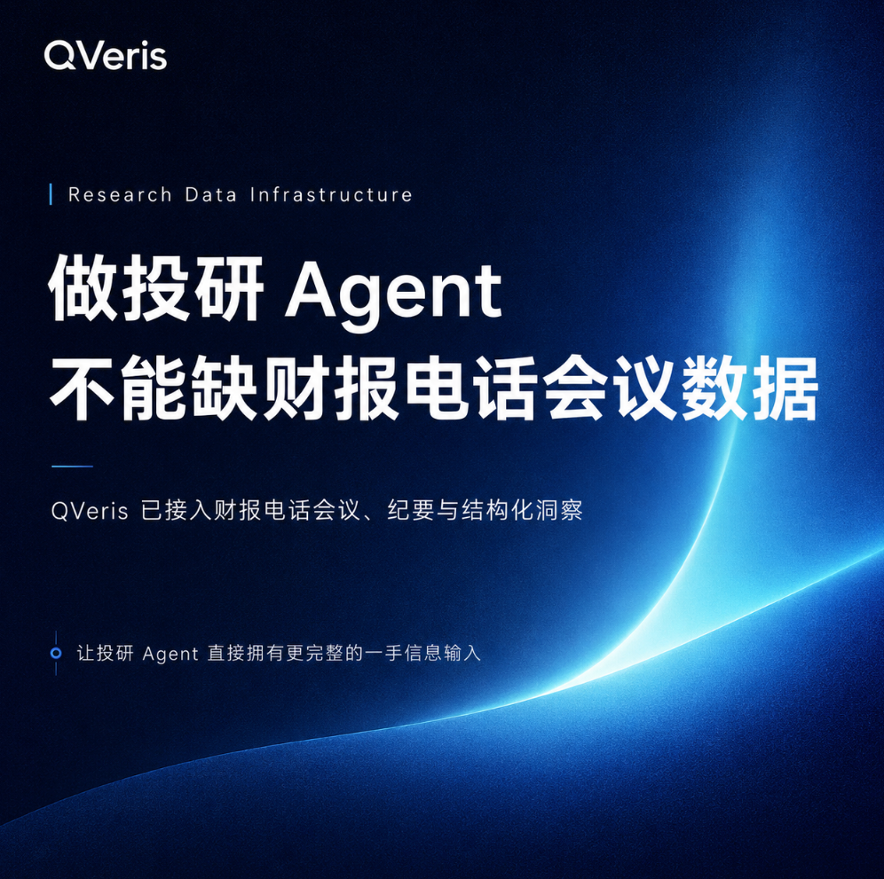
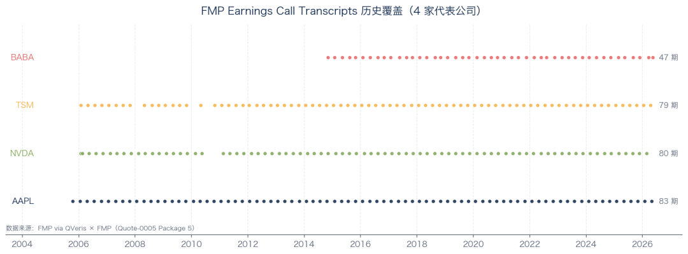
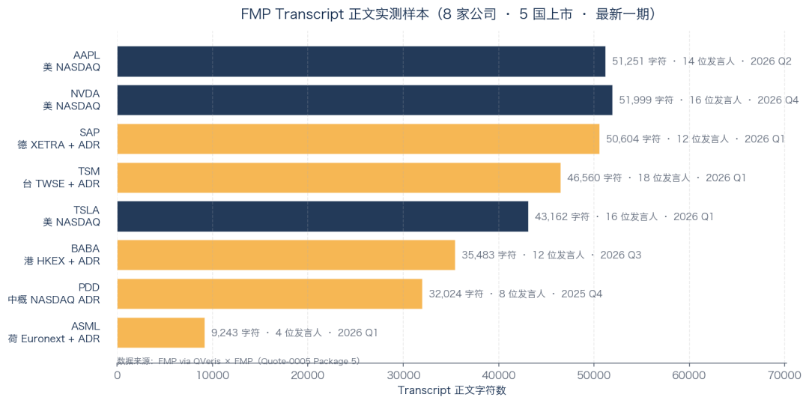
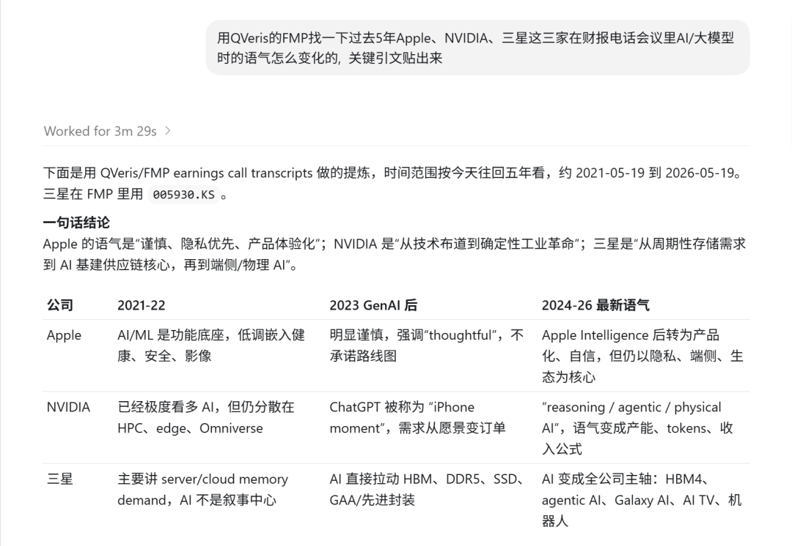
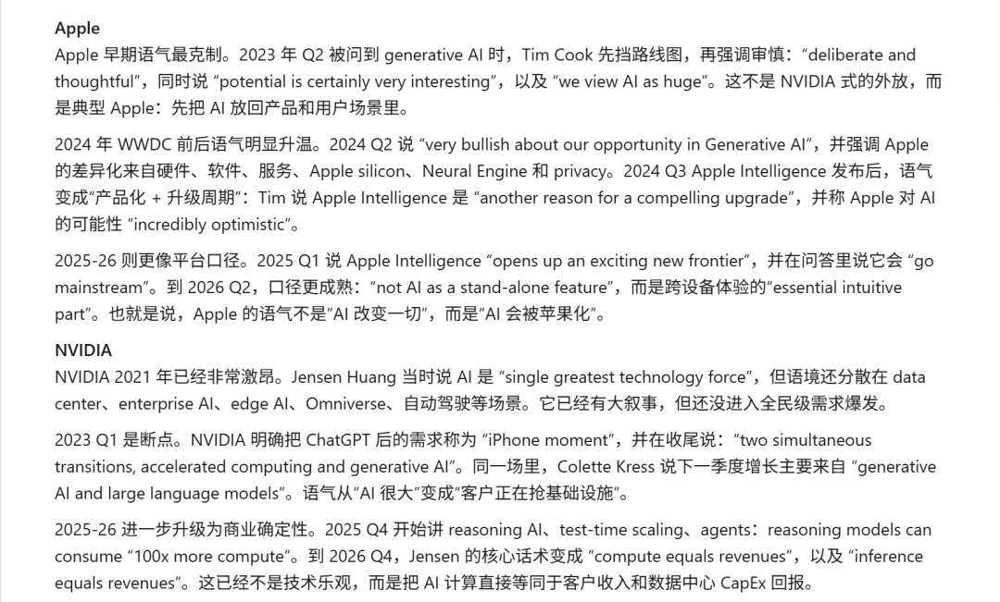
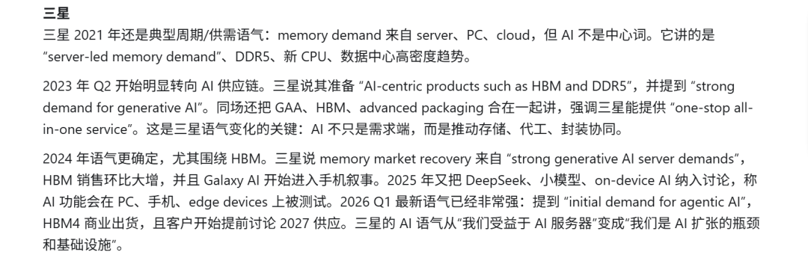
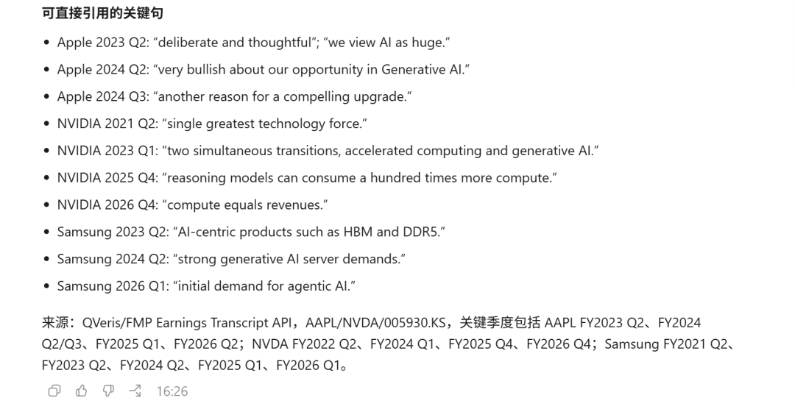

QVeris · Data Test

  

If you are building an investment research Agent, you may have run into this problem: a client asks how Tim Cook handed off the CEO role on Apple’s last-quarter earnings call, or how the CFO presented the first earnings report no longer signed off by Tim. Your Agent cannot answer.

Because news summaries only include a few secondhand lines. Where is the original transcript?

Bloomberg / Refinitiv starts at tens of thousands of dollars per year.

Earnings call transcripts are rarely discussed in the domestic developer community.

Search Chinese databases, and most stop at the three core financial statements. “Unstructured text” like Earnings Calls is usually treated as something reserved for institutional clients.

Out of curiosity, I checked several US stock data APIs: Alpha Vantage, Polygon, IEX. I could not find one that directly returned the full transcript body.

Then I opened the Financial Modeling Prep (FMP below) API documentation,

and saw a standalone “Earnings Call Transcripts” package. Its coverage note said: “8,000+ US Listed companies and Foreign Companies Dual Listed on US Exchanges,” with 10+ years of depth.

I stared at that line for a few seconds. If true, this is Bloomberg-level content at SaaS-level pricing. Worth testing.
## A Complete Breakdown of One Apple Earnings Call

I first pulled AAPL Fiscal Year 2026 Q2, published on 2026-04-30.

The returned JSON surprised me: the `content` field alone contained 51,251 characters, roughly 8,000 English words. This was a proper full transcript.

The article opens with the standard IR introduction from Suhasini Chandramouli:

> "Good afternoon, and welcome to the Apple Q2 Fiscal Year 2026 Earnings Conference Call... Speaking first today is Apple CEO, Tim Cook. John Ternus will be joining after that for a brief set of remarks, and I will be followed by CFO, Kevan Parekh." 

Fourteen speakers then appear in sequence, each clearly marked in `Name:` format.

After Tim Cook discusses strategy, John Ternus follows: “In my view, Tim is one of the greatest business leaders of all time. Stepping into the role of CEO is an incredible honor.” This is not a secondhand paraphrase from the news. It is what he said on the call that evening.

Further down, CFO Kevan Parekh reports the numbers: March quarter revenue of \$111.2 billion, up 17% year over year, a March-quarter revenue record.

Then comes Q&A, with 10 sell-side analysts asking questions in turn.

Morgan Stanley’s Erik Woodring opens by paying tribute to Tim; Bank of America’s Wamsi Mohan asks about the pass-through of memory costs. Every question and every answer is preserved in full, including conversational sign-offs like “ll save the congrats on the Art of war for next quarter.”

This is the depth of Bloomberg Transcript content. That is not an exaggeration.

 FMP Earnings Call Transcripts historical coverage (4 representative companies) 
## A 21-Year Timeline: From Before the iPhone to Tim Cook’s Exit

Next I pulled AAPL’s transcript dates and got 83 earnings call dates. The earliest was 2005-10-13. In other words, FMP still preserves Apple earnings call transcripts from two years before the iPhone was released in 2007.

Then NVDA: 80 calls, from 2006-01-30 through 4Q FY2026 on 2026-02-25.

TSM (TSMC ADR): 79 calls, starting in 2006.

BABA: 47 calls, starting from Alibaba’s first earnings report after listing on 2014-11-04.

Each data point is a complete earnings call. That means

if you want to study “how Apple management talked during every major design shift over the past 20 years,” the raw material is sitting inside a single FMP API.

The contract states “10+ Years” of depth. In testing, the actual coverage was far broader.
## Five Countries, Eight Companies: Overseas Equities Work Too

Starting from Apple, I expanded the test set and deliberately selected several companies that are not US-headquartered but have ADRs dual-listed in the US. This is where FMP’s dataset becomes genuinely differentiated:

 FMP Transcript body test sample (8 companies · 5 listing markets · latest period) 

The latest transcript for all 8 companies returned a full body, across 5 different listing markets:

- **US domestic (NASDAQ)**: Apple, NVIDIA, Tesla, each with 40,000-50,000 characters

- **Germany + ADR (XETRA → SAP ADR)**: SAP SE 2026 Q1, about 50,000 words

- **Taiwan + ADR (TWSE → TSM ADR)**: TSMC 2026 Q1, 46,000 characters, opened by host Jeff Su

- **Hong Kong + ADR (HKEX → BABA ADR)**: Alibaba 2026 Q3, including Q&A from 11 analysts

- **China ADR (NASDAQ ADR)**: PDD Holdings 2025 Q4, 32,000 characters

- **Netherlands + ADR (Euronext → ASML ADR)**: ASML Q1 is shorter at about 9,000 words; FMP recorded the abbreviated version after ASML switched to video format

In other words, if you are building an Agent for cross-sectional comparison of global technology leaders, you do not need to connect six separate data sources. One API key, one endpoint, and a different symbol gets you the result.
## Not Just the Body: Calendar, Metadata, and Latest Lists

A transcript body alone is not enough. You also need to know which company is holding a call on which date, and which companies have transcript history available. FMP includes three additional supporting endpoints in the same package:

**Transcripts Dates By Symbol**: pass in a ticker and it returns every available transcript quarter for that company. The 83 AAPL calls, 80 NVDA calls, and 79 TSM calls above all came from this endpoint. For an investment research pipeline, this is the key enumeration entry point.

**Latest Transcripts**: returns recently published transcripts, including company, quarter, and date. In testing, it returned 100 companies published on 2026-05-15, including KLC, LFT, RUM, and AMAT. This can be wired into an Agent workflow like “automatically summarize the key signals from last night’s earnings calls every morning.”

**Available Transcript Symbols**: returns the full list of companies with transcript history. FMP returned 10,850 companies, exceeding the 8,000+ stated in the contract.

Together, the four endpoints form a complete Earnings Call data stack: when a call happens, which companies have data, what the latest period is, and what was actually said.
## How This Is Actually Used on QVeris

A single transcript can run 40,000-50,000 words. What users really ask an Agent to do is not “what did Tim Cook say in Q2?” News summaries are already enough for that. What makes Agents stumble is a question like this:

>
> You: Find how the tone of Apple, NVIDIA, and Samsung changed when discussing AI / large models in earnings calls over the past 5 years, and include the key quotes.
>

Tens of thousands of words × dozens of companies × dozens of quarters of unstructured text: impossible for a human to read through manually, while news summaries are too shallow.

Letting an Agent locate and compare across companies, quarters, and themes is the real use case for a transcript database. It is not about looking up a single fact. It is about studying evolution and building cross-company narratives.

The same Agent workflow can directly cover overseas dual-listed companies such as SAP, TSMC, Alibaba, Samsung, and ASML, without integrating six separate APIs.

We recently integrated FMP’s full commercial package into QVeris. Earnings Call Transcripts is one part of it. Earnings call data that costs tens of thousands of dollars per year from Bloomberg / Refinitiv is now directly accessible to ordinary AI Agent developers. So far, we have not seen an alternative at the same level in the domestic developer community.

**🎁 Try it now**:

Visit qveris.ai to sign up. New users automatically receive 1,000 free credits, enough to run a full Agent workflow for cross-company, cross-quarter earnings call comparison.

FMP Earnings Call Transcripts is already integrated and ready to use, with no need to connect it yourself.

📊 QVeris × Data Supplier Series: each article takes a deep look at one provider, covering only capabilities we have tested ourselves.
