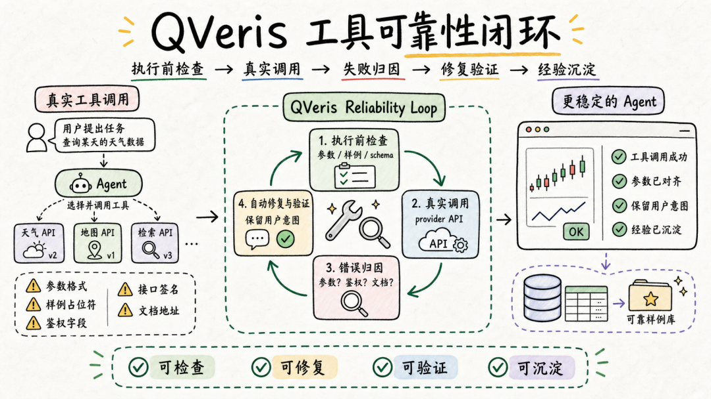
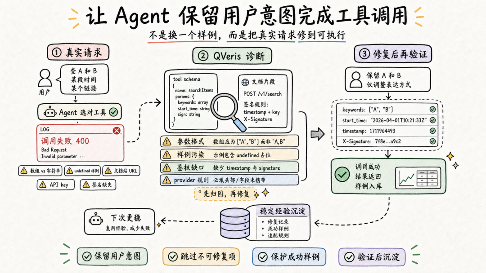

QVeris · Product Updates

QVeris has already connected a large number of APIs and tools into the Agent execution flow. For users, the ideal experience is simple: ask a question, let the Agent choose the right tool, get the result, and continue completing the task.

But in the real world, tool calls are not always that smooth. Many failures do not happen because the user asked the wrong question, or because the Agent completely misunderstood the task. They happen because the tools behind the scenes come with many small but critical constraints: parameter formats, sample values, authentication methods, documentation URLs, API signatures, and provider-specific field rules.

When the system does not understand these differences, what the user sees is simply a "tool call failed" message.

So my recent work has focused on moving the QVeris toolchain from "being able to call tools" toward "being able to complete tool calls more reliably."

## Background

The hard part of tool calling is not just connecting APIs.

Once a tool truly enters an Agent workflow, it has to handle many real requests. A user may want to look up a company, a video, a set of accounts, or a time range. The Agent needs to translate those natural-language intents into parameters that the provider can execute.

If any detail in that translation is misaligned, the call can fail:

- Should multiple values be passed as an array, or as a comma-separated string?

- Can `undefined`, `null`, or `string` in the documentation be treated as real examples?

- Should a URL parameter be the business URL the user wants to query, or has the system accidentally used a documentation-site URL?

- Should authentication fields such as API key or appid be passed manually by the user?

- Do certain professional APIs need a signature generated from the request body?

- Does the example on the documentation page actually correspond to the current tool?

From the user's perspective, none of this should become their burden. Users do not care what the provider schema looks like. They care whether the Agent can get the job done.

## What We Built

The core of this recent set of improvements is a more reliable loop around tool calling: check before execution, repair after failure, and preserve validated experience after success.

Before execution, the system first checks whether the tool definition and sample parameters are actually executable.

For example, it filters out placeholders that are clearly not business parameters, so documentation examples such as `undefined`, `null`, `n/a`, and `string` are no longer treated as real requests.

During execution, if existing sample parameters do not match the tool schema, the system tries to apply lightweight normalization. For example, some APIs describe a field as accepting multiple values, but in practice require a single comma-separated string. The system preserves the user's intent and only adjusts how that intent is expressed.

After a failure, the system uses the error message, tool definition, and documentation content to determine where the problem came from. It does not simply "try again." It first determines whether this is a parameter issue, an endpoint issue, an authentication issue, or a permission or data-scope limitation from the provider itself.

More importantly, the system does not casually overwrite existing tool experience just because it found one sample that can run successfully.

For tools that are already succeeding reliably, existing examples are protected.

For new candidate parameters generated from documentation, the system validates them first and only preserves them after confirming they work.

This may sound like a small detail, but it is critical: tool reliability cannot depend on luck, and it cannot rely on replacing the user's original question with a "common example."

The truly valuable repair is to keep the user's intent as intact as possible while adjusting the parameters into a format the provider can understand.

## A More User-Centered Example

Suppose a user wants to query a set of accounts or symbols.

Semantically, "A and B" is simple. But different tools may express "multiple values" in completely different ways. Some APIs accept arrays, while others only accept a single string joined by English commas.

Previously, this kind of difference could easily cause a call to fail: the user's intent was correct, and the Agent chose the right tool, but the request got stuck on a provider-specific formatting detail.

Now, the system recognizes this as a tool-parameter alignment issue. It preserves the objects the user originally wanted to query, and only changes the parameter expression into the form the tool actually accepts.

Similarly, if the example in the documentation is `undefined`, the system will not treat it as a real query value. If an example URL points to a documentation site, support page, or the API host itself, the system will not mistake it for the business link the user wants to query.

The result of these optimizations is not a single isolated feature, but a steadier user experience: users do not need to understand these details, and Agents are less likely to interrupt tasks because of them.

## Supporting More Complex Professional APIs

In addition to parameter repair, we also added a more foundational product capability: allowing professional APIs that require signature-based authentication to enter the tool system more naturally.

Many enterprise-grade and industry-specific data APIs cannot be called by simply passing an API key. They require each request to include a timestamp, API name, version number, and a signature generated from the actual request body.

Without this capability, even if the Agent knows which tool to call, the request may still fail at the authentication layer.

Now, QVeris can generate the corresponding signature at execution time based on the parameters of the current call, and automatically complete the necessary authentication information. For users, this means more professional data sources can be used by Agents like ordinary tools, instead of stopping at the stage where "the interface is connected, but actual calls are unstable."

## What Users Will Feel

First, tool-call failures will less often become dead ends.

When a failure comes from parameter formatting, incorrect samples, mistaken endpoint selection, or missing authentication, the system has a chance to understand the cause and apply a repair before passing the error directly back to the user.

Second, the Agent will respect the user's original intent more.

A good repair is not "switching to a parameter that succeeds." It is aligning the expression with the tool's requirements while keeping the object, time, and scope the user wanted to query unchanged.

Third, the QVeris tool library will continue improving through real usage.

Every execution, failure, repair, and validation helps the system accumulate more reliable tool experience. Stable, usable examples are protected; new usable examples are validated before being preserved; and the entire tool ecosystem becomes steadily more robust.

## Why This Matters

Once Agents truly enter production environments, the hard part is not demonstrating one successful tool call. It is continuing to complete tasks as reliably as possible when facing messy real-world tools, documentation, and data sources.

What QVeris is doing is moving tool calling from "API connected" to "API used reliably."

When the system can understand failures, repair parameters, handle authentication, protect existing experience, and preserve successful paths, the Agent experience evolves from "able to call tools" into something closer to an assistant that can keep completing tasks.
