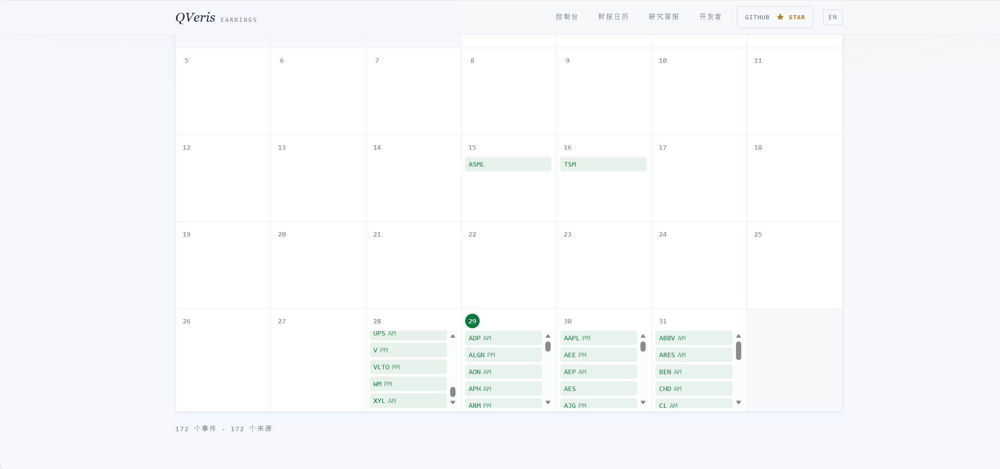
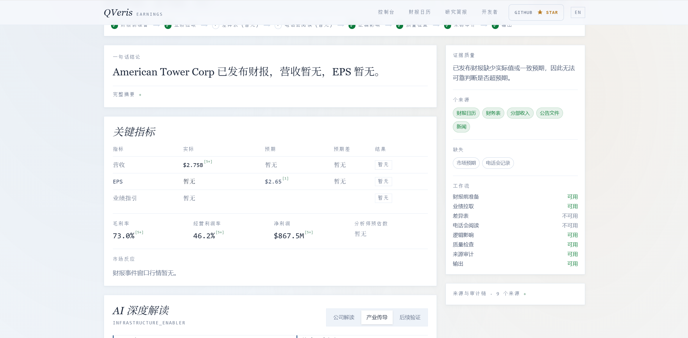
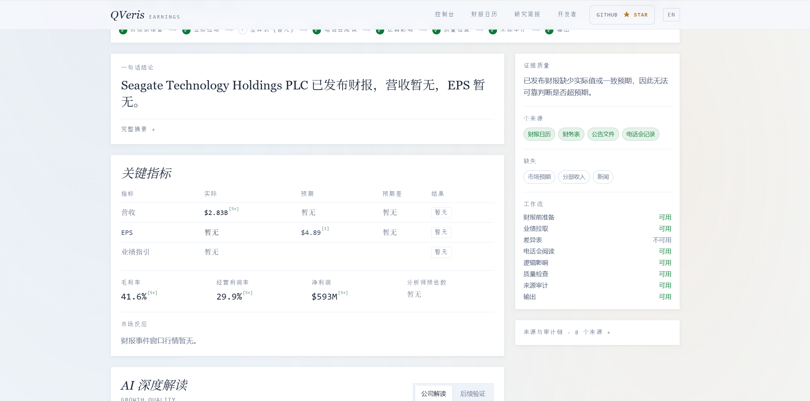
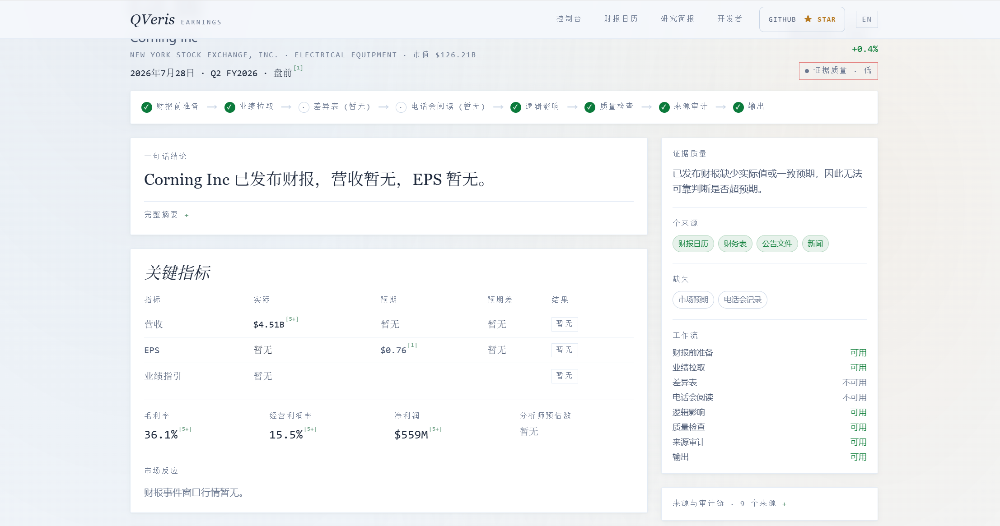
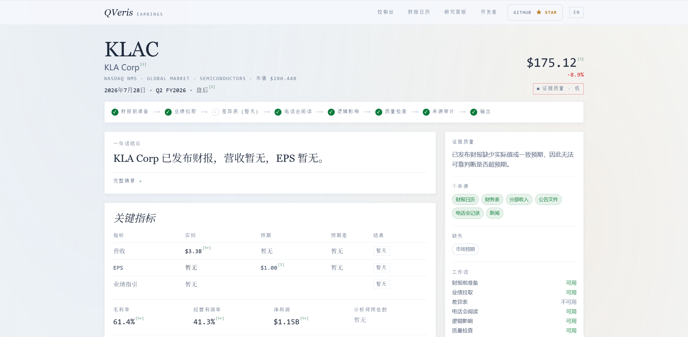
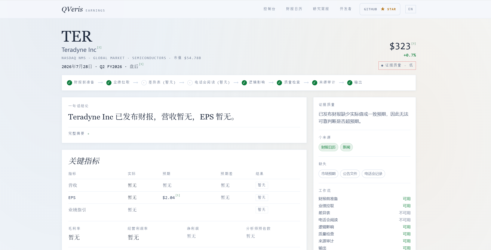

# The AI Infrastructure Earnings Chain Is Printing High Gross Margins: A QVeris Earnings Copilot Scan

> From communication towers to fuel cells, hard drives, and fiber optics, AI infrastructure profits are now materializing across the supply chain.

Last night was a packed earnings session for U.S. equities. Around the July 28 pre-market and after-hours windows, 170 companies reported Q2 results.

I used QVeris Earnings Copilot to scan the day's earnings calendar, grouped the names by industry, and opened several companies tied to the AI infrastructure chain. The clearest takeaway: downstream AI demand is no longer just a narrative. It is showing up as profit.

---

## Six AI Infrastructure Companies, Gross Margins From 29% to 74%

The financials for several AI infrastructure names were strong almost across the board:

### 🗼 American Tower (AMT) — Communication Towers

- Gross margin: **74.0%**
- Operating margin: **46.2%**
- Net income: **\$868 million**

AMT is more than a tower company. Its CoreSite business is one of the largest data center interconnection platforms in the United States. AI training clusters need low-latency interconnects, and AMT controls some of the most critical nodes. A 74% gross margin says a lot: this is not the margin profile of ordinary heavy infrastructure. It reflects the pricing power of a platform business.

### ⚡ Bloom Energy (BE) — Data Center Power

- Gross margin: **29.6%** (about 20% in the same period last year)
- Revenue growth: **+130% year over year**
- Share-price gain year to date: **+113%**

Bloom Energy makes solid oxide fuel cells that provide on-site power for data centers. Its gross margin has moved from roughly 20% to nearly 30%, suggesting that scale effects are starting to flow through. AI data center power demand is already pressing beyond the limits of grid capacity, turning Bloom's fuel-cell power plants into a real requirement for hyperscalers.

### 💾 Seagate (STX) — Storage

- Gross margin: **35.3%** (23.5% in the same period last year)
- Operating margin: **20.8%**
- Net margin: **16.2%**
- Revenue growth: **+44% year over year**

AI training requires massive data storage, and HDDs remain a core workhorse. Seagate's gross margin rose from 23% to 35% in a year, a 12-point improvement. That is not just pricing. It reflects a richer mix of high-capacity product shipments. Cloud customer HDD orders are still accelerating.

### 🔦 Corning (GLW) — Fiber Optics

- Gross margin: **36.0%**
- Operating margin: **14.6%**
- Net margin: **10.2%**
- Revenue growth: **+20% year over year**

Corning is one of the key fiber suppliers for AI data centers. NVIDIA signed a strategic partnership with the company in May. Fiber is the physical layer that enables terabyte-per-second data exchange between GPUs.

### 🔬 KLA Corp (KLAC) + Teradyne (TER) — Chip Inspection and Testing

**KLA Corp:**

- Gross margin: **60.9%**
- Operating margin: **39.3%**
- Net margin: **33.4%**
- Revenue growth: **+11.5% year over year**

**Teradyne:**

- Gross margin: **58.2%**
- Operating margin: **20.4%**
- Net margin: **17.4%**
- Revenue growth: **+87% year over year**

KLA and Teradyne provide inspection and test equipment used throughout chip manufacturing. AI chips, including GPUs, ASICs, and HBM, are much harder to manufacture at high yield than conventional chips. That makes demand for inspection and testing equipment more elastic. Gross margins near 60% are top-tier for the semiconductor equipment industry.

---

## Not a Coincidence: One Order Flow Passing Through Six Layers

If only one company's financials looked good, the explanation might simply be company-specific execution.

But on the same night, towers, power, storage, fiber, inspection, and testing all pointed to the same conclusion from different angles: AI Capex is converting into supplier profit.

Look at the gross-margin picture:

- **AMT**: 74%, with a five-year average also around 74%; this is not a turnaround, it has been highly profitable for years
- **STX**: from 23% to 35%; AI demand is reshaping the HDD product mix
- **BE**: from 20% to 30%; scale effects are starting to land
- **GLW**: 36%, benefiting from the shift toward higher-end fiber
- **KLAC**: 61%, reflecting exceptional pricing power in semiconductor inspection
- **TER**: 58%, showing the demand elasticity of test equipment

These companies are not competitors. They sit at different points in the AI infrastructure chain: towers for interconnection, power for data centers, storage for data, fiber for communication, and equipment for inspection and testing. Each benefits from the same underlying demand driver.

Of course, this does not mean the stocks can only go up. Bloom Energy faces scrutiny from short sellers. Seagate's HDD business is cyclical. KLA and Teradyne are highly sensitive to the macro cycle. But the Q2 data at least makes one point clear:

AI spending has moved from slide decks into suppliers' income statements.

---

## Scope and Caveats

- **Data source**: Finnhub Basic Financials, retrieved through QVeris Earnings Copilot. The metrics are TTM (Trailing Twelve Months), with some figures based on annual-report data.
- **Coverage**: Six U.S.-listed companies related to AI infrastructure. This is not a full representation of the entire AI supply chain.
- **Data freshness**: The financial data shown in Earnings Copilot reflects the most recent reporting period available in the tool. Some companies' latest Q2 data may not yet be fully ingested.
- **No investment advice**: This article shares an experience using QVeris Copilot to browse the earnings calendar. AI infrastructure is a high-volatility theme, and historical performance does not indicate future results.

---

If you also want to scan priority companies quickly during earnings season, the experience looks roughly like this:

👤 **"Which important companies are reporting today? Help me look at the AI infrastructure chain."**

🤖 **"There are 170 companies reporting Q2 results on July 28. Several AI infrastructure names already have data available: American Tower has a 74% gross margin, a 46% operating margin, and \$868 million in net income; Seagate's gross margin rose from 23% last year to 35%; KLA has a 61% gross margin and a 39% operating margin. Bloom Energy's gross margin moved from 20% to 30%, and revenue more than doubled year over year."**

👤 **"How good is the quality of those profits? Are they genuinely profitable or just benefiting from accounting adjustments?"**

🤖 **"Look at operating margin. AMT's 46% and KLAC's 39% are real operating profits, not non-recurring gains. STX's operating margin rose from low single digits last year to 21%, driven by a higher mix of high-capacity product shipments rather than a one-off item. BE is the name to watch: it moved from losses to profitability, and the gross-margin improvement from 20% to 30% suggests scale effects are working."**

👤 **"How does that compare with last year? Which names are accelerating?"**

🤖 **"STX has the clearest gross-margin improvement, up 12 percentage points year over year. BE has the strongest revenue growth at +130%, though from a smaller base. KLAC and GLW are the steadiest, with gross-margin movement under 2 points. KLAC reflects pricing power, while GLW reflects greater certainty from NVIDIA-related capacity commitments. Overall, this is not just one company improving; the whole chain is getting better."**

QVeris data test — the data in this article comes from Finnhub and other providers, retrieved in real time through QVeris Earnings Copilot.

QVeris is a capability routing network for AI agents: one unified protocol for discovering and calling tens of thousands of real-time data tools.

- AI assistant users: qveris.cn/plugins (install the plugin in 30 seconds and query data conversationally)
- Developers: npx -y @qverisai/mcp (IDE integration) or npm install -g @qverisai/cli (command line)
- Agent builders: openclaw plugins install @qverisai/qveris

Website: qveris.cn

---

*Disclaimer: This article is a data-tool usage example. All data comes from public earnings reports and third-party data APIs. Nothing in this article constitutes investment advice. AI infrastructure is a high-volatility sector, and investors should make independent judgments.*
