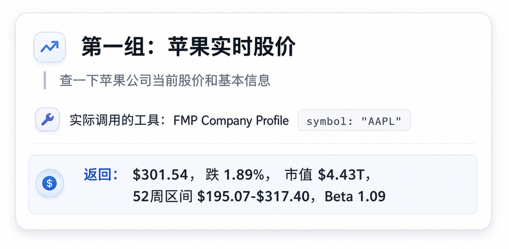
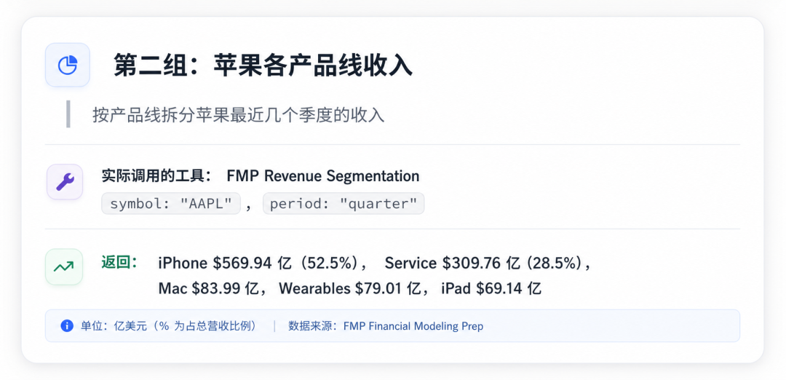
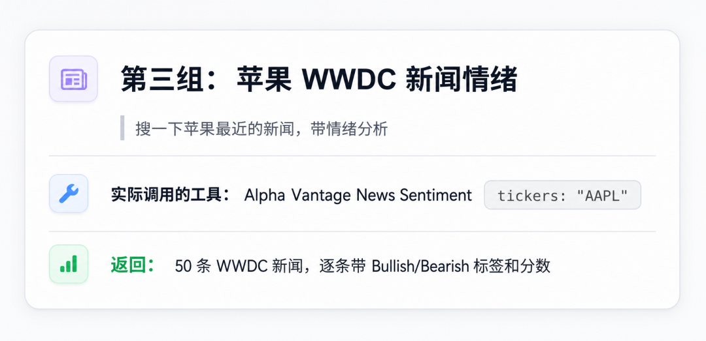
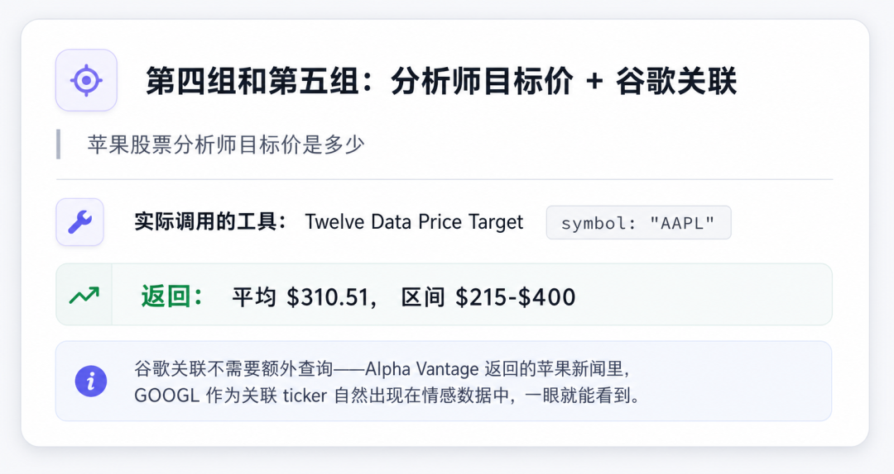
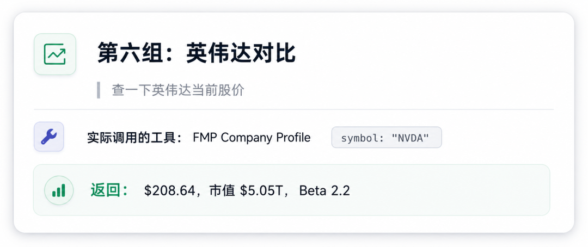
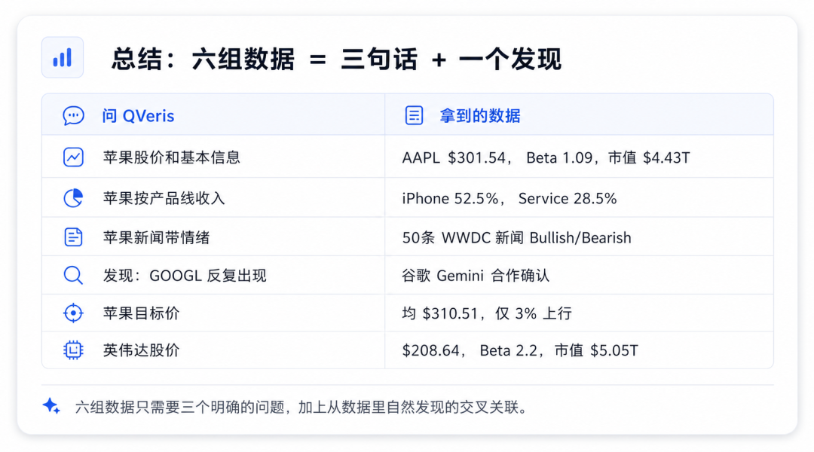

QVeris · Data Check

#  

In the early hours of June 9 Beijing time, Apple held WWDC 2026 as scheduled. Siri was renamed “Siri AI,” Google Gemini was integrated, and Apple Intelligence began rolling out across the ecosystem. This should have been Apple’s most important keynote in three years.

But one detail stood out: during the event, Apple’s stock went from being up more than 3% to closing in the red, down 1.89% at \$301.54.

What follows is not gut-feel analysis. I used QVeris to call six sets of interfaces and lay out Apple’s hand as it stands today.
##  

##  

##  

##  

##  

##  

## Set 1: Where the Stock Price Stands

Start with real-time data from FMP. Apple is currently at \$301.54, with a market cap of \$4.43 trillion, a 52-week range of \$195.07 to \$317.40, and a beta of 1.09. In other words, the stock is only 5% below its all-time high. It is no longer “cheap.”

Then look at Twelve Data’s analyst price targets: the average 12-month target is \$310.51, the median is \$310, the most optimistic target is \$400, and the most pessimistic is \$215. With the current price at \$301.57, there is only about 3% upside to the average target. Institutions had already priced in most of the expectation.

That explains why the “keynote rally” did not last: the good news was already priced in, and the stock had no room for mistakes.
##  

##  

##  

##  

##  

## Set 2: How Important the iPhone Really Is

Using FMP’s revenue breakdown interface, here is Apple’s latest quarterly product mix, for FY2026 Q2 ending March 28, 2026:

Compared with the previous quarter, FY2026 Q1 holiday season, iPhone revenue fell sharply from \$85.269 billion to \$56.994 billion. That is normal seasonality. The key point is this: **Services revenue has stayed above \$30 billion for four consecutive quarters**, rising from \$24.213 billion in 2024 Q3 to \$30.976 billion now, a 28% increase.

The continued growth of services is the most solid part of Apple’s valuation because it is not tied to the device replacement cycle. But the reverse is also true: if AI cannot drive upgrades, the iPhone, which still represents half the business, becomes a drag.
##  

##  

##  

##  

##  

## Set 3: What the Market Is Saying: Sentiment Breakdown

Using Alpha Vantage’s news sentiment interface, I pulled 50 AAPL-related news items around WWDC and analyzed the sentiment labels one by one:

**Bullish signals (Bullish / Somewhat-Bullish):**

- Reuters: “Apple unveils AI-powered Siri” — overall Bullish (0.42), AAPL-related sentiment Bullish (0.44)

- SiliconANGLE: “Siri AI as personal assistant built on Gemini” — AAPL sentiment Bullish (0.47)

- NBC News: “Apple renames Siri as &#x27;Siri AI&#x27;” — AAPL sentiment Bullish (0.47)

- Inc.com: “New Siri AI represents make-or-break moment” — AAPL sentiment Somewhat-Bullish (0.32)

**Bearish signals (Somewhat-Bearish):**

- 24/7 Wall St.: “Apple Finally Released A Brand-New Siri. Then Its Share Price Cratered.” — AAPL sentiment Somewhat-Bearish (-0.26)

- Epic Games antitrust: “Epic opposes Apple petition for certiorari” — AAPL sentiment Somewhat-Bearish (-0.33)

Overall, the media response to Siri AI itself is positive. But the narrative around the stock decline has already taken on a life of its own. The market is no longer asking “does Apple have AI?” It is asking “when will it ship, and how much incremental growth can it generate?”

##  

## Set 4: Who Siri AI Really Depends On: Google and Nvidia

## Alpha Vantage’s sentiment data also reveals another layer of the story: GOOGL appears repeatedly in AAPL-related news. Apple Intelligence’s backend model relies on Google Gemini, and Apple publicly confirmed the partnership during the keynote.

Then look at Nvidia. NVDA is currently at \$208.64, with a market cap of \$5.05 trillion and a beta of 2.2, twice Apple’s beta. When Apple mentioned “the most advanced cloud models” during WWDC, it did not name Nvidia, but inference compute demand is hard to separate from Nvidia GPUs.

In other words, Apple is not the only beneficiary of the Siri AI story. **Google gets a top-tier device entry point, while Nvidia continues collecting rent behind the scenes as the compute infrastructure provider.** This is another hidden reason Apple’s stock weakened: the market is breaking apart the value chain and finding that Apple is not the only winner.
##  

## Set 5: What Price Analysts Are Actually Putting on Apple

Twelve Data’s price target data shows a 12-month average target of \$310.51 versus the current price of \$301.57, implying only 3% upside. The most optimistic institution is at \$400 (+33%), while the most pessimistic is at just \$215 (-29%).

That divergence is the point. The market has no consensus on the core assumption behind an AI-driven upgrade cycle. Bulls believe Siri AI can create a replacement wave similar to 5G. Bears believe the AI features are still not enough to make users spend another \$1,000 on a new phone.
##  

## Set 6: The Real Narrative on Keynote Day

## Put the six data sets together, and Apple’s problem today is not whether its AI is good. It is facing three more specific tensions:

**Tension one: a high stock price versus a price-target ceiling.** The \$301 price had already absorbed most WWDC expectations, while the average analyst target of \$310.51 implies extremely limited upside. The keynote needed to beat expectations. Merely meeting them was not enough.

**Tension two: the upside from Siri AI is being split across multiple players.** Google earns the entry point, Nvidia earns the compute, and Apple earns the device upgrades. Whether the last link in that chain actually works depends on real iPhone sales this fall. A story that can only be verified six months later is difficult to use as support for the stock on keynote day.

**Tension three: services growth is certain, but the iPhone remains the valuation anchor.** Services revenue growth of 28% is solid, but the iPhone accounts for 52% of revenue. Whether AI-driven upgrades happen will directly determine Apple’s revenue ceiling over the next two years. Tim Cook’s final WWDC pointed Siri AI in a clear direction, but whether John Ternus can execute after taking over is a separate question.

## The Six QVeris Data Checks at a Glance

Every data set can be traced back to its source, timestamp, and original link. This is not “we believe.” It is “the data shows.”
##  

## Final Thoughts

## Apple’s WWDC made one thing clear: the company is no longer trying to build the largest model itself. Instead, it is turning its devices and operating systems into a distribution layer for AI capabilities. Siri AI + Gemini is the first step in that strategy.

But the capital market is not asking for direction. It wants pace and numbers. After the keynote, Apple has entered a period of being tested: the new iPhone launch this fall, the official rollout of Siri AI, and the first wave of user feedback will be the real exam.

Until then, Apple’s \$301 stock price does not need more imagination. It needs more evidence.

**  
**
