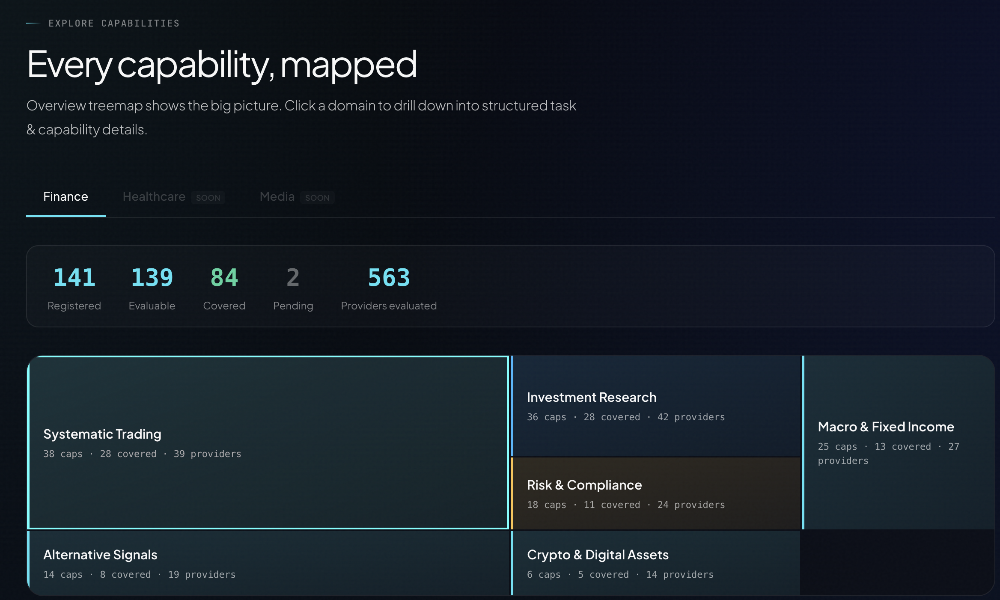
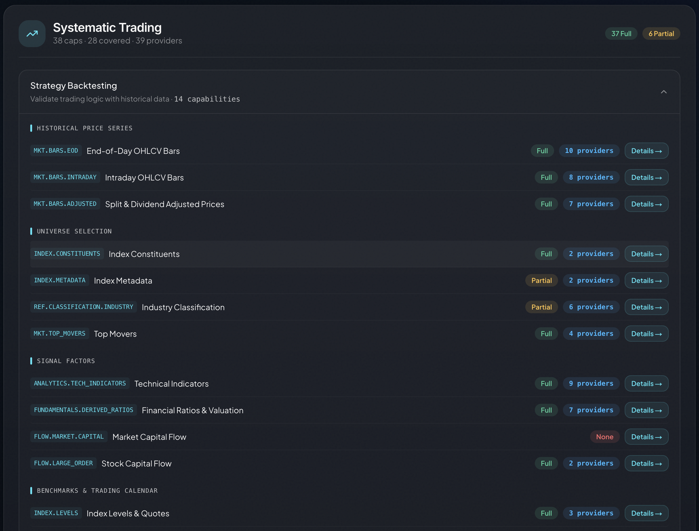
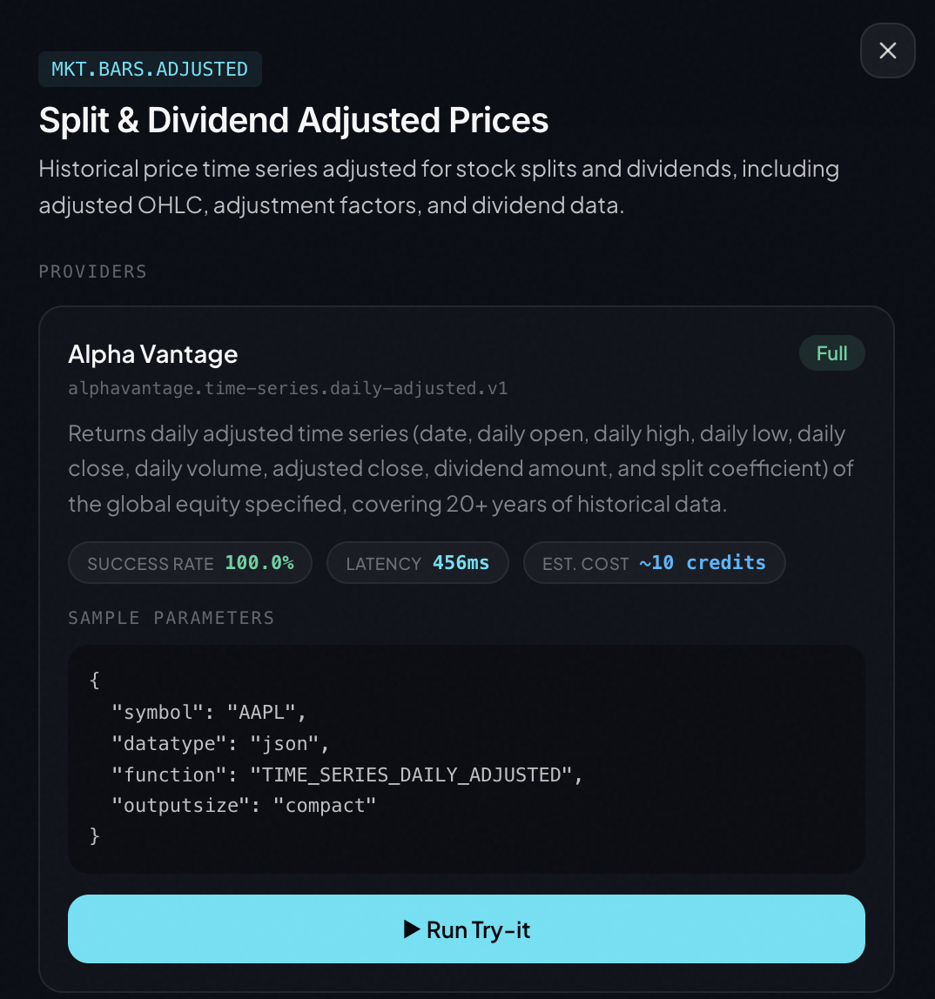

AI agents are evolving from conversational tools into action engines. But a fundamental question remains unsolved: **how does an agent know what it can do?**

Today we're launching **Capability Explorer** — an interactive coverage map that lets developers and agents browse, inspect, compare, and live-test every real-world, verified capability in the QVeris network.

Try it now: [qveris.ai/capabilities/explore](https://qveris.ai/capabilities/explore)

---

## The Problem

Traditional API directories are flat lists. You search a keyword, get a wall of endpoints, then spend hours reading docs, debugging parameters, and comparing providers.

For AI agents, this is even worse — they can't browse documentation. They're limited to whatever APIs a developer hardcoded into their configuration. The result:

- **Capabilities locked in config files** — agents only call what developers pre-wired
- **No awareness of new capabilities** — even if QVeris adds 50 new data sources, the agent doesn't know
- **No quality or cost decisions** — three providers offer the same capability, but which has the best success rate? Lowest latency? Cheapest cost?

Capability Explorer solves all three.

---

## What Capability Explorer Does

The Explorer organizes QVeris's entire capability network into a navigable, five-layer interactive map:

| Layer | What it shows | User action |
|---|---|---|
| **Treemap overview** | 6 finance domains, sized by capability count | Click to drill down |
| **Task structure** | Tasks and capabilities within each domain | Expand tasks, browse capabilities |
| **Provider details** | All providers with quality metrics per capability | Compare success rate, latency, cost |
| **Live execution** | Real API calls with structured JSON results | Click "Run Try-it" to execute |
| **Infrastructure** | Cross-domain capabilities (search, OCR, translation) | Browse shared foundations |



---

## Finance First: 138 Capabilities Across 6 Domains

The first release covers **finance** — QVeris's most mature vertical, with 138 registered capabilities and 73 fully covered by verified providers.

**Systematic Trading** — Backtesting, execution algorithms, order management, strategy simulation.

**Market Data** — Real-time quotes, historical bars, corporate actions, index constituents. Multi-market coverage (US, HK, A-shares).

**Risk & Compliance** — VaR calculations, stress testing, regulatory checks, AML screening.

**Investment Research** — Fundamental analysis, earnings data, analyst ratings, earnings estimates.

**Alternative Signals** — Sentiment analysis, satellite data, web scraping, social media signals. Alpha beyond traditional data.

**Crypto & Digital Assets** — Spot/derivatives data, on-chain analytics, DeFi TVL, token metrics.

> Healthcare and Media domains are already visible in the Explorer with a "SOON" badge — expanding coverage is on the roadmap.



---

## Quality Signals: Help Your Agent Choose Wisely

Each provider in the Explorer comes with a complete quality profile — not just a Tool ID:

**Success Rate** — Historical success percentage, color-coded:

- 🟢 ≥95% (reliable) / 🟡 80-95% (acceptable) / 🔴 <80% (caution)

**Average Latency** — Typical execution time in milliseconds

**Estimated Cost** — Credits consumed per call (1-100 credits, priced by data value)

**Call Count** — Total historical invocations — the most direct proof of verification

**Provider Grade** — FULL / GOOD / PARTIAL implementation completeness

When three providers offer the same capability, your agent can route to the one with the highest success rate, lowest latency, or lowest cost. This isn't an API directory — it's a **capability routing dashboard**.



---

## Try-It: Live Execution, Not Mock Data

After browsing capabilities and comparing providers, you can **run real API calls** directly in the Explorer.

Each provider card has a **"▶ Run Try-it"** button. Click it to:

1. Use pre-filled sample parameters (or customize)
1. Execute against the real provider API
1. Run in a sandboxed environment
1. Get structured JSON results back

```json
{
  "symbol": "AAPL",
  "price": 192.53,
  "change": 2.15,
  "volume": 54382100,
  "timestamp": "2026-04-10T15:30:00Z"
}
```

This is not simulated data. These are real-world, verified capabilities running in real time.

---

## From Explorer to Code

Found a capability you want? Integration takes one step.

**QVeris CLI (recommended):**

```bash
qveris discover "real-time stock price API" --json
qveris inspect 1 --json
qveris call 1 --params '{"symbol":"AAPL"}' --json
```

**MCP Server (for Cursor, Claude Desktop):**

```bash
npx @qverisai/mcp
```

**Python SDK:**

```python
from qveris import QVerisClient
client = QVerisClient(api_key="your-key")
results = client.search("stock price API", limit=5)
response = client.execute_tool(
    tool_id="polygon.stocks.eod.v2",
    parameters={"symbol": "AAPL"}
)
```

---

## What's Next

Finance is the starting point. The Explorer already previews two upcoming verticals:

- **Healthcare** — Clinical trials, drug information, medical literature
- **Media** — Image/video generation, text-to-speech, content moderation

---

## Get Started

- **Explorer:** [qveris.ai/capabilities/explore](https://qveris.ai/capabilities/explore)
- **Docs:** [qveris.ai/docs](https://qveris.ai/docs)
- **GitHub:** [github.com/QVerisAI/QVerisAI](https://github.com/QVerisAI/QVerisAI)
- **API Key:** [qveris.ai/account](https://qveris.ai/account?page=api-keys) — free, 1,000 credits on signup

---

## About QVeris AI

QVeris AI builds **action infrastructure for the agent era** — a semantic search and execution engine that lets AI agents discover and call 10,000+ real-world, verified tools through a single interface.

**Products:**

- **QVeris CLI** — Universal API gateway from the terminal
- **QVeris MCP Server** — Tool gateway for IDE agents
- **QVerisBot** — Production-grade AI assistant built on OpenClaw
- **QVeris REST API** — Standard HTTP interface for any language and platform

**Website:** [https://qveris.ai](https://qveris.ai)

**GitHub:** [https://github.com/QVerisAI/QVerisAI](https://github.com/QVerisAI/QVerisAI)

**X (Twitter):** [@QVerisAI](https://x.com/QVerisAI)
