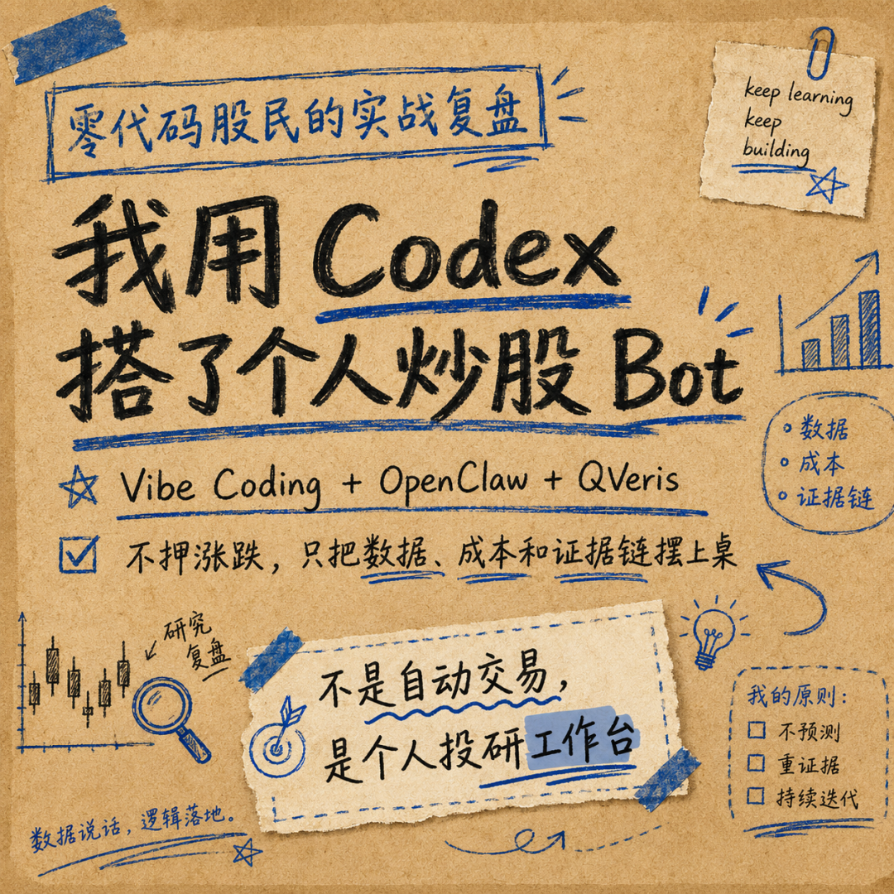
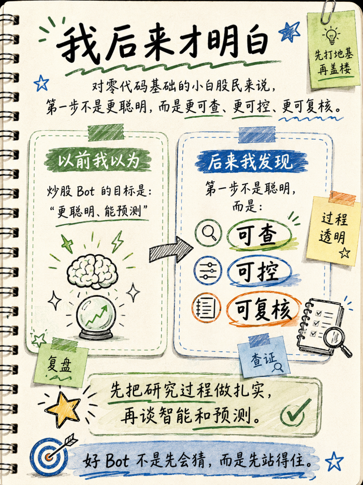
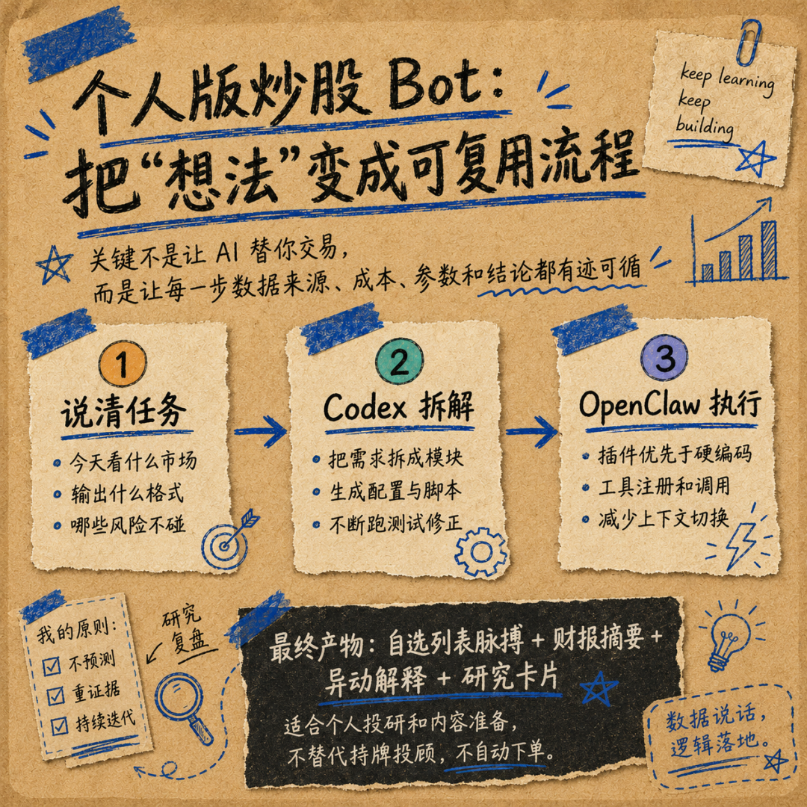
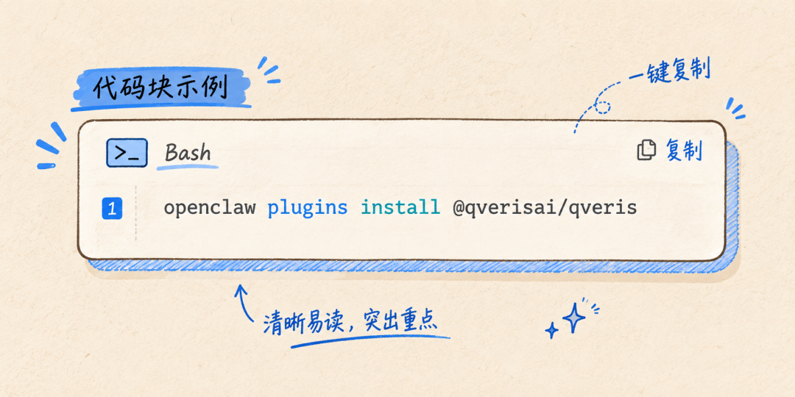
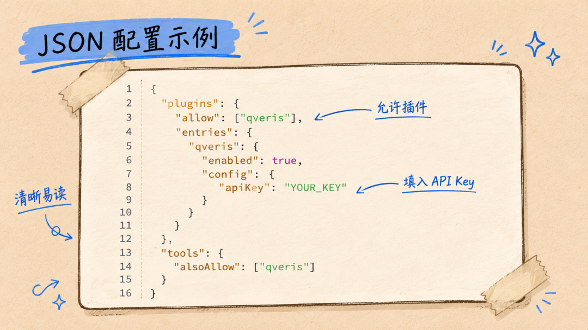
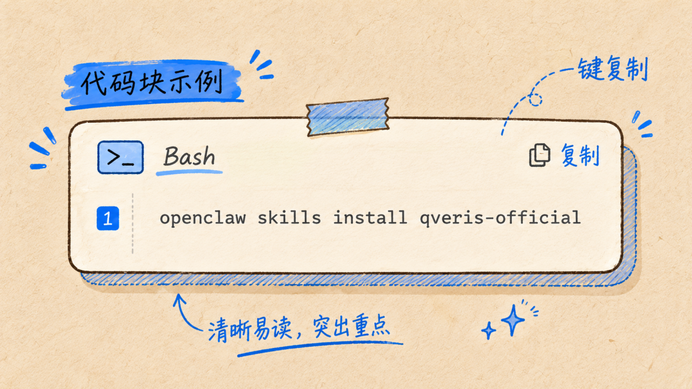
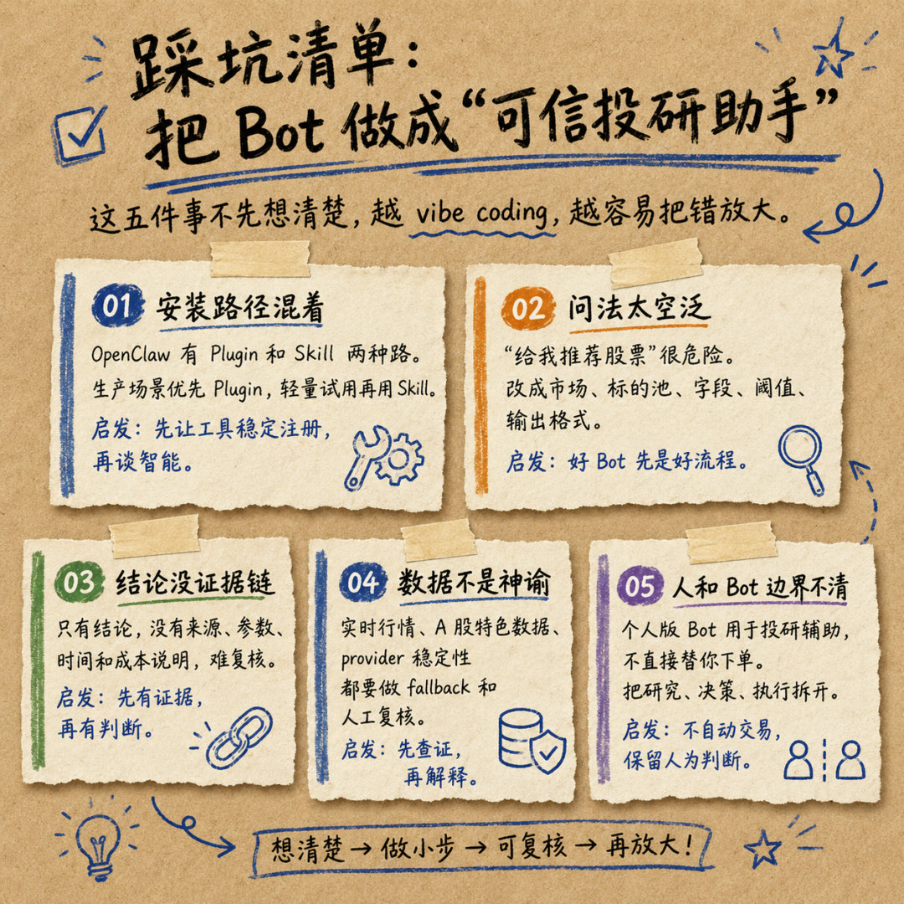
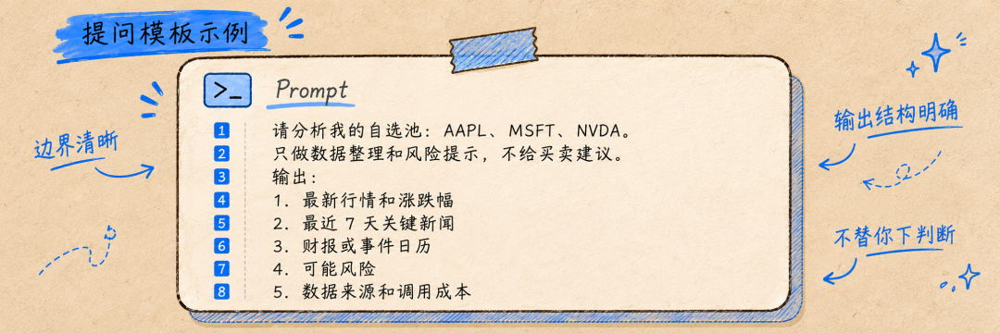
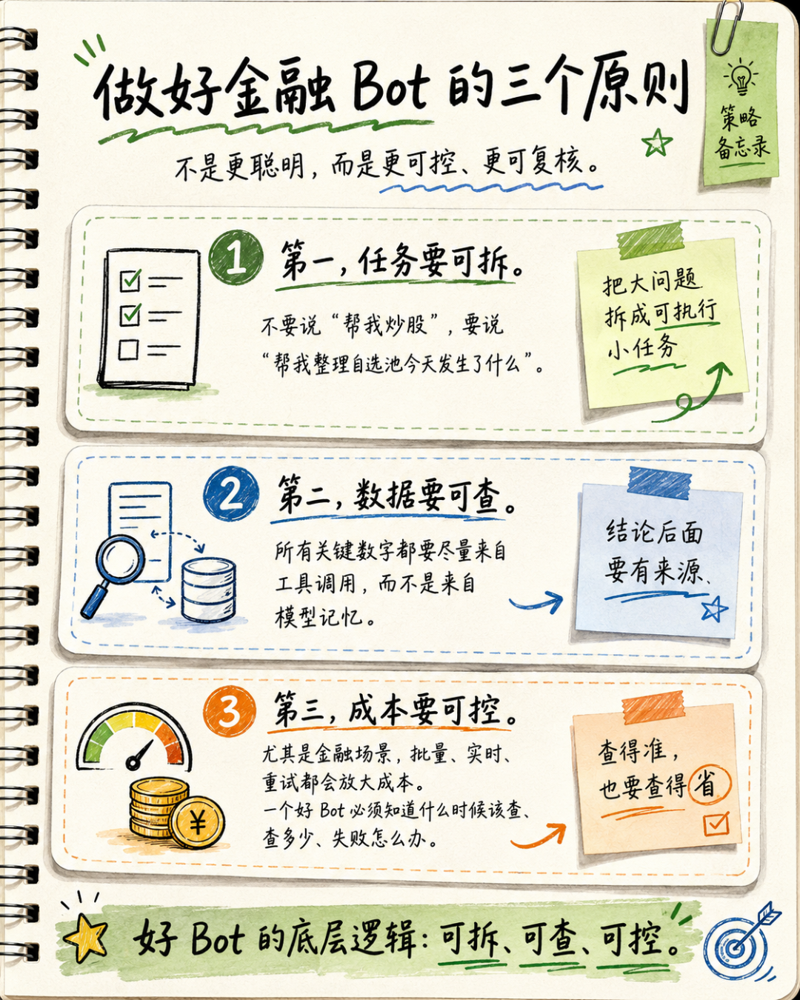
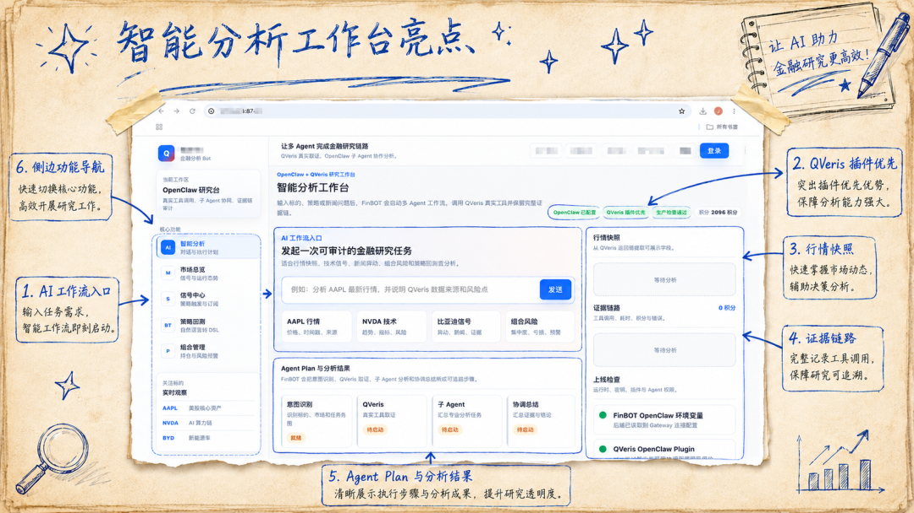

QVeris · Data Tested

Let me say this upfront: this is not investment advice, and it is not a tutorial on “making money with automated AI trading.”

I used to fantasize about building an AI stock-trading Bot that could predict limit-up moves with one click and let me sit back while the gains rolled in. After actually building and testing it, I realized something much more grounded: profitable strategies still depend on human experience and judgment. What AI is genuinely useful for is putting individual stock data, research costs, and information sources out in the open, then turning them into a private research tool that can be reviewed and traced.

What I eventually built is more accurately described as a personal investment research Bot. I use it to organize my watchlist, check market quotes, read financial reports, find news, explain unusual price moves, and record how many credits each call costs.

It does not trade for me, and it does not make mystical claims like “this will definitely rise tomorrow.”

## First, the Goal: What My Bot Can Do

I defined four everyday tasks for it:

1.**Watchlist pulse**: Enter a group of stocks or ETFs and get the latest price, percentage change, volume, abnormal moves, and possible reasons.

2.**Earnings summary**: Turn company financial data, market reaction, and key news into a one-page memo.

3.**Unusual move explanation**: When a ticker suddenly rises or falls sharply, check data and news first, then summarize possible triggers.

4.**Call ledger**: Record which tool was used, which provider handled it, how many credits it cost, and whether the call failed.

On the surface, it looks like a financial assistant you can chat with.

But what I really care about is the workflow behind it: every answer should, as much as possible, go through `Discover -> Inspect -> Call`. It first finds a tool, then checks the tool’s inputs and outputs, success rate, cost, and limitations, and only then executes the call. This workflow comes from QVeris’s core protocol. It does not ask AI to answer from memory. It asks the Agent to discover and call real-world financial data capabilities.

### Why Not Just Ask a Large Language Model Directly

At the beginning, I also tried asking directly:

>
>  “Help me analyze Apple and Nvidia. Which one is more worth buying?”
>
The answer was smooth, but the problem was obvious: it might not know the latest market data, it might not know the data source, and it might even invent numbers that “look reasonable.”

With stock investing, the scariest thing is not that AI cannot talk. It is that AI can talk too well. A fluent conclusion with no source is far more dangerous than a simple “I can’t find that.”

So I changed the way I asked:

>
>  “Please first use QVeris to search for suitable tools to retrieve AAPL’s latest quote, market cap, and fundamental summary. Before execution, tell me the tool ID, estimated cost, and input parameters. After execution, output the data source, call result, and risk notes.”
>
At that point, the large model would search first, then explain, showing the execution process step by step before giving me the result. It felt like a white-box bot, but it still was not automatic or intelligent enough.
## Then, the How: Assemble the Tool Stack and Let AI Handle the Rest

To build this BOT, I used three parts of the tool stack:

**Codex: turning natural language into engineering steps.**

I do not know how to code, so I describe goals in plain language, such as “make a daily watchlist report,” “turn the output into a table,” or “do not give buy or sell advice.” Codex breaks down the task, writes configuration, modifies scripts, and runs validation.

**OpenClaw: hosting the Agent.**

OpenClaw is responsible for making the assistant run, managing tool calls, context, and workflows. For a beginner like me, OpenClaw feels like an extensible Agent container.

**QVeris: handling financial data and tool routing.**

This is the key part. QVeris provides a capability discovery and invocation layer, not just a single financial data API. QVeris supports 10,000+ verified capabilities across financial markets, economic indicators, company financials, news, crypto assets, and more. OpenClaw can connect to QVeris in multiple ways, including Plugin and Skill.

After stepping through the pitfalls, my recommendation is: **use Plugin first for production or long sessions, and use Skill for lightweight trials.**

The official OpenClaw Setup documentation gives this Plugin installation method:

Then allow the plugin and configure the API key in `openclaw.json`:

The Skill path also works:

But the official documentation is also very clear: Plugin registers tools at runtime and does not compete with the prompt context for space. Its parameters are also easier to validate with JSON Schema. For a beginner like me who can easily mess up configuration, this matters a lot.
## Pitfalls I Ran Into

### Pitfall 1: I Asked Questions That Sounded Too Much Like Wishes

>
>  Asking overly broad questions forces AI to make things up
>
A prompt like “help me find stocks that will rise tomorrow” is essentially asking AI to tell a story.

A better prompt defines the research targets, required data fields, screening thresholds, final output format, and explicit prohibitions.

Once I made the objective, scope, output format, and forbidden behaviors clear, the Bot immediately became much more useful.

### Pitfall 2: Reading Only the Answer, Not the Tool\*

>
>  Focusing only on the analysis while ignoring the evidence chain behind it
>
At first, I only looked at the Bot’s analysis and did not care where the data came from. That meant I could receive wrong information without realizing it. The real value of calling QVeris tools is not just that they can “find data.” It is that they preserve the full call trace: every data retrieval marks the data source provider, interface stability, latency, billing rules, and remaining credits. Now I make my Bot follow a principle: any conclusion without source evidence is invalid. This completely prevents false data from interfering with judgment. This is very important, because with financial data, more is not automatically better. You need to know:

- Which data source was used this time?

- What were the success rate and latency like?

- Was there any charge if the call failed?

- Can this answer be traced back to where it came from?

- How many credits did it cost?

### Pitfall 3: Mistaking a “Data Source Gap” for “AI Is Not Good Enough”

>
>  Blaming missing data on weak AI capability
>
Many times, when the Bot’s analysis was wrong, the issue was not that the large model was not capable enough. It was that a data source interface was unstable, or that some data interface was missing. After that, I constrained the Bot so that key A-share data must use QVeris capability map interfaces, key data must be cross-checked, and abnormal data must be manually reviewed. This solved most of the data failure cases. During this round of vibe coding, as my Bot called more QVeris tools, I increasingly felt that QVeris should not be understood as “just another data API.” It is more like the routing layer, governance layer, and audit layer for Agents calling financial capabilities.

### Pitfall 4: Having No Budget Awareness

Checking three stocks once is one thing. Scanning 5,000 stocks in bulk is something else entirely.

I later added a very simple rule to the Bot: before executing any batch task, first list the estimated number of calls, per-call cost, failure handling method, and whether the work needs to be split into batches. This rule changed it from an “enthusiastic assistant” into a “budget-aware assistant.” Once, during a task, it became “less smart” and repeatedly executed calls, wasting credits. I gave it a stern warning, and the Bot immediately recorded a “lesson learned” for itself, reinforcing this principle.
## The Most Valuable Takeaway

My biggest takeaway from this experiment is that I no longer treat AI tools as an all-purpose black box. I do not completely outsource my own judgment and intelligence to AI. Instead, I break the tool apart, understand its execution logic, and spar with it. I split its execution process into three things:

For zero-code users, the value of Codex vibe coding is not that it turns me into a programmer overnight. It is that it lets me explain a workflow more and more clearly in natural language. Codex helps turn that workflow into configuration and scripts. OpenClaw makes it a runnable Agent. QVeris lets it touch real financial data and tools.
## Who This Is For, and Who It Is Not For

Suitable for:

Ordinary investors who want to build a personal watchlist daily report, review assistant, or earnings summary tool.

Individual developers who want to connect financial data to an Agent.

People who want to use natural language for investment research support, but do not want AI to fabricate data.

People who want to try Agent toolchains such as OpenClaw, Codex, MCP, and CLI.

Not suitable for:

People looking for a “sure-win strategy.”

People who want a Bot to place orders automatically.

People unwilling to look at data sources, costs, and risk notes.

People who treat AI answers as investment advice.
## Final Thoughts From a Beginner

Here is a look at my bot. It is still very rough, and I am still polishing and tuning it.

I used to think the hard part of building a stock-trading Bot was “how to make AI smarter.”

Now I think the real challenge is: how to stop AI from acting recklessly.

The value this Bot gives me is not some magical conclusion. It is turning the process of an Agent calling financial data into a workflow that can be discovered, understood, executed, and audited.

That is enough.

Because the person who should make the final decision is still me.

## Appendix: Sources

- This article does not constitute investment advice and does not provide any buy or sell points, return promises, or automated trading recommendations.

- Public references: QVeris OpenClaw Setup documentation, the official QVeris Skill for OpenClaw blog, QVeris Skill Hub, and the QVerisBot page.
