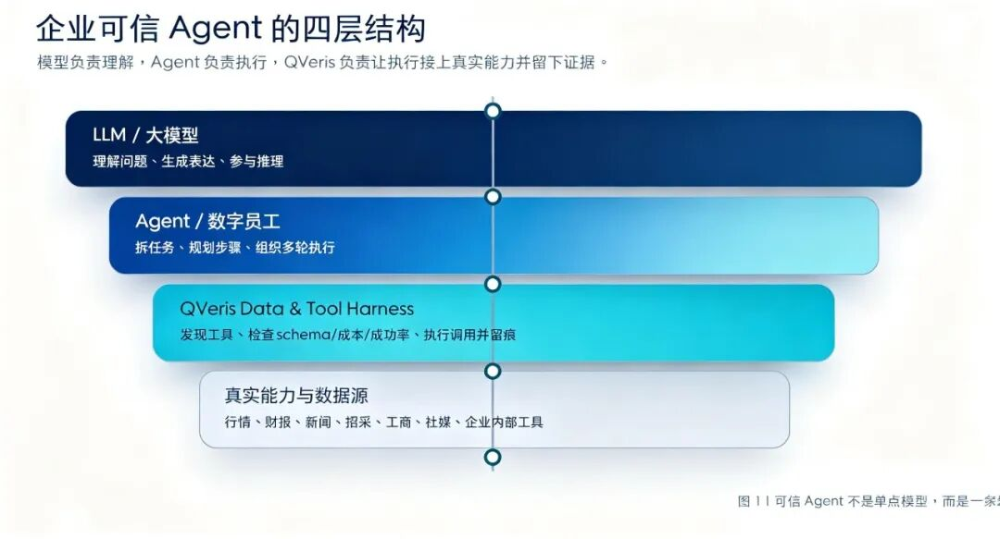
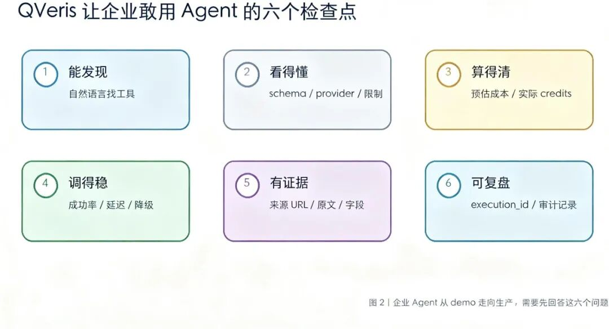
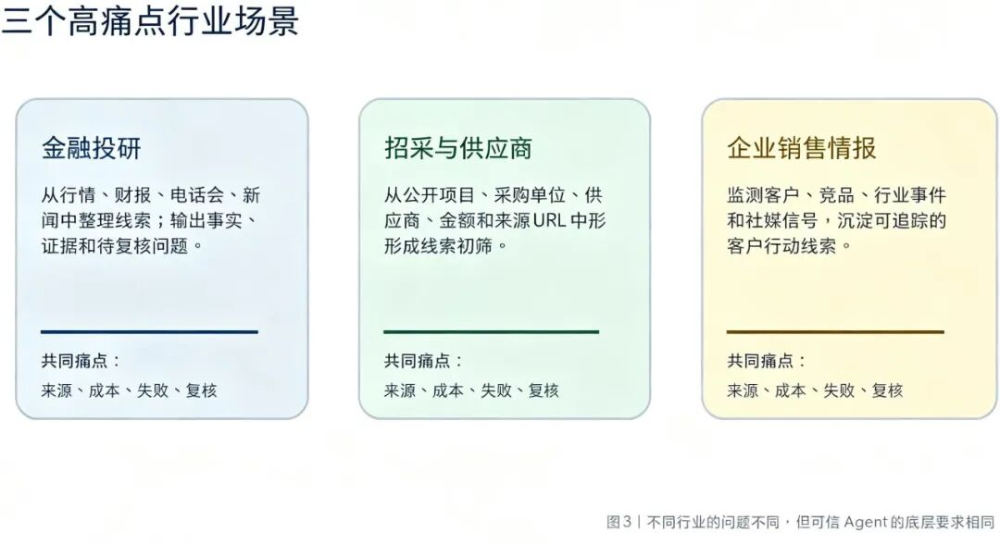

QVeris · Technical Deep Dive

>
> **One-sentence summary**
>
> Enterprises do not avoid Agents because they lack interest. They hesitate because they cannot put black-box Agents into critical workflows. The value of QVeris is to make Agents discoverable, inspectable, executable, and traceable when they call real-world capabilities.
>
## For AI to Enter Business Workflows, the Missing Piece Is Not Answers, but Evidence

Many enterprises are impressed the first time they try an AI Agent demo.

With a single instruction, the system starts planning tasks, searching for information, calling tools, and generating reports. It looks like a tireless digital employee.

But as soon as the Agent needs to enter a real business workflow, the hard questions appear: What did it look up? Which tool did it use? Where did the result come from? How much did it cost? Was there a record when it failed? Six months later, can the team reconstruct the basis for its judgment?

Enterprises are not unwilling to use AI. They are unwilling to place black-box AI inside critical workflows.

This is where QVeris has a clear role: when AI moves from "can chat" to "can get work done," the key capability is not only a stronger model. It is a Data & Tool Harness that can manage tools, data, costs, sources, and auditability.

>
> Core view
>
> Large models handle understanding and expression. Agents break down tasks and execute them. QVeris connects that execution to real-world capabilities and makes the process controllable, trustworthy, and reviewable.
>

Figure 1 | The four-layer structure of a trustworthy enterprise Agent
## Why Ordinary Agents Struggle to Enter Enterprise Workflows Directly

The biggest problem with ordinary Agents is not that they cannot write polished answers. It is that their execution process is hard to manage.

In real business settings, Agents often need to connect to market data, financial reports, news, disclosures, company registries, procurement data, social media, internal systems, and other tools. Each tool has different fields, permissions, pricing, and failure modes. Without a unified mechanism for discovery, inspection, and traceability, an Agent can easily turn from an "automation assistant" into an "automation risk."

- Opaque tool selection: The Agent does not know which data source to prioritize, or whether a given tool is suitable for the current task.

- Uncontrolled cost: Once batch tasks run, call volume, credits, and retry costs can scale quickly.

- Untraceable sources: The report may look convincing, but key facts cannot be traced back to the original disclosure, source excerpt, or call record.

- Unreviewable failures: After an error, it is difficult to determine whether the cause was invalid parameters, insufficient permissions, an unavailable data source, or a task that was not suitable for that tool in the first place.

- Risk that cannot be handed off: Scenarios such as finance, risk control, sales, and supply chain all require human review checkpoints, rather than handing the final judgment entirely to the model.
## QVeris Provides the Harness, Not Another Chat Window

QVeris breaks the act of calling real capabilities through an Agent into three steps: Discover, Inspect, and Call.

| Step | What the Agent does at this step | Value for the enterprise |
| --- | --- | --- |
| Discover | Searches for candidate tools, data sources, and capabilities based on the task | Teams do not need to know which API to connect from the start, reducing trial-and-error and integration costs |
| Inspect | Checks parameters, fields, provider, success rate, latency, cost, and limits before calling | Avoids blind calls by first determining whether the task can be done, how it should be done, whether it is expensive, and whether it is reliable |
| Call | Executes the real tool and returns structured results and execution records | Lets key facts come from real data while retaining source, cost, and execution_id |

These three steps may look simple, but they determine whether an Agent can move from demo to production. Enterprises do not just need "AI that sounds right." They need to know "what AI did, what it was based on, and whether problems can be investigated."

Figure 2 | Six checkpoints enterprises need to answer before they can trust Agents
## Scenarios: Three High-Pain Industry Use Cases

Figure 3 | Different industries have different problems, but trustworthy Agents share the same underlying requirements
## These Industries Look Different, but the Underlying Problems Are the Same

| Industry / Scenario | What the Agent needs to accomplish | Biggest concern | Layer QVeris can provide |
| --- | --- | --- | --- |
| Financial research | Organize market data, financial reports, earnings calls, news, and risk signals | Conclusions have no data source and can drift into investment advice | Tool discovery, call traceability, evidence ledger, human review |
| Procurement / Suppliers | Discover projects, purchasing entities, suppliers, amounts, and contact clues | Entities are mixed together, source URLs are missing, and the compliance boundary for contact information is unclear | Company-level queries, source evidence, field standardization, masked display |
| Sales intelligence | Track customers, competitors, official accounts, social media, and industry events | There are many hot topics but too much noise, making them hard to turn into actionable leads | Multi-platform content tools, publication time, original links, lead assignment |
| Risk control / Compliance | Verify entity background, anomaly signals, public events, and risk changes | The basis cannot be reviewed, and false positives or false negatives are hard to explain | Auditable call chain, failure records, evidence grading |

## The Real Bar for Trustworthy Enterprise Agents

Enterprises will not lack AI tools in the future. What will remain scarce is AI that can enter workflows, be managed, and be reviewed.

A trustworthy Agent must meet at least six conditions: it can discover tools, understand tools, calculate costs, call data reliably, produce evidence, and support audit and review.

This is where QVeris sits. It does not replace large models, nor does it make final judgments on behalf of business experts. It is closer to the tool library, operating manual, cost ledger, and evidence trail behind the Agent.

When enterprises ask, "Can AI enter real business workflows?", the answer should not be just a demo video. A better answer is a reproducible execution chain: from task to tool, from tool to data, from data to evidence, and from evidence to human review.
## Closing: From Answering Questions to Getting Work Done, AI Needs a Harness in Between

Over the past two years, we have seen plenty of AI that can answer questions. What matters next is AI that can get work done, be managed, and be reviewed.

The logic of QVeris is not "we also have many tools." It is "we help Agents know which tools to use, how to use them, how much they cost, where the results came from, and how to trace problems when they occur."

The endpoint of trustworthy enterprise Agents is not to make AI look smarter. It is to make every execution defensible.

Because in real business, trust is never built by a single sentence. Trust comes from evidence, from boundaries, and from a process that can be reviewed.

>
> AI no longer only answers. It is beginning to get work done, and the process of that work can be seen.
>
