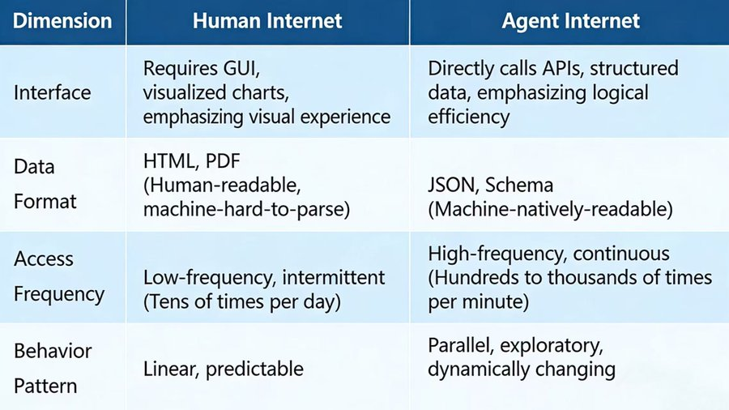

## Today, AI models are becoming increasingly intelligent.

But a very real question remains:

**Can we actually trust AI to execute important tasks directly?**

ChatGPT, Doubao, or Yuanbao can help you check the weather or book a flight —

but would you trust them to make investment decisions?

The core issue is not that large models are not powerful enough.

It’s that they still lack true perception of, and the ability to act within, the real world.

To produce a genuinely useful financial analysis report, static knowledge encoded during model training is far from sufficient.

A large model must continuously and dynamically access up-to-date policies, news, industry data, public sentiment, and real-time market information — and then apply professional financial tools to perform precise calculations.

Only then can it generate an analysis that is actually usable.

The reality today is that while large models are highly intelligent — with strong capabilities in understanding, reasoning, and planning — they are effectively **blind and powerless** in the digital world.

Like a “Brain in a Vat” they are trapped: unable to efficiently, conveniently, and cost-effectively perceive or operate the real world.

To truly solve this problem, models need to be connected to a **perception-and-action infrastructure layer**, allowing them to become genuine super-agents — capable of seeing, deciding, and acting in the digital world.

## QVeris AI: Building Infra for the Agent Era

A startup called **QVeris AI** is focusing precisely on this Infra layer of the Agent era.

The company is building native search and action-routing engines for Agents.

As of now, QVeris AI has reportedly raised nearly RMB 10 million in seed round financing.

If embodied intelligence gives AI a “body” to interact with the physical world, then what QVeris AI is building is the **eyes, ears, hands, and feet of Agents in the digital world**.

**Once connected to this infrastructure, large models and Agents can autonomously search for data, invoke tools, and truly interact with the real digital environment.**

> “In simple terms, what we are building is an AI-ready digital twin engine — one that exposes all open services, resources, and capabilities in a form that large models and Agents can use directly.
> This enables fast, efficient, low-cost, real-time discovery and invocation of professional, authoritative, and trustworthy data and tools.”— Wang Linfang, Founder & CEO of QVeris AI

## Why Can’t Agents Connect to the Real World?

The internet’s data and tool ecosystem was designed for humans — not for Agents.

Agents lack a unified, trustworthy, and standardized supply layer.

Today, expertise and tools are scattered across platforms: finance, investment, computation, compliance, SaaS systems — all siloed.

Take financial investing as an example.

If you’re deciding whether to invest in gold, Bitcoin, stocks, or bonds, this is already a complex task even for humans.

A person might consult bank managers, financial advisors, investment experts, and read online analyses before making a decision.

The common approach today is to let large models run in “deep research” mode, or rely on specialized financial Agents to gather information and generate recommendations.

But here’s the real question:

**Can today’s Agents truly handle massive cross-platform data queries, comparisons, paid vs. free information, and multi-vendor integration?**

In reality, Agents are still at an early technical stage.

Without access to real, trustworthy, high-quality data, the reports they generate may be incorrect — or simply low quality.

Even the most advanced Agent products today typically connect to only dozens or, at most, a few hundred data sources and tools.

The cost, complexity, and time required to discover, evaluate, integrate, and maintain these resources remain extremely high.

When faced with professional-grade problems, AI often has no choice but to guess — relying on training-time memory rather than real-time authoritative data.

The biggest limitation of AI today is not intelligence —

it is being trapped in a world where it can **talk but not act**.

This is not the problem of any single model or product, but a **structural bottleneck across the entire Agent ecosystem**.

## AI Can Think, But Lacks “Action Infrastructure”

In fact, a broad consensus has already emerged across the industry:

large language models now possess remarkably powerful “brains” — strong capabilities in reasoning and planning — but they severely lack the “hands and feet” needed to perceive and change the real world.

To fill this gap, the market is shifting from isolated technical exploration toward systematic infrastructure building. Looking at the broader ecosystem, three major infrastructure paths are taking shape today:

**the standard protocol layer, the model compute layer, and the emerging “action infrastructure” layer.**

1. Standard Protocol Layer

The first category is the standard protocol layer, represented by initiatives such as **MCP (Model Context Protocol)** introduced by organizations like Anthropic.

These protocols define the “grammar” through which AI communicates with the external world, addressing the problem of *how* connections should be standardized.

However, this merely lays down the pipes.

What flows through those pipes — **rich, usable, real-world tools and resources** — remains scarce.

2. Model Compute & Routing Layer

The second category is the model compute routing layer, with platforms such as **OpenRouter** as a representative example.

These platforms aggregate APIs from leading model providers worldwide, making it significantly easier for developers to access and switch between different sources of intelligence.

> “Platforms like these solve the supply problem of the ‘brain’ — they belong to the core compute layer,”
> Wang Linfang explains.
> “But for a complete Agent, having only a brain is far from enough.”

For Agents to truly land in real-world scenarios, they must operate within a complex, non-standardized, and highly fragmented environment.

This is precisely where **QVeris AI focuses: on action capabilities beyond the model itself** — transforming industry-specific skills and services into assets that AI can understand and invoke.

## From a Macro Perspective: A Shift in Operating Paradigms

From a broader technological perspective, we are undergoing a fundamental shift in how systems operate:

- In the **internet era**, it was *human search + human execution*
- In the early **LLM era**, it became *human-assisted + AI-generated*
- Now, we are entering a new phase:**Agent-driven resource orchestration + Agent-driven execution**

However, the existing internet was designed for humans — not for Agents.

This creates a significant **paradigm gap**.

Forcing Agents to operate on human-oriented websites and interfaces is inherently inefficient and highly unstable.

QVeris AI’s core positioning is rooted in this insight: to build an **“AI-Ready” digital twin of the internet**, designed specifically for large models and intelligent agents.

## Beyond Tool Aggregation: Reconstructing the Digital World

QVeris AI is not merely aggregating tools.

It is **restructuring the digital world itself**.

By deeply cleaning, modeling, and encapsulating open services, resources, and capabilities across the internet, QVeris AI transforms the traditional “web for human reading” into an **“internet of capabilities” optimized for machine invocation**.

This allows large models to search for and invoke professional data and tools **quickly, efficiently, at low cost, and in real time**.

The situation is strikingly similar to the early e-commerce market of the 2000s.

Back then, products were abundant, but the absence of unified payment, logistics, and trust systems made transaction costs extremely high.

What QVeris AI is building today — this “action infrastructure” — plays a comparable role in the Agent economy.

It functions as a **business operating system for the Agent era**, bringing together digital exchange products across domains and platforms, and connecting the full lifecycle from search and discovery to comparison, invocation, and transaction.

## A Future Where Agents Act at Machine Speed

In the future, when an Agent needs to retrieve the latest regulations, book complex travel arrangements, or invoke specific SaaS capabilities, it will no longer need to browse webpages like a human.

Instead, it will connect to the real world directly — **at machine speed — through QVeris AI’s infrastructure**.

This is not merely an architectural upgrade.

It is a critical step toward unlocking productivity in the age of intelligent agents.

## A Search Engine Built for AI: Finding Capabilities, Not Information

In the Agent track, top players often aim to build **AI-era super apps**, positioning themselves as the next generation of traffic gateways. With strong engineering capabilities and business development resources, Big Tech Companies tend to rely on in-house development or deep customization to directly integrate high-frequency, core data and services—such as maps, payments, or mainstream e-commerce platforms.

However, the complexity of the real world far exceeds what any single platform can cover.

For **core and highly exclusive scenarios**, building direct integrations is a reasonable choice. But for the **massive, long-tail set of professional tools and data** scattered across industries—such as industry-specific compliance checks, vertical SaaS operations, or real-time supply chain data—a **cross-platform, neutral action infrastructure** is clearly a more cost-effective and scalable system-level solution than integrating providers one by one.

For the vast majority of small and mid-sized Agent developers, the pain point is even more immediate. They often possess sharp insight into real-world scenarios, yet are constrained by limited engineering and business resources. Validating a single idea may require integrating dozens of different APIs, each involving authentication, debugging, and ongoing maintenance—an effort that is both time-consuming and costly.

As a result, developers urgently need ready-made infrastructure that can dramatically shorten development cycles and reduce validation costs to a minimum.

From this perspective, the primary bottleneck of the Agent era is no longer compute power or model intelligence—but **connection cost**.

If chatbots like ChatGPT solved the problem of AI thinking, then **QVeris AI is focused on solving the problem of AI acting**.

## Three Core Values Delivered by QVeris AI

By building an **AI-Ready digital twin engine**, QVeris AI provides developers with three core capabilities:

**• Semantic Discovery**

AI agents are no longer limited to a predefined set of plugins. Given complex user intent, QVeris AI leverages semantic understanding to match the most suitable tools or data sources from a massive resource pool—within seconds—enabling a shift from keyword-based search to intent-driven discovery.

**• Unified Execution**

What once required months of business negotiations and API integrations can now be reduced to just a few lines of code. Through a unified schema definition, QVeris AI abstracts away the heterogeneity of tens of thousands of underlying tools. Developers integrate once and gain access to thousands of standardized capabilities, dramatically lowering integration complexity.

**• Dynamic Resilience and High Availability**

This capability is critical for enterprise-grade Agent reliability. QVeris AI acts as an intelligent router: when a tool becomes unavailable due to network issues, service outages, or pricing changes, the system automatically identifies and switches to equivalent alternatives.

As Wang Linfang explains:

> “We integrate tools across the entire internet and provide both search and invocation capabilities, including ranking for Agent usage. For example, when one financial data provider becomes unavailable, the infrastructure can query equivalent alternatives such as other market data platforms. This ensures developers always have real-time fallback options and are not constrained by a single service provider.”

## From Search to Agent: A Long-Term Bet

Integrating search, invocation, evaluation, and transactions into a unified system is by no means a lightweight engineering task. Looking back at Wang Linfang’s career, her deep experience in search laid the foundation for this venture.

She earned both her bachelor’s and master’s degrees from the Department of Electronic Engineering at Tsinghua University, interned at Microsoft Research Asia during graduate school, and later joined Microsoft to work on the Bing search engine, where her responsibilities included large-scale web crawling, indexing, multimodal understanding, and knowledge graphs.

She later joined Opera News at an early-stage startup to build large-scale recommendation systems. In 2018, Wang moved to JD AI Research, focusing primarily on computer vision algorithms and applications. After the emergence of ChatGPT at the end of 2022, she recognized a major inflection point for AI. In mid-2023, she left JD and began exploring entrepreneurship, joining Liblib AI as CTO, where she helped build one of China’s leading open and open-source multimodal model communities and tool platforms.

In June 2025, she officially founded **QVeris AI**. According to public information, the company has already established partnerships with several enterprises, including well-known general-purpose Agent developers and multiple Agent companies focused on finance and technology, with annual revenue reaching several million RMB.

## “The Google of the Agent Ecosystem”

In Wang’s view, cloud providers, SaaS vendors, and data tool providers fundamentally belong to the **resource supply side**, whereas QVeris AI operates at the **indexing and distribution layer that connects supply and demand**—occupying a distinctly different position in the ecosystem.

> “We want to become the ‘Google’ of the Model Agent ecosystem,”Wang says.
> “Just as Google doesn’t produce web pages but indexes the entire web, QVeris AI’s core value lies in its cross-platform neutrality. We are not tied to any single cloud provider. Instead, we broadly integrate infrastructure across different clouds, aggregate fragmented services, and distribute them uniformly to models and developers upstream. No matter where your resources are, or which model you use, we are the efficient connector in the middle.”

## The Long-Term Vision of the Agent Economy

The Agent economy opens up vast room for imagination. Agent development may be non-linear and eventually become deeply embedded across industries.

Wang believes that within the next decade, **up to 90% of business processes could be autonomously executed by Agents**.

“Even though every domain has its best tools, development paths usually follow a ‘coverage first, optimization later’ pattern—just like how search engines outperform manual curation in scale,” she explains. “I believe the search-based model is better suited for current needs and will remain so for a long time.”

As Agents begin to autonomously search, compare options, make decisions, and execute actions, the relationship between humans and technology may once again be reshaped.

In this process, what truly matters is not how intelligent the model is—but whether it can be connected to a world that is **more open, transparent, and trustworthy**.

If the internet once connected people, then the emerging Agent network will connect **capabilities themselves**.
