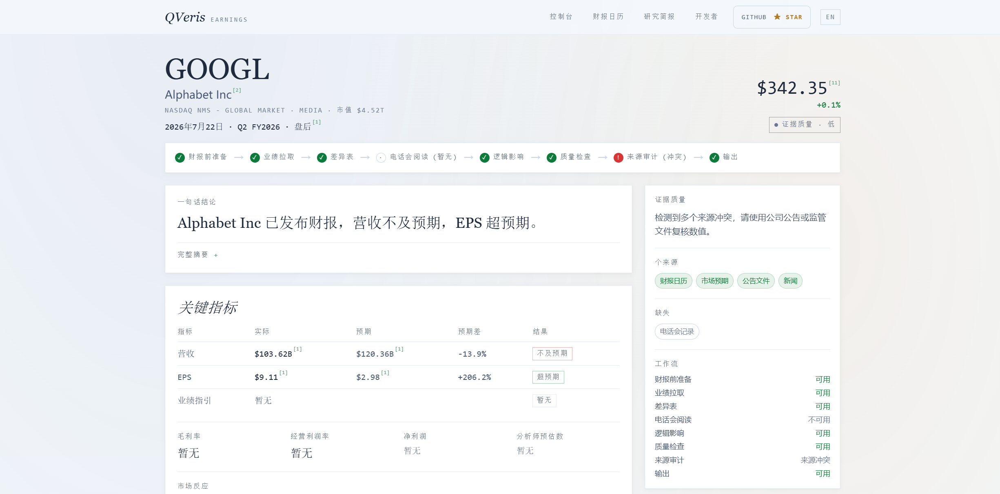

# Google Cloud Jumped 82%, Tesla EPS Was Cut in Half: What Last Night's Earnings Really Signal for A-Share Semiconductors

Yesterday at 2:30 p.m., the STAR 50 Index went from down 3% to up 10% in one move, with semiconductor names hitting limit-up across the board. On Xueqiu, some people were calling it the start of a bull market. Others were more cautious: "Don't celebrate too early. Google and Tesla report tonight. Tomorrow is the real test."

That was right. Or at least, the direction was right.

In the early hours of this morning Beijing time, both Google and Tesla released their Q2 results. Google reported \$119.8 billion in revenue, up 24%, with Cloud surging 82%. Tesla reported \$28.2 billion in revenue, up 26%, and delivered a Q2 record number of vehicles. Both companies beat revenue expectations.

But the market did not reward them. Tesla fell more than 4% after hours. And Google did not hold up either; it also traded lower after hours. The reason was the same for both: AI capital expenditure is running too hot, and profits are being absorbed by the spending cycle.

## Layer 1: Use the Calendar to See Who Reported and What A Shares Should Watch

For earnings-event trading, the first step is always to know who is reporting and when. Open QVeris Earnings Copilot and the first screen is a real-time earnings calendar. There is no need to search for tickers manually; companies reporting after the close are already organized by exchange.

For the July 22 after-hours calendar, two companies stood out as having a real transmission path into A shares:

| Company | Transmission path into A shares | What to watch tonight |
|-|-|-|
| **Google (GOOGL)** | AI Capex → chip/compute demand → semiconductor equipment & materials | Cloud growth, full-year Capex guidance |
| **Tesla (TSLA)** | Delivery guidance → new energy vehicle chain → lithium batteries & components | Margins, Robotaxi progress |

Click any company card in the calendar and Copilot takes you directly to consensus estimates and historical data. Click GOOGL, and the page automatically lands on the Q2 consensus view.

## Layer 2: Consensus vs Actuals, Who Beat and Who Broke

From the Google calendar card, the first screen in Copilot is the consensus view. Market expectations are on the left, and actual figures refresh automatically on the right once results are released. After last night's update, the table looked like this:

| Metric | Actual | Market expectation | Gap |
|-|-|-|-|
| Revenue | \$119.8B | ~\$116.8B | **+2.6% beat** |
| Google Cloud growth | +82% | ~+67% | Far above expectations |
| Full-year Capex guidance | \$195-205B | \$175-190B | **Raised by \$20B** |

Cloud moving from a consensus +67% to +82% was not a marginal improvement. It was acceleration. On the profit side, net income attributable to shareholders reached \$28.0 billion, up 298% year over year, a very strong single-quarter result.

The problem was capex. Expectations were \$175-190 billion, while actual guidance moved up to \$205 billion, \$20 billion above the prior range. The direct consequence: **Google recorded negative free cash flow for the first time in its history**. AI infrastructure spending has started to punch a hole in one of the market's most reliable cash machines.

Switch to Tesla's card and the same "actual vs expected" data structure tells a very different story: strong revenue, collapsing profitability.

| Metric | Actual | Market expectation |
|-|-|-|
| Total revenue | \$28.2B (+26%) | \$25.7-26.3B |
| Adjusted EPS | **\$0.33** | **\$0.50-0.53** |
| Operating margin | 1.4% | — |
| Free cash flow | -\$1.09B | -\$3.25B to -\$3.64B |

Revenue beat, EPS missed. This is the classic "selling more, earning less" setup. Tesla delivered 480,000 vehicles, a Q2 record, but promotions and price cuts compressed operating margin to 1.4%. Scroll further down into Tesla's historical surprise records and the operating-margin trend is even more persuasive than any single-quarter number: from double digits two years ago to barely above 1% today.

## Layer 3: Put the Two Reports Together and Read the Signal for A Shares

Back to A shares. In Copilot, every company research page follows the same structure: calendar, expectations, actuals, and history. Moving between Google and Tesla naturally brings the shared narrative to the surface, but the conclusion is split.

**The positive signal for A-share semiconductors**: Google Cloud grew 82%, and capex guidance rose to \$205 billion. AI infrastructure hardware investment is still accelerating. Demand for chip equipment, advanced packaging, and compute chips is not slowing. Yesterday's 10% rally in the STAR 50 was a front-running move on exactly this expectation, and that part of the thesis was not invalidated.

The medium- to long-term signal is less comfortable. Both companies showed negative free cash flow, and Tesla's operating margin fell to 1.4%. Earnings are being consumed by AI investment. If that trend continues, the market will not keep paying for the story forever. Capex growth will eventually have to converge, and the hardware supply chain would likely be the first area to feel the pressure.

In the short to medium term, over the next 6 to 12 months, AI capex is still accelerating and A-share semiconductors still have order support. Over the longer term, if the return on investment fails to keep pace with spending, budget cuts become a matter of timing.

## Where It Works and Where It Does Not

QVeris Earnings Copilot has clear strengths, along with boundaries it does not yet cross.

**Best-fit scenarios**: fast risk screening during earnings season, where calendar + consensus + actuals can be reviewed in one flow; cross-company research, because every company page follows the same structure and can be compared quickly; and research notes, where analysis can be turned directly into a shareable page with citations.

**Current boundaries**: earnings-call transcripts currently cover only selected large-cap U.S. companies, with no A-share coverage yet; technical indicators are not provided; domestic brokerage research reports are not included; and the product does not publish buy or sell recommendations.

For anyone working on the "earnings event → sector mapping" workflow, Copilot removes much of the manual stitching between the calendar and the final judgment. For pure technical analysis, use a different tool.

## What It Felt Like in Practice

Last night's workflow looked roughly like this:

**You**: "Which major companies are reporting after the close on July 22?"

**AI**: "Google, Tesla, IBM, and Texas Instruments. Google's Q2 revenue expectation is \$116.8 billion, and Tesla's is \$25.7-26.3 billion. Click any company to view detailed expectations."

**You**: "Are Google's Q2 actuals out?"

**AI**: "Yes. Revenue was \$119.8 billion, up 24%, beating expectations. Cloud grew 82%, far above the +67% consensus. But full-year Capex guidance was raised to \$205 billion, and free cash flow turned negative for the first time. Let's switch to Tesla."

**You**: "Okay, show me Tesla."

**AI**: "Revenue was \$28.2 billion, up 26%, beating expectations, but adjusted EPS was \$0.33, far below the \$0.51 expectation. Operating margin was only 1.4%, and free cash flow turned negative. The stock fell more than 4% after hours. Both companies beat on revenue, but profits were eaten by Capex: Google is spending into future growth, while Tesla is sacrificing current profit."

**You**: "Is this bullish or bearish for A-share semiconductors?"

**AI**: "Short to medium term, bullish. Google's Capex is still accelerating, and Cloud growth confirms that AI demand is real. Longer term, caution is warranted: if investment returns fall out of balance, margin pressure in the middle of the industry chain is only a matter of time."

**Data note**: The Google and Tesla Q2 2026 actuals discussed in this article come from Alpha Vantage and public earnings releases, retrieved in real time through the QVeris capability-routing network. QVeris Earnings Copilot will soon launch at earnings.alexai-lab.com.

QVeris is a capability-routing network for AI agents: a unified protocol for discovering and invoking tens of thousands of real-time data tools.

- Plugins: qveris.cn/plugins
- Developers: `npx -y @qverisai/mcp` or `npm install -g @qverisai/cli`
- Website: qveris.cn

---

*Disclaimer: This article is a data-tool walkthrough. All data comes from third-party APIs (Alpha Vantage, Twelve Data) and public earnings releases. It does not constitute investment advice.*
