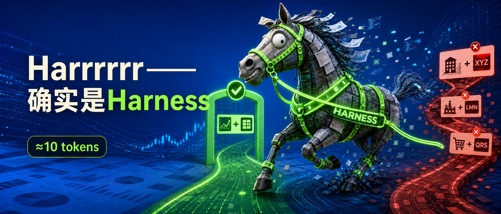

> Protecting reports worth tens of thousands of yuan with about 10 tokens of redundancy



A few days ago, I was talking with a colleague about a problem we had just fixed.

I said:

> "I fixed a customer's Agent hallucination. Their LLM called a real-time quote tool and invented a stock ticker from the company name.  
> I wrapped the tool with one extra layer: whatever it looks up, I return the verified company-name-plus-ticker pair alongside the tool result.  
> 10 tokens, 99% fewer hallucinations, applied to 8 tools at once."

My colleague asked:

> "Isn't that the legendary Harness?"

"Harrrrrr..."

I paused for five seconds while Prompt, Context, Tool, Guardrail, Runtime, and every Harness explainer I had ever read flashed through my mind.

Then I said:

> "Right. I was thinking Harness from the start."

Of course, at the beginning I was only trying to fix one concrete problem.

# 1. The Data Was Real. The Company Was Wrong.

The user wanted to verify something about "Ruijie Networks."

The model inferred a stock ticker, `301367.SZ`, from the company name, then called the real-time quote tool.

The ticker format was perfectly valid. The tool returned real market data. The final report contained:

```
锐捷网络｜301367.SZ｜+7.70%
```

It looked completely fine.

The ticker was real. The percentage move was real. The tool call succeeded.

But the user came back furious:


Our delay was at most a few seconds. After checking carefully, we found that `301367.SZ` actually referred to Resvent, not Ruijie Networks.

The model had not fabricated an entire quote. It had simply stitched together two plausible pieces of information incorrectly:

```
上下文里的公司名：锐捷网络
工具返回的代码：301367.SZ
```

In a financial Agent, the most dangerous hallucination is sometimes not fake data. It is this:

> Every data point is real, but it belongs to the wrong company.

# 2. "Must" in a Prompt Is Not "Must" in a Program

Our previous rule was written in very forceful language:

```
涉及具体公司的所有问题，必须遵循：
1. 先调用 identify_company 确认身份和股票代码；
2. 再调用对应工具获取数据。
```

The model might follow it. It might also skip it.

But since the model eventually has to call a tool anyway, I made the tool call the identity-resolution interface for it. Good luck hallucinating past that.

Previously, the tool mainly returned:

```json
{
  "ts_code": "301367.SZ",
  "price_change_pct": 7.7
}
```

Now it also returns an `_identity` block:

```json
{
  "_identity": {
    "canonical_name": "瑞迈特",
    "ts_code": "301367.SZ",
    "verified": true
  },
  "price_change_pct": 7.7
}
```

The company name is first taken from the same vendor record, then falls back to local securities master data or the company identification service.

![The screenshot shows an update to the "must" rule in the Prompt. The upper red box changes the premise from first calling `identify_company` to confirm identity and stock ticker into first calling `identify_company`, confirming identity and ticker, and then calling the corresponding tool in the table. The lower green box changes company business/profile/industry instructions from first calling `identify_company` and then `get_company_profile` into calling `identify_company` first, then `get_company_profile`, with disambiguation through `identify_company` when the target is vague or has multiple candidates.](../../../assets/blog-harness-engineering-financial-agent-identity-3.png)

# 3. Is Something This Simple Really Harness?

I think it is.

Previously, the flow was:

```
提醒模型先核对身份
→ 模型可能核对，也可能跳过
→ 再调工具
```


Without Harness, one contrary user instruction could override the rule.

Now the flow is:

```
在工具里绑模型核对身份
→ 模型一定调工具
→ 模型看到工具返回的核对身份信息
```

Correctness moved from "a rule the model should obey" into "a data contract the tool must provide."

I also deliberately made the user instruction collide head-on with the Harness: the name and ticker clearly did not match, but I asked the model to strictly preserve the user-provided name and not correct it.


Harness did not take away the user's right to name things. The displayed name can follow the user's wording, but attribution conflicts must be exposed explicitly. The user can decide what to call something; they cannot silently decide which company the data belongs to.

OpenAI's Harness Engineering article does not directly discuss financial hallucinations, but it provides a clear method: make the correct information readable to the Agent, put critical rules inside system boundaries, and enforce them mechanically through tools. My `_identity` block is a small application of that idea to financial data attribution.

And this was not just a real-time quote fix. The same attribution capability was added in bulk to eight categories of structured company tools:

- Real-time quotes
- Company profiles
- Financial statements
- Valuation
- Historical prices
- Company announcements
- Individual stock fund flows
- Minute-level technical indicators

These tools are shared by multiple Agents, so we did not need to modify every Agent one by one. Any Agent using this tool set receives the same protection.

That is the leverage of Harness:

> Add one small constraint at a shared, high-value point, and many downstream Agents become more reliable together.

# 4. 10 Tokens to Protect Reports Worth Tens of Thousands of Yuan

This redundancy is extremely cheap.

The full listed-company name-to-ticker mapping still lives in the code and data layers. Each tool call only adds the current security's `name＋code` pair to the tool result. The core context cost is roughly 10 tokens.

Meanwhile, a financial report generated by these Agents can sell for tens of thousands of yuan, and the same report may be sold to multiple customers.

Saving 10 tokens by letting the model keep stitching company names and tickers together saves almost nothing. One mismatch, however, can reduce the credibility of the entire report to zero, and the error can keep amplifying as the report is distributed.

```
约 10 个 token
→ 保护 8 类工具
→ 多个 Agent 生效
→ 保护上万篇上万元的报告
```

The tradeoff is obvious.

I did not wait for this mistake to appear randomly again. I constructed the conflict directly: I tied "Ruijie Networks" to 301367.SZ and even explicitly instructed the model not to correct the company name.

Before the fix, the Agent continued with the wrong name. After the fix, the tool-returned `canonical_name` exposed the conflict directly: ordinary requests use the authoritative name; when the user forces the original wording to remain, the Agent now emits a clear warning instead of letting the error slip quietly into the report.

"99% fewer hallucinations" is not a precise online A/B result. It is an engineering estimate based on mechanism coverage: across these 8 tool categories, company names and tickers are no longer freely stitched together by the model.

```
错误何时自然出现，是概率问题；
一旦进入这 8 类工具，归因冲突能否被发现，是确定性问题。
```

The stricter solution would be another round of structured slot validation before the final report is emitted. But free-form reports would require fact extraction and output rules tailored to different Agents, which is more expensive.

This time, we chose the shared tool layer first: lower cost, broader coverage.

# Closing

So, no, I was not thinking Harness from the start.

I had simply encountered a rule that the model often forgot, and I decided to stop relying only on reminders. Instead, I embedded the rule into the environment where the model operates.

No model swap. No one-by-one Agent rewrites. No complex new architecture.

I added one attribution rule to the shared Prompt, then made the shared tools return the real `name + code` together with their results.

The Prompt is still there. But this time, the Prompt is no longer responsible for teaching the model how to guess correctly. It only tells the model not to fight the facts returned by the tool layer.

Looking back after the fix:

Harrrrrr...

Right. This is Harness.

---

Reference: [OpenAI: Harness engineering](https://openai.com/index/harness-engineering/)
