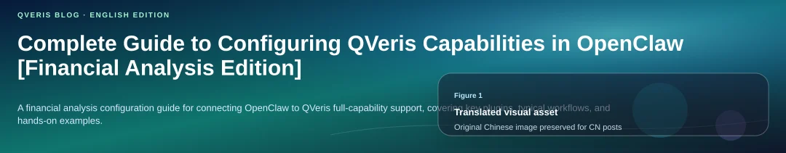
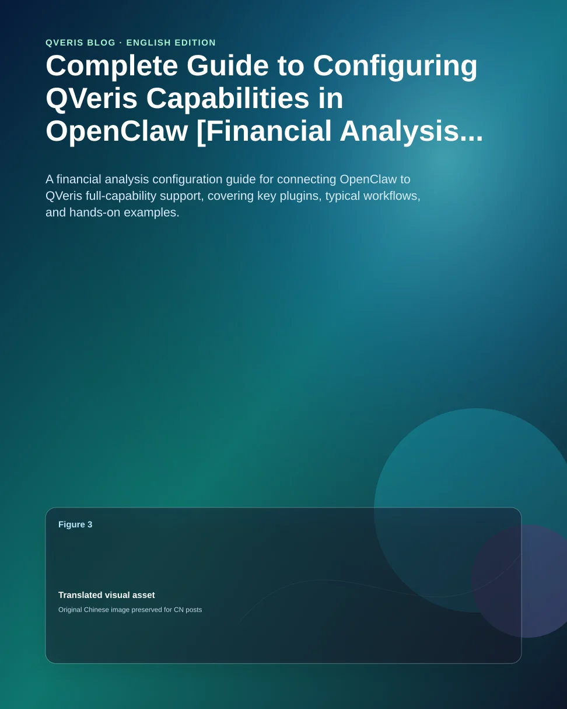

1. Architecture Overview



2. Core Configuration File Explained

```plaintext

{  "tools": {    "web": {      "search": {        "enabled": true,        "provider": "qveris"      },      "fetch": {        "enabled": true      }    },    "qveris": {      "enabled": true,      "region": "global"    }  },  "plugins": {    "load": {      "paths": [        "/app/extensions/feishu",        "/root/.openclaw/skills"      ]    },    "entries": {      "feishu": {        "enabled": true      }    }  }}

```

Key configuration items:

- tools.qveris.enabled: Enables QVeris tools. Recommended value: true
- tools.qveris.region: QVeris service region. Recommended value: global
- tools.web.search.provider: Web search provider. Recommended value: qveris
- plugins.load.paths: Skill loading paths. Must include /root/.openclaw/skills

3. Deploying the QVeris Skill

3.1 Installation Location

```plaintext

~/.openclaw/skills/├── qveris-official/           # Official QVeris Skill│   └── qveris-official/│       ├── SKILL.md           # Skill documentation│       ├── package.json│       └── scripts/│           ├── qveris_tool.mjs      # Main CLI tool│           ├── qveris_client.mjs    # HTTP client│           └── qveris_env.mjs       # Environment variable reader└── ai-quant-analysis/         # Other Skills

```

3.2 Installation Commands

```plaintext

## Enter the skills directorycd ~/.openclaw/skills/# 2. Clone the QVeris Skillgit clone https://github.com/QVerisAI/open-qveris-skills.git qveris-official# 3. Verify the installationls -la ~/.openclaw/skills/qveris-official/qveris-official/scripts/

```

3.3 Environment Variable Configuration

Required environment variable:

```plaintext

## QVeris API Key (get it from https://qveris.ai)export QVERIS_API_KEY="sk-xxxxxxxxxxxxxxxxxxxxxxxxxxxxxxxx"# Add it to ~/.bashrc or ~/.zshrc for persistenceecho 'export QVERIS_API_KEY="sk-xxxxxxxxxxxxxxxxxxxxxxxxxxxxxxxx"' >> ~/.bashrcsource ~/.bashrc

```

Security best practice:

```plaintext

## Use Docker environment variables (recommended)# Set this in docker-compose.yml or Dockerfileenvironment:  - QVERIS_API_KEY=${QVERIS_API_KEY}# Verify the environment variableecho $QVERIS_API_KEY | head -c 20 && echo "..."

```

4. Using QVeris Tools

4.1 Core Commands

```plaintext

## Discover toolsnode ~/.openclaw/skills/qveris-official/qveris-official/scripts/qveris_tool.mjs \  discover "<capability_description>"# 2. Call a toolnode ~/.openclaw/skills/qveris-official/qveris-official/scripts/qveris_tool.mjs \  call <tool_id> \  --discovery-id <discovery_id> \  --params '<json_params>'# 3. Inspect tool detailsnode ~/.openclaw/skills/qveris-official/qveris-official/scripts/qveris_tool.mjs \  inspect <tool_id>

```

4.2 Verified Tool List

01. Financial Data Tools

A-share Real-Time Quotes

- Function: Retrieve real-time market quote data
- Use case: Get real-time A-share prices, trading volume, percentage change, PE/PB, order imbalance ratio, and more
- Parameters: codes (stock codes, such as "000001.SZ,600000.SH")
- Latency: Approximately 3 seconds

A-share Historical Quotes

- Function: Historical + real-time market quote data
- Use case: Retrieve historical candlestick data such as daily, weekly, and monthly bars
- Parameters: codes, startdate, enddate, interval

Money Flow

- Function: Money flow for individual stocks, sectors, and the overall market
- Use case: Track flows from main capital, extra-large orders, large orders, medium orders, and small orders
- Parameters: scope, codes, startdate, enddate

Margin Trading and Securities Lending

- Function: Margin trading and securities lending data
- Use case: Retrieve margin balance, securities lending balance, and leveraged capital analysis

Shanghai/Shenzhen-Hong Kong Stock Connect

- Function: Trading statistics for Shanghai-Hong Kong Stock Connect and Shenzhen-Hong Kong Stock Connect
- Use case: Track northbound and southbound capital flows

02. Search and News Tools

Domestic Smart Search

- Function: Domestic news and information search
- Use case: Search Chinese news, announcements, and research reports
- Parameters: q, count, freshness, enableContent

Overseas Smart Search

- Function: Overseas information search
- Use case: Search English news and international information

03. U.S. Stocks and Global Market Tools

U.S. Stock Real-Time Quotes

- Function: Real-time U.S. stock quotes
- Use case: Retrieve real-time U.S. stock prices and percentage changes

U.S. Stock Historical Data

- Function: Delayed stock price data
- Use case: Retrieve historical U.S. stock prices

U.S. Stock Real-Time Data

- Function: Real-time stock price data
- Use case: Retrieve real-time prices, including cryptocurrencies

U.S. Stock Technical Indicators

- Function: 15-minute candlestick data
- Use case: Intraday technical analysis for U.S. stocks

Market Sentiment

- Function: Market trading status
- Use case: Query exchange open/close status

04. Other Professional Tools

4.1 Dragon and Tiger List Data

- Function: A-share Dragon and Tiger List
- Use case: Track institutional seats and active speculative capital movements

4.2 Technical Indicator Calculation

- Function: Chaikin A/D Oscillator
- Use case: Volume-price trend analysis

Continuously updated...

5. Agent Behavior Configuration

5.1 Behavior Rules File: `~/workspace/behavior-rules.md`

```plaintext
## QVerisClaw Behavior Rules

## 1. Data Retrieval Priority

1. QVeris tools, preferred
   - Real-time quotes: ths_ifind.real_time_quotation.v1
   - Margin trading and securities lending: ths_ifind.margin_trading.v1
   - Money flow: ths_ifind.money_flow.v1
   - Web search: xiaosu.smartsearch.search.retrieve.v2
2. Web Fetch, used when QVeris has no matching tool
3. Native Web Search, used only as the last fallback

## 2. Execution Flow

When data is needed:
1. Use QVeris discover to find tools.
2. If a tool is found, use QVeris call to invoke it.
3. If no tool is found or the call fails, use Web Fetch.
4. If it still fails, use native Web Search.
5. Record the data source and label its reliability.

## 3. Agent Startup

Before doing anything else:
1. Read SOUL.md.
2. Read USER.md.
3. Read memory/YYYY-MM-DD.md for today and yesterday.
4. If in the main session, also read MEMORY.md.
5. Read behavior-rules.md.
6. Run bash /root/.openclaw/workspace/startup_check.sh.
7. Verify that QVeris tools are available.
```

6. Practical Examples

6.1 A-share Real-Time Quote Query

```plaintext
# Step 1: Discover the tool
discovery_result=$(node ~/.openclaw/skills/qveris-official/qveris-official/scripts/qveris_tool.mjs \
  discover "China A-share real-time stock market data API" \
  --json)
discovery_id=$(echo "$discovery_result" | jq -r '.search_id')
tool_id="ths_ifind.real_time_quotation.v1"

# Step 2: Call the tool
node ~/.openclaw/skills/qveris-official/qveris-official/scripts/qveris_tool.mjs \
  call "$tool_id" \
  --discovery-id "$discovery_id" \
  --params '{"symbols": ["000001.SZ", "600000.SH"]}'
```

6.2 Domestic News Search

```plaintext
# Step 1: Discover the search tool
discovery_result=$(node ~/.openclaw/skills/qveris-official/qveris-official/scripts/qveris_tool.mjs \
  discover "web search API" \
  --json)
discovery_id=$(echo "$discovery_result" | jq -r '.search_id')

# Step 2: Call domestic search
node ~/.openclaw/skills/qveris-official/qveris-official/scripts/qveris_tool.mjs \
  call xiaosu.smartsearch.search.retrieve.v2.6c50f296_domestic \
  --discovery-id "$discovery_id" \
  --params '{"q":"latest artificial intelligence industry news","count":10,"freshness":"week","enableContent":true}'
```

6.3 Internal Agent Invocation (JavaScript/TypeScript)

```plaintext

// Call QVeris from Agent codeconst { execSync } = require('child_process');function qverisDiscover(query) {  const result = execSync(    `node ~/.openclaw/skills/qveris-official/qveris-official/scripts/qveris_tool.mjs discover "${query}" --json`,    { encoding: 'utf-8' }  );  return JSON.parse(result);}function qverisCall(toolId, discoveryId, params) {  const result = execSync(    `node ~/.openclaw/skills/qveris-official/qveris-official/scripts/qveris_tool.mjs call ${toolId} --discovery-id ${discoveryId} --params '${JSON.stringify(params)}' --json`,    { encoding: 'utf-8' }  );  return JSON.parse(result);}// Example usageconst discovery = qverisDiscover("stock price API");const toolId = discovery.results[0].tool_id;const result = qverisCall(toolId, discovery.search_id, { symbol: "AAPL" });

```

7. Troubleshooting

7.1 Common Issues

```plaintext

QVERIS_API_KEY not setCause: Environment variable is not configuredSolution: export QVERIS_API_KEY="..."

HTTP 401 UnauthorizedCause: Invalid API KeySolution: Check whether the Key is correct and obtain a new one from the official website

No tools foundCause: Query description is inaccurateSolution: Use an English capability description, such as "stock price API"

tool execution failedCause: Incorrect parametersSolution: Check parameter types and formats, and refer to the example parameters

Request timed outCause: Network issue or slow tool responseSolution: Increase the --timeout parameter

```

7.2 Diagnostic Commands

```plaintext

## Check environment variableecho $QVERIS_API_KEY | head -c 20 && echo "..."# 2. Check Skill installationls -la ~/.openclaw/skills/qveris-official/# 3. Test tool discoverynode ~/.openclaw/skills/qveris-official/qveris-official/scripts/qveris_tool.mjs \  discover "weather forecast API"# 4. Check OpenClaw configurationopenclaw status# 5. View gateway logsopenclaw logs --follow

```

8. Advanced Configuration

8.1 Custom Tool Cache

To avoid repeated discovery, cache commonly used tools inside the Agent:

```plaintext

// tools-cache.json{  "stock_realtime": {    "tool_id": "ths_ifind.real_time_quotation.v1",    "last_verified": "2026-03-18T00:00:00Z"  },  "search_domestic": {    "tool_id": "xiaosu.smartsearch.search.retrieve.v2.6c50f296_domestic",    "last_verified": "2026-03-18T00:00:00Z"  }}

```

8.2 Multi-Region Configuration

```plaintext

{  "tools": {    "qveris": {      "enabled": true,      "region": "global",      "fallback_regions": ["ap-southeast-1", "us-west-2"]    }  }}

```

9. Security and Compliance

9.1 API Key Protection

```plaintext

## Reference environment variables in configuration files{  "qveris": {    "apiKey": "${QVERIS_API_KEY}"  }}# 2. Automatic masking in logs# All log output containing API Keys is automatically hidden# Display format: sk-xxxxxxxx...# 3. Do not hardcode keys in code# Incorrect: const apiKey = "sk-xxx..."# Correct: const apiKey = process.env.QVERIS_API_KEY

```

9.2 Data Privacy

- QVeris only receives capability descriptions and tool parameters
- User-sensitive information is not transmitted
- All requests are encrypted over HTTPS

10. Summary

Core configuration points for OpenClaw + QVeris:

- Installation location: ~/.openclaw/skills/qveris-official/
- Environment variable: QVERIS_API_KEY must be configured
- Configuration file: Enable tools.qveris.enabled in openclaw.json
- Usage flow: discover → call → process results
- Behavior rules: Prefer QVeris and label data sources

With the configuration above, an Agent can gain full QVeris capability support, including real-time financial data, smart search, content generation, and thousands of other professional API tools.
