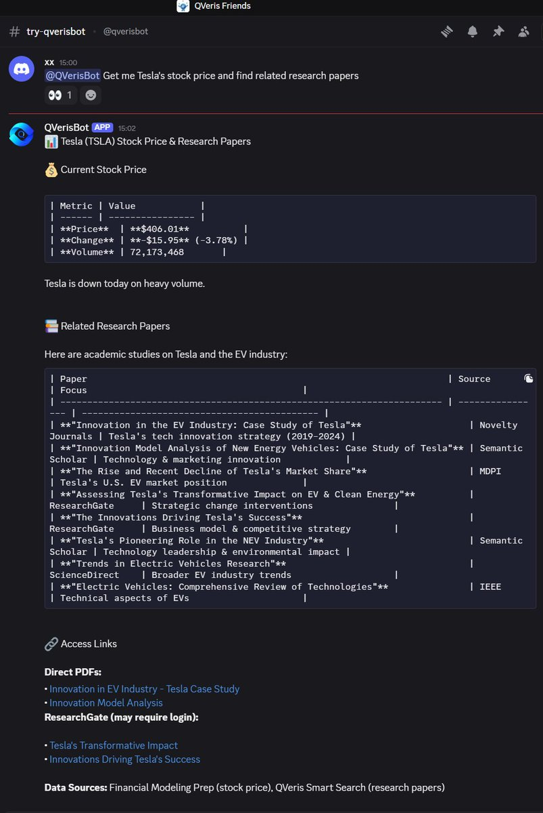
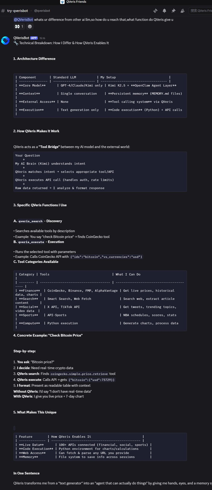
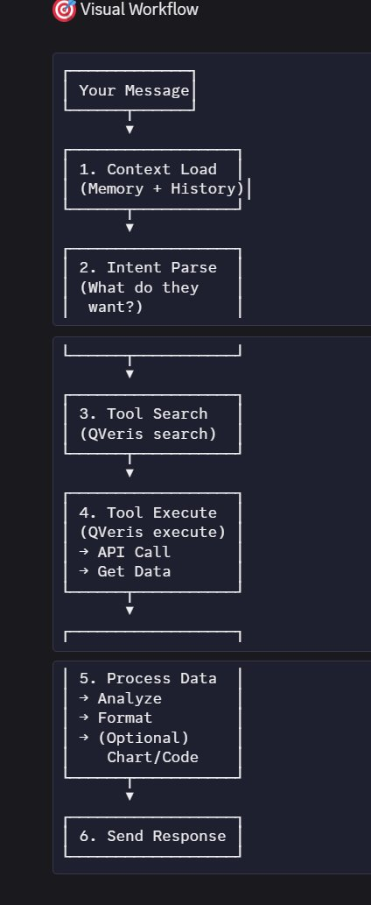
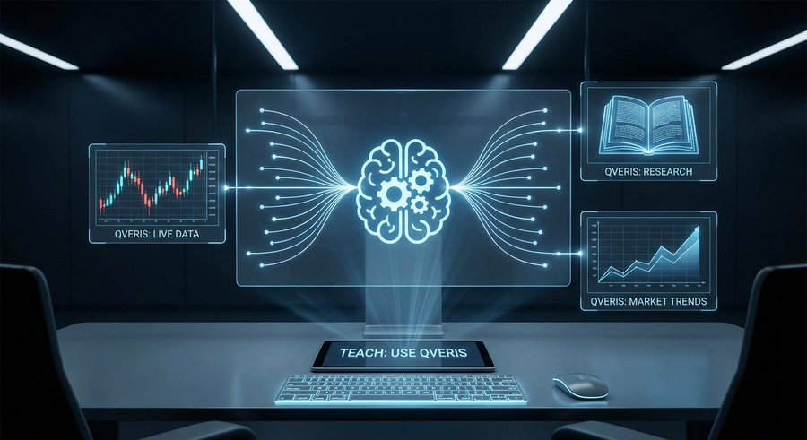
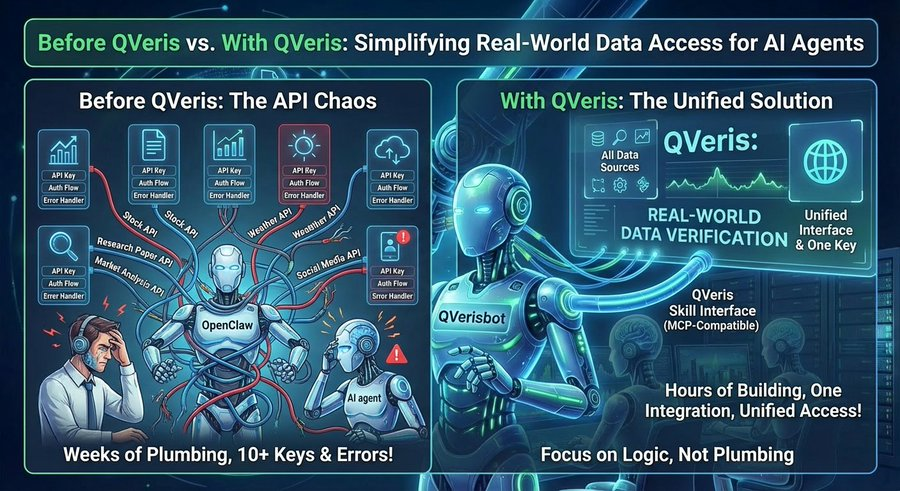
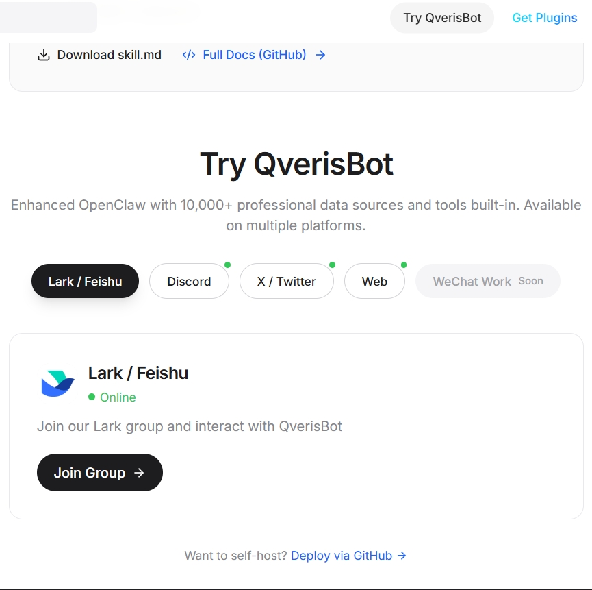
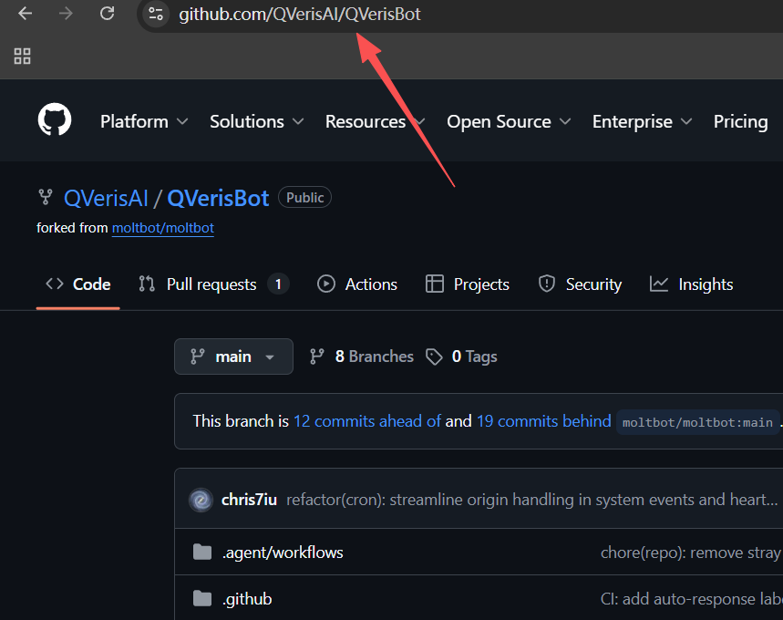

## What OpenClaw + QVeris Can Do

We built QVerisBot to show what happens when you combine OpenClaw's execution framework with QVeris's unified data interface. Here's what it can do:

Ask it: "Get me Tesla's stock price and find related research papers."

It does: Queries real-time stock data from Binance, Coinbase, and Yahoo Finance, searches academic papers from arXiv and PubMed, and returns formatted results—all in one response.

Ask it: "Analyze Bitcoin's price trend and pull the latest crypto news."

It does:Fetches historical price data, calculates trends, searches news APIs, and synthesizes insights.

Ask it: "Find medical research papers on diabetes treatment from the last year."

It does: Searches PubMed, filters by date, extracts key findings, and formats results.

All through one skill. One integration. Zero API key management.

## The Problem We Solved

Most AI agents can't access real-world data. They can chat, but they can't query stock prices, search research papers, pull market trends, or access industry databases. You'd need separate skills for each—each with its own API keys, authentication flows, rate limits, and error handling.

We solved this with a unified data interface.

Instead of building 10,000 individual skills, QVeris provides one gateway that routes to thousands of APIs across finance, healthcare, sports, research, and more. Install the QVeris skill once, and your OpenClaw agent gains access to:

Financial data: Real-time stock prices, crypto markets, historical data, company financials

Research databases: Academic papers, medical research, scientific publications

News & media: Real-time news feeds, industry reports, market analysis

Industry APIs: Healthcare databases, sports statistics, weather data, and more

## How It Works

The OpenClaw layer handles task execution, skill management, and local storage. The QVeris Skill wraps our unified `qveris_search` and `qveris_execute` interface. The QVeris gateway routes requests to the right data source without exposing complexity.

When you ask QVerisBot to get stock prices and research papers, it:

1. Recognizes it needs the QVeris skill
2. Calls the QVeris unified interface
3. Routes to stock API and academic search API simultaneously
4. Returns formatted results

One skill. Multiple data sources. Zero API key management.

## What You Can Build

With OpenClaw + QVeris, you're not limited to chat. You can build:

Financial analysis agents: Real-time market data + research papers + news synthesis

Healthcare assistants: Medical databases + research + patient data analysis

Research assistants: Academic papers + web search + data analytics

Trading bots: Market data + sentiment analysis + execution capabilities

Industry-specific agents: Any domain that requires real-world data access

All through one unified data interface.

The experience is like training an assistant who gets smarter with every task. You teach it once: "Use QVeris to get data." It learns: Stock prices? Use QVeris. Research papers? Use QVeris. Market trends? Use QVeris. One skill. Multiple capabilities. It just works.

## The Developer Experience

The difference is night and day.

Before QVeris:

 Want stock data? Build a skill, integrate API, handle auth, manage errors

 Want research papers? Build another skill, different API, different auth

 Want market analysis? Build another skill...

You're spending weeks on API integrations instead of building features.

With QVeris:

 Install QVeris skill once

 Access all data sources through one MCP-compatible interface

 Focus on agent logic, not API plumbing

Weeks of work becomes hours of building.

Instead of managing 10+ API keys, 10+ authentication flows, 10+ rate limit handlers, and 10+ error handling patterns, you manage one QVeris integration, one unified interface, one skill installation.

## Open Source Reference Implementation

We're open-sourcing QVerisBot not as a product, but as a reference implementation. It demonstrates:

 How to integrate QVeris into OpenClaw

 How unified interfaces reduce complexity

 How to build production-grade agents without data layer overhead

Deploy it. Modify it. Extend it. Use it as a starting point for your own agents.

The real value isn't QVerisBot—it's QVeris's unified data layer. One integration. Thousands of APIs. Standardized interface. Available for any AI agent framework.

## Try It Yourself

If you're building with OpenClaw and need real-world data, this is how you do it without the API management nightmare.

Get started:

[<text underline="true">https://qveris.ai</text>](https%3A%2F%2Fqveris.ai%2F)

QVerisBot code will be available on GitHub as a reference implementation for developers who want to see how unified data interfaces work in practice.

The future of AI agents isn't better frameworks—it's better data interfaces. Unified. Standardized. Scalable.
