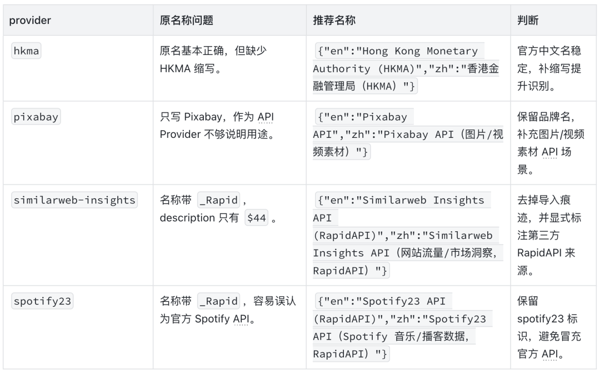

QVeris · Engineering Practice
## Background

A provider name may look like a very small field.

But in QVeris, it directly affects how users and Agents understand a tool: is this provider a company, a data source, an API, an SDK, or an endpoint on a third-party platform? If the name is only `API Reference`, `AI/ML API`, or `Spotify_Rapid`, users will struggle to tell what it actually does, and Agents will lack stable semantics when selecting and explaining tools.

So the goal of this provider translation review was not to mechanically translate English into Chinese. It was to make every provider name easier to recognize, search, and verify.
```
Raw provider data ↓ verify official websites / official docs / authoritative sources one by one ↓ determine official Chinese name, English brand name, and business label ↓ generate recommended name JSON, rationale, confidence level, and evidence links ↓ colleague annotation and secondary revision ↓ distill into a reusable Skill and scripts
```
## Challenges

The real difficulty is that a provider name is not always a "company name."

### Surface-Level Issues

- Many records had `zh` directly equal to the English name, or left empty.

- Some names carried import traces, such as `_Rapid`.

- Some names were only documentation page titles, such as `API Reference` or `Public API`.

- Some abbreviations had no context, such as `AEM`.

### Real Risks

- It is easy to mistake a third-party RapidAPI endpoint for an official API.

- It is easy to mix a parent company, product line, and documentation page title into one provider.

- If an English-only brand has no business label, users cannot tell what it is for.

- Without an evidence chain, colleagues have to repeat the same research during later review.

A good translation, therefore, is not one that "looks more Chinese." It is one that makes the provider's real identity clearer.
## What We Did

The first step was to separate raw data from review data. The original `id/name/url` fields were kept unchanged, and review fields were appended afterward so every change remained traceable.

| Field | Purpose |
| --- | --- |
| Revised name | The final recommended JSON, where both `en` and `zh` can be improved. |
| Official website / authoritative source | Records which official website, official documentation, or authoritative source was used as the basis. |
| What the company does | Explains the provider's real business or data capability in one sentence. |
| Candidate translation / final translation | Preserves the naming decision process instead of leaving only the final result. |
| Rationale / confidence / evidence links | Helps later reviewers quickly judge whether the entry is reliable. |

**The second step was to refine the naming standard. We defined several principles**:

- When an official Chinese name exists, use it first.

- When there is no stable Chinese name, do not force a phonetic translation of the brand.

- When the brand name itself does not reveal the use case, add a very short business label.

- API, SDK, and platform names must preserve product semantics; they cannot be reduced to "public API" or "developer API."

- If the original `en` value is too generic or incorrect, `修改后的name.en` should also be improved.

This last point is critical. For example, `AEM Admin API` should not simply be translated as "AEM 管理 API," because users still do not know what AEM is. A better version is:
```
{"en":"Adobe Experience Manager (AEM) Admin API","zh":"Adobe Experience Manager（AEM）管理 API"}
```
## A Concrete Example

Recently, we ran another small-sample validation on several providers from the database. They covered several typical problem types: official institutions, official APIs, third-party RapidAPI endpoints, and abnormal description fields.



>
> 💡 The point here is not "whether RapidAPI should be translated." The point is that import traces should not become final display names, and third-party endpoints should not be packaged as official providers.
>
## From One Review to a Reusable Skill

If this work stopped at a one-off Excel edit, we would keep running into the same problems. So we distilled the experience into a provider translation review Skill.

### SKILL.md

Defines when the Skill should be triggered, how the review workflow proceeds, which files should be output, and how final validation is performed.

### translation_rules.md

Captures the translation decision tree, naming matrix, good and bad examples, and confidence rules.

### evidence_chain.md

Captures review-sheet fields, evidence chains, checkpoint progress, risk items, and the colleague annotation process.

**We also included a script for structured file checks and auxiliary output**:
```
provider_translation_review.py inspect provider_translation_review.py export-marked provider_translation_review.py validate provider_translation_review.py progress-export provider_translation_review.py risk-export provider_translation_review.py apply
```

With this in place, future provider translation tasks no longer need to restart the discussion from "how should we translate, annotate, and preserve evidence?" Agents can work directly from the Skill's rules: check the source first, then name the provider, then write the rationale and confidence level, and finally export risk items and write back recommendations.

>
> 💡 **Open-source placeholder:** This is where we can add the GitHub repository link, installation instructions, and a minimal usage example. The Skill has already been organized into an open-source-ready structure, including \`SKILL.md\`, \`references\`, and \`scripts\`.
>
## What Users Will Experience

First, the provider list will be easier to understand.

Users will no longer see a pile of names like `AI/ML API`, `API Reference`, or `Spotify_Rapid`. Instead, they will see names that include brand, product, and business scope. Even when English is retained, users will have a rough sense of what the provider does.

Second, colleague review costs will decrease.

Every change includes sources, rationale, candidate translations, and confidence levels. Annotation columns can also clearly distinguish "resolved" from "requires human confirmation," instead of burying issues in comments.

Third, the quality of future batch translations will become more stable.

Previously, translation quality depended more on how well the model performed in that specific run. Now, with fixed rules, few-shot examples, evidence chains, and script validation, Agent output becomes much closer to a reusable review workflow.
## Why This Matters

Whether an Agent can use tools reliably depends not only on whether the tools themselves can be called, but also on whether the system can accurately understand each provider's identity and boundaries.

Provider names are one of the earliest semantic entry points in the tool system. If this layer is ambiguous, downstream selection, explanation, review, and search all become harder.

This work moves provider translation from "manually editing a spreadsheet" to a process with rules, evidence, review, and reusable learnings. It is not a one-off translation task. It adds a more stable semantic foundation to the QVeris tool ecosystem.
