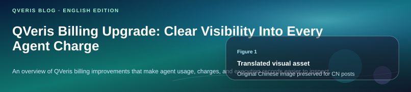
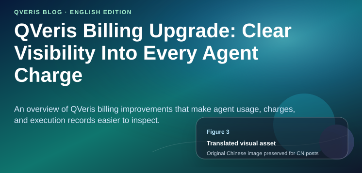
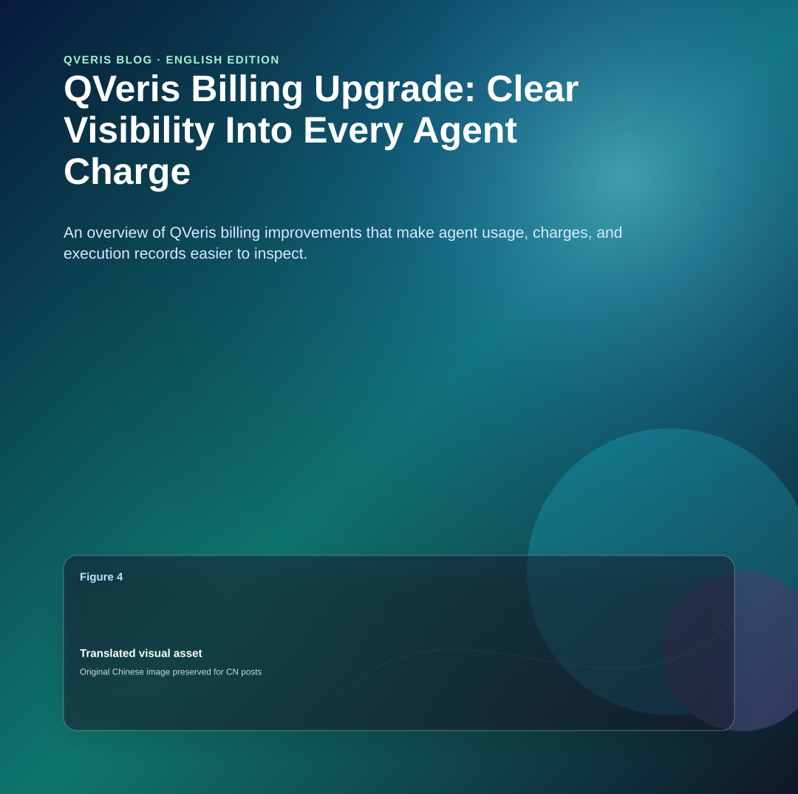
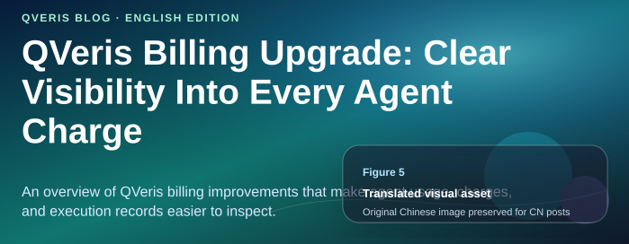
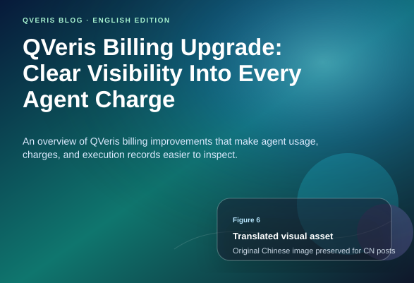
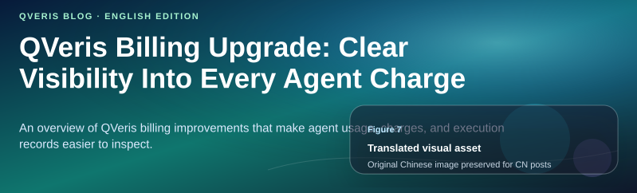

QVeris · Product Update

See exactly why each call is charged

When you build agents and API applications, a question that looks simple on the surface may trigger multiple rounds of tool discovery, tool execution, and model calls behind the scenes. In the past, what confused users most was not simply "how much balance was deducted," but:

-    Did that failed call just now get charged?

-    If it was charged, which call caused the deduction?

-    Why are some successful calls charged while others are 0?

-    Can exported records be reconciled with the page and the credits ledger?

This billing transparency upgrade is designed to answer those questions. It is not just about adding a few more columns to a bill. It turns **every request into a usage record that can be viewed, filtered, exported, and audited**.

01 What this upgrade solves

Before: You could only see balance changes

You could see how many credits were deducted. But it was hard to tell which call caused the deduction.

Now: Calls and the ledger can be reconciled

- **Usage** answers "what happened."

- **Credits Ledger** answers "why did the balance change."

- Failures, empty results, provider errors, timeouts, permission issues, and similar cases can now be clearly shown as not charged or requiring review.

   You can think of it this way: Usage is the call detail view, while Credits Ledger is the credits transaction log. The former shows the process; the latter shows the money.

02 How to read the Usage page

In the Usage page under Account Center, you will see "Calls and usage records." It covers search discovery, tool calls, and model calls, making it the first place to investigate a request.

**  
**

- **Succeeded + Charged**: The request succeeded and an actual deduction was made.

- **Succeeded + Included**: The request succeeded, but the charge for this call was 0. This usually means it was included, covered by a free allowance, or did not require charging under the current rules.

- **Failed + Not charged**: The request failed and no charge was made. This is often the type of record users care about most.

- **Needs review**: The system has found a case where the billing result and the call result need review, such as a failed call that still shows a charge, a missing ledger association, or use of a supplemental snapshot.

03 How to read the Credits Ledger page

   The Billing page in Account Center includes the "Credits Ledger." It does not try to record every request. Instead, it focuses only on **events that actually affect the balance**: tool call charges, model call charges, top-up grants, refund reversals, daily free allowances, signup rewards, referral rewards, and so on.

Ledger rows can also be expanded. After expanding a row, you can see the billing summary, bucket deduction details, source references, and, when there are multiple billing items, the quantity, unit price, and subtotal.

This means you can see not only how much was deducted, but also what quantity and unit price were used to calculate it.

# Failed calls are now more reliably free

The core of the second-stage upgrade is the introduction of standardized execution result evaluation. The system no longer looks only at whether "HTTP returned 200" or whether a "success" field is true. Instead, it breaks a call down into several checks that are closer to the real business outcome:

- Whether the request path successfully reached the upstream service.

- Whether the provider processed it successfully.

- Whether the returned result was valid.

- Whether this result meets the conditions for charging.

The final decision on whether a charge is allowed is based primarily on the chargeable determination in the standardized execution result. For example, empty results, provider errors, permission errors, timeouts, rate limits, and invalid results should not automatically trigger a minimum charge just because an API was called.

04 How to use it in practice

1.   Log in to QVeris and go to Account Center.

2.   If you want to investigate a specific call, open Usage first.

3.   Select a 1-day, 7-day, or 30-day time range; if needed, filter further by success status, charge status, or audit flag.

4.   Click a row to expand it and review the summary, error, reference ID, and latency.

5.   If the record is marked Charged, go to the Credits Ledger under Billing to compare it with the actual credit balance change.

Recommended troubleshooting flow: first use Usage to determine whether the request succeeded and whether it was charged, then use Credits Ledger to confirm whether the balance actually changed.

05 Benefits after the upgrade

# FAQ

### Why are there 0.00 records in Usage?

Because Usage records call events, not just charge events. Successful but included calls, failed and uncharged calls, search discovery, and other events may all show 0.00.

### Why can't I see a failed call in Billing?

If a failed call was not charged, it did not change the balance, so it will not appear as a charge transaction in the Credits Ledger. You should check this type of record in Usage.

### Why does some Pricing show quantity and unit price, while other entries show a fixed charge?

The new structured billing format will display quantity, billing unit, unit price, and subtotal wherever possible. For older data or records that lack a complete structured snapshot, the page falls back to showing fixed charge, included, not charged, and similar states.

### What should I do if I see Needs review?

This usually means the system has detected an audit signal that requires review, such as a failed call that still shows a charge, a missing ledger association, or use of a supplemental snapshot. We recommend expanding the record, copying the reference ID, and contacting the support team.
