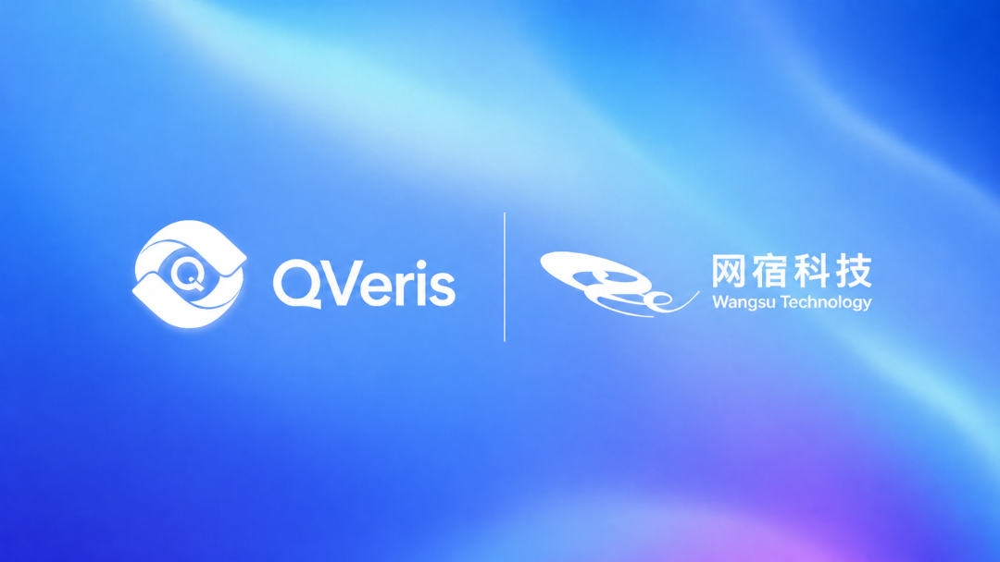
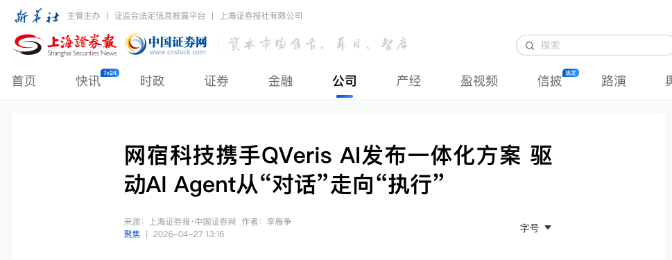

Recently, QVeris AI and Wangsu Science & Technology entered into a strategic partnership. The two companies will work together on the deployment of enterprise-grade AI agents, jointly explore the Agent Infra market, and advance integrated “model + tool” solutions for enterprise customers, providing full-stack support for agents from reasoning and decision-making to secure execution.

Source: China Securities Journal

At the center of this partnership is the collaborative development of the key infrastructure required to bring enterprise-grade agents into production.

Over the past year, large language models have shown enterprises the enormous potential of AI in knowledge understanding, content generation, task planning, and more. But in real business environments, model capability alone is not enough for agents to enter production workflows. Agents also need stable connections to real-world tools, data, APIs, and business systems, and they must be able to execute under controlled, secure, and auditable conditions.

This is the most critical layer of infrastructure as enterprise agents move from demos into production.

The Key Question for Enterprise Agents: Not “Can They Answer?” but “Can They Execute Securely?”

Today, many enterprises have begun integrating large language models into customer service, marketing, operations, data analysis, office collaboration, and business automation scenarios. But once these systems enter production, companies usually encounter several common challenges:

- Tools and APIs are highly fragmented, with each system using different interfaces, parameters, authentication methods, and response formats.

- Before invoking tools, agents often lack reliable mechanisms for capability discovery, quality assessment, and cost evaluation.

- Integrating a single tool is manageable, but when enterprises need to connect dozens, hundreds, or even tens of thousands of tools at scale, development and maintenance costs rise rapidly.

- Enterprises need permission control, key management, execution audits, cost billing, and security boundaries. Agents cannot be allowed to call external systems as black boxes.

- MCP, plugins, and function-calling mechanisms solve the problem of “being able to connect,” but enterprises also need higher-level capability routing, quality governance, and closed-loop execution.

As a result, the competitiveness of enterprise-grade agents depends not only on the model itself, but also on the real-world capability boundaries they can connect to, select from, invoke, and govern.

QVeris AI’s view is that the Agent era requires a new infrastructure layer: one that turns fragmented external APIs, data services, enterprise systems, and tool capabilities into a capability network that agents can discover, understand, and invoke securely.

QVeris AI: Capability Routing and Execution Infrastructure for Agents

QVeris AI is currently positioned as a capability routing network for AI agents. Its core workflow can be summarized as Discover, Inspect, and Call.

Discover: Agents or developers can describe their needs in natural language and dynamically discover suitable tools and capabilities, without having to memorize specific API names in advance or read documentation one by one.

Inspect: Before execution, the system can review key information such as tool parameters, invocation methods, latency, success rate, and cost, helping agents and developers make more reliable choices.

Call: After confirming the capability and parameters, tools are invoked through a unified interface, returning structured results that agents can use for further reasoning, verification, and follow-up actions.

**Around this workflow, QVeris AI has built four key capability layers**:

- Aggregated access layer: Unified registration, authentication, and billing reduce the cost of connecting enterprises to external tools and data sources.

- Quality evaluation layer: Real-time probing, reliability indexes, latency measurement, and success-rate evaluation help agents avoid blind tool calls.

- Intelligent matching layer: Dynamic matching based on user intent, scenario requirements, and available capabilities improves tool selection accuracy.

- Trusted execution layer: Permission, security, cost, audit, and risk-control mechanisms ensure that enterprise-grade agents can invoke external capabilities in a controlled, traceable, and governable way.

What QVeris AI aims to solve is not “connecting one more tool,” but giving agents reusable, scalable, and governable execution infrastructure.

Integrated “Model + Tool” Solutions: Bringing Agents Into Real Business Workflows

The ultimate goal of using agents in the enterprise is not to generate more polished text, but to complete real tasks.

A complete enterprise-grade agent workflow typically includes goal understanding, task decomposition, tool selection, external system calls, result verification, and business action execution. The model is responsible for understanding, planning, and decision-making, while the tool layer connects to real-world data, systems, and operational interfaces.

With only a model, agents can easily remain limited to Q&A and content generation. With only tools, the system lacks natural language understanding, complex task planning, and contextual reasoning. Only when model capabilities and the tool execution layer are systematically connected can enterprise agents truly enter business workflows.

The partnership between Wangsu Science & Technology and QVeris AI is focused precisely on this critical link. By combining enterprise-grade infrastructure, scenario delivery capabilities, agent capability routing, tool invocation, and trusted execution, the two companies will help enterprises build agent systems that can be deployed, operated, and governed more quickly.

Joint Value for Enterprise Customers

Through this partnership, QVeris AI and Wangsu Science & Technology will jointly explore Agent Infra scenarios for enterprise customers, with a focus on helping customers solve the following problems:

- Reduce tool and API integration costs: Enterprises no longer need to repeatedly write adapter code for every external tool and business system.

- Improve agent execution success rates: Capability discovery, parameter inspection, quality evaluation, and structured invocation reduce tool-call failures and model hallucinations.

- Shorten the path to agent application deployment: Enterprises can move faster from model experimentation to business workflow validation and production deployment.

- Strengthen security and governance: Enterprise-grade execution boundaries can be built around permissions, keys, costs, logs, and audits.

- Expand the capability boundaries of agents: Through a unified capability network, agents can connect to more real-world data, services, and business systems.

For enterprises advancing AI transformation, this means agents are no longer just conversational entry points. They can become execution entry points that connect business systems, external data, and automated workflows.

Joint Exploration Across Typical Scenarios

Going forward, the two companies will explore joint solutions across multiple enterprise-grade scenarios, including financial investment, public opinion monitoring, enterprise data analysis and report generation, business management, marketing and growth automation, and support for global expansion.

What these scenarios have in common is that business value does not come from a single Q&A interaction. It comes from whether agents can stably, securely, and cost-effectively invoke real systems and complete tasks.

QVeris AI will continue building product capabilities around agent capability routing, quality evaluation, unified invocation, and trusted execution, working with ecosystem partners to help enterprise-grade agents move from proof of concept into production deployment.

Founder’s View

**QVeris AI Founder and CEO Wang Linfang said**:

“The deployment of enterprise-grade agents is not only about model capability. The core question is whether models can securely and reliably connect to real-world tools and business systems. QVeris AI has long focused on building capability routing and execution infrastructure for agents, enabling them to discover, evaluate, and invoke external capabilities. Our partnership with Wangsu Science & Technology is an important step in helping enterprise-grade agents move from ‘thinking’ to ‘executing.’”

- End -
