QVeris · Data Test

## I Do Not Want an Agent to Pick Stocks Directly. I Want It to Learn How to Screen First

**Recently, I wanted to test a question that can easily push an Agent in the wrong direction**:

>
> Are AI-related stocks still worth watching?
>

If you throw this question directly at a general-purpose Agent, it is easy to get a lively but not very useful answer: AI is a long-term trend, demand for compute remains strong, leading companies have advantages, investors should watch valuation risk... It all sounds right. The problem is that it has not actually started to "screen."

I do not want an Agent to immediately tell me which stock is good. That is too risky, and too much like the generic filler often seen in financial content.

What I really wanted to test was this: after QVeris connected to FMP, could it act like a research assistant and first help me build a screening path?

At minimum, that path needs to answer four questions. First, are AI-related industries currently trading at high valuation levels overall? Second, what is the market chasing, selling, and trading today? Third, can we use a Screener to first filter a candidate pool of US-listed companies? Fourth, among those candidates, can we add a quick check of fundamental metrics and Share Float instead of looking only at concept heat?

So this article is not an "AI stock recommendation." It is a more basic test: I asked QVeris to act as an AI stock research assistant and checked whether it could first get the screening framework running.

## Step 1: First Check Valuation Levels for US Market Sectors and Industries

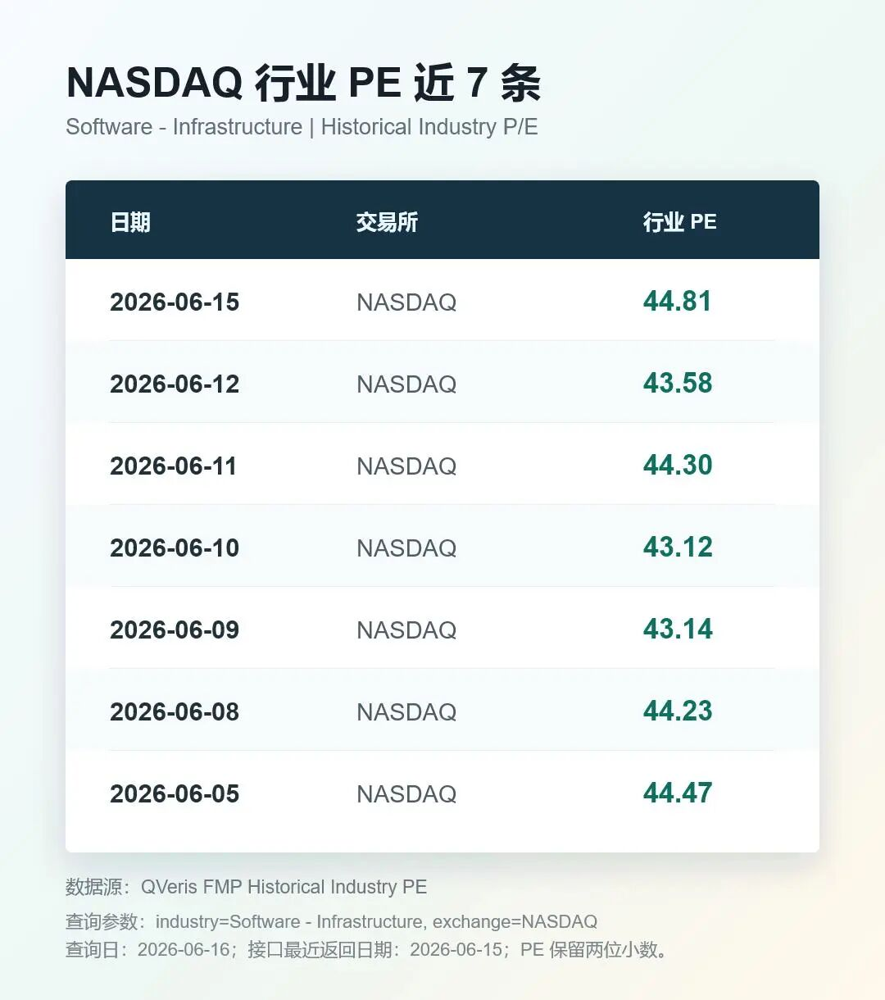

I did not start by looking up a single stock. I started with the industry.

Looking only at individual companies makes it easy to be pulled along by narratives. This is especially true for a theme like AI. As long as a company touches compute, chips, software, or data centers, it can easily be placed under the "AI concept" umbrella. But a research assistant cannot just listen to stories. At minimum, it should first ask: is this industry expensive overall right now?

I asked QVeris to call FMP's Historical Industry PE and query NASDAQ Software - Infrastructure.

This call successfully returned 7 records. On 2026-06-15, the industry PE for NASDAQ Software - Infrastructure was around **44.81**. Around 2026-06-05 and 2026-06-08, it was around **44**.

This set of numbers was useful to me. It does not tell me whether the software infrastructure industry is a buy or not. Instead, it gives the Agent an industry valuation reference. Later, if a company's PE is 25, 30, 50, or 80, the Agent at least knows it is not looking at valuation in a vacuum. It is comparing it against the industry level.

I also had QVeris call the SIC classification and search for SEMICONDUCTORS. It returned SIC code **3674**, with the industry title **SEMICONDUCTORS & RELATED DEVICES**.

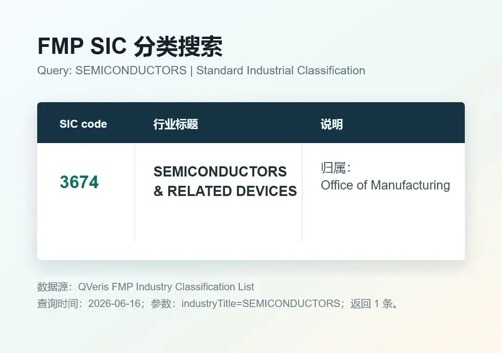

This step may look small, but it matters for an Agent. AI themes should not be classified by keyword guessing alone. Aligning industry, SIC, and sector classifications first keeps the later screening process from turning into "if it looks like AI, count it as AI."

## Step 2: Look at Sector Performance and Market Movers, Not Just Popular Narratives

Industry valuation can answer the question of "level." It cannot answer "what is moving in the market today."

So in the second step, I asked QVeris to call FMP's Historical Sector Performance and look at recent sector performance for NASDAQ Technology.

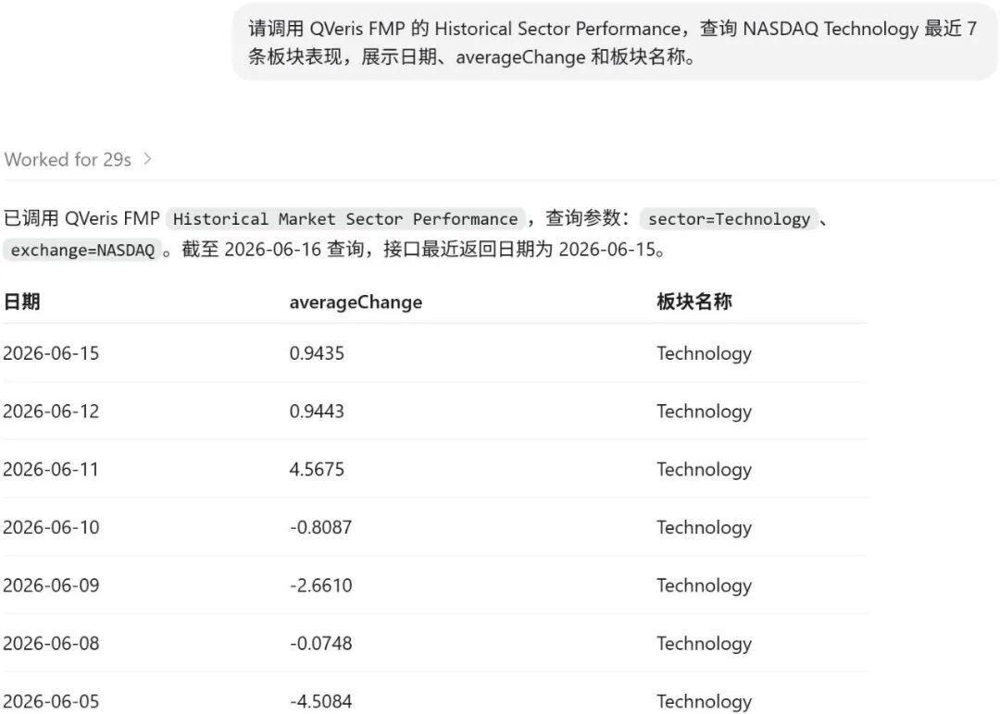

The result also returned normally. On 2026-06-15, the averageChange for Technology / NASDAQ was about **0.94%**. On 2026-06-05, there was a more obvious negative value of around -**4.51**%. On 2026-06-08, it was -**0.07**%.

This means the Agent can read sector performance as background noise. Otherwise, when it sees an individual technology stock rise or fall, it may easily over-explain the move as company-specific, when in reality the whole sector may simply have been moving that day.

Next, I ran FMP's market mover endpoints: Biggest Gainers, Biggest Losers, and Most Active.

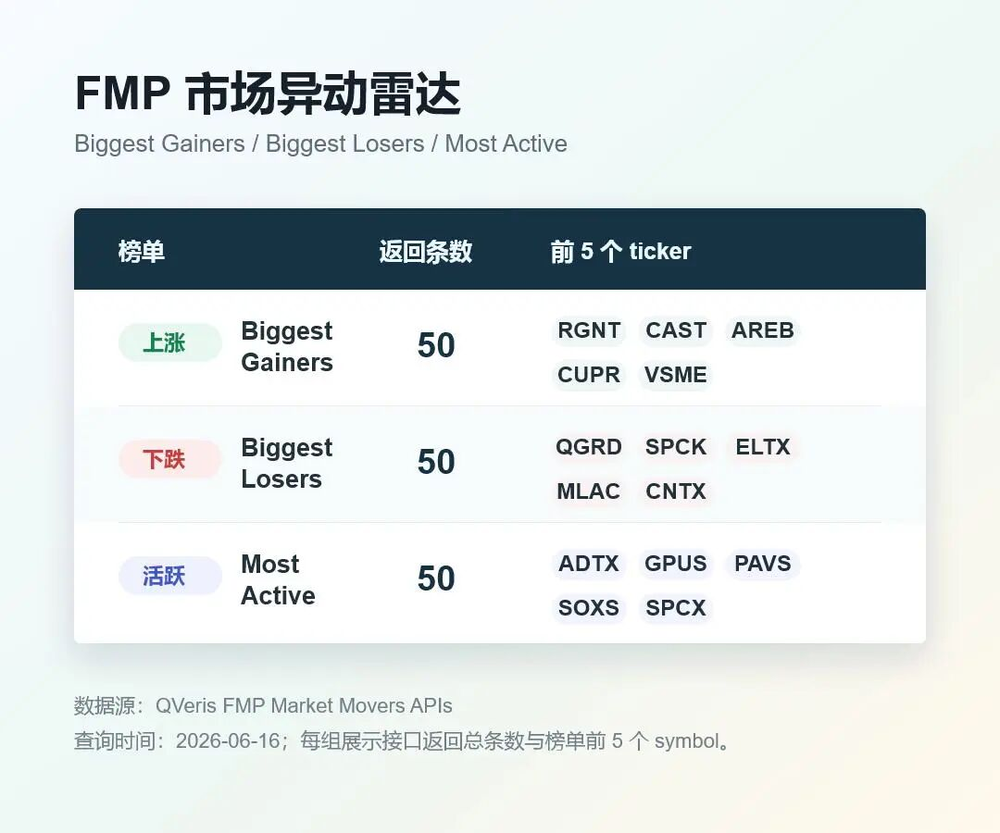

Gainers returned 50 records. At the top were names such as RGNT, CAST, AREB, CUPR, and VSME with extremely large gains. Most Active also returned 50 records, including high-attention tickers such as ADTX, GPUS, PAVS, SOXS, and SPCX. Losers also successfully returned 50 records, including QGRD, SPCK, ELTX, MLAC, and CNTX among the largest decliners.

This actually made me more comfortable. An Agent should not only look at "what rose the most," and it should not only look at "what is most active." Market movers are more like a radar screen: gainers tell you where something suddenly flared up, losers tell you where something is collapsing, and most active tells you where capital and attention are concentrated.

This step is not a stock-picking conclusion. It simply helps the research assistant establish the day's market context.

## Step 3: Use the Screener to Build a Candidate Pool, Then Review ROE and PE

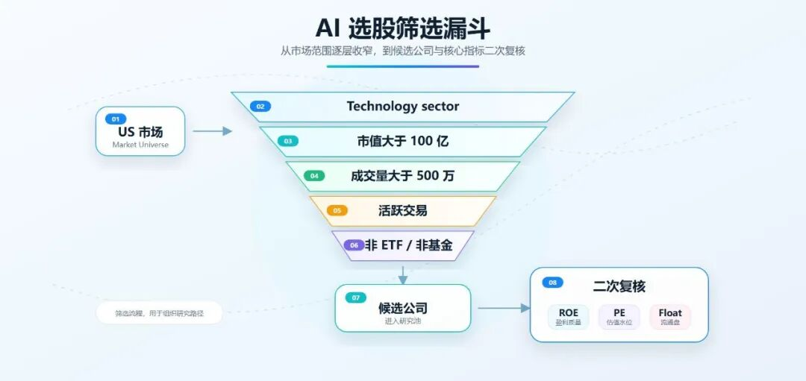

At this point, I finally started screening companies.

But there was an important finding here: in the current QVeris schema, FMP's Stock Screener cannot directly filter by ROE or PE. It supports fields such as sector, industry, country, market cap, price, volume, exchange, isEtf, isFund, and isActivelyTrading.

So I did not pretend that I could directly use the Screener to filter for high ROE and low PE. That would not be accurate.

I used a two-step approach instead. First, I used the Screener to filter for a candidate pool of US market companies in the Technology sector with market cap above USD 10 billion, volume above 5 million, actively traded status, non-ETF, and non-fund. Second, I used FMP's Key Metrics TTM to review ROE and valuation for the candidate companies.

**This Screener call successfully returned 10 candidates**:

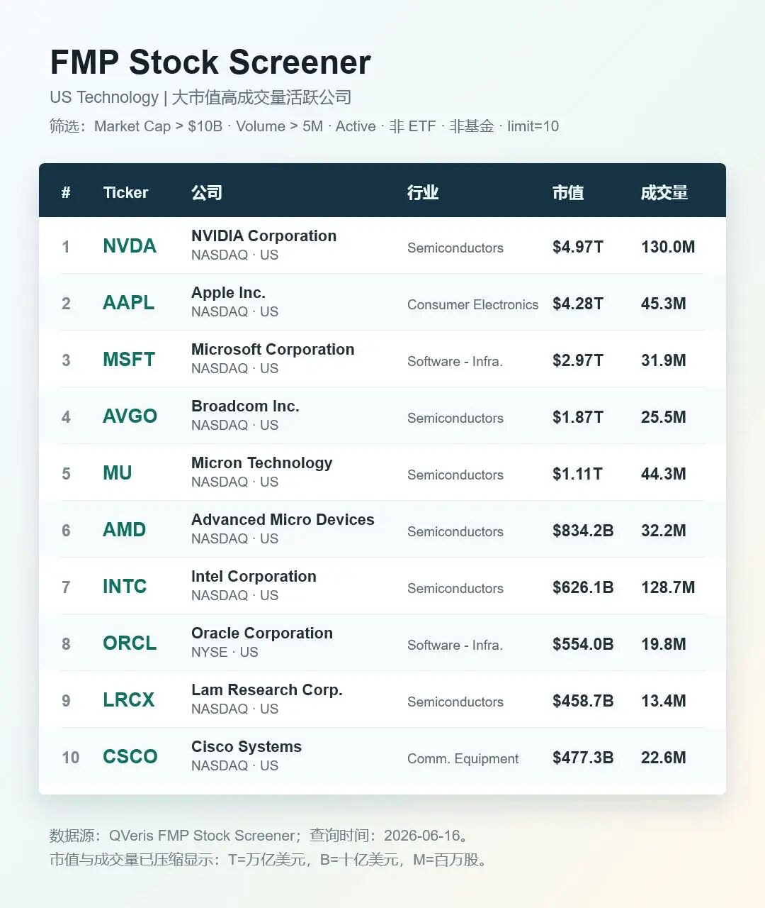

That already looks much more like what a research assistant should do: produce a candidate pool first, instead of immediately outputting an opinion.

Then I used Key Metrics TTM on two samples: NVDA and MSFT.

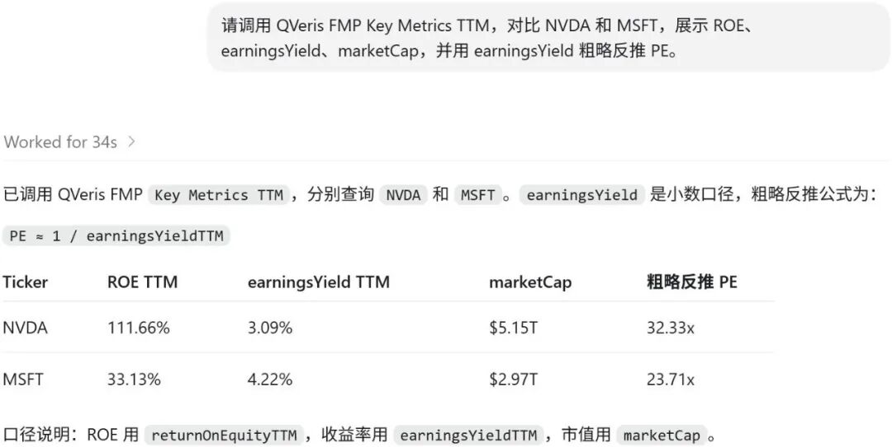

NVDA's TTM ROE returned at about **111.66%**, with an earnings yield of about **3.09%**, implying a PE of roughly **32.33**. MSFT's TTM ROE returned at about **33.13%**, with an earnings yield of about **4.22%**, implying a PE of roughly **23.71**.

This is where it gets interesting. Earlier, we saw that the NASDAQ Software - Infrastructure industry PE was about **44.81**, so MSFT can be placed against this industry level as a rough reference. Its PE, if derived from earnings yield, is about **23.71**, clearly below that industry PE.

NVDA, on the other hand, should not be directly compared with Software - Infrastructure, because it belongs to the semiconductor industry. It is better treated as another review sample here: its TTM ROE is about **111.66%**, and the implied PE is about **32.33**. This shows that the Agent is not just seeing "AI heat"; it can continue asking research questions about earnings quality, growth delivery, and semiconductor industry valuation levels.

I would not write this as "which one is more worth buying." The right expression is: QVeris can first screen a candidate pool, then place industry valuation, company ROE, and valuation multiples in the same table, allowing users to decide which names to review next.

## Step 4: Add a Share Float Check and Do Not Ignore Tradable Shares

Finally, I added one more step: Share Float.

Many stock screening workflows skip this step, but I do not think an Agent should. A stock's tradable float affects liquidity, volatility, and trading accessibility. This is especially true on market mover lists, where small-cap, low-float, or unusually structured stocks often show extreme moves. If an Agent completely ignores share float, it can easily misread a "liquidity-driven move" as a "fundamental opportunity."

I first ran All Shares Float. The endpoint successfully returned 10 records, but the first-page samples were Shenzhen-listed names such as 000001.SZ and 000002.SZ, which were not suitable for the US stock screening thread.

So I switched to Company Share Float and queried NVDA from the Screener candidates.

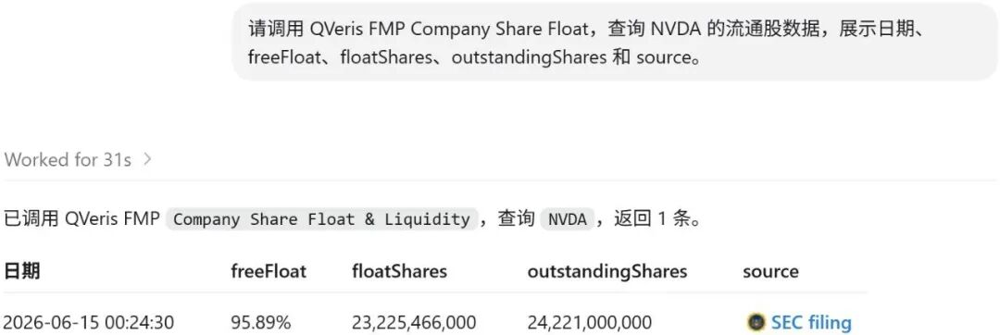

This result was very clear: for NVDA on 2026-06-15, freeFloat was about **95.89%**, floatShares were about **23.225 billion shares**, outstandingShares were about **24.221 billion shares**, and the result also included an SEC source link.

The point of this step is not to say whether NVDA is good or bad. It is to make sure the Agent does not only look at market cap, volume, and concepts, but can also put share structure into the research memo.

## What This Means for QVeris Agent

After this test, I think the value of FMP's industry / sector plus Screener capabilities for QVeris is very clear:

>
> It moves the Agent from "answering stock questions" to "building a screening process."
>

The difference is large.

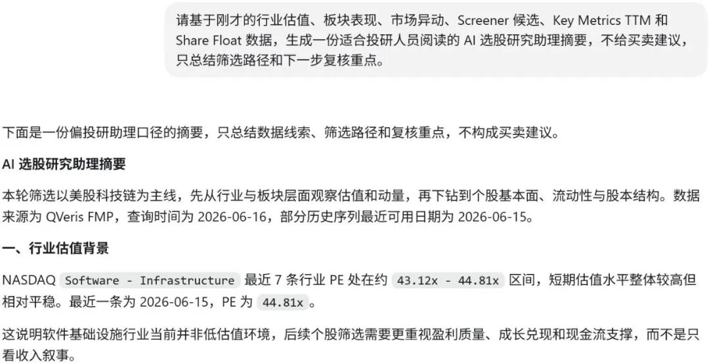

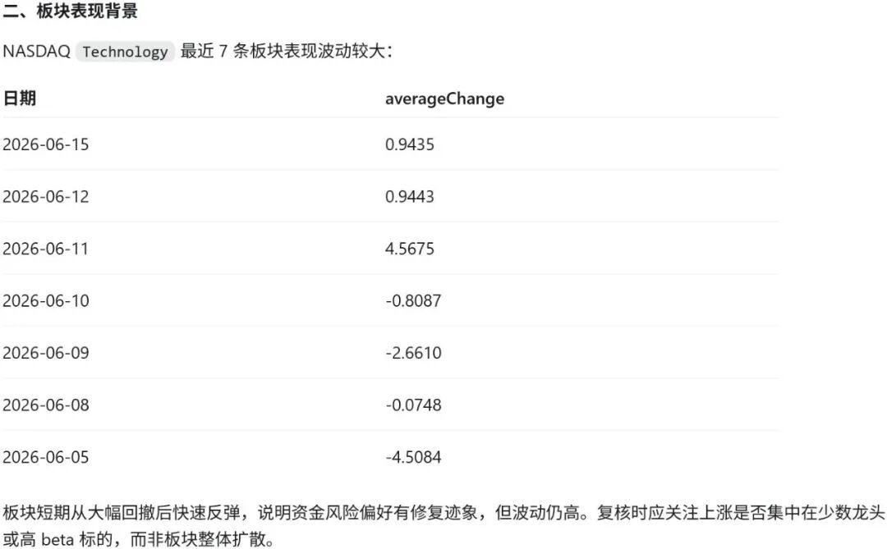

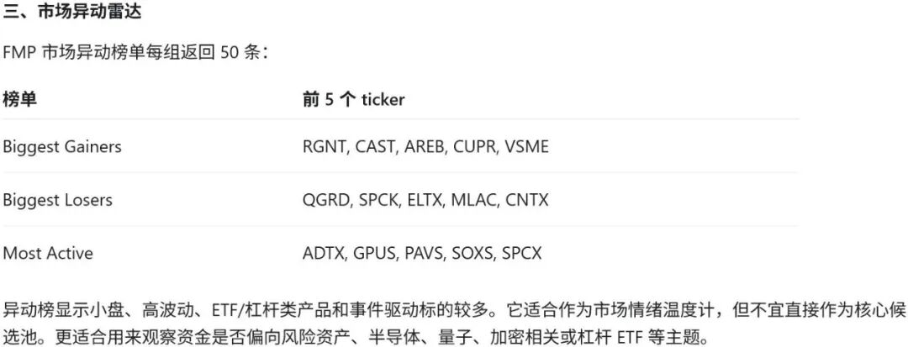

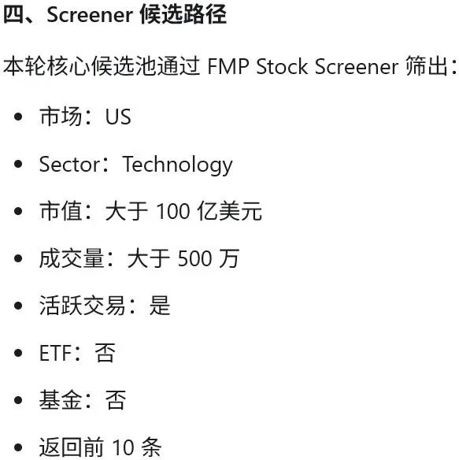

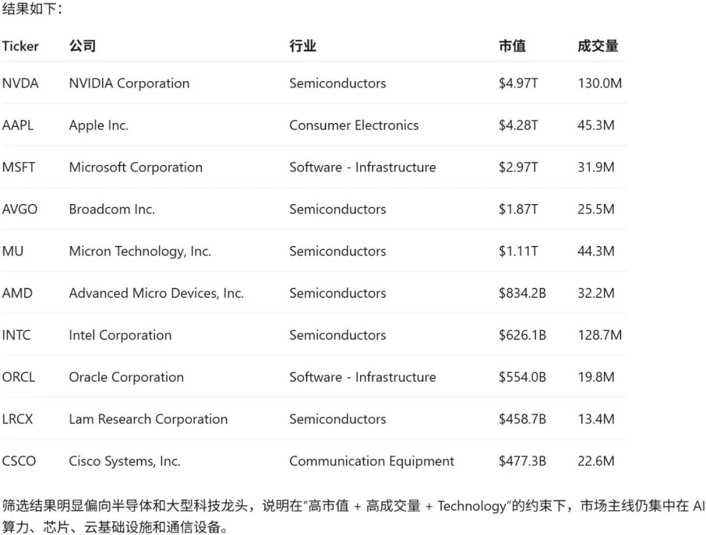

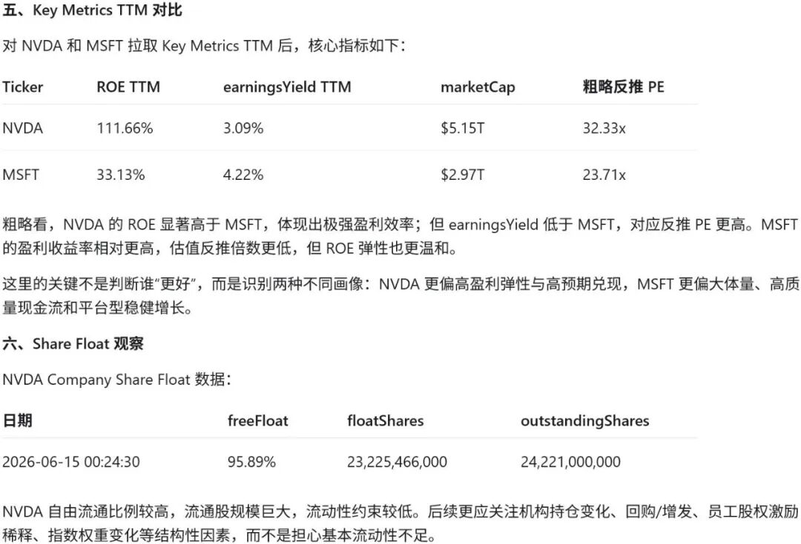

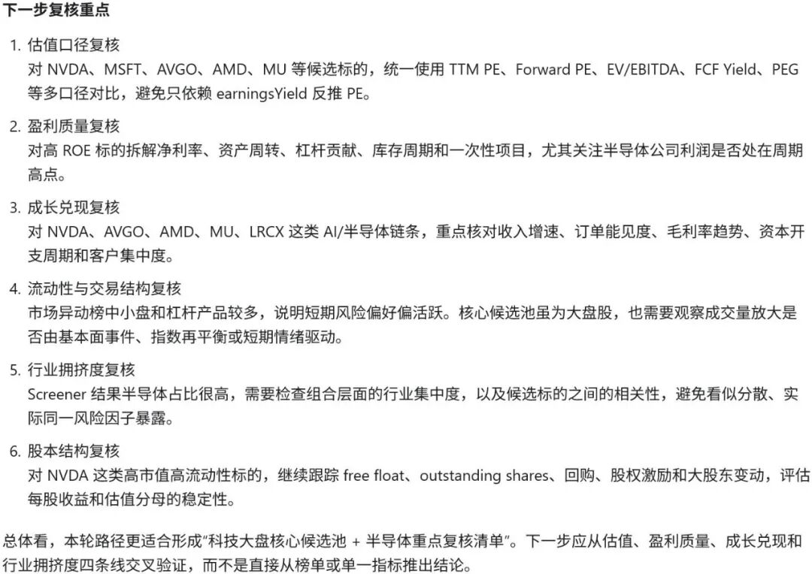

Answering stock questions can easily become opinion generation: AI is hot, technology stocks are strong, valuation needs attention. Building a screening process is closer to what a research assistant does: first check industry valuation, then sector performance, then market movers, then use the Screener to produce a candidate pool, then use ROE, PE, and Share Float for a second review.

The best output for this workflow is not "which stock to buy." It is a candidate list, industry valuation references, market mover context, fundamental review fields, float checks, and the next questions that need human confirmation.

That is the role I want QVeris Agent to play in investment research: not making snap judgments for users, but organizing data that was originally scattered across multiple pages, interfaces, and screeners into a research framework that can be questioned further.

This is especially important for a theme like AI. The hotter a theme becomes, the easier it is for "story," "valuation," "trading heat," and "fundamental quality" to get mixed together.

This QVeris call to FMP proved at least one thing: an Agent does not need to rush to an answer. It can first learn how to screen.

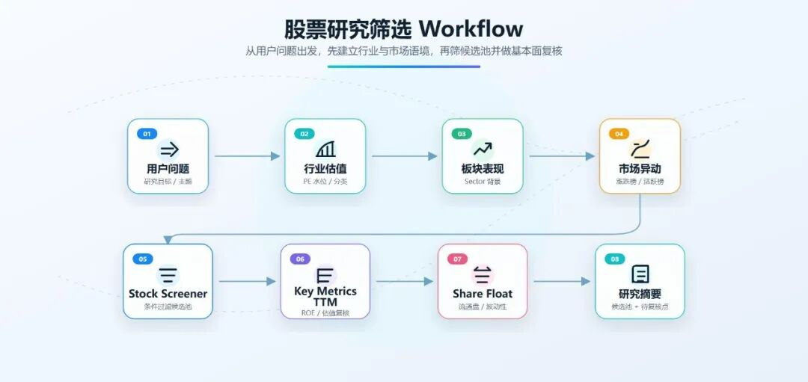

>
> This article only demonstrates the QVeris × FMP data calls and research workflow. It does not constitute investment advice.
>
