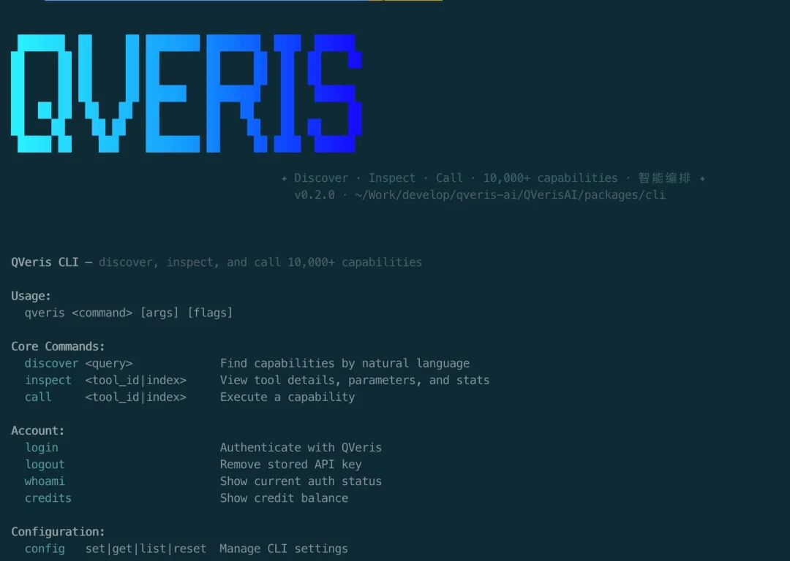
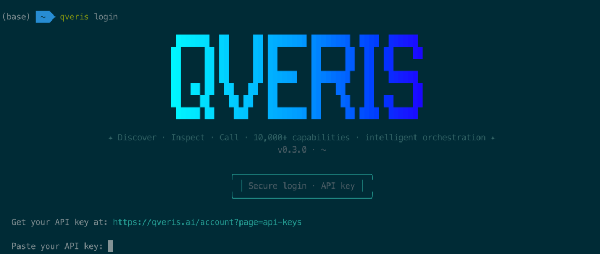
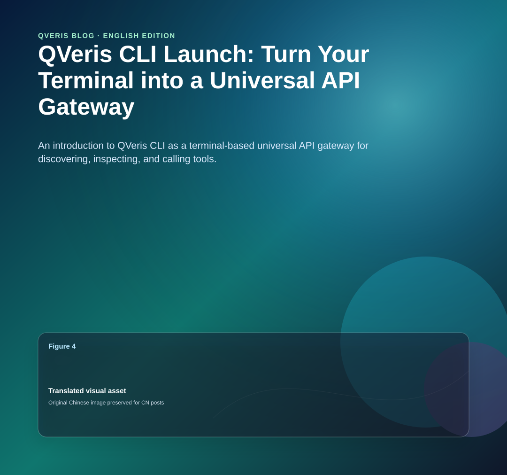
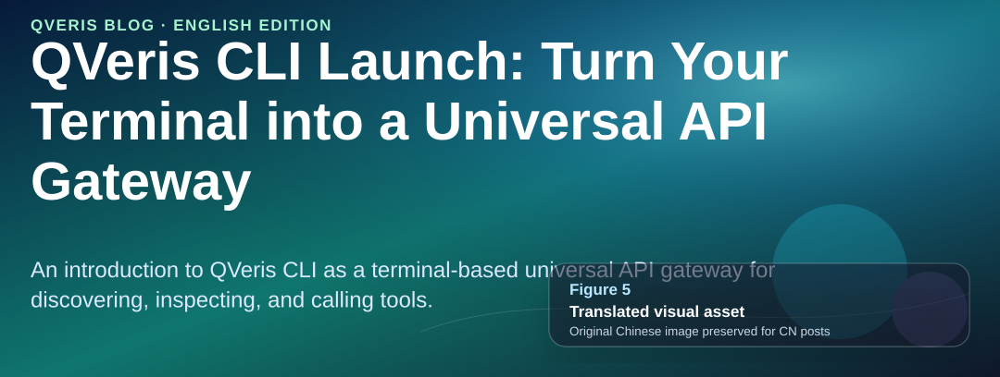
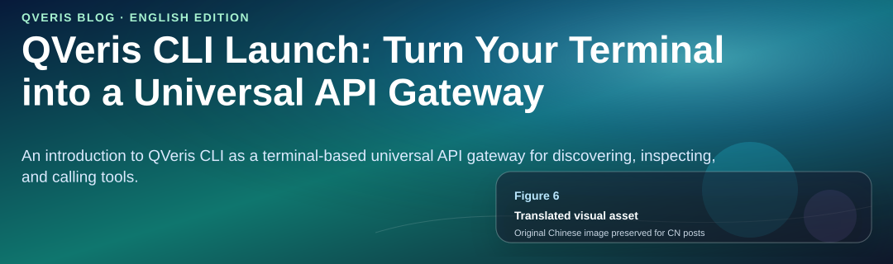
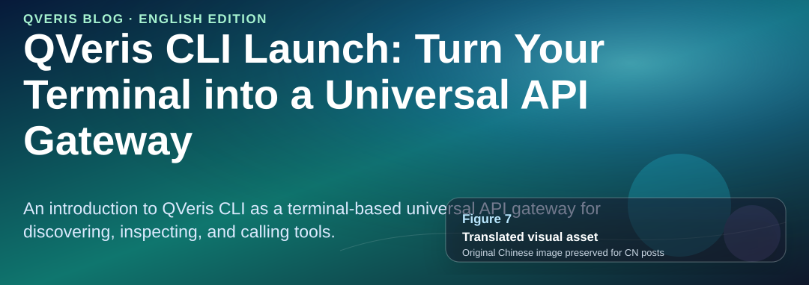
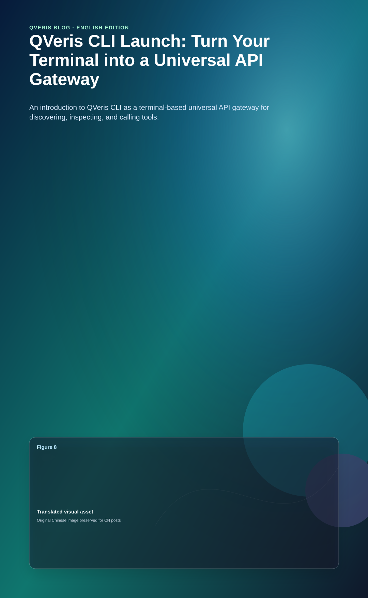
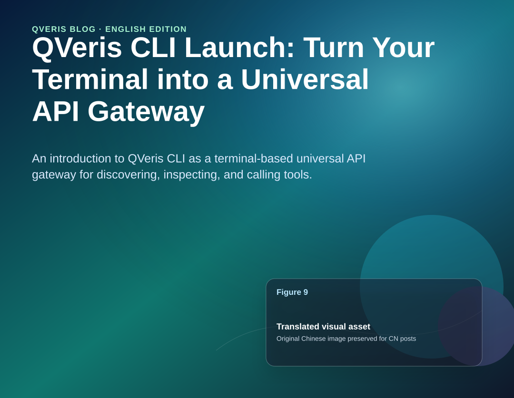
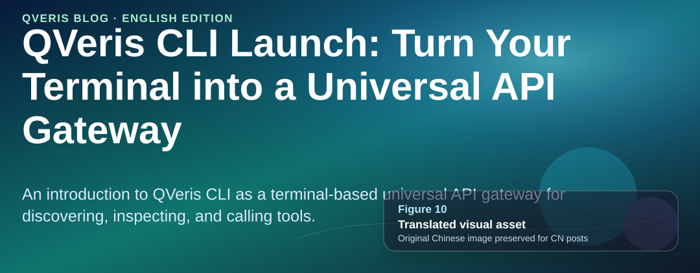
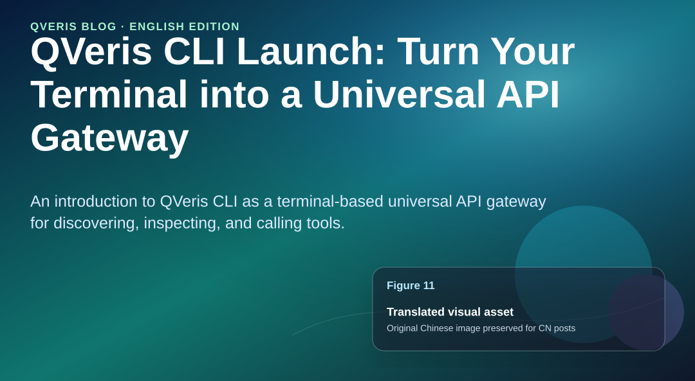

As AI agents reshape the developer toolchain, one practical problem still has not been solved well: **  
**

**What do you do when you need to call an API quickly, but do not want to write code, read documentation, or sign up for a third-party platform?**

Now, one command is enough.

**QVeris CLI** is a command-line tool built for developers and agents. It lets you discover, inspect, and call 10,000+ API capabilities from your terminal using natural language.

No documentation hunting. No adapter code. From zero to usable in 30 seconds.



# 01.

#  

# Install in 30 Seconds and Start Immediately

#  

**One curl command, available globally**:

```
curl -fsSL https://qveris.ai/cli/install | bash
```


**Or install with npm**:

```
npm install -g @qverisai/cli
```


**After installation, login takes one step**:

```
qveris login # Automatically opens the browser for authentication and stores the API Key securely locally
```

**New user benefit**: Sign up and receive 1,000 credits. Search is completely free, with no card required.

#  

# 02.

#  

# Core Workflow: Discover → Inspect → Call

#  

The design philosophy behind QVeris CLI is simple: **find APIs like a search engine, use APIs like terminal commands**. The entire flow has only three steps:

## Step 1: Search in Natural Language

##  

**You do not need to remember any API names. Just describe what you need**:

```
qveris discover "real-time stock quotes"
```


**The CLI semantically matches your query across 10,000+ tools and returns the best results**:

```
Found 6 tools:  1. finance.stock_quote       Real-time stock quotes      ⚡ 320ms  99.2%  2. market.live_price         Real-time market prices    ⚡ 450ms  98.7%  3. trading.ticker_data       Quote data and history     ⚡ 280ms  99.5%
```




Each result includes latency and success-rate scores at a glance. **Search is completely free and does not consume any credits.**

## Step 2: Inspect Tool Details

##  

**Use an index number for quick reference instead of copying and pasting a long tool_id**:

```
qveris inspect 1
```


```
finance.stock_quoteReal-time stock price quotes from major exchangesProvider: MarketData Pro  ·  Avg: 320ms  ·  Success: 99.2%Parameters:  symbol    string (required)   Stock ticker symbol  exchange  string (optional)   Exchange code
```




Parameters, descriptions, and performance metrics are all clearly visible.

## Step 3: Call and Get Results

##  

```
qveris call 1 --params '{"symbol": "AAPL"}'
```


```
{ "symbol": "AAPL", "price": 198.52, "change": +2.31, "volume": 45230100 }
```



**Three commands take you from “I need a stock API” to real-time data in under 30 seconds.**

#  

# 03.

#  

# Interactive REPL: Explore APIs Like a Conversation

#  

**If you want to explore and test as you go, start an interactive environment with `qveris interactive`**:



```
$ qveris interactiveQVeris REPL v1.0 — type a query to discover tools, help for commandsqveris> weather forecast APIFound 4 tools:  1. weather.forecast   7-day weather forecast   ⚡ 380ms  2. weather.current    Current conditions        ⚡ 220msqveris> inspect 1  weather.forecast  Parameters: location (required), days (optional, default: 7)qveris> call 1 {"location": "Shanghai"}  { "location": "Shanghai", "forecast": [...] }qveris> codegen curl# Generated curl command:curl -X POST https://qveris.ai/api/v1/execute \  -H "Authorization: Bearer $QVERIS_API_KEY" \  -d '{"tool_id":"weather.forecast","params":{"location":"Shanghai"}}'
```




**Highlight**: The `codegen` command can automatically generate curl, Python, or JavaScript calling code that you can copy directly into your project.

# 04.

#  

# The Most Efficient Way for Agents to Call Tools

#  

**QVeris CLI is the most token-efficient way for agents to use QVeris.**

Compared with an MCP Server, which needs to inject full tool schemas into context and typically consumes thousands of tokens, the CLI approach is simple: one command in, JSON results out, with zero protocol overhead.

```
# Structured output for direct agent parsing (search for capabilities first, then continue with the tool_id or index)qveris discover "aggregate news or financial indicators into structureddata" --json --limit 3
```

- 
- 
- 

```js
# stdin pipeline for automation (upstream scripts assemble parameters, downstream calls directly)echo '{"tickers":["AAPL","MSFT","GOOGL"],"interval":"1d"}' | \  qveris call 1 --params - --json
```

(`1` refers to the index from the most recent `discover` result in the current session. You can also replace it with the actual `tool_id`.)


- 
- 
- 

```js
# Dry-run validation without consuming credits (confirm parameters and routing before the real run)qveris call 1 --params '{"tickers":["AAPL","MSFT"],"interval":"1d"}' --dry-run --json
```

**  
**

If you care more about **exporting Excel / CSV**, you can replace the discover query with more precise natural language, for example:

```
qveris discover "export table or spreadsheet Excel CSV API" --json --limit 3
```

**Note when aligning with real tools**: The exact `tool_id` and parameter names returned by `discover` depend on the API. A typical agent flow is **`discover` → `inspect` the schema → `call`/`--dry-run`**, which matches the way the CLI is used today.


**Why does this use fewer tokens than MCP?**

- MCP: Requires injecting the full schema of every tool into the LLM context, growing linearly with the number of tools

- CLI: Uses a single shell command plus JSON output, with a fixed overhead of about 50-100 tokens

- In scenarios with 10+ tools, the CLI approach can save 80%+ of token consumption

###  

### Agent-Friendly Design

###  

|   |
| --- |

| Feature | Description |
|----|----|
| `--json` output | All commands support structured JSON output for easy programmatic parsing |
| stdin pipeline | `--params -` reads parameters from standard input, supporting pipeline workflows |
| Structured exit codes | 0 success · 77 authentication failed · 69 service unavailable · 75 network timeout |
| Automatic terminal detection | Pipeline mode automatically disables colors and animations, and expands response bodies to 20KB |
| `--dry-run` | Pre-validates parameters without consuming credits |

**Suitable for**: Claude Code, OpenCode, Cursor, custom Agent scripts, and any agent platform that can execute shell commands.

#  

# 05.

#  

# Complete Command Cheat Sheet

#  



All commands support `--json` output, `--api-key` authentication override, and `--timeout` timeout settings.

#  

# 06.

#  

# Six Core Capabilities

#  



#  

# 07.

#  

# QVeris CLI vs MCP Server: How to Choose

#  



**Recommendation**: They are not mutually exclusive. CLI is a good fit for terminal and automation scenarios, while MCP is a good fit for embedded IDE scenarios. You can use both at the same time.

#  

# 08.

#  

# Use Cases

#  

## Scenario 1: Everyday Developer Debugging

##  

**Need to quickly verify what data an API returns while coding? Stay in the terminal**:

```
qveris discover "geocoding API"
qveris call 1 --params '{"address": "Chaoyang District, Beijing"}'
```


After you get the result, use 

`codegen python` to generate Python calling code directly and copy it into your project.

##  

## Scenario 2: Agent Automation Workflow

##  

**Let your AI Agent complete complex tasks through shell calls**:

```
# Agent automatically discovers, validates, and callsqveris discover "weather forecast" --json --limit 1 | \  jq -r ".results[0].tool_id" | \  xargs -I {} qveris call {} --params '{"location":"Shanghai"}' --json
```


## Scenario 3: Data Collection and Analysis

##  

**Combine shell pipelines to retrieve data in batches**:

```
# Query multiple stocks in batchfor symbol in AAPL GOOGL MSFT; do  qveris call finance.stock_quote --params "{\"symbol\":\"$symbol\"}" --jsondone | jq -s "."
```


## Scenario 4: CI/CD Integration

##  

**Call external services in your continuous integration workflow**:

```
# Send a notification after deploymentqveris call email.send_smtp \  --params '{"to":"team@example.com","subject":"Deploy Complete"}' \  --api-key $QVERIS_API_KEY --json
```


# 09.

#  

# Try It Now

```
curl -fsSL https://qveris.ai/cli/install | bashqveris loginqveris discover "any API you want"
```


**Three commands unlock 10,000+ API capabilities.**

- Sign up and receive 1,000 credits; search is free

- No card required; install and start using immediately

- Fully open source: github.com/QVerisAI/QVerisAI

#  

# 10.
