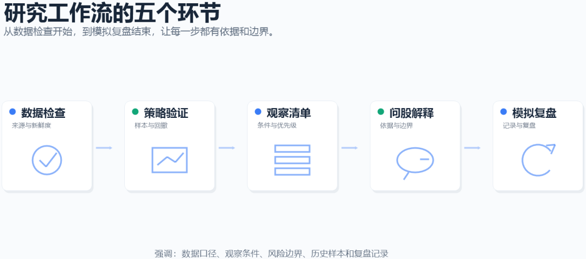

QVeris · Product Overview

## Opening: Information Is Not Scarce. Explainable Research Workflows Are.

When users open a market data tool, the usual problem is not a lack of information, but information overload: price movements, news summaries, technical indicators, model signals, and market opinions all arrive at once. The real challenge is how to organize this information into a research chain that can be inspected: what the evidence is, where the boundaries are, and how the process can be reviewed later.

QStock’s product philosophy is to downgrade “signals” into “objects of observation” and break “conclusions” into “conditions, evidence, and boundaries.” QVeris extends this direction, helping users turn investment research from scattered judgments into workflows that are easier to trace, explain, and review.

## 1. From Conclusion-Oriented to Observation-Oriented

Many investment research tools compress complex information into a prominent result label. This reduces reading effort, but it can also obscure more important questions: whether the data is reliable, whether the conditions still hold, whether the risk boundaries are clear, and whether the decision can be reviewed afterward.

QStock is closer to a research workflow framework: first confirm the data scope, then check whether a strategy has been tested against historical samples, then judge whether there are objects worth observing continuously, and finally use the stock assistant and simulated portfolio to complete the explanation and review loop.

| Common issue | More robust approach | QVeris product direction |
| --- | --- | --- |
| Give a single result directly | Preserve observation conditions and trigger evidence | Organize information around data, conditions, risk lines, and target observation lines. |
| Look only at one result metric | Clarify the historical sample scope | Explain historical sample performance, maximum drawdown, and statistical scope. |
| Assistant gives a conclusion directly | Explain data structure and boundaries | Answer around system signals, simulation records, and invalidation conditions. |
| Review depends on human memory | Let the process accumulate over time | Record observation, execution, skipping, closing, and post-market review. |

## 2. Breaking Investment Research Into Five Continuous Actions

QVeris focuses not only on individual pages, but also on the continuity between pages. A more complete investment research process should begin with data checks, move through strategy validation, opportunity observation, and stock-specific explanation, and finally return to simulation records and review.

| Stage | What users actually ask | What QVeris aims to help organize |
| --- | --- | --- |
| Check data | Is today’s data new? Is market data delayed? | Data source, cache status, snapshot time, and data freshness. |
| Check strategy | Is this strategy just an idea, or has it been tested against historical samples? | Sample period, cost assumptions, drawdown, and stability. |
| Check observation objects | Which symbols are worth adding to today’s observation list? Why? | Trigger conditions, multi-strategy resonance, and observation priority. |
| Ask the assistant | What should I focus on for this stock right now? | Explain using signals, risk lines, simulation records, and sample limitations. |
| Review | What happened after observation? Why did it not enter the simulation record? | Simulated execution records, post-market review, reasons for non-execution, and closing status. |

## 3. The Core Is Not More Human-Like Answers, but a More Verifiable Process

Investment research products can easily overemphasize whether answers are fluent or whether the interface feels lively. But in real research, fluency is not the same as credibility. Credibility comes more from data scope, sample range, assumptions, risk boundaries, and review records.

### Strategy Validation: Let Ideas Face Sample Testing First

In strategy validation, QVeris is better suited to presenting historical sample performance, maximum drawdown, transaction costs, sample periods, and similar information, rather than compressing a complex strategy into a single score.

This moves strategy discussion beyond “this logic looks effective” and into “how this logic performed under which samples, which costs, and which risk boundaries.”

### Opportunity Radar: Turning Candidate Symbols Into an Observation List

Opportunity Radar should not be just a ranking list. It is more like a filtered observation pool: which symbols satisfy multiple conditions, where the risk line is, where the target observation line is, and whether there is multi-strategy resonance.

Ideally, users should not need to switch back and forth among dozens of indicators. They should first receive a structured set of observation objects, then decide whether to go deeper.

## 4. Stock Assistant: Answers Should Return to Known Data and Boundaries

The stock assistant should not be packaged as a stock commentator. A more appropriate role is research assistant: when a user asks about a stock, the system should not invent news, capital flow, or specific trading advice. It should explain observation conditions based on existing data.

For example, when a user asks, “Can this stock still be observed today?”, a more robust answer returns to several structured questions: whether it is still in an open signal, whether it is close to the risk line, whether there is already a position in the simulation record, whether it has recently touched the target observation line, and whether sample performance is stable.

| Generic answer | Data-based answer example |
| --- | --- |
| “There may still be short-term opportunity; you can keep watching it.” | “It is still within the observation plan and has not broken below the risk line; however, the distance to the target observation line has narrowed, so the next focus is volume and invalidation conditions.” |
| “Handle it if it falls.” | “If it breaks below the system risk line, the original observation plan becomes invalid; if it only approaches the risk line, check whether there are new resonance signals.” |
| “This strategy has performed well historically.” | “Historical sample performance comes from a specified period and does not represent future performance; transaction costs, drawdown, and holding period also need to be considered.” |

## 5. Simulated Portfolio: Turning Observations Into Reviewable Assets

Many tools stop after “discovering observation objects.” QVeris places more emphasis on the second half of the workflow: did the observation object enter the simulation record? Why was it skipped? How did it perform later? Can the post-market review explain what happened?

The value of this capability lies in turning a temporary judgment into a research record that can be revisited. Teams can compare strategy performance under different market conditions, and individual users can understand whether the objects they watched produced continuous feedback.

- **Execution records**

Record entries, exits, skips, and reasons for non-execution.

- **Position status**

Show simulation records, position status, risk lines, and target observation lines.

- **Post-market review**

Organize the day’s execution, key changes, concentration, and next research questions.

## 6. Three Scenarios Where QVeris Fits

| Scenario | Common need | Suitable capabilities |
| --- | --- | --- |
| Individual researchers | Organize observation lists more efficiently and understand the reasons behind them. | Today’s Opportunities, Opportunity Radar, stock assistant, watchlist stocks. |
| Pro users | Maintain watched stocks and validate their own strategy ideas. | Custom strategies, strategy backtesting, deep stock Q&A, watched stock maintenance. |
| Teams and platforms | Manage data scope, strategy workflows, and permission boundaries in a unified way. | Admin backend, data diagnostics, strategy catalog, and simulated portfolio review. |

## Closing: Let the Research Process Preserve Its Evidence

QVeris is valuable not because it completes judgments on behalf of users, but because it helps users make the judgment process clear. A good observation plan should be able to answer: why this object, where the risk lies, whether the data is credible, how the historical sample performed, and what the final outcome was.

When the research process can be traced, explained, and reviewed, an investment research tool is no longer just an information entry point. It becomes a more stable research workflow.
