## A Cross-Border Research Question That Gets Stuck at the Data Source

I recently wanted to test a very ordinary question that becomes surprisingly painful in practice:

If we compare Kweichow Moutai and Nestlé side by side, what exactly is comparable between them?

One is a leading A-share baijiu company priced in RMB.

The other is a Swiss consumer goods giant priced in Swiss francs. On the surface, this sounds like pulling two company profiles and comparing them. But anyone who has done cross-border investment research knows that the first step is often not analysis. It is finding the data.

Which exchange is Kweichow Moutai listed on? What is the correct symbol format? What currency is it priced in? For Nestlé, should you use the local SIX ticker or the U.S. ADR? Can the ISIN be matched? Are the industry classifications based on the same taxonomy? If you then add Tencent, Toyota, Samsung, SAP, and BHP, every additional market adds another layer of data source and identifier friction.

The awkward part of this kind of question is that the problem is not a lack of analytical ability. The Agent has not even started analyzing before it gets blocked by markets, exchanges, currencies, and ticker formats.

So this test was not about whether “FMP can look up a U.S. company.” That is too basic. What I wanted to test was this: after QVeris integrates FMP, can it use one unified entry point to connect company profiles and historical prices across multiple countries, exchanges, and local currencies? This time, I did not manually look up those markets. I handed the question to QVeris to see whether it could use FMP to pull cross-market data into one aligned view.

## First, I Checked How Many Exchanges FMP Covers

The first step was to call `availableexchanges`.

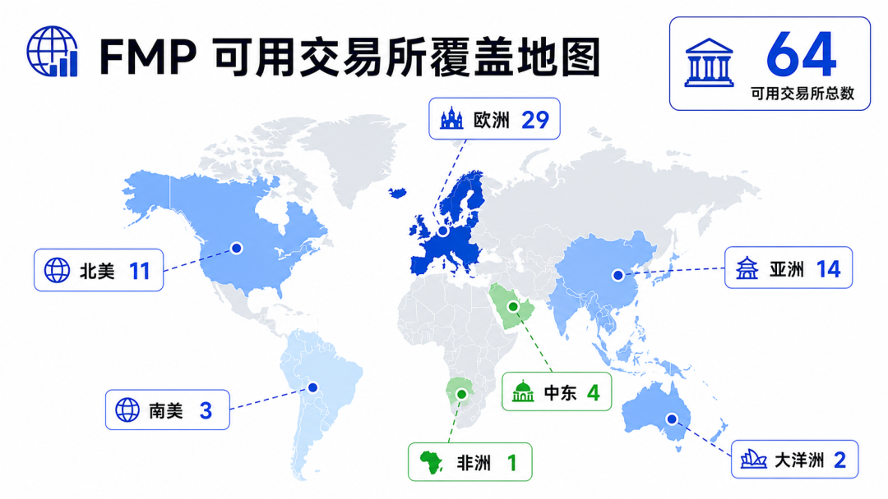

The result returned 64 exchanges. Roughly by region: 11 in North America, 3 in South America, 29 in Europe, 14 in Asia, 4 in the Middle East, 1 in Africa, and 2 in Oceania. This is no longer “a U.S. equity data source with a bit of international coverage on the side.” It is a real underlying data map that can support cross-border investment research.

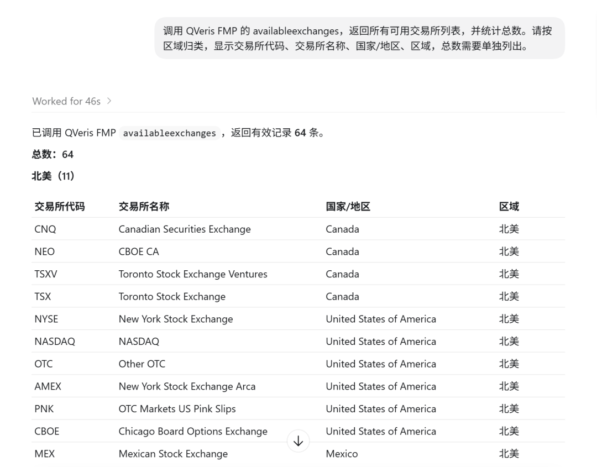

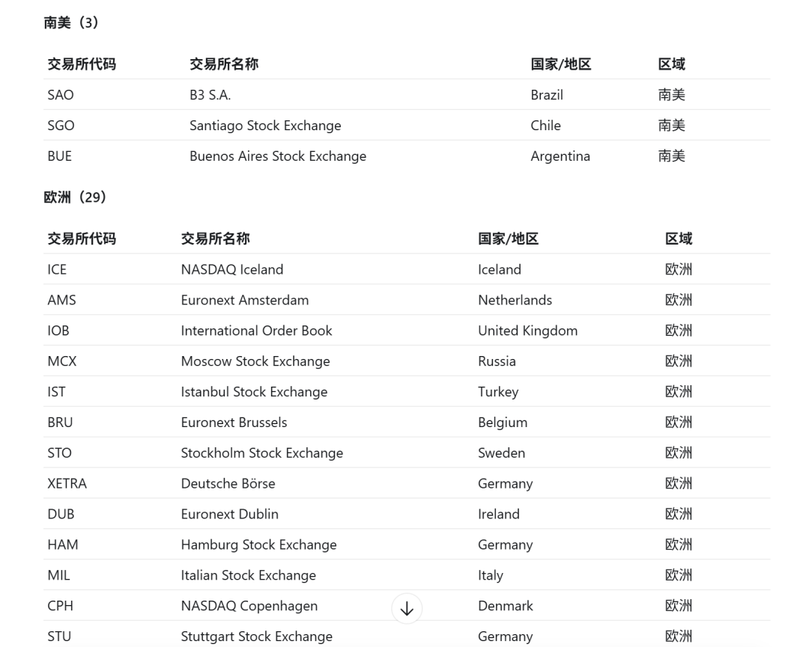

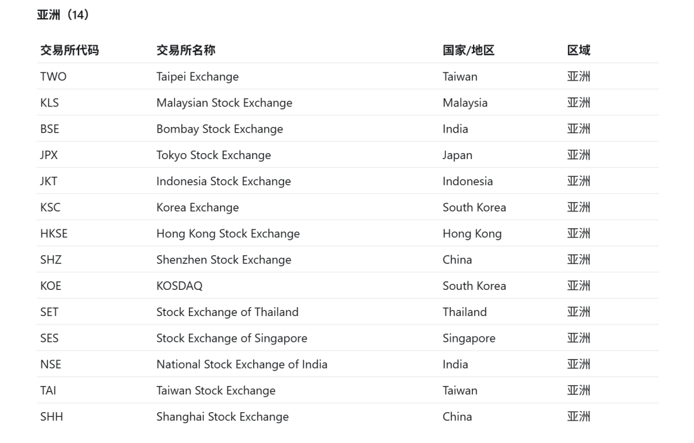

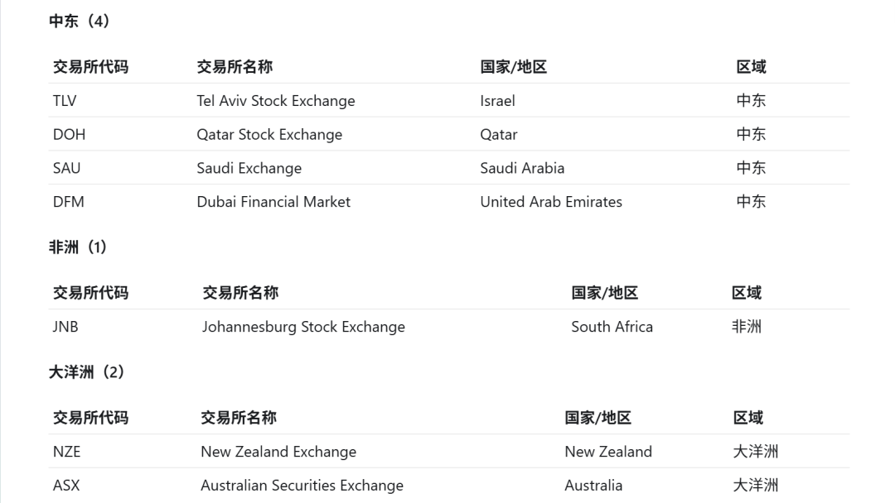

The most important point here is not the number itself, but the consistency.

The problem with many data sources is that U.S. equities use one interface, Hong Kong equities use another, and A-shares use yet another. When you build an Agent workflow, you eventually end up with a pile of conditional logic: if it is a Hong Kong stock, use this provider; if it is a Japanese stock, switch to another symbol format; if it is a European market, add another exchange mapping layer.

For a human, this is annoying. For an Agent, it is a disaster.

Every additional data source adds another point of failure: the code format may be wrong, currencies may get mixed, field names may be inconsistent, and historical price depth may not line up.

The value of FMP for QVeris is that it flattens the idea of a “global market entry point” as much as possible. The Agent does not need to become a data source dispatcher before it can start doing research.

## Kweichow Moutai vs. Nestlé: Local Currency, Exchange, and ISIN All Need to Match

I chose Kweichow Moutai and Nestlé as the main case because they are a good test of the real difficulties in cross-border research.

Kweichow Moutai is a Chinese A-share company whose core trading venue is the Shanghai Stock Exchange and whose shares are priced in RMB. Nestlé is a Swiss company whose core trading venue is the SIX Swiss Exchange and whose shares are priced in Swiss francs. Both are in the consumer sector, but one is a Chinese baijiu company while the other is a global food and beverage group. To compare them properly, the basics must be aligned first: company identity, trading venue, currency, and industry classification.

In testing, the profile data was able to return key fields such as company name, exchange, currency, industry classification, CEO, IPO date, and ISIN.

The ISIN is especially important here, because cross-market companies often have local shares, ADRs, and tickers on different exchanges at the same time.

Looking only at the ticker can easily lead to a mismatch, while looking only at the company name is too loose. The ISIN is a very practical anchor in cross-border investment research.

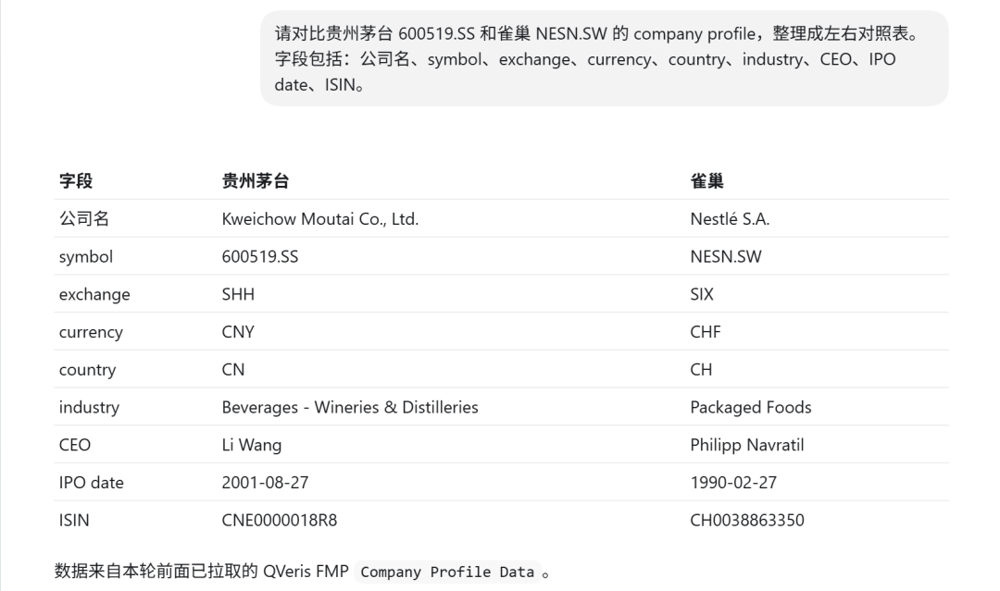

**Once this step works, the Agent can move on to more valuable questions**:

For example, even if both are leading consumer companies, are Kweichow Moutai and Nestlé valued according to completely different logic?

One looks more like a scarce brand asset, while the other looks more like a global channel and category portfolio. One has maintained extremely high margins over the long term, while the other has stronger stability and geographic diversification. The analysis can unfold gradually, but only if the underlying data does not block the road first.

This kind of “pre-analysis cleanup” used to be the part I disliked most. You think you are doing investment research, but half an hour is spent confirming symbols and currencies. Now, at least this part can be handed to a QVeris Agent to run first.

## Pulling 7 More Markets: Not a Demo, but Coverage

Testing only Kweichow Moutai and Nestlé would not be enough. It could easily become a polished demo. So I continued with seven more market samples.

Tencent, Hong Kong equities, priced in HKD. Toyota, Japan, priced in JPY. Samsung, Korea, priced in KRW. Tesco, London market, priced in pence. SAP, Germany, priced in EUR. Shopify, Canada, priced in CAD. BHP, Australia, priced in AUD.

Together with Kweichow Moutai and Nestlé, that makes nine market samples, all successfully handled through profile.

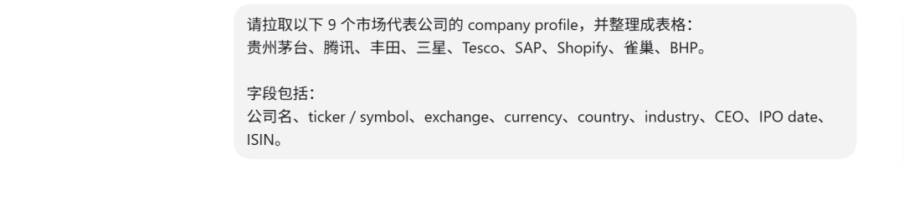

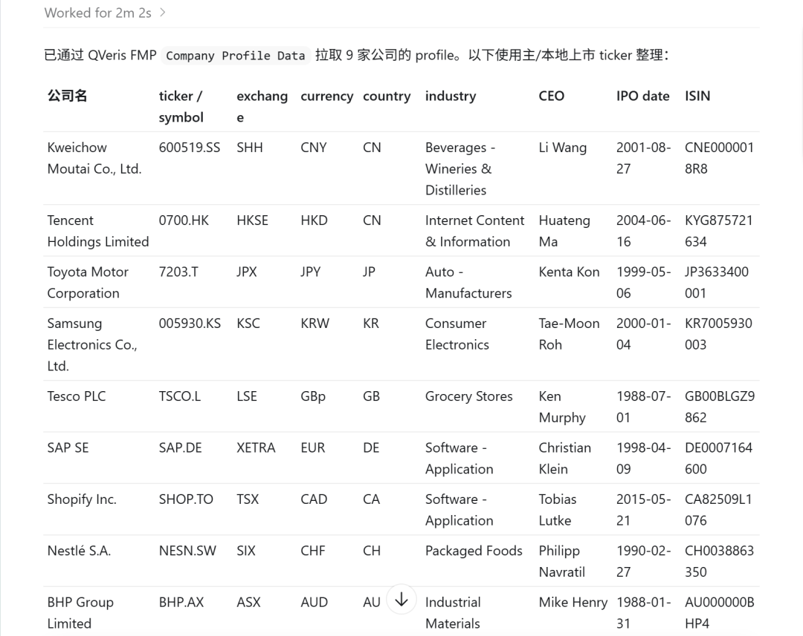

The point of this sample set is that it covers several common sources of friction when an Agent performs cross-border research: Asian markets, European markets, Hong Kong equities, local-currency trading, different ticker suffixes, different currency units, and differences in how the same industry is classified across countries.

If a user asks, “Help me find several global leaders in consumer goods, manufacturing, software, and resources, then produce a basic comparison using local-market data,” that task used to break down into a long list of manual steps. Now it looks more like an automatable workflow: identify companies and markets, pull profiles, normalize fields, then move into valuation, financials, prices, or news analysis.

For QVeris, this is not just “a few more overseas tickers.” It is the dividing line for whether an Agent can move beyond a single market.

## Not Just Company Profiles: LSE Daily Prices Work Too

Company profiles only prove that “company identity can be recognized.” Investment research cannot stop at the business-card level, so I also tested historical prices.

The case here was Tesco on the London Stock Exchange. In testing, the EOD daily series for TSCO.L returned 1260 records.

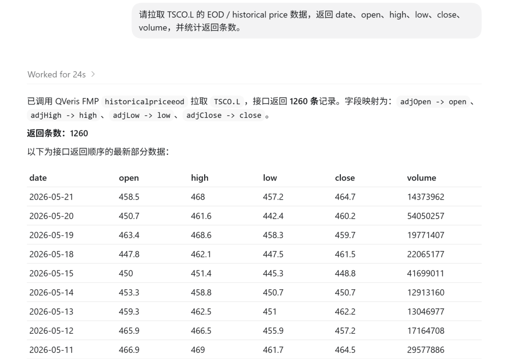

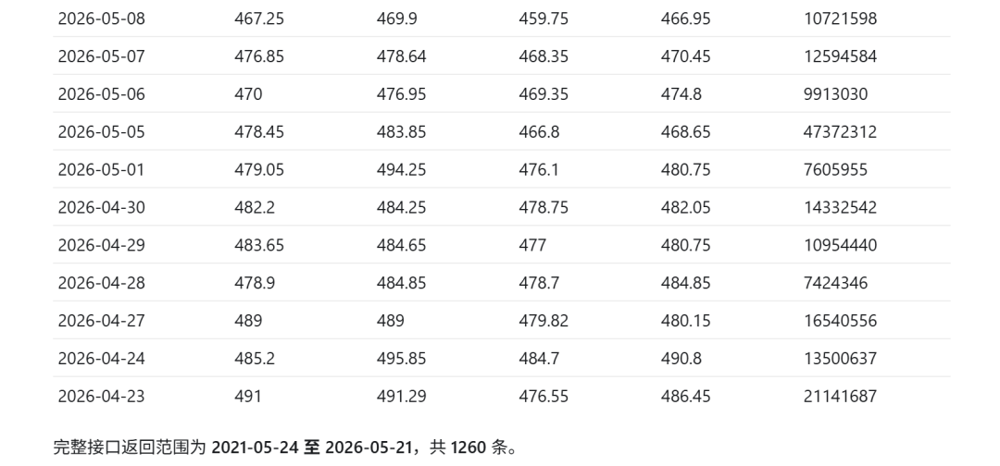

This result shows two things.

First, for non-U.S. markets, FMP does not only provide static company profiles. Price data can be connected as well.

Second, when a QVeris Agent performs cross-border research, it can put “company profile” and “historical price” into the same workflow, instead of getting profiles from one place and prices from another.

For example, a future Agent workflow could compare the five-year share price performance, local-currency returns, and valuation changes of leading consumer companies across different countries. It could also combine industry classification, financial metrics, and historical prices to build a more complete cross-market screener.

Of course, currency conversion, adjustment methodology, and trading-day differences still need to be handled carefully.

Cross-border investment research does not become automatically easy just because an API exists. But at least the most fundamental step, “can we get the data, and can we call it through a unified interface,” is now working.

## What This Means for QVeris Agent

The most important part of this test, in my view, is not that FMP covers 64 exchanges, nor that profiles worked across all nine market samples. Those numbers matter, of course, but the product implication behind them matters more:

QVeris Agent can start treating “global markets” as an operable object, not as a set of scattered data islands.

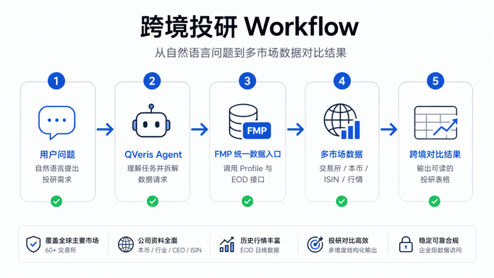

In the past, building a cross-border research Agent could easily turn into an engineering swamp. First connect U.S. equities, then Hong Kong equities, then find a way to fill in A-shares, then handle European markets. Every new provider requires another round of adaptation for authentication, fields, tickers, currencies, and error handling. Before the Agent becomes smart, the engineering work has already turned into an interface maintenance project.

Now that QVeris has brought a large part of the underlying data layer in through FMP, the Agent can focus more on the task itself: comparing companies, tracking industries, finding cross-market comparables, generating research frameworks, and outputting tables and conclusions.

For example, users will be able to ask directly:

>
>  Compare the company profiles of Kweichow Moutai and Nestlé, including exchange, local currency, ISIN, industry, and CEO. Answer with a concise table suitable for researchers, and note the data source below the table.
>
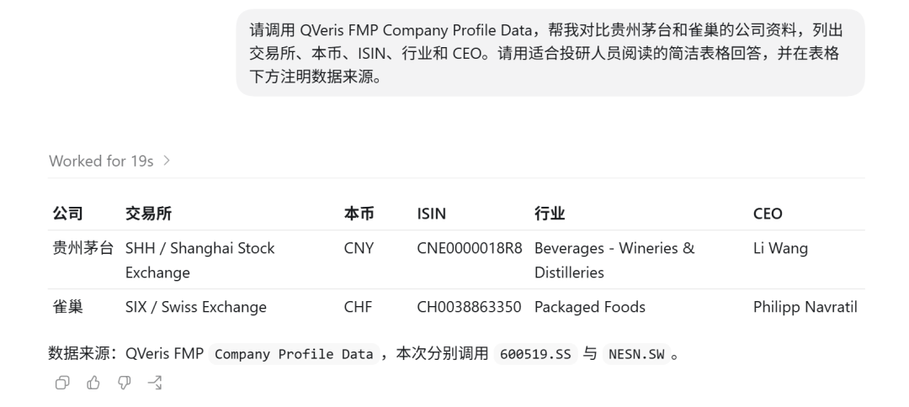

This question is not a single-point lookup. It is cross-market data orchestration. It requires the Agent to know where to look, how to align the data, how to explain the result, and how to preserve the data source and methodology in the output.

That is where the QVeris × FMP combination becomes genuinely valuable: it is not just about saving developers one API lookup. It gives Agents another layer of global investment research infrastructure.

QVeris has already connected FMP’s global exchanges and cross-border company data into a unified entry point. For developers, the first step in building a cross-border investment research Agent is no longer manually stitching together data sources. It is designing the research workflow itself.
