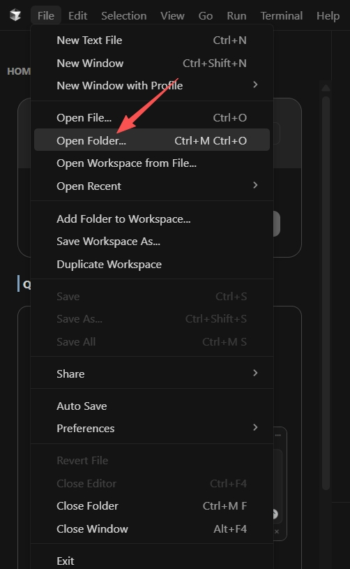

## What can Cursor + QVeris actually do?

Many people’s experience with AI today looks like this:

💬 *“AI is smart — but it can only talk, not act.”*

For example:

- It can analyze markets, but can’t access real-time financial data
- It can plan workflows, but API calls often fail
- It can write code, but doesn’t know **which tool** to use

**QVeris exists to solve exactly this problem.**

Our goal is simple:

> Enable AI to **reliably, affordably, and deterministically** call real-world tools and data in a chaotic internet environment.

Once you connect **QVeris inside Cursor**:

- AI no longer hallucinates data
- You don’t need to manually integrate dozens of APIs
- Agents can complete a full **Search → Decide → Act** loop

## So How to Use QVeris in Cursor ？

## Step 1: Install the QVeris Plugin

Open **Cursor**

Click the small arrow in the top-left corner to expand the menu,then open **Extensions**

Search for **QVeris AI,then c**lick **Install**

Step 2: Register on QVeris and Get Your API Key

After installation, find **QVeris AI** again in Extensions

Click **“Sign in with Browser”**

In the popup, click **Open** — you’ll be redirected to the QVeris website,then sign up or log in

Generate your **API Key**

⚠️ **Important:**

You’ll need this API key when calling tools via QVeris later.

## Step 3: Create a Project in Cursor

Click **File → Open Folder**

Create a new folder (for example: code-for-example)

## Tell the AI What You Want

You can now start chatting with AI in the right panel to build your project.

Next, let’s walk through a simple example using QVeris.

In **Cursor Chat**, try something like:

> *“*Create a web page, collect the latest posts from some Al-relatedbloggers on platform X and display a list.*”*

You can expand the response to see **which tools were actually called** behind the scenes.

When using QVeris inside Cursor, make sure to:

- Explicitly mention
- [<text underline="true">@qveris</text>](https%3A%2F%2Fx.com%2F%40qveris)
- .mdc
- Leave **a space before **
- [<text underline="true">@qveris</text>](https%3A%2F%2Fx.com%2F%40qveris)
- .mdc
- Include your **QVeris API Key**

This tells Cursor that the agent should **execute real-world tools**, not just generate text.

Cursor vs QVeris: Different Roles, One Workflow

- **Cursor solves:** how AI writes better code
- **QVeris solves:** how AI actually *does things* in the real world

When you connect them together:

> You’re no longer just writing code —
> you’re building **agents that can take action**.
