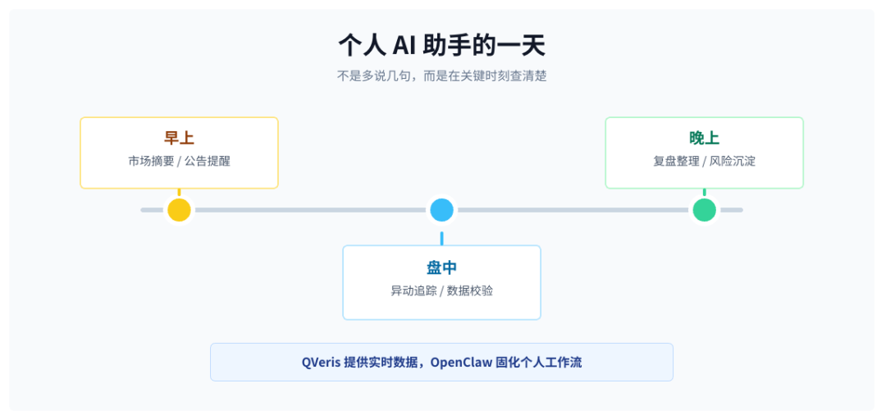
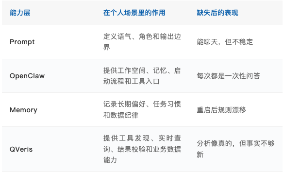
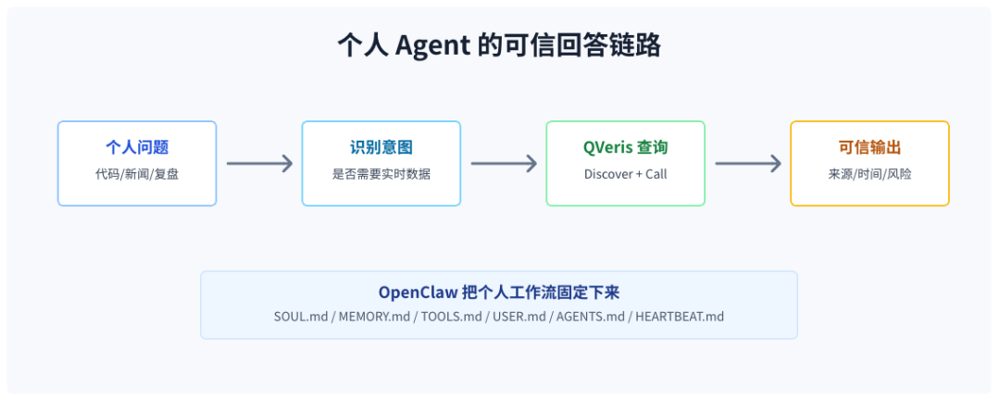
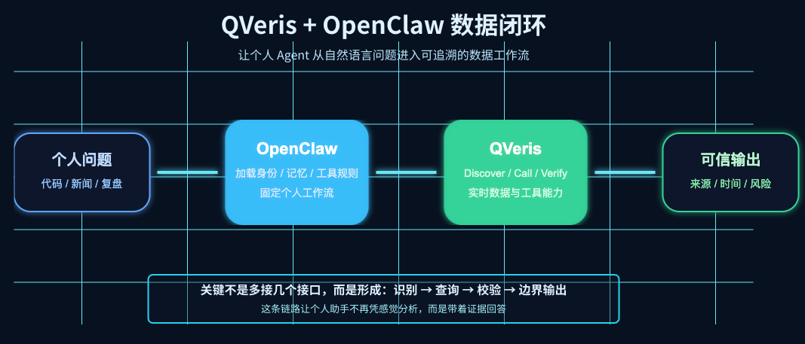
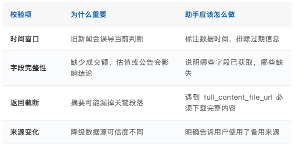
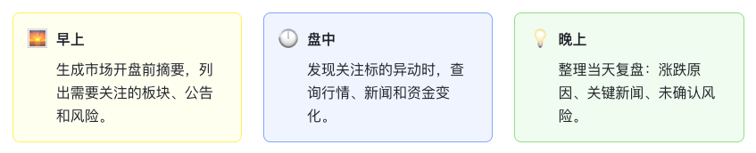
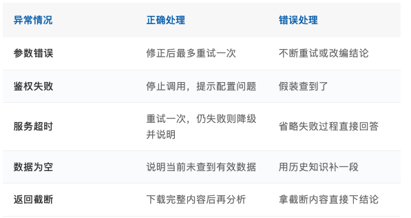

QVeris · Product Practice 


> What truly sets a personal AI assistant apart is not whether it can phrase things elegantly, but whether it knows to check first when facing a real-time question. Prompts handle expression; QVeris connects the assistant to real evidence: market data, news, announcements, financials, and more. 

Many personal users do not give AI assistants fully formed requirements. More often, they ask about the market in the morning, send a stock ticker during trading hours, and ask the assistant to organize the day's information at night. 

That is where the problem begins. Ordinary chatbots are too good at keeping the conversation going. Industry momentum, capital attention, policy catalysts, valuation repair: one phrase follows another, and the answer sounds plausible. But it may not have checked today's data at all. 

So a truly useful personal Agent should not merely be "better at chatting." It needs to know when it must look things up, be willing to stop when it cannot find data, and separate facts, inferences, and risks in its response. 


## The Smoothest Answers Are Often the Most Risky


For example, suppose the only input is a stock ticker. 

>
>  600519 
>
An ordinary chatbot may immediately start introducing Kweichow Moutai: the leading baijiu company, strong brand moat, long-term value, stable cash flow. Most of that may be true, but it is more like an old business card than a judgment about "right now." 

The real questions should be different: 

- Did the stock price move significantly today?

- What changed in valuation metrics and trading volume?

- Have there been recent announcements, research reports, news, or regulatory events?

- Are the related sector and market environment moving in the same direction?

- If the data source fails, will the assistant keep inventing an answer?


This is the easiest trap for personal Agents: the answer looks complete, but contains very few current facts. The smoother it reads, the easier it is to forget to ask: **Did it actually check just now?**

|   | Ordinary Chat Assistant | Personal Production-Grade Agent |
| --- | --- | --- |
| Information source | Generates analysis from training knowledge | First determines whether the question needs real-time data |
| Timeliness | Treats historical common knowledge as real-time judgment | Discovers and calls tools through QVeris |
| Precision | Does not distinguish today, last week, and last year | Verifies time, fields, sources, and completeness |
| Failure handling | May keep answering after an API failure | Says when data is unavailable instead of filling gaps with rhetoric |

A personal Agent therefore needs a very simple rule: 

>
> Whenever a question involves market data, news, announcements, financials, prices, indicators, or real-time status, it cannot answer from memory. It must query QVeris first. 
>
This rule is not meant to make the answer longer. It is meant to give the answer a foundation. 
## Personal Assistants Need Stable Rules Too


"Production-grade" sounds like a term from enterprise systems: permissions, deployment, monitoring, audit. Applied to a personal assistant, it may seem heavy. 

But if the assistant participates in judgment every day, it cannot rely only on improvisation. This is especially true for market, news, and financial questions, where a single mistake can be costly. 

Personal Agent tasks are usually more fragmented, faster, and less standardized: a ticker, a news headline, a sudden thought, or a screenshot can all become the entry point for a task. If the assistant does not have a stable workflow, every answer feels patched together on the spot. 



OpenClaw is like the assistant's workbench: where files live, which memories are read at startup, how tools are called, and which tasks run on a schedule all have a place.

QVeris connects the assistant to the outside world: market data, announcements, news, financial indicators, API status, and a traceable data chain. 

More precisely: **OpenClaw keeps the personal assistant running steadily; QVeris keeps it grounded in real data.**



**  
**
## QVeris Is Not Just Another API Connection


Many people assume that connecting data simply means giving an Agent one more API. In practice, it is not that simple. 

The real value is not "can it call an API," but turning "when to check, what to check, and how to decide whether the result is usable" into a fixed process. Otherwise, the more tools an Agent has, the easier it is for the Agent to use them chaotically. 

In personal scenarios, this process can be broken into four steps. 

### Step One: Decide Whether to Query First 

Not every question requires an API call. Explaining concepts, rewriting text, and organizing local notes can be handled directly. But once words such as "today," "recently," "current," "announcement," "financials," "price," "rise or fall," "news," "trading volume," "valuation," or "ranking" appear, QVeris should be triggered. 

>
> The most important judgment for a personal assistant is not "can I answer this?" but "can I answer this without checking?" The latter determines credibility. 
>
### Step Two: Find the Tool Before Calling the Tool 

Personal users do not ask questions according to API documentation. Inputs are often very short: a stock ticker, a company abbreviation, or a sentence like "why did this stock suddenly move?" 

At this point, the Agent should not call APIs at random. It should first use `qveris_discover` to find the right tools, then use `qveris_call` to retrieve results. Stock-related questions may involve real-time quotes, historical prices, announcements, news, financial statements, and capital flows. More tools are not always better; the key is matching the question.



**The standard QVeris flow for a personal Agent:**
```
User asks a question → Determine whether it involves real-time/business data → Use qveris_discover to find suitable tools → Use qveris_call to retrieve results → Validate time window, field completeness, source, and return status → Download full content from full_content_file_url when necessary → Output conclusions, evidence, risks, and uncertainties
```

### Step Three: Do Not Rush to Conclude Just Because Data Was Retrieved 

Getting a returned result does not mean the assistant can immediately draw a conclusion. This is especially easy to overlook in personal use, because users often want answers quickly. 



### Step Four: Keep Boundaries in the Final Output 

A personal assistant is not an investment adviser, nor a substitute for decision-making. It can help users clarify facts, organize logic, and list risks, but it should not directly give operational instructions such as "buy," "sell," "buy the dip," or "exit at the top." 

This does not weaken the assistant's capability. It puts that capability in the right place: provide evidence, support judgment, and do not make the final call for the user. 
## These Rules Belong in OpenClaw


If QVeris rules exist only in a single conversation, the Agent will soon forget them. A personal assistant restarts every day, switches tasks, and enters new sessions, so the rules must be written into the workspace. 

### SOUL.md: Define Boundaries 

SOUL.md should clearly state several bottom lines: when real-time business data is involved, QVeris must be queried first; data that has not been queried must not be used for conclusions; direct buy or sell instructions must not be provided; and when data cannot be obtained, the assistant must say so clearly. 

### MEMORY.md: Record Long-Term Discipline 

The most valuable thing to preserve in long-term memory is not the conclusion from a particular market move, but behavioral rules. Market data expires. Discipline should not. 

1.  Real-time data must be queried again

2.  Questions about stocks, news, financials, announcements, prices, and indicators must not be answered from memory

3.  If a QVeris query fails, retry at most once

4.  If falling back to an alternative tool, explain the source change

5.  Do not expose API keys, private memories, or internal configuration

### TOOLS.md: Document the Calling Process 

TOOLS.md is suitable for storing specific tool preferences, calling order, verified tools, and failure-handling strategies. For example, real-time quotes are suited to batch queries, financial statements are suited to deeper checks on a single stock, and historical prices are suited to observing recent trends. 

This step is critical. It turns the Agent from something that "can call tools" into something that **knows how to use tools**. 

### HEARTBEAT.md: From Passive Q&A to Active Monitoring 

The value of a personal assistant is not limited to "ask once, answer once." Scheduled reminders and proactive organization are more valuable. A truly useful assistant should prepare the relevant material on its own at key moments. 


## A Day in Use Makes This Clearer


Suppose a user sees a stock on their watchlist suddenly trade with unusually high volume in the morning and asks their personal Agent directly: 

>
>  Why did this stock suddenly start moving today? 
>
An assistant without business data can only give common explanations: news stimulus, capital inflow, sector rotation, technical breakout. They all sound reasonable, but they are more like a "list of possible reasons." None of them truly answers "why today." 

After connecting to QVeris, the Agent should handle it this way: 

1.  Use USER.md to identify this as a stock movement analysis request

2.  Use MEMORY.md to trigger the rule that real-time data must be queried

3.  Use QVeris to query real-time quotes, trading volume, price change, and historical trends

4.  Continue checking related news, announcements, industry data, or sector data

5.  Check news timestamps to avoid mistaking old news for today's catalyst

6.  If the full content is in a file, download it before analysis

7.  Output facts, inferences, risks, and what cannot be confirmed


A more appropriate answer should look something like this: 

> Based on today's data retrieved through QVeris, the stock's unusual move is mainly reflected in expanded trading volume and a larger intraday gain. After checking news and announcements, the information that can be confirmed today includes: the related sector is broadly strengthening, some comparable companies are also seeing capital inflows, and market attention is focused on a specific industry catalyst.
>
> At present, no single cause can be confirmed as the driver of the rise. A more reasonable judgment is that "sector sentiment + capital push + news catalyst" are working together. Short-term volatility may be relatively high, and it is not appropriate to directly extrapolate this into a trend reversal. Data source: QVeris real-time query.
>
> Nature of conclusion: information organization and risk reminder, not investment advice.

The value of this kind of answer is not that it "sounds more like an expert." It separates verifiable facts from inference and makes the source and boundaries clear. 
## How It Responds When Data Is Unavailable Determines Whether It Deserves Trust


What personal users fear most is not that the assistant occasionally cannot retrieve data. That is acceptable; data sources time out and APIs fail. 

The real danger is when the assistant cannot retrieve data but keeps talking anyway. The harder it tries to smooth over the gap, the more dangerous it becomes. 



A reliable personal Agent does not need to succeed every time, but it must fail honestly. Saying "I did not get enough data this time" is more valuable than forcing a polished conclusion. 


## The Assistant That Lasts Is Not the One That Talks Best


When people first use an Agent, it is easy to be impressed by how well it talks. But over time, the one that remains is often not the most eloquent assistant, but the most reliable one. 

It knows which questions can be handled directly and which must be checked against data; it knows to stop when tools fail; it knows to include time, source, and risk when outputting conclusions; and it knows it cannot make the final decision on the user's behalf. 

Prompts give an Agent a role. OpenClaw gives an Agent a workspace and persistent memory. QVeris connects the Agent to real business data. 

**When QVeris is written into OpenClaw's key specification files, a personal Agent is no longer just a chat window. It becomes a personal production-grade assistant that can query, verify, review, and respect boundaries.**

**  
**
