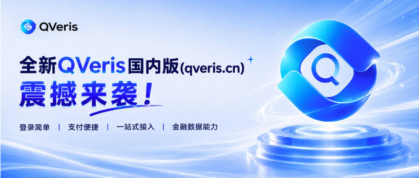
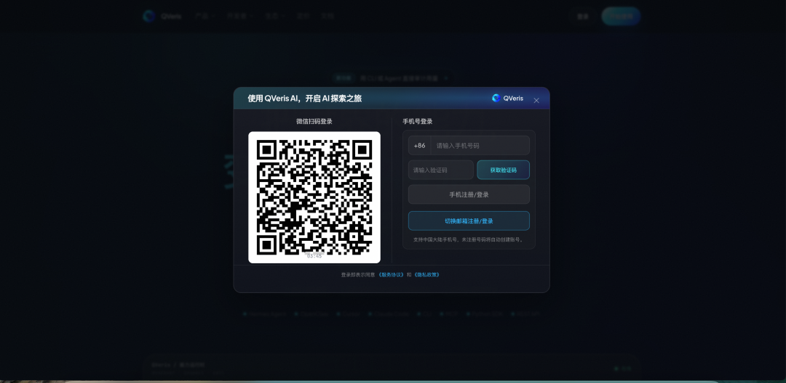
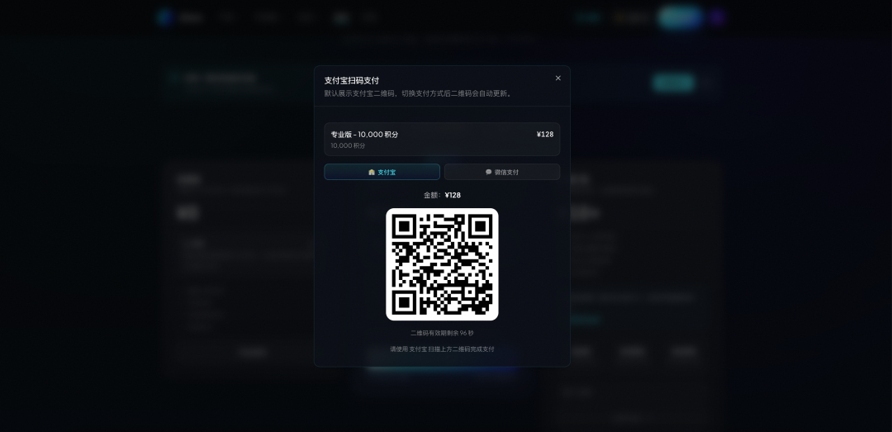
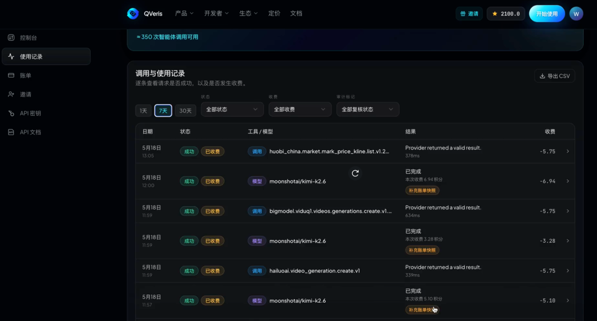

QVeris · Product Release

The QVeris China website has been fully upgraded, making the path for connecting AI agents to real-world capabilities shorter, clearer, and better suited to users in China.

The most immediate change in this update is simple: it is faster to get started, and easier to use.

If you are using QVeris for the first time, you can think of it as a “capability routing network” for AI Agents.

In the past, when you wanted an agent to call external capabilities such as market data, document parsing, OCR, image generation, knowledge graphs, real-time signals, or financial data, you often had to find providers one by one, read their documentation, apply for keys, handle parameters, and manage billing separately.

Now, after logging in to the QVeris website, you can complete the whole process through one unified flow:
## Minimal Onboarding: Scan with WeChat, Register and Log In with One Tap

Now you only need to open WeChat on your phone and scan the code to log in instantly. Start exploring digital capabilities in seconds.

## Seamless Payments: WeChat Pay and Alipay in One Tap

QVeris now fully supports mainstream domestic payment channels in China. Whether you are purchasing discounted call credits, paying by usage, or subscribing to the advanced routing engine, payments can be completed in seconds, giving you a smooth localized transaction experience.

## Clearer Usage and Billing

Every paid Agent action is now easier to understand. Billing is clearer and more transparent.

## A New Financial Capability Map

With QVeris, you no longer need to “guess” which API to use from a pile of interface documentation. In the capability map, you can compare capabilities and providers by success rate, latency, estimated cost, call volume, and more. For developers, this can significantly reduce the trial-and-error cost of only discovering a capability is unsuitable after integration.

**Choose a domain → choose a capability → try a real provider API in one click**

From real-time market data, macro interest rates, and investment research analysis to risk control and compliance, crypto assets, news events, and other financial scenarios, the coverage is clear at a glance. Each capability can be inspected further for parameters, responses, latency, and cost, helping developers, investment research teams, and AI Agents find truly usable tools faster.

Taking investment research analysis in financial scenarios as an example, here is the full end-to-end flow for finding which providers can be called to obtain a financial report:

At its core, QVeris provides a unified tool search and execution layer for agents. By describing your need in natural language, you can search APIs, data sources, and automation capabilities. Through a unified protocol, you can execute tools and receive structured, machine-readable results. The capabilities shown on the website span financial markets, economics, news, social media, blockchain, AI/ML, image generation, healthcare, weather, and more, with over 10,000 tool and data capabilities.

For financial scenarios, this means:

**For investment research**, you can quickly call capabilities for market data, financial reports, valuation, consensus expectations, and more.

**For risk control**, you can connect to capabilities such as KYC, sanctions screening, and compliance workflows.

**For market monitoring**, you can combine news, events, social media, and on-chain signals.

**For AI Agents**, you can let agents discover tools, select tools, and call tools on their own.

If API integration used to mean “find a provider, read the docs, write adapters, and call the interface,” QVeris is turning it into a path better suited to agents:

**Discover · Inspect · Call**

Discover capabilities, evaluate capabilities, and call capabilities.
## Try 10,000+ Real, Verified Capabilities Online

In the online experience, you can directly test capability calls, such as market analysis, financial report parsing, structured summaries, and other tasks. Validate the results first, then decide whether to integrate them into your own agent or product.

**The refreshed QVeris China website is not just a page update. It is an upgraded capability entry point for the AI Agent era.**

It turns real-world financial data, tools, and services into action capabilities that agents can call at any time.

As a leading Agent infrastructure platform and digital action routing engine, QVeris is committed to breaking down resource barriers across domains and platforms. This release marks a major update to the QVeris China website.
## What Does This Bring to Users?

For new users, QVeris lowers the barrier to trying real capabilities: you do not need to configure a complex engineering environment first to immediately see how an Agent calls real-world capabilities.

For existing users,

this update makes the core workflow smoother: call records are easier to read, billing is more transparent, documentation entry points are clearer, and the CLI/MCP language has been unified around Discover / Inspect / Call, making troubleshooting, integration, and deployment easier.

For developers, AI Agent teams, and professional institutions,

the value of QVeris is not “one more API platform.” It turns real capabilities scattered across different providers into a standardized process that Agents can search, compare, audit, and call.

When agents need to do more than chat, and must actually look up data, read files, call tools, and retrieve results, QVeris is the layer that connects Agents with real-world capabilities.

AI Agents are moving from “able to answer” to “able to act.” What truly matters is not only how intelligent the model is, but whether it can quickly find, evaluate, and call real-world data, tools, and APIs.
## Limited-Time Invitation Rewards: Share More, Earn More

QVeris.cn has also added and strengthened its invitation rewards mechanism. When users invite friends to register and start using QVeris, both the inviter and the invitee can receive reward points.

Invite one person, and both sides receive rewards. There is no limit on the number of invitees.

Invite friends to use QVeris together, and both sides are rewarded with no upper limit. The more people join, the more real-world tools and data can be called by agents.
