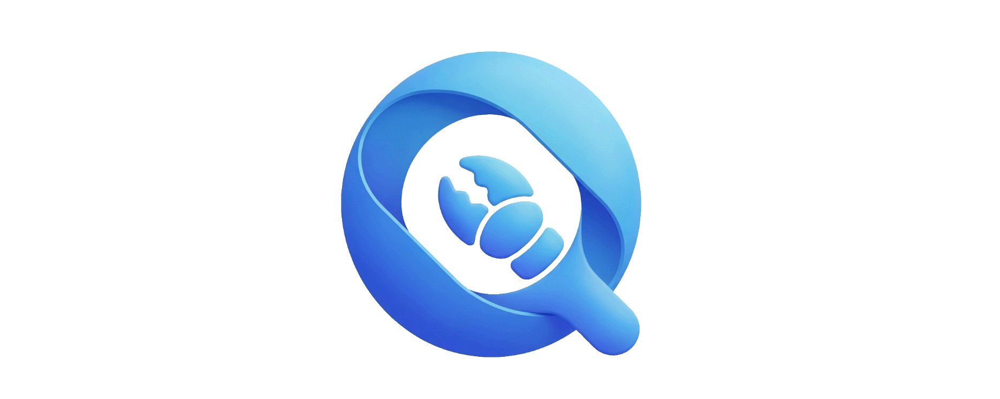
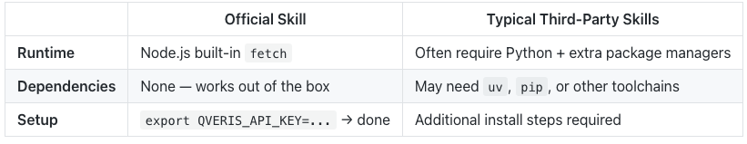
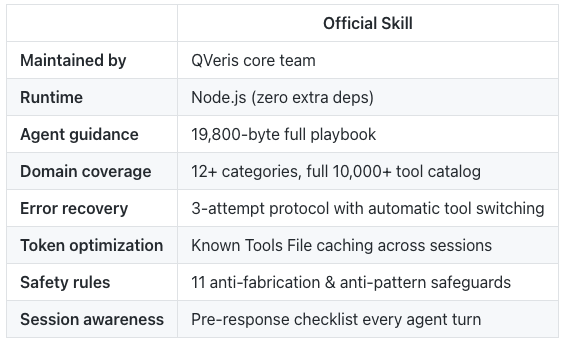

We're excited to release the official QVeris skill — built and maintained by the QVeris team.

Install:

```plaintext

clawhub install qveris-official

```

GitHub: QVerisAI/open-qveris-skills

ClawHub:

[<text underline="true">clawhub.ai/linfangw/qveris-official</text>](https%3A%2F%2Fclawhub.ai%2Flinfangw%2Fqveris-official)

We've seen several community-built QVeris skills appear on ClawHub and GitHub — which is awesome. It tells us developers genuinely want QVeris integrated into their agents, and we appreciate every community contribution that helped validate this demand.

But as QVeris's capabilities have grown to 10,000+ tools across dozens of domains, we realized the agent needs deeper guidance to use the platform effectively. So we built the official skill from the ground up.

## What's Different?

## Zero Extra Dependencies



If you have OpenClaw installed, you have Node.js. That's all you need.

## Deep Agent Playbook, Not Just a Wrapper

Most third-party skills provide a basic search-and-execute wrapper — enough to get started, but they leave the agent to figure out the rest on its own.

The official skill includes a comprehensive 19,800-byte SKILL.md — a full agent playbook covering:

- QVeris-First Protocol — a mandatory workflow: search QVeris → evaluate → execute → fallback only after genuine exhaustion. The agent is trained to try QVeris before web search or giving up.
- Trigger Conditions Table — a 12-domain checklist (financial markets, economics, blockchain, scientific research, image generation, geocoding, email/SMS, healthcare, and more) so the agent knows when to invoke QVeris automatically.
- Search Best Practices — query formulation rules with good/bad examples, multi-phrasing retry strategies, specificity guidelines.
- Tool Selection Criteria — how to evaluate tools by success_rate, avg_execution_time_ms, parameter quality, and output relevance. Never just pick the first result blindly.
- Parameter Filling Guide — data type validation, format conventions (ISO dates, ticker symbols, geo coordinates), and a common mistakes table to avoid silent failures.
- Error Recovery Protocol — a 3-attempt recovery flow: fix params → simplify → switch to alternative tool → report honestly. Your agent doesn't give up after one failure.
- Known Tools File Protocol — persistent caching to avoid redundant searches and save tokens across sessions. The agent remembers which tools worked.
- Anti-Patterns List — 11 explicit "NEVER do this" rules, including never fabricating data, never skipping QVeris, and never passing natural language as tool parameters.
- Session Persistence Checklist — a pre-response verification the agent runs every turn to ensure it hasn't missed a QVeris opportunity.

## Full Catalog Awareness

The official skill is designed to expose the full breadth of QVeris's capabilities to your agent:

- Data sources: financial markets (stocks, crypto, forex, commodities, ETFs), economic indicators, company financials/earnings, news feeds, social media analytics, blockchain/on-chain data, scientific papers, clinical trials, weather/climate, satellite imagery
- Tool services: image/video generation, text-to-speech, speech recognition, OCR, PDF extraction, content transformation, translation, AI model inference, code execution
- SaaS integrations: email sending, SMS notifications, cloud storage, workflow automation, CRM operations
- Location & geo: maps, geocoding, reverse geocoding, walking/driving navigation, POI search, satellite imagery
- Academic & research: paper search, patent databases, clinical trial registries, dataset discovery

Third-party skills typically cover a subset of these domains. The official skill ensures your agent knows about all of them.

## Built-in Safety & Quality Practices

- Never fabricate data — if both QVeris and fallbacks fail, the agent reports honestly. No made-up numbers, ever.
- Never silently skip — the agent must search QVeris before saying "I can't do this" or "I don't have access to..."
- Learning loop — log every execution outcome, track local success rates, learn from parameter mistakes, avoid repeating errors.
- Token optimization — the Known Tools File protocol prevents context bloat from repeated search results in long conversations.

## Quick Start

```plaintext

## Install

clawhub install qveris-official

## Set your API key

export QVERIS_API_KEY="your-key-here"

## Get your key at https://qveris.ai

## Done. Your agent now has access to 10,000+ tools.

```

Manual Commands (for testing)

```plaintext

## Search for tools

node scripts/qveris_tool.mjs search "real-time stock price API"

## Execute a tool

node scripts/qveris_tool.mjs execute <tool_id> \

  --search-id <id> \

  --params '{"symbol": "AAPL"}'

## Output raw JSON

node scripts/qveris_tool.mjs search "weather forecast" --json

```

At a Glance



## What's Next

We'll continue evolving the official skill as QVeris grows:

- Smarter routing based on task context and agent history
- Cost-aware tool discovery ("find the cheapest reliable option")
- Multi-tool orchestration in a single query
- Community feedback is always welcome — file issues on GitHub

## Links

- GitHub: QVerisAI/open-qveris-skills
- ClawHub: [<text underline="true">clawhub.ai/linfangw/qveris-official</text>](https%3A%2F%2Fclawhub.ai%2Flinfangw%2Fqveris-official)
- Get your API key: [<text underline="true">qveris.ai</text>](https%3A%2F%2Fqveris.ai%2F)
- QVeris docs: [<text underline="true">qveris.ai/docs</text>](https%3A%2F%2Fqveris.ai%2Fdocs)

*Built with 🦞 by the QVeris team*
